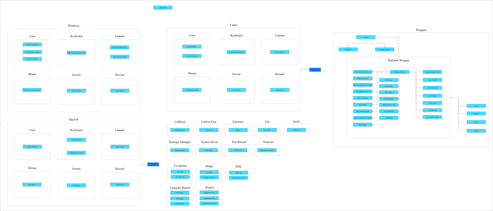

### AutoControl

[](https://pepy.tech/project/je-auto-control)

[](https://www.codacy.com/gh/JE-Chen/AutoControl/dashboard?utm_source=github.com&amp;utm_medium=referral&amp;utm_content=JE-Chen/AutoControl&amp;utm_campaign=Badge_Grade)

[](https://github.com/Intergration-Automation-Testing/AutoControl/actions/workflows/stable_python3_8.yml)

[](https://github.com/Intergration-Automation-Testing/AutoControl/actions/workflows/stable_python3_9.yml)

[](https://github.com/Intergration-Automation-Testing/AutoControl/actions/workflows/stable_python3_10.yml)

[](https://github.com/Intergration-Automation-Testing/AutoControl/actions/workflows/stable_python3_11.yml)

### Documentation
[](https://autocontrol.readthedocs.io/en/latest/?badge=latest)

---

> Project Kanban \
> https://github.com/orgs/Intergration-Automation-Testing/projects/2 \
> Image & Coordinate based GUI Automation \

> GUI automated based on image comparison and coordinates. \
> Cross-platform and cross-programming language.\
> Solve problems:
>> * Provide automation execution for repetitive tasks.
>> * Multiple methods are available, including recording, image recognition, and coordinate-based testing.
>> * Tests can be executed remotely through TCP/IP.
>> * Test reports can be generated with records for each action.
>> * The same code can be used for three platforms, reducing the possibility of platform-dependent programs.
>> * Provide hooks for keyboard and mouse events and state checks (including using code to simulate key presses).
>> * Can use keywords for development to improve readability.
---

### NOTICE
> We don't support Unix/Linux Wayland GUI Now \
> May be future feature
---
### Features

>* Image Detect
>* Keyboard Event
>* Mouse Event
>* Screen
>* Action file and executor
>* Record Event
>* CLI with action file
>* Generate HTML Report
>* Timeout

---

## install

```
# make sure you have install cmake libssl-dev (on linux)
pip install je_auto_control
```

## Info

> * requirement
>> * Python 3.8 or later
>> * pip 19.3 or later

> * Dev env
>> * windows 11
>> * osx 11 big sur
>> * ubuntu 20.0.4


> * Test on
>> * Windows 10 ~ 11
>> * osx 10.5 ~ 11 big sur
>> * ubuntu 20.0.4
>> * raspberry pi 3B and 4B

## How to set dev environment

> * Clone repo on GitHub or download source code
> * Prepare a python venv
> * Run command "pip install --upgrade pip"
> * Run command "pip install -r dev_requirements.txt"

### Architecture Diagram

