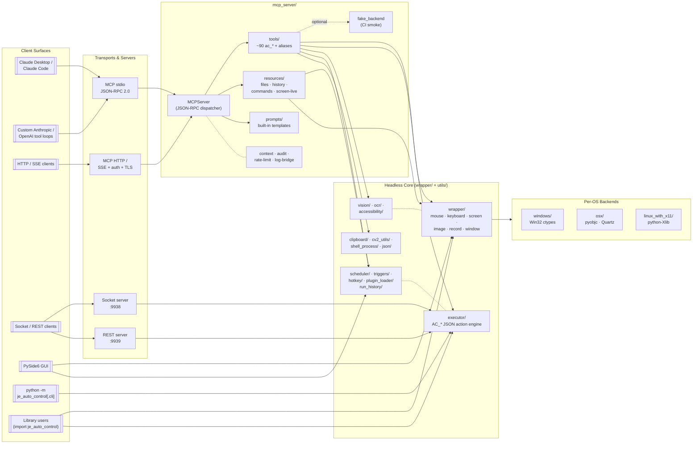

# AutoControl

[](https://pypi.org/project/je_auto_control/)
[](https://pypi.org/project/je_auto_control/)
[](LICENSE)
[](https://autocontrol.readthedocs.io/en/latest/?badge=latest)

**AutoControl** is a cross-platform Python GUI automation framework providing mouse control, keyboard input, image recognition, screen capture, action scripting, and report generation — all through a unified API that works on Windows, macOS, and Linux (X11).

**[繁體中文](README/README_zh-TW.md)** | **[简体中文](README/README_zh-CN.md)**

---

## Table of Contents

- [Features](#features)
- [Architecture](#architecture)
- [Installation](#installation)
- [Requirements](#requirements)
- [Quick Start](#quick-start)
  - [Mouse Control](#mouse-control)
  - [Keyboard Control](#keyboard-control)
  - [Image Recognition](#image-recognition)
  - [Accessibility Element Finder](#accessibility-element-finder)
  - [AI Element Locator (VLM)](#ai-element-locator-vlm)
  - [OCR (Text on Screen)](#ocr-text-on-screen)
  - [LLM Action Planner](#llm-action-planner)
  - [Runtime Variables & Control Flow](#runtime-variables--control-flow)
  - [Remote Desktop](#remote-desktop)
  - [Clipboard](#clipboard)
  - [Screenshot](#screenshot)
  - [Action Recording & Playback](#action-recording--playback)
  - [JSON Action Scripting](#json-action-scripting)
  - [MCP Server (Use AutoControl from Claude)](#mcp-server-use-autocontrol-from-claude)
  - [Scheduler (Interval & Cron)](#scheduler-interval--cron)
  - [Global Hotkey Daemon](#global-hotkey-daemon)
  - [Event Triggers](#event-triggers)
  - [Run History](#run-history)
  - [Report Generation](#report-generation)
  - [Remote Automation (Socket / REST)](#remote-automation-socket--rest)
  - [Plugin Loader](#plugin-loader)
  - [Shell Command Execution](#shell-command-execution)
  - [Screen Recording](#screen-recording)
  - [Callback Executor](#callback-executor)
  - [Package Manager](#package-manager)
  - [Project Management](#project-management)
  - [Window Management](#window-management)
  - [GUI Application](#gui-application)
- [Command-Line Interface](#command-line-interface)
- [Platform Support](#platform-support)
- [Development](#development)
- [License](#license)

---

## Features

- **Mouse Automation** — move, click, press, release, drag, and scroll with precise coordinate control
- **Keyboard Automation** — press/release individual keys, type strings, hotkey combinations, key state detection
- **Image Recognition** — locate UI elements on screen using OpenCV template matching with configurable threshold
- **Accessibility Element Finder** — query the OS accessibility tree (Windows UIA / macOS AX) to locate buttons, menus, and controls by name/role
- **AI Element Locator (VLM)** — describe a UI element in plain language and let a vision-language model (Anthropic / OpenAI) find its screen coordinates
- **OCR** — extract text from screen regions using Tesseract; wait for, click, or locate rendered text; regex search and full-region dump
- **LLM Action Planner** — translate a plain-language description into a validated `AC_*` action list using Claude
- **Runtime Variables & Control Flow** — `${var}` substitution at execution time, plus `AC_set_var` / `AC_inc_var` / `AC_if_var` / `AC_for_each` / `AC_loop` / `AC_retry` for data-driven scripts
- **Remote Desktop** — stream this machine's screen and accept remote input over a token-authenticated TCP protocol, *or* connect to another machine and view + control it (host + viewer GUIs included). Optional TLS (HTTPS-grade encryption), WebSocket transport (ws:// + wss:// for browser / firewall-friendly clients), persistent 9-digit Host ID, host→viewer audio streaming, bidirectional clipboard sync (text + image), and chunked file transfer (drag-drop + progress bar; arbitrary destination path; no size cap)
- **Clipboard** — read/write system clipboard text on Windows, macOS, and Linux
- **Screenshot & Screen Recording** — capture full screen or regions as images, record screen to video (AVI/MP4)
- **Action Recording & Playback** — record mouse/keyboard events and replay them
- **JSON-Based Action Scripting** — define and execute automation flows using JSON action files (dry-run + step debug)
- **Scheduler** — run scripts on an interval or cron expression; jobs persist across restarts
- **Global Hotkey Daemon** — bind OS-level hotkeys to action scripts (Windows today; macOS/Linux stubs in place)
- **Event Triggers** — fire scripts when an image appears, a window opens, a pixel changes, or a file is modified
- **Run History** — SQLite-backed run log across scheduler / triggers / hotkeys / REST with auto error-screenshot artifacts
- **Report Generation** — export test records as HTML, JSON, or XML reports with success/failure status
- **MCP Server** — JSON-RPC 2.0 Model Context Protocol server (stdio + HTTP/SSE) so Claude Desktop / Claude Code / custom tool-use loops can drive AutoControl. ~90 tools, full protocol coverage (resources, prompts, sampling, roots, logging, progress, cancellation, elicitation), bearer-token auth + TLS, audit log, rate limit, plugin hot-reload, CI fake backend
- **Remote Automation** — TCP socket server **and** REST API server to receive automation commands
- **Plugin Loader** — drop `.py` files exposing `AC_*` callables into a directory and register them as executor commands at runtime
- **Shell Integration** — execute shell commands within automation workflows with async output capture
- **Callback Executor** — trigger automation functions with callback hooks for chaining operations
- **Dynamic Package Loading** — extend the executor at runtime by importing external Python packages
- **Project & Template Management** — scaffold automation projects with keyword/executor directory structure
- **Window Management** — send keyboard/mouse events directly to specific windows (Windows/Linux)
- **GUI Application** — built-in PySide6 graphical interface with live language switching (English / 繁體中文 / 简体中文 / 日本語)
- **CLI Runner** — `python -m je_auto_control.cli run|list-jobs|start-server|start-rest`
- **Cross-Platform** — unified API across Windows, macOS, and Linux (X11)

---

## Architecture

The runtime is layered: **client surfaces** (CLI, GUI, MCP/REST/socket
servers) sit on top of the **headless API** (`wrapper/` + `utils/`),
which resolves to a **per-OS backend** chosen at import time by
`wrapper/platform_wrapper.py`. The package façade
(`je_auto_control/__init__.py`) re-exports every public name so users
need only `import je_auto_control` regardless of which surface or
backend they hit.


```mermaid
flowchart LR
    subgraph Clients["Client Surfaces"]
        direction TB
        Claude[["Claude Desktop /<br/>Claude Code"]]
        APIUser[["Custom Anthropic /<br/>OpenAI tool loops"]]
        HTTPClient[["HTTP / SSE clients"]]
        TCPClient[["Socket / REST clients"]]
        GUIUser[["PySide6 GUI"]]
        CLIUser[["python -m<br/>je_auto_control[.cli]"]]
        Library[["Library users<br/>(import je_auto_control)"]]
    end

    subgraph Transports["Transports & Servers"]
        direction TB
        Stdio["MCP stdio<br/>JSON-RPC 2.0"]
        HTTPMCP["MCP HTTP /<br/>SSE + auth + TLS"]
        REST["REST server<br/>:9939"]
        Socket["Socket server<br/>:9938"]
    end

    subgraph MCP["mcp_server/"]
        direction TB
        Dispatcher["MCPServer<br/>(JSON-RPC dispatcher)"]
        Tools["tools/<br/>~90 ac_* + aliases"]
        Resources["resources/<br/>files · history ·<br/>commands · screen-live"]
        Prompts["prompts/<br/>built-in templates"]
        Context["context · audit ·<br/>rate-limit · log-bridge"]
        FakeBE["fake_backend<br/>(CI smoke)"]
    end

    subgraph Core["Headless Core (wrapper/ + utils/)"]
        direction TB
        Wrapper["wrapper/<br/>mouse · keyboard · screen ·<br/>image · record · window"]
        Executor["executor/<br/>AC_* JSON action engine"]
        Vision["vision/ · ocr/ ·<br/>accessibility/"]
        Recorder["scheduler/ · triggers/ ·<br/>hotkey/ · plugin_loader/<br/>run_history/"]
        IOUtils["clipboard/ · cv2_utils/ ·<br/>shell_process/ · json/"]
    end

    subgraph Backends["Per-OS Backends"]
        direction TB
        Win["windows/<br/>Win32 ctypes"]
        Mac["osx/<br/>pyobjc · Quartz"]
        X11["linux_with_x11/<br/>python-Xlib"]
    end

    Claude --> Stdio
    APIUser --> Stdio
    HTTPClient --> HTTPMCP
    TCPClient --> Socket
    TCPClient --> REST

    Stdio --> Dispatcher
    HTTPMCP --> Dispatcher
    Dispatcher --> Tools
    Dispatcher --> Resources
    Dispatcher --> Prompts
    Dispatcher -.- Context
    Tools -.optional.-> FakeBE

    Tools --> Wrapper
    Tools --> Executor
    Tools --> Vision
    Tools --> Recorder
    Tools --> IOUtils
    Resources --> Recorder
    Resources --> Wrapper

    REST --> Executor
    Socket --> Executor

    GUIUser --> Wrapper
    GUIUser --> Recorder
    CLIUser --> Executor
    Library --> Wrapper
    Library --> Executor

    Wrapper --> Backends
    Vision -.- Wrapper
    Recorder -.- Executor
```

```
je_auto_control/
├── wrapper/                    # Platform-agnostic API layer
│   ├── platform_wrapper.py     # Auto-detects OS and loads the correct backend
│   ├── auto_control_mouse.py   # Mouse operations
│   ├── auto_control_keyboard.py# Keyboard operations
│   ├── auto_control_image.py   # Image recognition (OpenCV template matching)
│   ├── auto_control_screen.py  # Screenshot, screen size, pixel color
│   ├── auto_control_window.py  # Cross-platform window manager facade
│   └── auto_control_record.py  # Action recording/playback
├── windows/                    # Windows-specific backend (Win32 API / ctypes)
├── osx/                        # macOS-specific backend (pyobjc / Quartz)
├── linux_with_x11/             # Linux-specific backend (python-Xlib)
├── gui/                        # PySide6 GUI application
└── utils/
    ├── mcp_server/             # MCP server (stdio + HTTP/SSE) — server, tools/, resources, prompts, audit, rate_limit, fake_backend, plugin_watcher
    ├── executor/               # JSON action executor engine
    ├── callback/               # Callback function executor
    ├── cv2_utils/              # OpenCV screenshot, template matching, video recording
    ├── accessibility/          # UIA (Windows) / AX (macOS) element finder
    ├── vision/                 # VLM-based locator (Anthropic / OpenAI backends)
    ├── ocr/                    # Tesseract-backed text locator
    ├── clipboard/              # Cross-platform clipboard (text + image)
    ├── scheduler/              # Interval + cron scheduler
    ├── hotkey/                 # Global hotkey daemon
    ├── triggers/               # Image/window/pixel/file triggers
    ├── run_history/            # SQLite run log + error-screenshot artifacts
    ├── rest_api/               # Stdlib HTTP/REST server
    ├── plugin_loader/          # Dynamic AC_* plugin discovery
    ├── socket_server/          # TCP socket server for remote automation
    ├── shell_process/          # Shell command manager
    ├── generate_report/        # HTML / JSON / XML report generators
    ├── test_record/            # Test action recording
    ├── script_vars/            # Script variable interpolation
    ├── watcher/                # Mouse / pixel / log watchers (Live HUD)
    ├── recording_edit/         # Trim, filter, re-scale recorded actions
    ├── json/                   # JSON action file read/write
    ├── project/                # Project scaffolding & templates
    ├── package_manager/        # Dynamic package loading
    ├── logging/                # Logging
    └── exception/              # Custom exception classes
```

The `platform_wrapper.py` module automatically detects the current operating system and imports the corresponding backend, so all wrapper functions work identically regardless of platform.

---

## Installation

### Basic Installation

```bash
pip install je_auto_control
```

### With GUI Support (PySide6)

```bash
pip install je_auto_control[gui]
```

### Linux Prerequisites

On Linux, install the following system packages before installing:

```bash
sudo apt-get install cmake libssl-dev
```

---

## Requirements

- **Python** >= 3.10
- **pip** >= 19.3

### Dependencies

| Package | Purpose |
|---|---|
| `je_open_cv` | Image recognition (OpenCV template matching) |
| `pillow` | Screenshot capture |
| `mss` | Fast multi-monitor screenshot |
| `pyobjc` | macOS backend (auto-installed on macOS) |
| `python-Xlib` | Linux X11 backend (auto-installed on Linux) |
| `PySide6` | GUI application (optional, install with `[gui]`) |
| `qt-material` | GUI theme (optional, install with `[gui]`) |
| `uiautomation` | Windows accessibility backend (optional, loaded on demand) |
| `pytesseract` + Tesseract | OCR engine (optional, loaded on demand) |
| `anthropic` | VLM locator — Anthropic backend (optional, loaded on demand) |
| `openai` | VLM locator — OpenAI backend (optional, loaded on demand) |

See [Third_Party_License.md](Third_Party_License.md) for a full list of
third-party components and their licenses.

---

## Quick Start

### Mouse Control

```python
import je_auto_control

# Get current mouse position
x, y = je_auto_control.get_mouse_position()
print(f"Mouse at: ({x}, {y})")

# Move mouse to coordinates
je_auto_control.set_mouse_position(500, 300)

# Left click at current position (use key name)
je_auto_control.click_mouse("mouse_left")

# Right click at specific coordinates
je_auto_control.click_mouse("mouse_right", x=800, y=400)

# Scroll down
je_auto_control.mouse_scroll(scroll_value=5)
```

### Keyboard Control

```python
import je_auto_control

# Press and release a single key
je_auto_control.type_keyboard("a")

# Type a whole string character by character
je_auto_control.write("Hello World")

# Hotkey combination (e.g., Ctrl+C)
je_auto_control.hotkey(["ctrl_l", "c"])

# Check if a key is currently pressed
is_pressed = je_auto_control.check_key_is_press("shift_l")
```

### Image Recognition

```python
import je_auto_control

# Find all occurrences of an image on screen
positions = je_auto_control.locate_all_image("button.png", detect_threshold=0.9)
# Returns: [[x1, y1, x2, y2], ...]

# Find a single image and get its center coordinates
cx, cy = je_auto_control.locate_image_center("icon.png", detect_threshold=0.85)
print(f"Found at: ({cx}, {cy})")

# Find an image and automatically click it
je_auto_control.locate_and_click("submit_button.png", mouse_keycode="mouse_left")
```

### Accessibility Element Finder

Query the OS accessibility tree to locate controls by name, role, or app.
Works on Windows (UIA, via `uiautomation`) and macOS (AX).

```python
import je_auto_control

# List all visible buttons in the Calculator app
elements = je_auto_control.list_accessibility_elements(app_name="Calculator")

# Find a specific element
ok = je_auto_control.find_accessibility_element(name="OK", role="Button")
if ok is not None:
    print(ok.bounds, ok.center)

# Click it directly
je_auto_control.click_accessibility_element(name="OK", app_name="Calculator")
```

Raises `AccessibilityNotAvailableError` if no accessibility backend is
installed for the current platform.

### AI Element Locator (VLM)

When template matching and accessibility both fail, describe the element
in plain language and let a vision-language model find its coordinates.

```python
import je_auto_control

# Uses Anthropic by default if ANTHROPIC_API_KEY is set, else OpenAI.
x, y = je_auto_control.locate_by_description("the green Submit button")

# Or click it in one shot
je_auto_control.click_by_description(
    "the cookie-banner 'Accept all' button",
    screen_region=[0, 800, 1920, 1080],   # optional crop
)
```

Configuration (environment variables only — keys are never persisted or
logged):

| Variable | Effect |
|---|---|
| `ANTHROPIC_API_KEY` | Enables the Anthropic backend |
| `OPENAI_API_KEY` | Enables the OpenAI backend |
| `AUTOCONTROL_VLM_BACKEND` | `anthropic` or `openai` to force a backend |
| `AUTOCONTROL_VLM_MODEL` | Override the default model (e.g. `claude-opus-4-7`, `gpt-4o-mini`) |

Raises `VLMNotAvailableError` if neither SDK is installed or no API key
is set.

### OCR (Text on Screen)

```python
import je_auto_control as ac

# Locate all matches of a piece of text
matches = ac.find_text_matches("Submit")

# Center of the first match, or None
cx, cy = ac.locate_text_center("Submit")

# Click text in one call
ac.click_text("Submit")

# Block until text appears (or timeout)
ac.wait_for_text("Loading complete", timeout=15.0)
```

If Tesseract is not on `PATH`, point at it explicitly:

```python
ac.set_tesseract_cmd(r"C:\Program Files\Tesseract-OCR\tesseract.exe")
```

Dump every recognised text record in a region (or full screen), or
search by regex when the text varies:

```python
import je_auto_control as ac

# Every hit in a region as TextMatch records (text, bounding box, confidence)
for match in ac.read_text_in_region(region=[0, 0, 800, 600]):
    print(match.text, match.center, match.confidence)

# Regex — accepts a pattern string or a compiled re.Pattern
for match in ac.find_text_regex(r"Order#\d+"):
    print(match.text, match.center)
```

GUI: **OCR Reader** tab.

### LLM Action Planner

Translate plain-language descriptions into validated `AC_*` action lists
using an LLM (Anthropic Claude by default). Output is leniently parsed
(strips code fences, extracts the first JSON array from prose) and then
validated by the same schema the executor uses, so the result can be
piped straight into `execute_action`:

```python
import je_auto_control as ac
from je_auto_control.utils.executor.action_executor import executor

actions = ac.plan_actions(
    "click the Submit button, then type 'done' and save",
    known_commands=executor.known_commands(),
)
executor.execute_action(actions)

# Or in a single call:
ac.run_from_description("open Notepad and type hello", executor=executor)
```

| Variable | Effect |
|---|---|
| `ANTHROPIC_API_KEY` | Enables the Anthropic backend |
| `AUTOCONTROL_LLM_BACKEND` | `anthropic` to force a backend |
| `AUTOCONTROL_LLM_MODEL` | Override the default model (e.g. `claude-opus-4-7`) |

GUI: **LLM Planner** tab — description box, `QThread`-backed *Plan*
button, action-list preview, and a *Run plan* button.

### Runtime Variables & Control Flow

The executor resolves `${var}` placeholders **per command call** rather
than pre-flattening, so nested `body` / `then` / `else` lists keep their
placeholders and re-bind on every iteration. Combined with new mutation
commands, scripts can drive themselves from data without Python glue:

```json
[
    ["AC_set_var", {"name": "items", "value": ["alpha", "beta"]}],
    ["AC_set_var", {"name": "i", "value": 0}],
    ["AC_for_each", {
        "items": "${items}", "as": "name",
        "body": [
            ["AC_inc_var", {"name": "i"}],
            ["AC_if_var", {
                "name": "i", "op": "ge", "value": 2,
                "then": [["AC_break"]], "else": []
            }]
        ]
    }]
]
```

`AC_if_var` operators: `eq`, `ne`, `lt`, `le`, `gt`, `ge`, `contains`,
`startswith`, `endswith`. GUI: **Variables** tab — live view of
`executor.variables` with single-set, JSON seed, and clear-all controls.

### Remote Desktop

Stream this machine's screen and accept remote input, **or** view and
control another machine. The wire format is a length-prefixed framing
on raw TCP (no extra deps), starting with an HMAC-SHA256
challenge / response handshake; viewers that fail auth are dropped
before they can see a frame. JPEG frames are produced at the configured
FPS / quality and broadcast to authenticated viewers via a shared
latest-frame slot, so a slow viewer drops frames instead of blocking
the rest. Viewer input is JSON, validated against an allowlist, and
applied through the existing wrappers.

```python
# Be remoted — start a host and hand the token + port to whoever views you
from je_auto_control import RemoteDesktopHost
host = RemoteDesktopHost(token="hunter2", bind="127.0.0.1",
                          port=0, fps=10, quality=70)
host.start()
print("listening on", host.port, "viewers:", host.connected_clients)
```

```python
# Control another machine — connect a viewer and send input
from je_auto_control import RemoteDesktopViewer
viewer = RemoteDesktopViewer(host="10.0.0.5", port=51234, token="hunter2",
                              on_frame=lambda jpeg: ...)
viewer.connect()
viewer.send_input({"action": "mouse_move", "x": 100, "y": 200})
viewer.send_input({"action": "type", "text": "hello"})
viewer.disconnect()
```

GUI: **Remote Desktop** tab with two sub-tabs.

- **Host** — token field with a *Generate* button, security warning
  about the bind address, start / stop controls, refreshing port +
  viewer-count status, and a 4 fps preview pane below the controls so
  the user being remoted sees what viewers see.
- **Viewer** — address / port / token form, *Connect* / *Disconnect*,
  and a custom frame-display widget that paints incoming JPEG frames
  scaled with `KeepAspectRatio`. Mouse / wheel / key events on the
  display are remapped from widget coordinates back to the remote
  screen's pixel space using the latest frame's dimensions, then
  forwarded as `INPUT` messages.

> ⚠️ Anyone with the host:port and token gets full mouse / keyboard
> control of the host machine. Default bind is `127.0.0.1`; expose
> externally only via SSH tunnel or TLS front-end. The token is the
> only line of defence — treat it like a password.

**Encrypted transports + alternate protocols.** Pass an `ssl_context`
to either `RemoteDesktopHost` or `RemoteDesktopViewer` to wrap every
connection in TLS. For firewall-friendly access, use the in-tree
WebSocket variants (no extra deps) — same protocol, RFC 6455 framing,
and `wss://` if you also pass `ssl_context`:

```python
from je_auto_control import (
    WebSocketDesktopHost, WebSocketDesktopViewer,
)
host = WebSocketDesktopHost(token="hunter2", ssl_context=server_ctx)
viewer = WebSocketDesktopViewer(
    host="example.com", port=443, token="hunter2",
    ssl_context=client_ctx, expected_host_id="123456789",
)
```

**Persistent Host ID.** Every host owns a stable 9-digit numeric ID
(persisted at `~/.je_auto_control/remote_host_id`), announced in
`AUTH_OK` and verifiable via the viewer's `expected_host_id`:

```python
print(host.host_id)            # e.g. "123456789"
viewer = RemoteDesktopViewer(
    host=..., port=..., token=...,
    expected_host_id="123456789",   # AuthenticationError on mismatch
)
```

**Audio streaming (host → viewer).** Optional `sounddevice` dep; opt
in with an `AudioCaptureConfig` on the host, attach an `AudioPlayer`
(or your own callback) on the viewer:

```python
from je_auto_control.utils.remote_desktop import AudioCaptureConfig
host = RemoteDesktopHost(
    token="tok",
    audio_config=AudioCaptureConfig(enabled=True),    # default mic
)
# Or pick a loopback / monitor device:
# audio_config=AudioCaptureConfig(enabled=True, device=12)

from je_auto_control.utils.remote_desktop import AudioPlayer
player = AudioPlayer(); player.start()
viewer = RemoteDesktopViewer(host=..., on_audio=player.play)
```

**Clipboard sync (text + image, bidirectional).** Explicit per-call —
no auto-poll loops. Image clipboard works on Windows (CF_DIB via
ctypes) and Linux (`xclip -t image/png`); macOS get is supported via
Pillow ImageGrab, set requires PyObjC.

```python
viewer.send_clipboard_text("hello")
viewer.send_clipboard_image(open("logo.png", "rb").read())
host.broadcast_clipboard_text("greetings")
```

**File transfer with progress.** Bidirectional, chunked, arbitrary
destination path, no size cap; the GUI viewer also accepts drag-drop:

```python
viewer.send_file(
    "local.bin", "/tmp/uploaded.bin",
    on_progress=lambda tid, done, total: print(done, total),
)
host.send_file_to_viewers("local.bin", "/tmp/from_host.bin")
```

> ⚠️ Path is unrestricted and there is no aggregate size limit.
> Anyone with the token can write any file to any location and can
> fill the disk — keep "trusted token holders == trusted users" in
> mind, or wrap with your own `FileReceiver` subclass that vets
> destination paths.

### Clipboard

```python
import je_auto_control as ac
ac.set_clipboard("hello")
text = ac.get_clipboard()
```

Backends: Windows (Win32 via `ctypes`), macOS (`pbcopy`/`pbpaste`),
Linux (`xclip` or `xsel`).

### Screenshot

```python
import je_auto_control

# Take a full-screen screenshot and save to file
je_auto_control.pil_screenshot("screenshot.png")

# Take a screenshot of a specific region [x1, y1, x2, y2]
je_auto_control.pil_screenshot("region.png", screen_region=[100, 100, 500, 400])

# Get screen resolution
width, height = je_auto_control.screen_size()

# Get pixel color at coordinates
color = je_auto_control.get_pixel(500, 300)
```

### Action Recording & Playback

```python
import je_auto_control
import time

# Start recording mouse and keyboard events
je_auto_control.record()

time.sleep(10)  # Record for 10 seconds

# Stop recording and get the action list
actions = je_auto_control.stop_record()

# Replay the recorded actions
je_auto_control.execute_action(actions)
```

### JSON Action Scripting

Create a JSON action file (`actions.json`):

```json
[
    ["AC_set_mouse_position", {"x": 500, "y": 300}],
    ["AC_click_mouse", {"mouse_keycode": "mouse_left"}],
    ["AC_write", {"write_string": "Hello from AutoControl"}],
    ["AC_screenshot", {"file_path": "result.png"}],
    ["AC_hotkey", {"key_code_list": ["ctrl_l", "s"]}]
]
```

Execute it:

```python
import je_auto_control

# Execute from file
je_auto_control.execute_action(je_auto_control.read_action_json("actions.json"))

# Or execute from a list directly
je_auto_control.execute_action([
    ["AC_set_mouse_position", {"x": 100, "y": 200}],
    ["AC_click_mouse", {"mouse_keycode": "mouse_left"}]
])
```

**Available action commands:**

| Category | Commands |
|---|---|
| Mouse | `AC_click_mouse`, `AC_set_mouse_position`, `AC_get_mouse_position`, `AC_get_mouse_table`, `AC_press_mouse`, `AC_release_mouse`, `AC_mouse_scroll`, `AC_mouse_left`, `AC_mouse_right`, `AC_mouse_middle` |
| Keyboard | `AC_type_keyboard`, `AC_press_keyboard_key`, `AC_release_keyboard_key`, `AC_write`, `AC_hotkey`, `AC_check_key_is_press`, `AC_get_keyboard_keys_table` |
| Image | `AC_locate_all_image`, `AC_locate_image_center`, `AC_locate_and_click` |
| Screen | `AC_screen_size`, `AC_screenshot` |
| Accessibility | `AC_a11y_list`, `AC_a11y_find`, `AC_a11y_click` |
| VLM (AI Locator) | `AC_vlm_locate`, `AC_vlm_click` |
| OCR | `AC_locate_text`, `AC_click_text`, `AC_wait_text`, `AC_read_text_in_region`, `AC_find_text_regex` |
| LLM planner | `AC_llm_plan`, `AC_llm_run` |
| Clipboard | `AC_clipboard_get`, `AC_clipboard_set` |
| Window | `AC_list_windows`, `AC_focus_window`, `AC_wait_window`, `AC_close_window` |
| Flow control | `AC_loop`, `AC_break`, `AC_continue`, `AC_if_image_found`, `AC_if_pixel`, `AC_if_var`, `AC_while_image`, `AC_for_each`, `AC_wait_image`, `AC_wait_pixel`, `AC_sleep`, `AC_retry` |
| Variables | `AC_set_var`, `AC_get_var`, `AC_inc_var` |
| Remote desktop | `AC_start_remote_host`, `AC_stop_remote_host`, `AC_remote_host_status`, `AC_remote_connect`, `AC_remote_disconnect`, `AC_remote_viewer_status`, `AC_remote_send_input` |
| Record | `AC_record`, `AC_stop_record`, `AC_set_record_enable` |
| Report | `AC_generate_html`, `AC_generate_json`, `AC_generate_xml`, `AC_generate_html_report`, `AC_generate_json_report`, `AC_generate_xml_report` |
| Run history | `AC_history_list`, `AC_history_clear` |
| Project | `AC_create_project` |
| Shell | `AC_shell_command` |
| Process | `AC_execute_process` |
| Executor | `AC_execute_action`, `AC_execute_files`, `AC_add_package_to_executor`, `AC_add_package_to_callback_executor` |
| MCP server | `AC_start_mcp_server`, `AC_start_mcp_http_server` |

### MCP Server (Use AutoControl from Claude)

Expose AutoControl as a Model Context Protocol server so any
MCP-compatible client (Claude Desktop, Claude Code, custom Anthropic
/ OpenAI tool-use loops) can drive the host machine. Stdlib-only —
JSON-RPC 2.0 over stdio or HTTP+SSE.

**Register with Claude Code:**

```bash
claude mcp add autocontrol -- python -m je_auto_control.utils.mcp_server
```

**Register with Claude Desktop** (`claude_desktop_config.json`):

```json
{
  "mcpServers": {
    "autocontrol": {
      "command": "python",
      "args": ["-m", "je_auto_control.utils.mcp_server"]
    }
  }
}
```

**Start programmatically:**

```python
import je_auto_control as ac

# Stdio (blocks until stdin closes)
ac.start_mcp_stdio_server()

# Or HTTP / SSE with bearer-token auth + optional TLS
ac.start_mcp_http_server(host="127.0.0.1", port=9940,
                         auth_token="hunter2")
```

**Inspect the catalogue without starting the server:**

```bash
je_auto_control_mcp --list-tools
je_auto_control_mcp --list-tools --read-only
je_auto_control_mcp --list-resources
je_auto_control_mcp --list-prompts
```

**What ships:**

| Surface | Coverage |
|---|---|
| Tools (~90) | mouse · keyboard · drag · screen / multi-monitor · screenshot-as-image · diff · OCR · image · windows (move/min/max/restore/...) · clipboard text+image · process / shell · recording · screen recording · scheduler / triggers / hotkeys · accessibility tree · VLM locator · executor · history |
| Aliases | `click`, `type`, `screenshot`, `find_image`, `drag`, `shell`, `wait_image`, ... — toggle with `JE_AUTOCONTROL_MCP_ALIASES=0` |
| Resources | `autocontrol://files/<name>`, `autocontrol://history`, `autocontrol://commands`, `autocontrol://screen/live` (with `resources/subscribe`) |
| Prompts | `automate_ui_task`, `record_and_generalize`, `compare_screenshots`, `find_widget`, `explain_action_file` |
| Protocol | tools / resources / prompts / sampling / roots / logging / progress / cancellation / list_changed / elicitation |
| Transports | stdio, HTTP `POST /mcp`, SSE streaming when `Accept: text/event-stream` |
| Safety | tool annotations · `JE_AUTOCONTROL_MCP_READONLY` · `JE_AUTOCONTROL_MCP_CONFIRM_DESTRUCTIVE` · audit log · token-bucket rate limiter · auto-screenshot on error |
| Ops | bearer-token auth · TLS via `ssl_context` · `PluginWatcher` hot-reload · `JE_AUTOCONTROL_FAKE_BACKEND=1` for CI |

See [docs/source/Eng/doc/mcp_server/mcp_server_doc.rst](docs/source/Eng/doc/mcp_server/mcp_server_doc.rst)
for the full reference (or the
[繁體中文](docs/source/Zh/doc/mcp_server/mcp_server_doc.rst) version).

> ⚠️ The MCP server can move the mouse, send keystrokes, capture the
> screen, and execute arbitrary `AC_*` actions. Only register it with
> MCP clients you trust. HTTP defaults to `127.0.0.1`; binding to
> `0.0.0.0` requires explicit reason and **must** be paired with
> `auth_token` plus `ssl_context`.

### Scheduler (Interval & Cron)

```python
import je_auto_control as ac

# Interval job — run every 30 seconds
job = ac.default_scheduler.add_job(
    script_path="scripts/poll.json", interval_seconds=30, repeat=True,
)

# Cron job — 09:00 on weekdays (minute hour dom month dow)
cron_job = ac.default_scheduler.add_cron_job(
    script_path="scripts/daily.json", cron_expression="0 9 * * 1-5",
)

ac.default_scheduler.start()
```

Both flavours coexist; `job.is_cron` tells them apart.

### Global Hotkey Daemon

Bind OS-level hotkeys to action JSON scripts (Windows backend today;
macOS / Linux raise `NotImplementedError` on `start()` with Strategy-
pattern seams in place).

```python
from je_auto_control import default_hotkey_daemon

default_hotkey_daemon.bind("ctrl+alt+1", "scripts/greet.json")
default_hotkey_daemon.start()
```

### Event Triggers

Poll-based triggers that fire a script when a condition becomes true:

```python
from je_auto_control import (
    default_trigger_engine, ImageAppearsTrigger,
    WindowAppearsTrigger, PixelColorTrigger, FilePathTrigger,
)

default_trigger_engine.add(ImageAppearsTrigger(
    trigger_id="", script_path="scripts/click_ok.json",
    image_path="templates/ok_button.png", threshold=0.85, repeat=True,
))
default_trigger_engine.start()
```

### Run History

Every run from the scheduler, trigger engine, hotkey daemon, REST API,
and manual GUI replay is recorded to `~/.je_auto_control/history.db`.
Errors automatically attach a screenshot under
`~/.je_auto_control/artifacts/run_{id}_{ms}.png` for post-mortem.

```python
from je_auto_control import default_history_store

for run in default_history_store.list_runs(limit=20):
    print(run.id, run.source, run.status, run.artifact_path)
```

The GUI **Run History** tab exposes filter/refresh/clear and
double-click-to-open on the artifact column.

### Report Generation

```python
import je_auto_control

# Enable test recording first
je_auto_control.test_record_instance.set_record_enable(True)

# ... perform automation actions ...
je_auto_control.set_mouse_position(100, 200)
je_auto_control.click_mouse("mouse_left")

# Generate reports
je_auto_control.generate_html_report("test_report")   # -> test_report.html
je_auto_control.generate_json_report("test_report")   # -> test_report.json
je_auto_control.generate_xml_report("test_report")    # -> test_report.xml

# Or get report content as string
html_string = je_auto_control.generate_html()
json_string = je_auto_control.generate_json()
xml_string = je_auto_control.generate_xml()
```

Reports include: function name, parameters, timestamp, and exception info (if any) for each recorded action. HTML reports display successful actions in cyan and failed actions in red.

### Remote Automation (Socket / REST)

Two servers are available — a raw TCP socket and a stdlib HTTP/REST
server. Both default to `127.0.0.1`; binding to `0.0.0.0` is an explicit,
documented opt-in.

```python
import je_auto_control as ac

# TCP socket server (default: 127.0.0.1:9938)
ac.start_autocontrol_socket_server(host="127.0.0.1", port=9938)

# REST API server (default: 127.0.0.1:9939)
ac.start_rest_api_server(host="127.0.0.1", port=9939)
# Endpoints:
#   GET  /health           liveness probe
#   GET  /jobs             scheduler job list
#   POST /execute          body: {"actions": [...]}
```

Client example:

```python
import socket
import json

sock = socket.socket(socket.AF_INET, socket.SOCK_STREAM)
sock.connect(("localhost", 9938))

# Send an automation command
command = json.dumps([
    ["AC_set_mouse_position", {"x": 500, "y": 300}],
    ["AC_click_mouse", {"mouse_keycode": "mouse_left"}]
])
sock.sendall(command.encode("utf-8"))

# Receive response
response = sock.recv(8192).decode("utf-8")
print(response)
sock.close()
```

### Plugin Loader

Drop `.py` files defining top-level `AC_*` callables into a directory,
then register them as executor commands at runtime:

```python
from je_auto_control import (
    load_plugin_directory, register_plugin_commands,
)

commands = load_plugin_directory("./my_plugins")
register_plugin_commands(commands)

# Now usable from any JSON action script:
# [["AC_greet", {"name": "world"}]]
```

> **Warning:** Plugin files execute arbitrary Python on load. Only load
> from directories you control.

### Shell Command Execution

```python
import je_auto_control

# Using the default shell manager
je_auto_control.default_shell_manager.exec_shell("echo Hello")
je_auto_control.default_shell_manager.pull_text()  # Print captured output

# Or create a custom ShellManager
shell = je_auto_control.ShellManager(shell_encoding="utf-8")
shell.exec_shell("ls -la")
shell.pull_text()
shell.exit_program()
```

### Screen Recording

```python
import je_auto_control
import time

# Method 1: ScreenRecorder (manages multiple recordings)
recorder = je_auto_control.ScreenRecorder()
recorder.start_new_record(
    recorder_name="my_recording",
    path_and_filename="output.avi",
    codec="XVID",
    frame_per_sec=30,
    resolution=(1920, 1080)
)
time.sleep(10)
recorder.stop_record("my_recording")

# Method 2: RecordingThread (simple single recording, outputs MP4)
recording = je_auto_control.RecordingThread(video_name="my_video", fps=20)
recording.start()
time.sleep(10)
recording.stop()
```

### Callback Executor

Execute an automation function and trigger a callback upon completion:

```python
import je_auto_control

def my_callback():
    print("Action completed!")

# Execute set_mouse_position then call my_callback
je_auto_control.callback_executor.callback_function(
    trigger_function_name="AC_set_mouse_position",
    callback_function=my_callback,
    x=500, y=300
)

# With callback parameters
def on_done(message):
    print(f"Done: {message}")

je_auto_control.callback_executor.callback_function(
    trigger_function_name="AC_click_mouse",
    callback_function=on_done,
    callback_function_param={"message": "Click finished"},
    callback_param_method="kwargs",
    mouse_keycode="mouse_left"
)
```

### Package Manager

Dynamically load external Python packages into the executor at runtime:

```python
import je_auto_control

# Add all functions/classes from a package to the executor
je_auto_control.package_manager.add_package_to_executor("os")

# Now you can use os functions in JSON action scripts:
# ["os_getcwd", {}]
# ["os_listdir", {"path": "."}]
```

### Project Management

Scaffold a project directory structure with template files:

```python
import je_auto_control

# Create a project structure
je_auto_control.create_project_dir(project_path="./my_project", parent_name="AutoControl")

# This creates:
# my_project/
# └── AutoControl/
#     ├── keyword/
#     │   ├── keyword1.json        # Template action file
#     │   ├── keyword2.json        # Template action file
#     │   └── bad_keyword_1.json   # Error handling template
#     └── executor/
#         ├── executor_one_file.py  # Execute single file example
#         ├── executor_folder.py    # Execute folder example
#         └── executor_bad_file.py  # Error handling example
```

### Window Management

Send events directly to specific windows (Windows and Linux only):

```python
import je_auto_control

# Send keyboard event to a window by title
je_auto_control.send_key_event_to_window("Notepad", keycode="a")

# Send mouse event to a window handle
je_auto_control.send_mouse_event_to_window(window_handle, mouse_keycode="mouse_left", x=100, y=50)
```

### GUI Application

Launch the built-in graphical interface (requires `[gui]` extra):

```python
import je_auto_control
je_auto_control.start_autocontrol_gui()
```

Or from the command line:

```bash
python -m je_auto_control
```

---

## Command-Line Interface

AutoControl can be used directly from the command line:

```bash
# Execute a single action file
python -m je_auto_control -e actions.json

# Execute all action files in a directory
python -m je_auto_control -d ./action_files/

# Execute a JSON string directly
python -m je_auto_control --execute_str '[["AC_screenshot", {"file_path": "test.png"}]]'

# Create a project template
python -m je_auto_control -c ./my_project
```

A richer subcommand CLI built on the headless APIs:

```bash
# Run a script, optionally with variables, and/or a dry-run
python -m je_auto_control.cli run script.json
python -m je_auto_control.cli run script.json --var name=alice --dry-run

# List scheduler jobs
python -m je_auto_control.cli list-jobs

# Start the socket or REST server
python -m je_auto_control.cli start-server --port 9938
python -m je_auto_control.cli start-rest   --port 9939
```

`--var name=value` is parsed as JSON when possible (so `count=10` becomes
an int), otherwise treated as a string.

---

## Platform Support

| Platform | Status | Backend | Notes |
|---|---|---|---|
| Windows 10 / 11 | Supported | Win32 API (ctypes) | Full feature support |
| macOS 10.15+ | Supported | pyobjc / Quartz | Action recording not available; `send_key_event_to_window` / `send_mouse_event_to_window` not supported |
| Linux (X11) | Supported | python-Xlib | Full feature support |
| Linux (Wayland) | Not supported | — | May be added in a future release |
| Raspberry Pi 3B / 4B | Supported | python-Xlib | Runs on X11 |

---

## Development

### Setting Up

```bash
git clone https://github.com/Intergration-Automation-Testing/AutoControl.git
cd AutoControl
pip install -r dev_requirements.txt
```

### Running Tests

```bash
# Unit tests
python -m pytest test/unit_test/

# Integration tests
python -m pytest test/integrated_test/
```

### Project Links

- **Homepage**: https://github.com/Intergration-Automation-Testing/AutoControl
- **Documentation**: https://autocontrol.readthedocs.io/en/latest/
- **PyPI**: https://pypi.org/project/je_auto_control/

---

## License

[MIT License](LICENSE) © JE-Chen.
See [Third_Party_License.md](Third_Party_License.md) for the licenses of
bundled and optional third-party dependencies.
