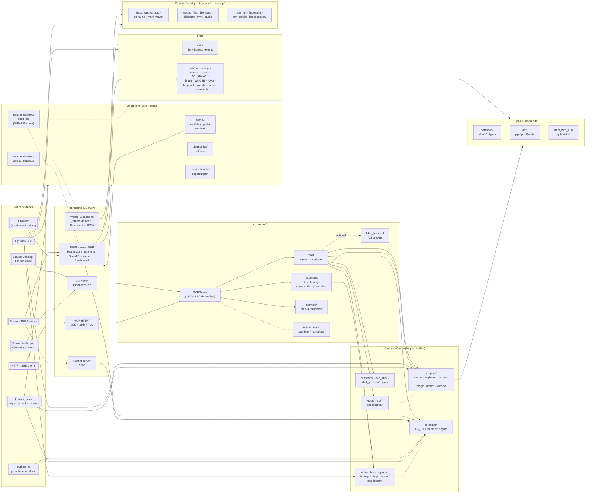

# AutoControl

[](https://pypi.org/project/je_auto_control/)
[](https://pypi.org/project/je_auto_control/)
[](LICENSE)
[](https://autocontrol.readthedocs.io/en/latest/?badge=latest)

**AutoControl** is a cross-platform Python GUI automation framework providing mouse control, keyboard input, image recognition, screen capture, action scripting, and report generation — all through a unified API that works on Windows, macOS, and Linux (X11).

**[繁體中文](README/README_zh-TW.md)** | **[简体中文](README/README_zh-CN.md)**

---

## Table of Contents

- [What's new (2026-06-22) — URI-Scheme Value References](#whats-new-2026-06-22--uri-scheme-value-references)
- [What's new (2026-06-21) — W3C Baggage Propagation](#whats-new-2026-06-21--w3c-baggage-propagation)
- [What's new (2026-06-21) — Dataset Diff (Row-Set Change Report)](#whats-new-2026-06-21--dataset-diff-row-set-change-report)
- [What's new (2026-06-21) — Distribution Drift Detection](#whats-new-2026-06-21--distribution-drift-detection)
- [What's new (2026-06-21) — Layered Configuration Resolver](#whats-new-2026-06-21--layered-configuration-resolver)
- [What's new (2026-06-21) — Server-Sent Events (SSE) Client Parser](#whats-new-2026-06-21--server-sent-events-sse-client-parser)
- [What's new (2026-06-21) — Dotenv (.env) Parsing](#whats-new-2026-06-21--dotenv-env-parsing)
- [What's new (2026-06-21) — RFC 9457 Problem Details Parsing](#whats-new-2026-06-21--rfc-9457-problem-details-parsing)
- [What's new (2026-06-21) — Data Profiling & Schema Inference](#whats-new-2026-06-21--data-profiling--schema-inference)
- [What's new (2026-06-21) — W3C Trace Context Propagation](#whats-new-2026-06-21--w3c-trace-context-propagation)
- [What's new (2026-06-21) — HTTP Record & Replay Cassette](#whats-new-2026-06-21--http-record--replay-cassette)
- [What's new (2026-06-21) — Bulkhead & Rate-Limit Headers](#whats-new-2026-06-21--bulkhead--rate-limit-headers)
- [What's new (2026-06-21) — Streaming Latency Percentiles](#whats-new-2026-06-21--streaming-latency-percentiles)
- [What's new (2026-06-21) — Service-Level Objectives (SLO)](#whats-new-2026-06-21--service-level-objectives-slo)
- [What's new (2026-06-21) — Chaos Experiments](#whats-new-2026-06-21--chaos-experiments)
- [What's new (2026-06-21) — JSON Contract & Snapshot Matching](#whats-new-2026-06-21--json-contract--snapshot-matching)
- [What's new (2026-06-21) — SLSA Build Provenance](#whats-new-2026-06-21--slsa-build-provenance)
- [What's new (2026-06-21) — Feature Flags](#whats-new-2026-06-21--feature-flags)
- [What's new (2026-06-21) — Text Diff, Patch & Three-Way Merge](#whats-new-2026-06-21--text-diff-patch--three-way-merge)
- [What's new (2026-06-21) — Calendar Recurrence Rules (RRULE)](#whats-new-2026-06-21--calendar-recurrence-rules-rrule)
- [What's new (2026-06-21) — Statistics & A/B Significance](#whats-new-2026-06-21--statistics--ab-significance)
- [What's new (2026-06-21) — Full-Text Search (BM25)](#whats-new-2026-06-21--full-text-search-bm25)
- [What's new (2026-06-21) — JSON Pointer, Patch & Merge Patch](#whats-new-2026-06-21--json-pointer-patch--merge-patch)
- [What's new (2026-06-21) — Client-Side Rate Limiting](#whats-new-2026-06-21--client-side-rate-limiting)
- [What's new (2026-06-21) — JSON Web Tokens (JWT)](#whats-new-2026-06-21--json-web-tokens-jwt)
- [What's new (2026-06-21) — License Policy Gate](#whats-new-2026-06-21--license-policy-gate)
- [What's new (2026-06-21) — OpenVEX Vulnerability Triage](#whats-new-2026-06-21--openvex-vulnerability-triage)
- [What's new (2026-06-21) — Dependency Vulnerability Scanning (OSV)](#whats-new-2026-06-21--dependency-vulnerability-scanning-osv)
- [What's new (2026-06-21) — JSON Schema Validation](#whats-new-2026-06-21--json-schema-validation)
- [What's new (2026-06-20) — SARIF 2.1.0 Findings Export](#whats-new-2026-06-20--sarif-210-findings-export)
- [What's new (2026-06-20) — Text PII Detection & Redaction](#whats-new-2026-06-20--text-pii-detection--redaction)
- [What's new (2026-06-20) — Self-Healing Locator Write-Back](#whats-new-2026-06-20--self-healing-locator-write-back)
- [What's new (2026-06-20) — DMN-Style Decision Tables](#whats-new-2026-06-20--dmn-style-decision-tables)
- [What's new (2026-06-20) — Saga / Compensating Rollback](#whats-new-2026-06-20--saga--compensating-rollback)
- [What's new (2026-06-20) — JSONPath Querying](#whats-new-2026-06-20--jsonpath-querying)
- [What's new (2026-06-20) — Multi-Channel Webhook Notifications](#whats-new-2026-06-20--multi-channel-webhook-notifications)
- [What's new (2026-06-20) — Outbound CloudEvents Emitter](#whats-new-2026-06-20--outbound-cloudevents-emitter)
- [What's new (2026-06-20) — Environment-Scoped Typed Asset Store](#whats-new-2026-06-20--environment-scoped-typed-asset-store)
- [What's new (2026-06-20) — Task / Process Mining (Automation-Candidate Discovery)](#whats-new-2026-06-20--task--process-mining-automation-candidate-discovery)
- [What's new (2026-06-20) — Stuck-Loop Guard (Agent Loop Progress Detection)](#whats-new-2026-06-20--stuck-loop-guard-agent-loop-progress-detection)
- [What's new (2026-06-20) — Coordinate-Space Mapping (Model Grid ⇄ Physical Pixels)](#whats-new-2026-06-20--coordinate-space-mapping-model-grid--physical-pixels)
- [What's new (2026-06-20) — Voice-Command Router](#whats-new-2026-06-20--voice-command-router)
- [What's new (2026-06-20) — Locale-Aware Number, Currency & Date Parsing](#whats-new-2026-06-20--locale-aware-number-currency--date-parsing)
- [What's new (2026-06-20) — Perceptual-Hash Image Dedupe](#whats-new-2026-06-20--perceptual-hash-image-dedupe)
- [What's new (2026-06-20) — S3-Compatible Artifact Store](#whats-new-2026-06-20--s3-compatible-artifact-store)
- [What's new (2026-06-20) — Fuzzy String Matching & Dedupe](#whats-new-2026-06-20--fuzzy-string-matching--dedupe)
- [What's new (2026-06-19) — Video Step-Overlay Report](#whats-new-2026-06-19--video-step-overlay-report)
- [What's new (2026-06-19) — Agent Observability (GenAI OpenTelemetry Spans)](#whats-new-2026-06-19--agent-observability-genai-opentelemetry-spans)
- [What's new (2026-06-19) — Compliance Control Report (SOC2 / ISO 27001)](#whats-new-2026-06-19--compliance-control-report-soc2--iso-27001)
- [What's new (2026-06-19) — Agent Trajectory Evaluation](#whats-new-2026-06-19--agent-trajectory-evaluation)
- [What's new (2026-06-19) — Approval Testing (Golden-Master Baselines)](#whats-new-2026-06-19--approval-testing-golden-master-baselines)
- [What's new (2026-06-19) — Network Egress Allowlist Guard](#whats-new-2026-06-19--network-egress-allowlist-guard)
- [What's new (2026-06-19) — Just-In-Time Credential Leases](#whats-new-2026-06-19--just-in-time-credential-leases)
- [What's new (2026-06-19) — Maker-Checker Approval Gate](#whats-new-2026-06-19--maker-checker-approval-gate)
- [What's new (2026-06-19) — Plugin SDK](#whats-new-2026-06-19--plugin-sdk)
- [What's new (2026-06-19) — MCP Structured Output](#whats-new-2026-06-19--mcp-structured-output)
- [What's new (2026-06-19) — Tweened Drag](#whats-new-2026-06-19--tweened-drag)
- [What's new (2026-06-19) — Process-Doc (SOP) Generator](#whats-new-2026-06-19--process-doc-sop-generator)
- [What's new (2026-06-19) — Heal Analytics & Secret Scan](#whats-new-2026-06-19--heal-analytics--secret-scan)
- [What's new (2026-06-19) — CI Annotations & Clipboard History](#whats-new-2026-06-19--ci-annotations--clipboard-history)
- [What's new (2026-06-19) — Resilience Primitives](#whats-new-2026-06-19--resilience-primitives)
- [What's new (2026-06-19) — Timed Input Macros](#whats-new-2026-06-19--timed-input-macros)
- [What's new (2026-06-19) — Semantic Screen State](#whats-new-2026-06-19--semantic-screen-state)
- [What's new (2026-06-19) — Set-of-Marks Overlay](#whats-new-2026-06-19--set-of-marks-overlay)
- [What's new (2026-06-19) — Checkpoint & Resume](#whats-new-2026-06-19--checkpoint--resume)
- [What's new (2026-06-19) — i18n / l10n Testing](#whats-new-2026-06-19--i18n--l10n-testing)
- [What's new (2026-06-19) — Data Quality](#whats-new-2026-06-19--data-quality)
- [What's new (2026-06-19) — SBOM & Suite Sharding](#whats-new-2026-06-19--sbom--suite-sharding)
- [What's new (2026-06-19) — Reactive Observer](#whats-new-2026-06-19--reactive-observer)
- [What's new (2026-06-19) — WCAG 2.2 Audit](#whats-new-2026-06-19--wcag-22-audit)
- [What's new (2026-06-19) — Memory & Determinism](#whats-new-2026-06-19--memory--determinism)
- [What's new (2026-06-19) — Office I/O](#whats-new-2026-06-19--office-io)
- [What's new (2026-06-19) — Agent Toolkit](#whats-new-2026-06-19--agent-toolkit)
- [What's new (2026-06-19) — Authoring & Debugging](#whats-new-2026-06-19--authoring--debugging)
- [What's new (2026-06-19) — Test & Tooling Batch](#whats-new-2026-06-19--test--tooling-batch)
- [What's new (2026-06-19) — Transactional Queue](#whats-new-2026-06-19--transactional-queue)
- [What's new (2026-06-19) — Unattended Reliability](#whats-new-2026-06-19--unattended-reliability)
- [What's new (2026-06-19) — Popup Watchdog](#whats-new-2026-06-19--popup-watchdog)
- [What's new (2026-06-19) — Native UI Control](#whats-new-2026-06-19--native-ui-control)
- [What's new (2026-06-19)](#whats-new-2026-06-19)
- [What's new (2026-06-18)](#whats-new-2026-06-18)
- [What's new (2026-06-17)](#whats-new-2026-06-17)
- [What's new (2026-06)](#whats-new-2026-06)
- [What's new (2026-05)](#whats-new-2026-05)
- [Features](#features)
- [Architecture](#architecture)
- [Installation](#installation)
- [Requirements](#requirements)
- [Quick Start](#quick-start)
  - [Mouse Control](#mouse-control)
  - [Keyboard Control](#keyboard-control)
  - [Image Recognition](#image-recognition)
  - [Accessibility Element Finder](#accessibility-element-finder)
  - [AI Element Locator (VLM)](#ai-element-locator-vlm)
  - [OCR (Text on Screen)](#ocr-text-on-screen)
  - [LLM Action Planner](#llm-action-planner)
  - [Runtime Variables & Control Flow](#runtime-variables--control-flow)
  - [Remote Desktop](#remote-desktop)
  - [Clipboard](#clipboard)
  - [Screenshot](#screenshot)
  - [Action Recording & Playback](#action-recording--playback)
  - [JSON Action Scripting](#json-action-scripting)
  - [MCP Server (Use AutoControl from Claude)](#mcp-server-use-autocontrol-from-claude)
  - [Scheduler (Interval & Cron)](#scheduler-interval--cron)
  - [Global Hotkey Daemon](#global-hotkey-daemon)
  - [Event Triggers](#event-triggers)
  - [Run History](#run-history)
  - [Report Generation](#report-generation)
  - [Observability (Prometheus / OpenTelemetry)](#observability-prometheus--opentelemetry)
  - [Remote Automation (Socket / REST)](#remote-automation-socket--rest)
  - [Plugin Loader](#plugin-loader)
  - [Shell Command Execution](#shell-command-execution)
  - [Screen Recording](#screen-recording)
  - [Callback Executor](#callback-executor)
  - [Package Manager](#package-manager)
  - [Project Management](#project-management)
  - [Window Management](#window-management)
  - [GUI Application](#gui-application)
- [Command-Line Interface](#command-line-interface)
- [Platform Support](#platform-support)
- [Development](#development)
- [License](#license)

---

## What's new (2026-06-22) — URI-Scheme Value References

Store pointers, not secrets, in config. Full reference: [`docs/source/Eng/doc/new_features/v85_features_doc.rst`](docs/source/Eng/doc/new_features/v85_features_doc.rst).

- **`resolve_ref` / `resolve_refs_in` / `is_ref` / `RefResolver`** (`AC_resolve_ref`, `AC_resolve_refs`): `interpolate` hardcoded only `${secrets.NAME}` and `AssetStore` refs were vault-name-only — there was no general read-time indirection. This resolves `env://VAR`, `file://path` (with an optional `base_dir` traversal guard), and `secret://name` (injectable resolver or the governance broker), and walks nested structures resolving every reference. Env reader / secret resolver / base dir are injectable. Pure-stdlib, deterministic.

## What's new (2026-06-21) — W3C Baggage Propagation

Carry cross-cutting key-value context across HTTP. Full reference: [`docs/source/Eng/doc/new_features/v84_features_doc.rst`](docs/source/Eng/doc/new_features/v84_features_doc.rst).

- **`Baggage` / `parse_baggage` / `format_baggage` / `inject_baggage` / `extract_baggage`** (`AC_baggage_parse`, `AC_baggage_format`): `trace_context` carried trace/span identity but nothing propagated cross-cutting context (`run_id`/`tenant`/`experiment`). This implements the W3C Baggage header — a percent-encoded `key=value` list — with an immutable `Baggage` (set/remove return new instances) and case-insensitive inject/extract over a headers dict. Pairs with `trace_context`. Pure-stdlib, deterministic.

## What's new (2026-06-21) — Dataset Diff (Row-Set Change Report)

Diff two tabular extracts by key. Full reference: [`docs/source/Eng/doc/new_features/v83_features_doc.rst`](docs/source/Eng/doc/new_features/v83_features_doc.rst).

- **`diff_rows` / `cell_changes` / `summarize_diff`** (`AC_diff_rows`, `AC_cell_changes`): the framework diffed screens/snapshots but had nothing to diff two **tabular** row-sets by key. This keys both sides and reports `{added, removed, changed, unchanged}` (changed carries `{key, old, new}`), expands per-cell `{key, column, old, new}` changes, and counts each bucket. Supports composite keys; last-write-wins on duplicates. Pure-stdlib, deterministic.

## What's new (2026-06-21) — Distribution Drift Detection

Check whether today's data is shaped like the baseline. Full reference: [`docs/source/Eng/doc/new_features/v82_features_doc.rst`](docs/source/Eng/doc/new_features/v82_features_doc.rst).

- **`psi` / `ks_two_sample` / `categorical_drift` / `detect_drift`** (`AC_detect_drift`, `AC_categorical_drift`): `stats` had A/B experiment tests but no Population Stability Index and no KS two-sample test for reference-vs-current distributions. This adds PSI (quantile-binned log-ratio), the KS statistic with a Kolmogorov p-value, and a categorical chi-square + total-variation summary — pairing with `data_profile`. `detect_drift` gives a one-call `{psi, drifted, ks}` verdict. Pure-stdlib, deterministic.

## What's new (2026-06-21) — Layered Configuration Resolver

Compose config with `defaults < file < env < CLI` precedence. Full reference: [`docs/source/Eng/doc/new_features/v81_features_doc.rst`](docs/source/Eng/doc/new_features/v81_features_doc.rst).

- **`LayeredConfig` / `deep_merge` / `SourceTrace`** (`AC_resolve_config`, `AC_explain_config`): `json_patch.merge_patch` merges two docs, `config_sync` is last-write-wins, `AssetStore` is flat-per-env — none compose an ordered precedence stack with deep merge or report which layer won each key. `add_layer(name, mapping, priority)` then `resolve()` deep-merges (nested dicts recursively, scalars/lists replaced); `explain("db.host")` names the winning layer. Layers are caller-supplied (env passed in, never `os.environ` implicitly). Pure-stdlib, deterministic.

## What's new (2026-06-21) — Server-Sent Events (SSE) Client Parser

Consume `text/event-stream` responses. Full reference: [`docs/source/Eng/doc/new_features/v80_features_doc.rst`](docs/source/Eng/doc/new_features/v80_features_doc.rst).

- **`parse_event_stream` / `SSEParser` / `SSEEvent`** (`AC_parse_sse`): the MCP HTTP transport emits SSE, but nothing consumed it — a streaming LLM/agent/chatops endpoint left `http_request` with a raw blob. This implements the WHATWG event-stream parsing algorithm (`event`/`data`/`id`/`retry`, comments, the leading-space rule, blank-line dispatch) with an incremental `feed` for chunks and a one-shot `parse_event_stream`. Pure-stdlib, fully deterministic.

## What's new (2026-06-21) — Dotenv (.env) Parsing

Read 12-factor `.env` files into config. Full reference: [`docs/source/Eng/doc/new_features/v79_features_doc.rst`](docs/source/Eng/doc/new_features/v79_features_doc.rst).

- **`parse_dotenv` / `load_dotenv` / `dotenv_values` / `dump_dotenv`** (`AC_parse_dotenv`, `AC_load_dotenv`): `load_vars_from_json` ingested flat JSON but nothing read the de-facto `.env` file. This parses `KEY=VALUE` lines (`export` prefixes, single/double quoting, `\n`/`\t` escapes, inline comments) into a plain dict — no `python-dotenv` dependency. The loader merges into a caller-supplied mapping rather than mutating `os.environ`, so it stays safe and deterministic. Pure-stdlib.

## What's new (2026-06-21) — RFC 9457 Problem Details Parsing

Read standardized API errors out of HTTP responses. Full reference: [`docs/source/Eng/doc/new_features/v78_features_doc.rst`](docs/source/Eng/doc/new_features/v78_features_doc.rst).

- **`parse_problem` / `is_problem` / `raise_for_problem` / `ProblemDetails`** (`AC_parse_problem`): `http_request` returned a non-2xx body unparsed, so flows and `assert_http` had no structured way to read a standardized API error. This parses the RFC 9457 `application/problem+json` document — registered `type`/`title`/`status`/`detail`/`instance` members plus vendor extensions — returning `None` for non-problem responses or raising `HttpProblemError`. Pure-stdlib, fully deterministic.

## What's new (2026-06-21) — Data Profiling & Schema Inference

Survey a row-set and propose a validation schema. Full reference: [`docs/source/Eng/doc/new_features/v77_features_doc.rst`](docs/source/Eng/doc/new_features/v77_features_doc.rst).

- **`profile_rows` / `infer_schema`** (`AC_profile_rows`, `AC_infer_schema`): `validate_rows` consumes a hand-written schema and `stats.describe` summarizes one numeric list — nothing surveyed a whole row-set. This profiles each column (null fraction, cardinality, inferred type, top values, numeric min/max/mean) and infers a `validate_rows`-compatible schema (required where non-null, unique where distinct, numeric bounds) — the profiler step that feeds the existing validator. Pure-stdlib, fully deterministic.

## What's new (2026-06-21) — W3C Trace Context Propagation

Correlate spans and logs across HTTP boundaries. Full reference: [`docs/source/Eng/doc/new_features/v76_features_doc.rst`](docs/source/Eng/doc/new_features/v76_features_doc.rst).

- **`SpanContext` / `new_root_context` / `child_context` / `inject_context` / `extract_context`** (`AC_trace_inject`, `AC_trace_extract`): the existing tracer and `agent_trace` spans carried no IDs, so a span on one side of an HTTP call couldn't be correlated with the work it triggered on the other. This implements the W3C Trace Context standard — generate/parse/propagate `traceparent` + `tracestate` headers (version-`00`, rejects malformed/all-zero IDs), with an injectable RNG for deterministic IDs in tests. Pure-stdlib.

## What's new (2026-06-21) — HTTP Record & Replay Cassette

Re-run API flows in CI with no live server. Full reference: [`docs/source/Eng/doc/new_features/v75_features_doc.rst`](docs/source/Eng/doc/new_features/v75_features_doc.rst).

- **`Cassette` / `CassetteMissError`** (`AC_http_replay`): the HTTP client hardcoded its `urllib` transport, so a flow driving a real API couldn't be re-run offline. The client now exposes a `build_call` / `urllib_transport` seam, and this adds a VCR-style cassette — `replay` returns a recorded response for a matching request (pure, no network — the CI-valuable half), `recording_transport` is a thin pass-through over the live transport. Match on `method`/`url` (optionally `body`); `save`/`load` JSON cassettes. Pure-stdlib.

## What's new (2026-06-21) — Bulkhead & Rate-Limit Headers

Cap concurrency, honor server back-off. Full reference: [`docs/source/Eng/doc/new_features/v74_features_doc.rst`](docs/source/Eng/doc/new_features/v74_features_doc.rst).

- **`Bulkhead` / `next_delay` / `parse_retry_after` / `parse_ratelimit`** (`AC_bulkhead_run`, `AC_retry_after`): `resilience` recovers and `rate_limit` paces, but nothing capped *simultaneous* in-flight calls (a slow dependency could exhaust every worker) and the HTTP client ignored `Retry-After`/`RateLimit-*`. This adds a bulkhead (bounded-concurrency permit that sheds load with `BulkheadFullError` when full) and parsers for the server's advised delay (delta-seconds or HTTP-date). Non-blocking permit counting → deterministic, no threads in tests. Pure-stdlib.

## What's new (2026-06-21) — Streaming Latency Percentiles

Mergeable p99 for load/soak runs. Full reference: [`docs/source/Eng/doc/new_features/v73_features_doc.rst`](docs/source/Eng/doc/new_features/v73_features_doc.rst).

- **`LatencyDigest` / `exact_percentiles`** (`AC_percentiles`): `stats.percentile` needs the full sorted list; this adds a HdrHistogram-style digest with O(1) `record`, bounded memory (significant-figure buckets), and `merge` for cross-shard aggregation — the property you need for a correct aggregate p99 from per-worker results. `exact_percentiles` covers the small-set case (arbitrary quantiles). Pure-stdlib `math`.

## What's new (2026-06-21) — Service-Level Objectives (SLO)

SLI, error budget and burn-rate alerts. Full reference: [`docs/source/Eng/doc/new_features/v72_features_doc.rst`](docs/source/Eng/doc/new_features/v72_features_doc.rst).

- **`evaluate_slo` / `burn_rate` / `burn_alerts` / `default_burn_rules`** (`AC_evaluate_slo`, `AC_burn_alerts`): the framework emitted raw signals but had no SLO layer. This computes the SLI over outcome records (`[{timestamp, ok}]`), the error budget against a target, and the **multi-window multi-burn-rate** alerts from the Google SRE workbook (page 14.4×@1h, 6×@6h; ticket 1×@3d — firing only when both windows exceed the threshold). Records are plain data, clock injectable, fully deterministic. Pure-stdlib.

## What's new (2026-06-21) — Chaos Experiments

Inject faults, verify the system holds. Full reference: [`docs/source/Eng/doc/new_features/v71_features_doc.rst`](docs/source/Eng/doc/new_features/v71_features_doc.rst).

- **`ChaosExperiment` / `run_experiment` / `Probe` / `latency_fault` / `exception_fault`** (`AC_run_chaos`): `resilience` *recovers* from failures; this *causes* them and checks a steady-state hypothesis still holds (Chaos Toolkit lifecycle — verify before, inject faults, verify after, roll back LIFO). Probes/faults/rollbacks are callables; the clock/RNG/sleep are injectable so experiments run **deterministically** in tests with no real failures or sleeping. `AC_run_chaos` drives an action-list spec. Pure-stdlib.

## What's new (2026-06-21) — JSON Contract & Snapshot Matching

Match, diff and snapshot JSON payloads. Full reference: [`docs/source/Eng/doc/new_features/v70_features_doc.rst`](docs/source/Eng/doc/new_features/v70_features_doc.rst).

- **`match_json` / `diff_json` / `normalize_json` / `snapshot_json`** (`AC_match_json`, `AC_diff_json`): `json_schema` validates against an authored schema and `jsonpath` extracts, but nothing matched two payloads with relaxed rules or diffed them path-by-path. This adds contract/snapshot matching — `partial` (subset), `match_type` (Pact-style `like`), `ignore` volatile paths — returning `{path, kind}` mismatches (`missing`/`extra`/`changed`), plus golden-master `snapshot_json`. Composes with `json_schema` + `json_patch`; pure-stdlib.

## What's new (2026-06-21) — SLSA Build Provenance

Attest what was built. Full reference: [`docs/source/Eng/doc/new_features/v69_features_doc.rst`](docs/source/Eng/doc/new_features/v69_features_doc.rst).

- **`build_provenance` / `subject_for` / `verify_provenance` / `write_provenance`** (`AC_build_provenance`, `AC_verify_provenance`): the framework signs action files and inventories deps (SBOM) but couldn't attest *what was produced by which build*. This adds an in-toto v1 Statement with a SLSA v1 provenance predicate over file `sha256` digests, and a verifier that re-hashes the artifacts (tamper → mismatch). Complements `action_signing` + `sbom`; pure-stdlib `hashlib`+`json`, fully offline.

## What's new (2026-06-21) — Feature Flags

Toggle behavior with targeting & rollout. Full reference: [`docs/source/Eng/doc/new_features/v68_features_doc.rst`](docs/source/Eng/doc/new_features/v68_features_doc.rst).

- **`FlagStore` / `evaluate_flag` / `is_enabled` / `assign_variant`** (`AC_evaluate_flag`, `AC_flag_enabled`): `decision_table` is one-shot DMN and `ab_locator` is locator A/B — neither is a product flag store with sticky % rollout. This adds an OpenFeature-shaped engine: targeting rules (`eq`/`in`/`semver_*`…), weighted variants, kill switch, and consistent-hash bucketing (`sha256(key.salt.context_key)`) so a subject is **sticky**. Returns `{value, variant, reason}` (`TARGETING_MATCH`/`SPLIT`/`DISABLED`/`ERROR`). Pure-stdlib, deterministic.

## What's new (2026-06-21) — Text Diff, Patch & Three-Way Merge

Apply and merge text diffs. Full reference: [`docs/source/Eng/doc/new_features/v67_features_doc.rst`](docs/source/Eng/doc/new_features/v67_features_doc.rst).

- **`unified_diff` / `apply_unified` / `three_way_merge`** (`AC_unified_diff`, `AC_apply_unified`, `AC_three_way_merge`): `difflib` *generates* a unified diff but the stdlib can't *apply* one, and there was no three-way merge. This adds the missing applier (walks `@@` hunks, verifies context, raises on mismatch) and a line-based three-way merge (non-overlapping edits combine cleanly; overlapping ones emit `<<<<<<<` conflict markers). Complements `json_patch` (structured JSON); pure-stdlib `difflib`.

## What's new (2026-06-21) — Calendar Recurrence Rules (RRULE)

Schedule "every 2nd Tuesday". Full reference: [`docs/source/Eng/doc/new_features/v66_features_doc.rst`](docs/source/Eng/doc/new_features/v66_features_doc.rst).

- **`parse_rrule` / `occurrences` / `next_occurrence`** (`AC_rrule_occurrences`, `AC_rrule_next`): the scheduler's cron is 5-field interval-only — it can't express "every 2nd Tuesday", "the last weekday of the month", or "every weekday for 10 occurrences". This adds an RFC 5545 (iCalendar) RRULE parser + occurrence expander supporting `FREQ`/`INTERVAL`/`COUNT`/`UNTIL`/`BYDAY` (with ordinals like `2MO`/`-1FR`)/`BYMONTHDAY`/`BYMONTH`/`BYSETPOS`/`WKST`. Pure-stdlib `datetime`+`calendar`, injectable clock for deterministic `next_occurrence`.

## What's new (2026-06-21) — Statistics & A/B Significance

Decide whether a difference is real. Full reference: [`docs/source/Eng/doc/new_features/v65_features_doc.rst`](docs/source/Eng/doc/new_features/v65_features_doc.rst).

- **`describe` / `percentile` / `two_proportion_z_test` / `welch_t_test` / `cohens_d` / `chi_square_2x2`** (`AC_describe_stats`, `AC_ab_significance`): `ab_locator` ranks by raw success rate and `run_history` stores durations, but nothing computed percentiles or significance. This adds the analysis layer — summary stats + p50/p90/p95/p99, a two-proportion z-test (with CI), Welch's t-test (exact t-distribution p-value via the incomplete beta — no SciPy), Cohen's d, and a 2×2 chi-square. The normal CDF is exact via `math.erf`; validated against textbook values (incl. the chi²=z² identity). Pure-stdlib `math`+`statistics`.

## What's new (2026-06-21) — Full-Text Search (BM25)

Rank a document corpus by relevance. Full reference: [`docs/source/Eng/doc/new_features/v64_features_doc.rst`](docs/source/Eng/doc/new_features/v64_features_doc.rst).

- **`SearchIndex` / `search_documents` / `tokenize`** (`AC_search_documents`, `ac_search_documents`): `fuzzy` is pairwise and `skill_library` matches substrings alphabetically — neither ranks a corpus by relevance. This adds an inverted-index search ranked with Okapi BM25 (`k1=1.5`, `b=0.75`, `IDF = ln(1+(N−df+0.5)/(df+0.5))`) or TF-IDF, so a rare term out-ranks a common one, term frequency saturates, and long docs are normalized down. Incremental `add`/`remove`, optional stop-words, deterministic ranking. Pure-stdlib `math`+`collections`+`re` — no database.

## What's new (2026-06-21) — JSON Pointer, Patch & Merge Patch

Address, diff and patch JSON. Full reference: [`docs/source/Eng/doc/new_features/v63_features_doc.rst`](docs/source/Eng/doc/new_features/v63_features_doc.rst).

- **`resolve_pointer` / `make_patch` / `apply_patch` / `merge_patch` / `make_merge_patch`** (`AC_resolve_pointer`, `AC_apply_json_patch`, `AC_make_json_patch`, `AC_merge_patch`): `jsonpath` is read-only and `approval` compares whole artifacts — nothing could address one location, compute a structured delta, or apply a partial update. This adds the three IETF primitives — JSON Pointer (RFC 6901), JSON Patch (RFC 6902, all six ops, **atomic** apply), and JSON Merge Patch (RFC 7386, `null` deletes) — for config-drift detection, partial updates, HTTP PATCH bodies, and golden-master deltas. Pure-stdlib `json`+`copy`, validated against the RFC test vectors.

## What's new (2026-06-21) — Client-Side Rate Limiting

Stay under API quotas. Full reference: [`docs/source/Eng/doc/new_features/v62_features_doc.rst`](docs/source/Eng/doc/new_features/v62_features_doc.rst).

- **`TokenBucket` / `SlidingWindowLimiter` / `throttle`** (`AC_rate_limit`, `ac_rate_limit`): `RetryPolicy`/`CircuitBreaker` recover from failures but nothing shaped the *rate* of calls. This adds a token bucket (smooth rate + burst), a sliding-window limiter (Cloudflare's O(1) weighted counter), and a leading-edge throttle decorator. Every limiter takes an injectable `clock` (and `acquire` a `sleep`) so it's fully deterministic in CI with no real delays. `AC_rate_limit` gates an action against a named bucket, returning `{acquired, tokens, wait}`.

## What's new (2026-06-21) — JSON Web Tokens (JWT)

Mint and verify bearer tokens for the APIs you automate. Full reference: [`docs/source/Eng/doc/new_features/v61_features_doc.rst`](docs/source/Eng/doc/new_features/v61_features_doc.rst).

- **`encode_jwt` / `decode_jwt` / `ClaimsPolicy`** (`AC_jwt_encode`, `AC_jwt_decode`): the framework had HMAC *file* signing and an ACME-bound RS256 JWS, but nothing to mint/verify a compact bearer JWT. This adds a pure-stdlib HS256/384/512 codec with full claim validation (`exp`/`nbf`/`aud`/`iss`, injectable clock) that drops straight into `http_request`'s bearer auth. Safe by default: rejects `alg:none`, enforces an algorithm allowlist (anti-confusion), and compares signatures with `hmac.compare_digest`. `AC_jwt_decode` returns `{ok, claims}` so flows can branch without raising.

## What's new (2026-06-21) — License Policy Gate

Flag disallowed dependency licenses. Full reference: [`docs/source/Eng/doc/new_features/v60_features_doc.rst`](docs/source/Eng/doc/new_features/v60_features_doc.rst).

- **`evaluate_sbom` / `evaluate_license` / `normalize_spdx` / `license_findings_to_sarif`** (`AC_check_licenses`, `ac_check_licenses`): the SBOM recorded each dependency's license name but never *judged* it. This normalizes license strings to SPDX ids and evaluates them against an allowlist/denylist (with a built-in `DEFAULT_COPYLEFT` set), understanding SPDX expressions (`OR` = choice, `AND` = all), then bridges violations into SARIF (`denied`→error, `unknown`→warning). Pure-stdlib, fully offline — the license-compliance lane beside the OSV vulnerability lane.

## What's new (2026-06-21) — OpenVEX Vulnerability Triage

Suppress the vulns that don't affect you. Full reference: [`docs/source/Eng/doc/new_features/v59_features_doc.rst`](docs/source/Eng/doc/new_features/v59_features_doc.rst).

- **`vex_statement` / `build_vex` / `apply_vex`** (`AC_apply_vex`, `ac_apply_vex`): the OSV scanner surfaces every known CVE forever — there was no way to record "we checked, this one doesn't affect us". This authors [OpenVEX](https://openvex.dev) 0.2.0 statements and applies them to the scanner's findings: `not_affected`/`fixed` **suppress** a finding, `affected`/`under_investigation` **annotate** it. Statements join on the vuln id *or* an alias, optionally product-scoped; `not_affected` requires a justification or impact statement. Pure-stdlib; chains directly after `AC_scan_vulns`.

## What's new (2026-06-21) — Dependency Vulnerability Scanning (OSV)

Match the SBOM against known CVEs. Full reference: [`docs/source/Eng/doc/new_features/v58_features_doc.rst`](docs/source/Eng/doc/new_features/v58_features_doc.rst).

- **`scan_components` / `match_package` / `is_affected` / `findings_to_sarif`** (`AC_scan_vulns`, `ac_scan_vulns`): `build_sbom` only *inventoried* dependencies and `to_sarif` only *exported* findings — nothing ever **produced** a vulnerability finding. This matches the SBOM's `(ecosystem, name, version)` components against an [OSV](https://osv.dev) advisory database (sweeping `introduced`/`fixed`/`last_affected` ranges, PEP-503 name normalization, severity→SARIF level) and bridges results into the existing SARIF exporter for GitHub/Azure DevOps code scanning. The advisory DB is **injected as data** (offline, deterministic); the live `osv.dev` query is an optional `fetcher` seam. Pure-stdlib `re`.

## What's new (2026-06-21) — JSON Schema Validation

Validate nested JSON against a real schema. Full reference: [`docs/source/Eng/doc/new_features/v57_features_doc.rst`](docs/source/Eng/doc/new_features/v57_features_doc.rst).

- **`validate_json` / `is_valid` / `assert_schema`** (`AC_validate_json`, `ac_validate_json`): the framework only *generated* JSON Schema and `data_quality` is a flat per-column checker — neither could validate a nested API request/response body. This adds the consumer: a JSON Schema (Draft 2020-12 subset) validator that reports **every** violation as `{path, keyword, message}` (e.g. `$.age maximum`). Covers `type` (incl. integral-float `integer`), `enum`/`const`, numeric/string bounds, array & object keywords, `allOf`/`anyOf`/`oneOf`/`not`, boolean schemas and local `$ref`. Pure-stdlib `re`; pairs with `json_query` and the `http_request` helper.

## What's new (2026-06-20) — SARIF 2.1.0 Findings Export

Unify scanner findings for GitHub code scanning. Full reference: [`docs/source/Eng/doc/new_features/v56_features_doc.rst`](docs/source/Eng/doc/new_features/v56_features_doc.rst).

- **`to_sarif` / `write_sarif` / `make_finding` / `from_lint_issues` / `from_audit_findings`** (`AC_export_sarif`, `ac_export_sarif`): the framework's findings producers (action-lint, secrets scan, WCAG audit, guardrail) had no common export. This builds a SARIF 2.1.0 document — with auto rule catalog and stable `partialFingerprints` for cross-run dedupe — that GitHub/Azure DevOps code scanning ingests as line-anchored alerts. Pure-stdlib `json`+`hashlib`; adapters normalize the existing lint/audit shapes.

## What's new (2026-06-20) — Text PII Detection & Redaction

Mask PII in text before it leaks. Full reference: [`docs/source/Eng/doc/new_features/v55_features_doc.rst`](docs/source/Eng/doc/new_features/v55_features_doc.rst).

- **`detect_pii` / `redact_pii_text`** (`AC_detect_pii` / `AC_redact_pii`, `ac_*`): image redaction existed but text (OCR, clipboard, LLM I/O, logs) had no string-level PII handling. This detects emails / phones / SSNs / credit cards / IPv4 / IBANs over plain text and redacts with `label` / `mask` / `partial` / `hash`. Overlapping spans dedupe (a card isn't also a phone); patterns are backtracking-safe. Pure-stdlib `re`+`hashlib`.

## What's new (2026-06-20) — Self-Healing Locator Write-Back

Persist corrected locators so heals aren't forgotten. Full reference: [`docs/source/Eng/doc/new_features/v54_features_doc.rst`](docs/source/Eng/doc/new_features/v54_features_doc.rst).

- **`RepairStore` / `repair_from_heal`** (`AC_repair_record` / `AC_repair_resolved` / `AC_repair_pending` / `AC_repair_approve`, `ac_*`): runtime self-healing previously **threw away** the corrected location, so every run re-healed. This records the corrected locator (coords/VLM description/method) from a heal, **auto-applies** it when `confidence >= auto_threshold` (default 0.9) or queues a reviewable suggestion, and `resolved(key)` returns the learned fix for reuse. Closes the heal→durable-fix loop; pure-stdlib, fully testable.

## What's new (2026-06-20) — DMN-Style Decision Tables

Externalize branching into reviewable rule tables. Full reference: [`docs/source/Eng/doc/new_features/v53_features_doc.rst`](docs/source/Eng/doc/new_features/v53_features_doc.rst).

- **`evaluate_table` / `DecisionTable`** (`AC_decision_table`, `ac_decision_table`): replaces nested `AC_if_var` chains with rows of `conditions -> outputs` and a hit policy (`UNIQUE`/`FIRST`/`PRIORITY`/`COLLECT`). Cell conditions are wildcard / literal / `{op, value}` using the executor's standard comparators (reused, not duplicated). Pure-stdlib, fully testable; the DMN way to keep business rules data-driven.

## What's new (2026-06-20) — Saga / Compensating Rollback

Undo completed steps when a later one fails. Full reference: [`docs/source/Eng/doc/new_features/v52_features_doc.rst`](docs/source/Eng/doc/new_features/v52_features_doc.rst).

- **`Saga` / `run_saga`** (`AC_run_saga`, `ac_run_saga`): records a compensating action per step; on any failure runs the completed steps' compensations in **LIFO** order — the durable-transaction primitive `AC_try` (single-block) couldn't provide. Forward actions/compensations are callables (or JSON action lists), so it's fully unit-tested with no side effects; compensation is best-effort (a failing undo is logged, rollback continues). Returns `{ok, completed, compensated, failed_step, error}`.

## What's new (2026-06-20) — JSONPath Querying

Query API/DB JSON with wildcards, recursion, filters. Full reference: [`docs/source/Eng/doc/new_features/v51_features_doc.rst`](docs/source/Eng/doc/new_features/v51_features_doc.rst).

- **`json_query` / `json_query_one` / `json_extract`** (`AC_json_query` / `AC_json_extract`, `ac_*`): the executor's path walker only split on `.` and indexed — this adds a JSONPath subset (`$`, `.key`, `[n]`/`[-n]`, `*`/`[*]`, `..` recursive descent, `[?(@.k op v)]` filters) over parsed JSON, so array-bearing API/DB responses are easy to extract from. `json_extract` runs a `{key: path}` mapping into a flat dict. Pure-stdlib `re`; the path engine `AC_http_to_var` and DB-row flows were missing.

## What's new (2026-06-20) — Multi-Channel Webhook Notifications

Alert Teams/Discord/Slack/webhook. Full reference: [`docs/source/Eng/doc/new_features/v50_features_doc.rst`](docs/source/Eng/doc/new_features/v50_features_doc.rst).

- **`notify_webhook` / `WebhookChannel`** (`AC_notify_webhook`, `ac_notify_webhook`): `notify` was desktop-toast only and ChatOps shipped Slack only — this sends to **Slack / Discord / Microsoft Teams / raw** webhooks, building the transport-shaped payload (Slack & Teams MessageCard use `text`, Discord uses `content`) and POSTing via the egress-guarded HTTP client. The `poster` transport is injectable (or `set_default_poster`), so sending is unit-tested with no network.

## What's new (2026-06-20) — Outbound CloudEvents Emitter

Emit run/automation events as CloudEvents. Full reference: [`docs/source/Eng/doc/new_features/v49_features_doc.rst`](docs/source/Eng/doc/new_features/v49_features_doc.rst).

- **`to_cloudevent` / `EventEmitter` / `post_cloudevent`** (`AC_emit_event`, `ac_emit_event`): the repo could receive webhooks but not **emit** events — this wraps run-lifecycle/assertion/failure data in a CloudEvents 1.0 (CNCF) envelope and optionally POSTs it over the egress-guarded HTTP client (interop with Knative, Azure Event Grid, iPaaS, generic webhooks). The `sink`/`poster` transport is injectable, so emission is unit-tested with no network.

## What's new (2026-06-20) — Environment-Scoped Typed Asset Store

Per-environment typed config + credential refs. Full reference: [`docs/source/Eng/doc/new_features/v48_features_doc.rst`](docs/source/Eng/doc/new_features/v48_features_doc.rst).

- **`AssetStore` / `active_environment`** (`AC_set_asset` / `AC_get_asset` / `AC_list_assets`, `ac_*`): the orchestrator "Assets/lockers" pillar — centrally-managed config values that differ by environment (dev/staging/prod) and carry a type (`text`/`int`/`bool`/`credential`). `get` coerces to the declared type and falls back to the default env; `credential` assets hold a secret *reference* that `resolve` turns into the real value via an injected resolver (Python-only, so secrets never enter `get`/executor records). Fills the gap the secret vault (secret-only) and config-sync (whole-blob) left.

## What's new (2026-06-20) — Task / Process Mining (Automation-Candidate Discovery)

Discover what to automate from recorded action logs. Full reference: [`docs/source/Eng/doc/new_features/v47_features_doc.rst`](docs/source/Eng/doc/new_features/v47_features_doc.rst).

- **`mine_action_log` / `find_repeated_sequences` / `directly_follows` / `rank_automation_candidates`** (`AC_mine_actions`, `ac_mine_actions`): mines a recorded action log for frequent, repeatable command n-grams, builds a directly-follows graph, and ranks automation candidates by `count × length` — the RPA "task mining" pillar AutoControl recorded data for but never analysed. Pure-stdlib; operates on the existing action-list shape; a candidate that recurs and spans several steps is a strong "extract into a skill" signal.

## What's new (2026-06-20) — Stuck-Loop Guard (Agent Loop Progress Detection)

Catch agents stuck in no-progress loops. Full reference: [`docs/source/Eng/doc/new_features/v46_features_doc.rst`](docs/source/Eng/doc/new_features/v46_features_doc.rst).

- **`LoopGuard` / `digest_result`** (`AC_loop_guard_observe` / `AC_loop_guard_reset`, `ac_*`): the top computer-use failure mode is an agent repeating an action with no effect — and the model can't see its own loop. `LoopGuard` watches the `(tool, args, result)` stream and flags `repeat` (same call N times), `ping_pong` (A-B-A-B), and `no_op` (observation digest unchanged), escalating `ok`→`warn`→`critical` by run length. Complements the step/time budget and offline trajectory eval; pure-stdlib, deterministic.

## What's new (2026-06-20) — Coordinate-Space Mapping (Model Grid ⇄ Physical Pixels)

Translate computer-use model clicks to real pixels. Full reference: [`docs/source/Eng/doc/new_features/v45_features_doc.rst`](docs/source/Eng/doc/new_features/v45_features_doc.rst).

- **`CoordinateSpace` / `xga_space` / `normalized_space` / `downscale_png`** (`AC_to_physical` / `AC_to_model`, `ac_*`): computer-use/VLA models click in a fixed grid (Anthropic downscales to XGA; Gemini returns a 1000×1000 grid), not physical pixels. This maps both ways (round + clamp), `xga_space` aspect-preserves without upscaling, and `downscale_png` resizes a screenshot to the model's input size (Pillow, already core). Pure-arithmetic mapping — unit-tested without a model/GPU.

## What's new (2026-06-20) — Voice-Command Router

Trigger flows hands-free from recognized speech. Full reference: [`docs/source/Eng/doc/new_features/v44_features_doc.rst`](docs/source/Eng/doc/new_features/v44_features_doc.rst).

- **`VoiceRouter`** (`AC_voice_register` / `AC_voice_dispatch` / `AC_voice_list` / `AC_voice_clear`, `ac_*`): map spoken trigger phrases to `AC_*` action lists; feed it recognized text and it runs the closest registered command (phrase matching reuses the fuzzy matcher, so "save the file" fires "save file"). **Speech-to-text is out of scope and injectable** — the router takes text and a `recognizer`/`runner` callable, so routing is fully unit-tested without audio or any speech dependency (a real Vosk/mic recogniser plugs into `listen_once`).

## What's new (2026-06-20) — Locale-Aware Number, Currency & Date Parsing

Parse localized numbers/currency/dates. Full reference: [`docs/source/Eng/doc/new_features/v43_features_doc.rst`](docs/source/Eng/doc/new_features/v43_features_doc.rst).

- **`parse_decimal` / `parse_number` / `format_decimal` / `format_currency` / `format_date`** (`AC_parse_decimal` / `AC_parse_number` / `AC_format_decimal` / `AC_format_currency` / `AC_format_date`, `ac_*`): OCR/UI text like `"1.234,56"` (de_DE) parses correctly to `1234.56` via **Babel**'s CLDR data, and values format back per-locale. `babel` is an optional `[locale]` extra, imported lazily; functional tests run under `importorskip` (wiring/facade always verified).

## What's new (2026-06-20) — Perceptual-Hash Image Dedupe

Collapse near-identical screenshots. Full reference: [`docs/source/Eng/doc/new_features/v42_features_doc.rst`](docs/source/Eng/doc/new_features/v42_features_doc.rst).

- **`average_hash` / `dhash` / `hamming_distance` / `images_similar` / `dedupe_images`** (`AC_image_hash` / `AC_dedupe_images`, `ac_*`): perceptual hashing maps visually similar images to close fingerprints, so near-duplicate frames in a recording or step report cluster by Hamming distance and collapse to one representative. Uses **Pillow** (already core — no extra dep); the dedupe/compare logic is pure Python with an injectable `hasher`, so clustering is unit-tested without any image and the real Pillow path under `importorskip`.

## What's new (2026-06-20) — S3-Compatible Artifact Store

Push run artifacts to object storage. Full reference: [`docs/source/Eng/doc/new_features/v41_features_doc.rst`](docs/source/Eng/doc/new_features/v41_features_doc.rst).

- **`S3ArtifactStore`** (`AC_s3_upload` / `AC_s3_download` / `AC_s3_list` / `AC_s3_delete`, `ac_*`): upload/download/list/delete reports, screenshots, and recordings against any S3-compatible bucket (AWS S3, MinIO, R2). `boto3` is an **optional** `[s3]` extra and the client is **injectable**, so the store's logic — and the executor path — are fully unit-tested with a fake client (no boto3/network); the live AWS path is honestly noted as CI-unverifiable. The whole API is relative to the store `prefix`. A module-level default store backs the commands.

## What's new (2026-06-20) — Fuzzy String Matching & Dedupe

Match noisy OCR/UI text robustly. Full reference: [`docs/source/Eng/doc/new_features/v40_features_doc.rst`](docs/source/Eng/doc/new_features/v40_features_doc.rst).

- **`fuzzy_ratio` / `fuzzy_best_match` / `fuzzy_matches` / `fuzzy_dedupe`** (`AC_fuzzy_ratio` / `AC_fuzzy_best_match` / `AC_fuzzy_dedupe`, `ac_*`): score similarity (0..1), pick the closest candidate from a list, or collapse near-duplicates — so a flow can act on "the button that *looks like* Submit" rather than an exact label. The default backend is stdlib `difflib` (**zero extra deps**); the optional `[fuzzy]` extra adds `rapidfuzz` for speed, with scores normalised either way. `ignore_case` and `score_cutoff` supported.

## What's new (2026-06-19) — Video Step-Overlay Report

Caption screenshots into a walkthrough video. Full reference: [`docs/source/Eng/doc/new_features/v39_features_doc.rst`](docs/source/Eng/doc/new_features/v39_features_doc.rst).

- **`write_step_video`** (`AC_write_step_video`, `ac_write_step_video`): turns per-step screenshots into a shareable video where each frame is held for a few seconds with its caption and a pass/fail colour banner burned in. The assembly logic (`build_overlay_plan` / `render_overlay_frame`) is separated from OpenCV via injectable `loader`/`drawer`/`writer_factory` hooks — unit-testable with fakes and no `cv2`/`numpy` dependency; the real path lazily imports `cv2` only when those hooks are absent. The visual companion to the HTML/JSON reports.

## What's new (2026-06-19) — Agent Observability (GenAI OpenTelemetry Spans)

OTel GenAI-convention spans for LLM runs. Full reference: [`docs/source/Eng/doc/new_features/v38_features_doc.rst`](docs/source/Eng/doc/new_features/v38_features_doc.rst).

- **`AgentTrace`** (`AC_trace_record` / `AC_trace_summary` / `AC_trace_export` / `AC_trace_reset`, `ac_*`): records spans whose attributes follow the OpenTelemetry **GenAI semantic conventions** (`gen_ai.operation.name`, `gen_ai.system`, `gen_ai.request.model`, `gen_ai.usage.input_tokens`/`output_tokens`, `gen_ai.tool.name`) and the `"{operation} {model}"` span name. `to_otel()` drops into an OTLP exporter; `summary()` rolls up token cost and latency; an `operation()` context manager times live blocks and marks errors. Pure-stdlib (no `opentelemetry` dep), injectable clock; pairs with trajectory evaluation (record here, score there).

## What's new (2026-06-19) — Compliance Control Report (SOC2 / ISO 27001)

Map governance evidence to named controls. Full reference: [`docs/source/Eng/doc/new_features/v37_features_doc.rst`](docs/source/Eng/doc/new_features/v37_features_doc.rst).

- **`build_compliance_report`** (`AC_compliance_report`, `ac_compliance_report`): the framework already ships the controls an auditor cares about — egress allowlist, JIT credential leases, maker-checker approval, secrets scanner, audit logging, CycloneDX SBOM. This maps a flat `evidence` mapping to SOC2 (CC6.1/CC6.3/CC6.8/CC7.3/CC8.1) and ISO 27001 (A.5.23/A.8.16/A.8.30) controls, each marked `satisfied`/`gap`/`not_assessed`, and renders JSON or a standalone HTML table. The capstone of the governance set — a reporting aid, not a certification.

## What's new (2026-06-19) — Agent Trajectory Evaluation

Score an agent run against a rubric. Full reference: [`docs/source/Eng/doc/new_features/v36_features_doc.rst`](docs/source/Eng/doc/new_features/v36_features_doc.rst).

- **`evaluate_trajectory`** (`AC_evaluate_trajectory`, `ac_evaluate_trajectory`): scores a recorded trajectory (ordered `{action, args, observation}` steps) against a declarative rubric — `required_actions` (+`ordered`), `forbidden_actions`, `max_steps`, `success_contains`. Returns `{passed, score, steps, checks}` where `score` is the fraction of applicable checks passed and each `check` pinpoints a violated expectation. A deterministic, dependency-free signal for agent regression testing; the rubric is plain data so it lives in JSON action files and travels over MCP.

## What's new (2026-06-19) — Approval Testing (Golden-Master Baselines)

Lock outputs against a human-approved baseline. Full reference: [`docs/source/Eng/doc/new_features/v35_features_doc.rst`](docs/source/Eng/doc/new_features/v35_features_doc.rst).

- **`verify_artifact` / `approve_artifact`** (`AC_verify_artifact` / `AC_approve_artifact` / `AC_pending_artifacts`, `ac_*`): golden-master / snapshot testing for *any* artifact (text, JSON, OCR output, screenshot bytes). `verify_artifact` compares produced content to `<name>.approved.<ext>`; a mismatch or missing baseline writes `<name>.received.<ext>` for review and fails, and `approve_artifact` promotes a reviewed received file to the baseline. Complements pixel diffing with a review-gated baseline you commit alongside the test; names are path-traversal-checked.

## What's new (2026-06-19) — Network Egress Allowlist Guard

Pin which hosts automation may reach. Full reference: [`docs/source/Eng/doc/new_features/v34_features_doc.rst`](docs/source/Eng/doc/new_features/v34_features_doc.rst).

- **`EgressPolicy` / `set_egress_policy`** (`AC_egress_allow` / `AC_egress_check` / `AC_egress_reset`, `ac_*`): an allow list (default-deny) and/or deny list of `fnmatch` host globs (`*.example.com`) consulted by **every** `http_request` (so `AC_http` and all features built on it are covered at once). Blocked hosts raise `EgressBlocked` *before* a socket opens. Starts in allow-all mode — no behavior change until an operator locks egress down. Closes the exfiltration surface for unattended automation.

## What's new (2026-06-19) — Just-In-Time Credential Leases

Zero standing privilege for secrets. Full reference: [`docs/source/Eng/doc/new_features/v33_features_doc.rst`](docs/source/Eng/doc/new_features/v33_features_doc.rst).

- **`CredentialBroker`** (`AC_lease_secret` / `AC_lease_valid` / `AC_revoke_lease` / `AC_lease_active`, `ac_*`): a consumer takes a short-lived *lease* (token bound to a secret name + expiry); the real value is fetched only at `redeem` time, only while valid, through a pluggable resolver (an unlocked `SecretManager`, env, vault). Secret values never enter executor/MCP records — the executor/MCP/Builder surfaces manage the lease lifecycle only; `redeem` is a deliberate Python-API-only escape hatch. Clock and resolver injectable.

## What's new (2026-06-19) — Maker-Checker Approval Gate

Segregation of duties for high-risk steps. Full reference: [`docs/source/Eng/doc/new_features/v32_features_doc.rst`](docs/source/Eng/doc/new_features/v32_features_doc.rst).

- **`ApprovalGate`** (`AC_approval_request` / `AC_approval_approve` / `AC_approval_reject` / `AC_approval_status`, `ac_*`): a *maker* files a high-risk action and gets a token; a *checker* — required to be a **different** principal — approves or rejects it; the action proceeds only once `is_approved` is true. State is an optional shared JSON file so the dispatcher and the human approver can run as separate processes. Pure-stdlib, SOC2-style four-eyes control.

## What's new (2026-06-19) — Plugin SDK

Third-party `AC_*` commands via entry points. Full reference: [`docs/source/Eng/doc/new_features/v31_features_doc.rst`](docs/source/Eng/doc/new_features/v31_features_doc.rst).

- **`discover_plugins` / `load_plugins`** (`AC_list_plugins` / `AC_load_plugins`, `ac_*`): a pip package registers new executor commands declaratively in the `je_auto_control.commands` entry-point group; AutoControl discovers and registers them at runtime (immediately usable from JSON flows, socket server, scheduler, MCP). Broken plugins are skipped; the declarative, namespaced complement to the runtime path loader.

## What's new (2026-06-19) — MCP Structured Output

MCP 2025-06-18 structured tool output. Full reference: [`docs/source/Eng/doc/new_features/v30_features_doc.rst`](docs/source/Eng/doc/new_features/v30_features_doc.rst).

- **`MCPTool(output_schema=...)`** — a tool may declare an `outputSchema`; its dict result is returned as `structuredContent` in the `tools/call` response so clients/LLMs consume a typed, schema-validated object instead of re-parsing text. `to_descriptor()` advertises it in `tools/list`; non-dict results and schema-less tools are unchanged. `ac_validate_rows` is the first built-in to adopt it.

## What's new (2026-06-19) — Tweened Drag

Deterministic eased drags. Full reference: [`docs/source/Eng/doc/new_features/v29_features_doc.rst`](docs/source/Eng/doc/new_features/v29_features_doc.rst).

- **`tween_points` / `tween_drag` / `easing_names`** (`AC_tween_drag`, `ac_tween_drag`): drag from `start` to `end` along an eased curve (linear / ease_in_out_quad / ease_out_cubic / ease_in_cubic) — deterministic, pure-math path, injectable sink for tests; complements the humanized jitter.

## What's new (2026-06-19) — Process-Doc (SOP) Generator

Turn an action list into a step-by-step SOP. Full reference: [`docs/source/Eng/doc/new_features/v28_features_doc.rst`](docs/source/Eng/doc/new_features/v28_features_doc.rst).

- **`generate_sop` / `write_sop`** (`AC_generate_sop`, `ac_generate_sop`): map a recorded/authored action list to numbered, human-readable steps + an HTML document (UiPath Task-Capture deliverable); content HTML-escaped, unknown commands degrade gracefully.

## What's new (2026-06-19) — Heal Analytics & Secret Scan

Two pure-stdlib audit/analysis tools. Full reference: [`docs/source/Eng/doc/new_features/v27_features_doc.rst`](docs/source/Eng/doc/new_features/v27_features_doc.rst).

- **Self-heal analytics** — `analyze_heal_log` / `heal_stats` (`AC_heal_stats`, `ac_heal_stats`): aggregate the self-heal log into heal-rate, strategy mix, fallback-rate, avg latency and the most-brittle locators — catch decaying selectors before they fail.
- **Secret scan** — `scan_secrets(data)` (`AC_scan_secrets`, `ac_scan_secrets`): flag hardcoded secrets in action JSON (by key name, value pattern, or high entropy) that should use `${secrets.*}`; vault refs ignored, previews masked.

## What's new (2026-06-19) — CI Annotations & Clipboard History

Two pure-stdlib utilities. Full reference: [`docs/source/Eng/doc/new_features/v26_features_doc.rst`](docs/source/Eng/doc/new_features/v26_features_doc.rst).

- **CI annotations** — `emit_annotations(results)` (`AC_ci_annotations`, `ac_ci_annotations`): turn result dicts into GitHub Actions workflow commands (`::error file=...,line=...::msg`) so failures show inline in a PR, no reporter action needed.
- **Clipboard history** — `ClipboardHistory` / `default_clipboard_history` (`AC_clip_history_capture`/`list`/`search`/`start`/`stop`, `ac_clip_history_*`): a capped, searchable, newest-first ring buffer of copied text with an optional background poller.

## What's new (2026-06-19) — Resilience Primitives

Reusable retry + circuit-breaker primitives. Full reference: [`docs/source/Eng/doc/new_features/v25_features_doc.rst`](docs/source/Eng/doc/new_features/v25_features_doc.rst).

- **RetryPolicy** — `RetryPolicy(...).run(fn)` / `retry_call(fn)`: retry on configured exceptions with exponential backoff (injectable sleep). (The existing `AC_retry` flow command already retries an action body; this is the reusable callable wrapper.)
- **CircuitBreaker** — `CircuitBreaker` / `CircuitOpenError` (`AC_circuit_call`, `ac_circuit_call`): open after N consecutive failures, short-circuit until a reset timeout, then half-open — stops a retry storm hammering a downed dependency. Injectable clock; `AC_circuit_call` runs an action list through a named breaker.

## What's new (2026-06-19) — Timed Input Macros

Replay input with timing fidelity + a press-hold-release DSL, full stack. Full reference: [`docs/source/Eng/doc/new_features/v24_features_doc.rst`](docs/source/Eng/doc/new_features/v24_features_doc.rst).

- **Timed timeline replay** — `replay_timeline(events, speed=...)` (`AC_replay_timeline`, `ac_replay_timeline`): replay events honoring each `delta_ms` gap, scaled by `speed` and clampable; ops = move/click/scroll/press/release/key.
- **Input-sequence DSL** — `run_sequence(steps)` (`AC_input_sequence`, `ac_input_sequence`): declarative press/hold/release chords + `repeat`/`wait`. Both inject sink+sleep for deterministic tests.

## What's new (2026-06-19) — Semantic Screen State

The semantic companion to the pixel diff, full stack. Full reference: [`docs/source/Eng/doc/new_features/v23_features_doc.rst`](docs/source/Eng/doc/new_features/v23_features_doc.rst).

- **Snapshot & diff** — `snapshot` / `diff_snapshots` / `snapshot_screen` / `screen_changed` (`AC_screen_snapshot` / `AC_screen_diff` / `AC_screen_changed`, `ac_*`): normalize the a11y tree to `{role, name, bbox}` and report what **appeared / vanished / moved** with a human-readable summary — the feedback signal an agent needs to verify a step ("Save dialog appeared").
- **Describe the screen** — `describe_screen` (`AC_describe_screen`, `ac_describe_screen`): a compact "where am I" — role counts + interactive control labels.

## What's new (2026-06-19) — Set-of-Marks Overlay

The standard VLM-grounding format, full stack. Full reference: [`docs/source/Eng/doc/new_features/v22_features_doc.rst`](docs/source/Eng/doc/new_features/v22_features_doc.rst).

- **Number elements** — `mark_elements` / `render_marks` / `resolve_mark` (pure + Pillow): assign `1..N` to interactable elements (with centre/role/text), draw numbered red boxes on a screenshot, and map a chosen number back to its element — so a VLM picks a *number* instead of guessing pixels (directly strengthens the existing VLM locator).
- **Mark-then-click loop** — `mark_screen(render_path=...)` / `mark_click(n)` (`AC_mark_screen` / `AC_mark_click`, `ac_*`): number the live a11y tree (+ optional overlay screenshot), feed marks+image to a model, then click mark `n`.

## What's new (2026-06-19) — Checkpoint & Resume

Durable execution for long flows + a `py.typed` marker, full stack. Full reference: [`docs/source/Eng/doc/new_features/v21_features_doc.rst`](docs/source/Eng/doc/new_features/v21_features_doc.rst).

- **Flow checkpoint & resume** — `run_resumable(actions, run_id=..., store=...)` / `CheckpointStore` (`AC_run_resumable` / `AC_checkpoint_status` / `AC_checkpoint_clear`, `ac_*`): persist step-index + variables after each step; on re-run with the same `run_id`, fast-forward past completed steps and rehydrate variables — a flow that crashes at step 400 resumes at 400, not 0. Pluggable (SQLite default), cleared on completion.
- **`py.typed` marker** — ships the PEP 561 marker so Mypy/Pyright/Pylance honor AutoControl's inline type hints in downstream code (the repo's typed API was previously invisible to type checkers).

## What's new (2026-06-19) — i18n / l10n Testing

Three pure-stdlib internationalization/localization testing helpers that compound, full stack. Full reference: [`docs/source/Eng/doc/new_features/v20_features_doc.rst`](docs/source/Eng/doc/new_features/v20_features_doc.rst).

- **Pseudo-localization** — `pseudo_localize` / `pseudo_localize_catalog` (`AC_pseudo_localize`, `ac_pseudo_localize`): accent + pad UI strings (placeholders preserved, `⟦…⟧` wrapped) to flush out hardcoded text and pre-stress layout before real translation.
- **Text-overflow detection** — `check_overflow(elements)` (`AC_check_overflow`, `ac_check_overflow`): flag text whose estimated width exceeds its widget bounds (the #1 l10n bug), computed from the a11y bounds AutoControl already reads.
- **Catalog completeness** — `check_catalog(base, target)` (`AC_check_catalog`, `ac_check_catalog`): diff a translation catalog for missing / orphaned / empty keys and placeholder mismatches — a CI gate against blank UI.

## What's new (2026-06-19) — Data Quality

Three pure-stdlib data-quality helpers (the gate between `load_rows`/OCR and downstream entry), full stack. Full reference: [`docs/source/Eng/doc/new_features/v19_features_doc.rst`](docs/source/Eng/doc/new_features/v19_features_doc.rst).

- **Row schema validation** — `validate_rows(rows, schema)` (`AC_validate_rows`, `ac_validate_rows`): declarative per-field rules (type/required/regex/min/max/min_len/max_len/allowed/unique); returns `{ok, valid, invalid, errors}` so bad scraped/OCR data is caught before it corrupts an ERP/form.
- **Field extraction** — `extract_fields(text, fields, patterns)` (`AC_extract_fields`, `ac_extract_fields`): named regex presets (email/url/ipv4/phone/date_iso/amount/hashtag) + custom patterns over free text / OCR blobs.
- **Row masking** — `mask_rows(rows, rules)` (`AC_mask_rows`, `ac_mask_rows`): mask columns before export — `redact` / `hash` (SHA-256) / `partial` (keep last 4); complements the screenshot-only redaction.

## What's new (2026-06-19) — SBOM & Suite Sharding

Two pure-stdlib ops tools (security + scale research angles), full stack. Full reference: [`docs/source/Eng/doc/new_features/v18_features_doc.rst`](docs/source/Eng/doc/new_features/v18_features_doc.rst).

- **CycloneDX SBOM** — `build_sbom` / `write_sbom` (`AC_generate_sbom`, `ac_generate_sbom`): emit a CycloneDX 1.6 dependency SBOM (name/version/purl/license) for supply-chain compliance (EU CRA / EO 14028); `root` limits to a package's closure, `extra_components` inventories action files. No third-party dependency.
- **Duration-aware suite sharding** — `shard_flows` / `merge_results` (`AC_shard_suite` / `AC_merge_results`): bin-pack flows into N shards balanced by historical per-flow duration (so the slowest worker, not test count, defines runtime), then merge per-shard reports into one rollup.

## What's new (2026-06-19) — Reactive Observer

A non-blocking screen observer (SikuliX `observe` model), full stack (facade, `AC_*`, MCP, Script Builder). Full reference: [`docs/source/Eng/doc/new_features/v17_features_doc.rst`](docs/source/Eng/doc/new_features/v17_features_doc.rst).

- **`ScreenObserver`** (`AC_observe_add` / `AC_observe_remove` / `AC_observe_list` / `AC_observe_poll` / `AC_observe_start` / `AC_observe_stop`, `ac_observe_*`): register watches that fire on **appear** / **vanish** / **change** of an image/text/pixel and run a callback or action list — react to dialogs/progress/status while the main flow continues.
- **Testable by design** — detection is an injectable `predicate`; transition logic is unit-tested via `poll_once()` with synthetic values. Built-in `image_predicate` / `text_predicate` / `pixel_predicate` wrap the existing locate/OCR/pixel helpers.

## What's new (2026-06-19) — WCAG 2.2 Audit

The accessibility audit gains a WCAG 2.2 / EN 301 549 success-criterion layer, full stack (facade, `AC_*`, MCP, Script Builder). Full reference: [`docs/source/Eng/doc/new_features/v16_features_doc.rst`](docs/source/Eng/doc/new_features/v16_features_doc.rst).

- **WCAG-tagged conformance audit** — `wcag_audit(level="AA")` (`AC_wcag_audit`, `ac_wcag_audit`): tags every defect with its WCAG success-criterion id/level/impact (4.1.2, 1.4.3, 1.4.10) and returns a conformance report with `by_criterion`/`by_impact` counts, filtered to A/AA/AAA — mappable to EN 301 549 for EAA compliance evidence.
- **Target Size (SC 2.5.8)** — `audit_target_size(elements, min_px=24)`: new WCAG 2.2 rule flagging interactive targets smaller than 24×24 px, computed from element bounds; `tag_issue` adds SC tagging to any existing audit issue.

## What's new (2026-06-19) — Memory & Determinism

Two pure-stdlib tools from the agent/QA research round, full stack (facade, `AC_*`, MCP, Script Builder). Full reference: [`docs/source/Eng/doc/new_features/v15_features_doc.rst`](docs/source/Eng/doc/new_features/v15_features_doc.rst).

- **Agent episodic memory** — `AgentMemory` (`AC_memory_remember` / `AC_memory_recall` / `AC_memory_recent` / `AC_memory_forget` / `AC_memory_stats`, `ac_memory_*`): SQLite store of `(goal → trajectory → outcome)` episodes with keyword recall to inject past experience into the planner's context — cross-run learning, no embedding dependency.
- **Deterministic run** — `DeterministicRun` / `seed_everything` (`AC_seed_everything`, `ac_seed_everything`): pin the RNG seed and freeze `time.time` for a `with` block (recording the choices for replay) to kill time/randomness flakiness; `time.monotonic` left intact so timeouts still work.

## What's new (2026-06-19) — Office I/O

Headless read/write for Excel/Word/PowerPoint, full stack (facade, `AC_*`, MCP, Script Builder). Optional extra: `pip install je_auto_control[office]`. Full reference: [`docs/source/Eng/doc/new_features/v14_features_doc.rst`](docs/source/Eng/doc/new_features/v14_features_doc.rst).

- **Excel** — `read_workbook` / `write_workbook` (`AC_read_workbook` / `AC_write_workbook`, `ac_read_workbook` / `ac_write_workbook`): read an `.xlsx` worksheet into row dicts (first row = keys) and write rows back, no GUI.
- **Word** — `read_document` / `write_document` (`AC_read_document` / `AC_write_document`): read/write `.docx` paragraphs.
- **PowerPoint** — `read_presentation` / `write_presentation` (`AC_read_presentation` / `AC_write_presentation`): read per-slide text; write slides as `{title, body:[...]}`.

The backing libraries (`openpyxl`/`python-docx`/`python-pptx`) are optional — each call raises a clear error if missing, and `import je_auto_control` pulls none of them.

## What's new (2026-06-19) — Agent Toolkit

Three pure-stdlib tools for LLM/agent-driven automation, full stack (facade, `AC_*`, MCP, Script Builder). Full reference: [`docs/source/Eng/doc/new_features/v13_features_doc.rst`](docs/source/Eng/doc/new_features/v13_features_doc.rst).

- **Skill / playbook library** — `SkillLibrary` (`AC_skill_save` / `AC_skill_run` / `AC_skill_list` / `AC_skill_remove` / `AC_skill_search`, `ac_skill_*`): store named, reusable action sequences on disk, search them by name/description/tags, and replay across runs — the durable counterpart to in-memory macros.
- **Prompt-injection guardrail** — `assess_text` / `scan_text` / `redact_text` (`AC_guard_text`, `ac_guard_text`): scan untrusted screen/OCR text for injection patterns (instruction-override, system-prompt exfiltration, jailbreak/chat-template markers …) before feeding it to an LLM; returns `{suspicious, score, findings, redacted}`.
- **A2A agent card** — `build_agent_card` / `write_agent_card` (`AC_agent_card`, `ac_agent_card`): publish an A2A agent card so other agents can discover and call AutoControl as a GUI-automation peer.

## What's new (2026-06-19) — Authoring & Debugging

Two pure-stdlib authoring-time tools, full stack (facade, `AC_*`, MCP, Script Builder). Full reference: [`docs/source/Eng/doc/new_features/v12_features_doc.rst`](docs/source/Eng/doc/new_features/v12_features_doc.rst).

- **Element repository** — `ElementRepository` (`AC_element_save` / `AC_element_find` / `AC_element_click` / `AC_element_remove` / `AC_element_list`, `ac_element_*`): save native-UI locators under friendly names (object repository) and reuse them — `repo.click("login.submit")` instead of repeating name/role everywhere; a UI change is fixed in one place.
- **Step debugger / tracer** — `FlowDebugger` (breakpoints, `step`/`continue_`/`run_to_end`, live `variables()`) and `trace_actions` (`AC_debug_trace`, `ac_debug_trace`): step through an action list one command at a time with variables persisting across steps, or get a per-step `{index, command, result}` trace (with `dry_run` to plan without running).

## What's new (2026-06-19) — Test & Tooling Batch

Three pure-stdlib quality-of-life tools, full stack (facade, `AC_*`, MCP, Script Builder). Full reference: [`docs/source/Eng/doc/new_features/v11_features_doc.rst`](docs/source/Eng/doc/new_features/v11_features_doc.rst).

- **Synthetic test data** — `generate_rows(schema, count, seed=...)` / `write_dataset` (`AC_generate_data`, `ac_generate_data`): deterministic fake rows (name/email/phone/int/choice/date…) to drive data-driven runs without real PII; no Faker.
- **MCP registry manifest** — `write_server_manifest("server.json", include_tools=True)` (`AC_mcp_manifest`, `ac_mcp_manifest`): publish a registry-valid `server.json` so MCP agents/IDEs can discover this server.
- **Risk-based test selection** — `rank_flows` / `select_flows` (`AC_rank_tests` / `AC_select_tests`): rank flows by recent failures, flakiness, staleness and never-run from run history; run the riskiest first or only the top-k.

## What's new (2026-06-19) — Transactional Queue

Turn AutoControl from "run a script" into "run a robot." A SQLite-backed work queue implements the production-RPA dispatcher/performer pattern: enqueue items, process one at a time with per-item status, dedup and retry, so a run of thousands is **resumable after a crash** and parallelizable. Pure stdlib, full stack. Full reference: [`docs/source/Eng/doc/new_features/v10_features_doc.rst`](docs/source/Eng/doc/new_features/v10_features_doc.rst).

- **Dispatcher/performer** — `WorkQueue.add()` enqueues (dedupes by reference); `get_next()` atomically claims the oldest item; `complete()` / `fail()` record the outcome. `AC_queue_add` / `AC_queue_next` / `AC_queue_complete` / `AC_queue_fail` / `AC_queue_stats`.
- **Failure semantics** — application errors retry up to `max_retries`; **business** errors (`BusinessError` / `kind="business"`) never retry. `stats()` gives per-status counts for dashboards.

## What's new (2026-06-19) — Unattended Reliability

Three practitioner-pain fixes for unattended / login automation, all headless and full-stack. Full reference: [`docs/source/Eng/doc/new_features/v9_features_doc.rst`](docs/source/Eng/doc/new_features/v9_features_doc.rst).

- **OTP / TOTP for 2FA** — `generate_totp` / `verify_totp` (`AC_otp_to_var`, `ac_generate_otp`): mint the current 6-digit code from a base32 secret to type into a login form (reuses the remote-desktop TOTP engine).
- **Native file dialogs** — `handle_file_dialog` (`AC_handle_file_dialog`): wait for the OS Open/Save/folder dialog, type the path, confirm — in one call, with an injectable driver.
- **Locked-session guard** — `ensure_interactive_session` / `is_session_locked` (`AC_assert_session_active`): fail clearly when the workstation is locked / disconnected instead of emitting phantom clicks.

## What's new (2026-06-19) — Popup Watchdog

The #1 cause of unattended-automation failure is an unexpected dialog the script never coded for (UAC, "session expiring", Windows Update, a modal). The popup watchdog runs a concurrent guard thread that watches for registered patterns and dismisses them independently of the main flow. Surfaced by the practitioner pain-point research as the top unattended failure cause; full stack (facade, `AC_*`, MCP, Script Builder), fully headless. Full reference: [`docs/source/Eng/doc/new_features/v8_features_doc.rst`](docs/source/Eng/doc/new_features/v8_features_doc.rst).

- **Auto-dismiss popups** — `default_popup_watchdog.add_window_rule(title, action="close")` then `.start()` (`AC_watchdog_add` / `AC_watchdog_start` / `AC_watchdog_stop` / `AC_watchdog_list`): closes a matching window or presses a key (`enter`/`esc`) when it appears.
- **Custom rules** — `PopupWatchdog` / `WatchdogRule` pair any detector (image/a11y/text) with a dismisser; a failing rule is logged and skipped, never killing the guard loop.

## What's new (2026-06-19) — Native UI Control

Object-level desktop automation: read and drive native controls through the OS accessibility API (by name / role / app / **AutomationId**) instead of clicking pixels or OCR-ing text — far more reliable for native apps. The accessibility layer previously only listed/found/clicked; it now also acts. Ships through the full stack (facade, `AC_*`, MCP, Script Builder) with a Windows UIAutomation backend; unsupported backends raise a clear error. Full reference: [`docs/source/Eng/doc/new_features/v7_features_doc.rst`](docs/source/Eng/doc/new_features/v7_features_doc.rst).

- **Read / set value** — `control_get_value` / `control_set_value` (`AC_control_get_value` / `AC_control_set_value`): read a textbox/combo value (no OCR) and set it in one call (no per-key typing).
- **Invoke / toggle** — `control_invoke` / `control_toggle` (`AC_control_invoke` / `AC_control_toggle`): press a button or flip a checkbox via its control pattern.
- **Read a table/grid** — `read_control_table` (`AC_read_table`): scrape a grid/list/table control into rows of cell strings — desktop data extraction without OCR.
- Targets a control by `name` / `role` / `app_name` / `automation_id` (the stable Windows identifier), so it survives layout/localization changes.

## What's new (2026-06-19)

Two headless cores that shipped without the rest of their stack are now
first-class. Both gain a facade re-export, an `AC_*` executor command, an
MCP tool, and a Script Builder entry, with headless tests. Full reference:
[`docs/source/Eng/doc/new_features/v6_features_doc.rst`](docs/source/Eng/doc/new_features/v6_features_doc.rst).

- **Visual regression (golden images)** — `take_golden` / `compare_to_golden` (`AC_take_golden` / `AC_assert_visual`): capture a baseline screenshot and fail when the screen drifts beyond a pixel tolerance, with a highlighted diff image and mask regions. `AC_assert_visual` auto-creates the baseline on first run. PIL-only.
- **Finite-state machine** — `run_state_machine` (`AC_run_state_machine`): drive a script as a declarative `{initial, states}` spec whose `on_enter` actions run through the executor and whose transitions fire on `after` / `if_var_eq` / predicate guards, bounded by `max_steps` / `global_timeout_s`.

## What's new (2026-06-18)

Eight headless capabilities that round out scripting, integration, and CI
use: a real command-line interface, recording-to-code generation, and
first-class HTTP / SQL / email / PDF / wait steps. Each ships a headless
Python API, an `AC_*` executor command, an MCP tool, and a visual Script
Builder entry, and is covered by headless tests (network / SMTP / PDF
backends are injected, so nothing touches the outside world). Full
reference page:
[`docs/source/Eng/doc/new_features/v5_features_doc.rst`](docs/source/Eng/doc/new_features/v5_features_doc.rst).

**Command-line interface**
- **`je_auto_control` console script** — run and inspect action files from a shell / CI: `run` (with `--var`, `--dry-run`), `validate` (alias `lint`), `list-commands`, `fmt`, `record`, `codegen`, `version`.

**Code generation**
- **Recording → code** — `generate_code` / `generate_code_file` (`AC_generate_code`, `je_auto_control codegen`) turn a recording or action file into a pytest test, standalone Python, or Robot suite. The default `calls` style emits readable `ac.<fn>(...)` statements, falling back to `ac.execute_action([...])` for flow control.

**Integrations**
- **HTTP / API** — `http_request` (`AC_http_request`): method, headers, JSON or raw body, basic / bearer auth, explicit timeout; non-2xx responses are returned (not raised) so you can assert on status. `AC_http_to_var` now shares the client and can POST bodies.
- **SQL** — `query_sqlite` (`AC_sql_to_var` / `AC_assert_db`): read-only, parameter-bound SQLite queries into a variable, or a scalar assertion (e.g. `SELECT COUNT(*) ... == 0`).
- **Email (SMTP)** — `send_email` (`AC_send_email`): stdlib SMTP with TLS on by default (STARTTLS or implicit SSL over a verified context), attachments, and multiple recipients.
- **PDF** — `extract_pdf_text` / `pdf_metadata` / `assert_pdf_text` (`AC_pdf_to_var` / `AC_assert_pdf_text`): text extraction and content assertions, backed by the optional `pypdf` extra (`pip install je_auto_control[pdf]`).

**Smart waits**
- **Wait for a file** — `wait_until_file` (`AC_wait_for_file`) blocks until a file exists and its size stops growing (a download finished writing).
- **Wait for a TCP port** — `wait_until_port` (`AC_wait_for_port`) blocks until `host:port` accepts connections (pairs with `launch_process`).
- **Wait for a process** — `wait_until_process` (`AC_wait_for_process`) blocks until a process appears or exits — the companion to `launch_process` / `kill_process` (requires psutil).

**Security** — HTTP / SMTP enforce http/https or TLS with verified certificates and explicit timeouts; SQL is read-only and parameter-bound; file paths are resolved before I/O.

## What's new (2026-06-17)

Thirty-plus automation primitives across input realism, vision, flow
control, triggers, window management, and file security — plus recoverable
deletion and an editor undo. Each ships with a headless API, an `AC_*`
executor command, and a visual Script Builder entry; vision and window
features keep their geometry / IO operations injectable so the logic is
fully unit-tested. Full reference page:
[`docs/source/Eng/doc/new_features/v4_features_doc.rst`](docs/source/Eng/doc/new_features/v4_features_doc.rst).

**Human-like input**
- **Human-like mouse motion** — `move_mouse_humanized` walks an eased, bowed cubic-Bezier path with optional overshoot + jitter, deterministic by `seed` (`AC_human_move`).
- **Human-like typing** — `type_text_humanized` types character by character with a jittered per-key delay and optional "thinking" pauses, seedable (`AC_human_type`).

**Vision**
- **VLM natural-language assertion** — `assert_by_description` asks a vision-language model whether the screen matches a description; the `verify()` companion to `locate_by_description` (`AC_assert_vlm`).
- **Scroll-to-find** — `scroll_until_visible` scrolls a direction until a template image or OCR text appears, or the budget runs out (`AC_scroll_to_find`).
- **Region colour stats** — `region_color_stats` reports a region's average + dominant colour and that colour's pixel fraction (`AC_region_color_stats`).
- **QR reading** — `read_qr_codes` decodes QR codes in a screen region via OpenCV's `QRCodeDetector` (no new dependency) (`AC_read_qr`).

**Flow control & variables**
- **Reusable macros** — `AC_define_macro` / `AC_call_macro`: define a named, parameterised action sub-routine once and call it with `${arg}` bindings.
- **In-process parallel** — `AC_parallel` runs branch action lists concurrently, each on an isolated executor so branches never race on shared variables.
- **Performance-budget assertion** — `assert_duration` / `AC_assert_duration` fails a block that takes longer than a millisecond budget.
- **Read into a variable** — `AC_ocr_to_var`, `AC_shell_to_var`, `AC_read_file_to_var`, `AC_http_to_var` (body or dotted JSON path), `AC_now_to_var` (strftime), `AC_random_to_var` (seeded int / float / choice).
- **Transform a variable** — `AC_transform_var`: upper / lower / strip / title / replace / regex-extract / slice, in place or into a new variable.
- **Assert a variable** — `assert_variable` / `AC_assert_var`: eq / ne / lt / gt / contains / regex through the assertion DSL.

**Triggers & smart waits**
- **Composite triggers** — `AllOfTrigger` / `AnyOfTrigger` / `SequenceTrigger` combine any existing trigger by boolean AND / OR / ordered sequence.
- **Cron trigger** — `CronTrigger` fires on a five-field cron expression, composing with the boolean triggers (e.g. "at 09:00 *and* only if the image is on screen").
- **More smart waits** — `wait_until_clipboard_changes` (`AC_wait_clipboard_change`) and `wait_until_window_closed` (`AC_wait_window_closed`).

**Window management**
- **Per-window capture** — `capture_window` screenshots exactly a window's bounds by title (`AC_capture_window`).
- **Layout save / restore** — `save_window_layout` / `restore_window_layout` snapshot every window's position to JSON and move them all back later (`AC_save_window_layout` / `AC_restore_window_layout`).
- **Snap / tile** — `snap_window` moves a window to a screen half, quarter, or maximize (`AC_snap_window`).

**File security & safety**
- **Action-file signing** — `sign_action_file` / `verify_action_file` (HMAC-SHA256 sidecar); `execute_files` can require signatures via `JE_AUTOCONTROL_REQUIRE_SIGNED_ACTIONS` (`AC_sign_action_file` / `AC_verify_action_file`).
- **Action-file encryption** — `encrypt_action_file` / `decrypt_action_file` (Fernet, AES-128-CBC + HMAC) (`AC_encrypt_action_file` / `AC_decrypt_action_file`).
- **Recoverable deletion** — `move_to_trash` sends a file to the OS recycle bin (Win32 `SHFileOperation` undo flag / macOS Trash / Linux XDG trash, preferring `send2trash`) (`AC_move_to_trash`).

**Reporting & notifications**
- **Screenshot annotation** — `annotate_screenshot` draws labelled boxes / translucent highlights / arrows / text onto a capture (`AC_annotate_screenshot`).
- **Desktop notifications** — `notify` shows a cross-platform toast (notify-send / osascript / PowerShell), injection-safe (`AC_notify`).

**GUI**
- **Recording Editor undo** — every edit is snapshotted; **Ctrl+Z** (and an Undo button) restore the prior state.
- **Triggers tab** — "Combine selected" wraps chosen triggers into a composite; new **Cron** trigger type.
- **Assertions tab** — new **VLM** ("screen matches description") assertion kind.
- Every new `AC_*` command appears in the visual **Script Builder**.

**Fixes** — repaired the USB-passthrough approval-prompt crash on PySide6 6.11.1 (`Q_ARG(object)` → a Qt signal), eight stale / broken GUI + USB tests, two lost exception chains, and brought thirteen functions back under the cyclomatic-complexity gate.

## What's new (2026-06)

Nine additions that turn the automation primitives into a full **QA / test
framework**: assert screen state, drive scripts from data, detect and
quarantine flaky tests, run a scored suite, emit CI-native reports, audit
accessibility / i18n, fan a script across a device matrix, and assert on
audio / video. Each ships with a headless API, an `AC_*` executor command,
an `ac_*` MCP tool, and a Qt GUI tab. Full reference page:
[`docs/source/Eng/doc/new_features/v3_features_doc.rst`](docs/source/Eng/doc/new_features/v3_features_doc.rst).

**Assertions**
- **Assertion DSL** — verify screen state instead of only driving it: `assert_text` (OCR, `regex` + `present=False` for absence), `assert_image`, `assert_pixel`, `assert_window`, `assert_clipboard` (`equals` / `contains` / `regex`, `present=False` to confirm a secret was cleared), `assert_process` (a named process is / isn't running, via psutil). Returns an `AssertionResult`; raises `AutoControlAssertionException` on mismatch with optional failure screenshot (`AC_assert_text / _image / _pixel / _window / _clipboard / _process`).
- **Off-screen assertions** — `assert_file` (existence / substring / SHA-256 / minimum size — verify a download or export) and `assert_http` (an http/https endpoint returns a status + optional body text, always with an explicit timeout). Both extend the DSL beyond the screen and plug into the combinators below (`AC_assert_file / AC_assert_http`).
- **Assertion combinators** — `assert_all([...specs])` runs a batch as *soft assertions* (every spec is checked, all failures collected before raising) and returns a `GroupAssertionResult`; `assert_any([...specs])` is the OR-complement (passes when at least one spec passes, short-circuiting — e.g. *either* a success dialog *or* a redirect confirms a login); `assert_eventually(spec, timeout, interval)` retries one declarative assertion spec until it passes or times out (e.g. poll a health endpoint until it returns 200, or wait for a download file to appear). Both are spec-driven (`{"kind": "text", "text": "Saved"}`, `{"kind": "http", "url": "..."}`) so they work identically from Python, JSON, and MCP across every assertion kind — text/image/pixel/window/clipboard/process/file/http (`AC_assert_all / AC_assert_eventually`).
- **Media assertions** — `assert_audio_activity` (record + RMS threshold for sound vs silence) and `assert_video_changes` (mean frame-to-frame diff over a segment for motion vs static); pure numeric cores, lazy `sounddevice` / OpenCV (`AC_assert_audio / AC_assert_video_changes`).

**Data-driven execution**
- **Data sources** — `load_rows` connectors for CSV / JSON / SQLite / Excel / inline; the `AC_for_each_row` block command runs a body once per row with `${row.column}` access. SQLite is single read-only `SELECT`/`WITH` only; paths are `realpath`-validated. `${var}` interpolation now resolves dotted dict-key / list-index paths while preserving types (`AC_load_data`).

**Flaky detection & quarantine**
- **Flaky report** — score intermittent failures from run history by pass↔fail flip rate, grouped by script / source (`AC_flaky_report`).
- **Quarantine** — a persistent (mode 0600) skip-list the suite runner honours; `auto_quarantine_from_flakiness` auto-populates it above a flip-rate threshold (`AC_quarantine_add / _remove / _list / _clear / _auto`).

**Suite runner + CI reports**
- **QA suite orchestration** — `run_suite` turns action lists into scored cases with setup / teardown, tags, and data-driven expansion; assertion failures → failed, other exceptions → error, quarantined → skipped (`AC_run_suite`).
- **JUnit / Allure reports** — `write_junit_xml` + `write_allure_results` (or `junit_path` / `allure_dir` on `AC_run_suite`) emit reports Jenkins / GitHub Actions / GitLab CI / Allure parse natively.

**Audit, matrix, media**
- **Accessibility / i18n audit** — reuse the a11y tree + OCR to find missing accessible names, WCAG contrast-ratio failures, and ellipsis-truncated strings (`AC_audit_accessibility / AC_audit_contrast`).
- **Mobile device matrix** — fan one action list across many Android / iOS devices in parallel, each on an isolated executor, targeting the current device via `${device.*}`; per-device pass/fail, failures isolated (`AC_run_device_matrix`).

## What's new (2026-05)

Twenty-seven additions covering smarter locators, deeper IDE / ops
tooling, four new platforms (Wayland, Wayland-libei, Android
widget-tree, iOS), screenshot PII redaction, and a generic
plan-execute-verify agent loop. Each ships with a headless API, an
`AC_*` executor command, an `ac_*` MCP tool, and (where it makes
sense) a Qt GUI tab. Full reference page:
[`docs/source/Eng/doc/new_features/v2_features_doc.rst`](docs/source/Eng/doc/new_features/v2_features_doc.rst).

**Locator + selector intelligence**
- **Self-healing locator** — `image_template → VLM` fallback with a JSON-lines audit log (`AC_self_heal_locate / _click`).
- **Anchor-based locator** — find element B by spatial relation (`above`, `below`, `left_of`, `right_of`, `near`) to anchor A; anchor and target can use different backends (image / OCR / VLM / a11y).
- **OCR with structured output** — cluster raw OCR matches into rows, tables, and `label:value` form fields (`AC_ocr_read_structure`).
- **Smart waits** — `wait_until_screen_stable`, `wait_until_pixel_changes`, `wait_until_region_idle`: frame-diff replacements for `time.sleep`.
- **A/B locator framework** — race N strategies for the same target; recommend the historically best one from a persisted ledger.

**Operations + observability**
- **LLM cost telemetry** — per-call token + USD log with day / model / provider rollup (`record_llm_call`, `summarise_llm_costs`).
- **Trace replay UI** — scrubbable timeline over the existing time-travel recordings with per-step action list.
- **Failure → ticket automation** — fan a failure report out to Jira / Linear / GitHub Issues when a scheduled / triggered / REST run fails.
- **Container CI templates** — GitHub Actions + GitLab CI workflows that build the image, run the headless pytest suite under Xvfb, and smoke-test the REST entrypoint; XFCE+x11vnc Dockerfile variant for flows that need a real WM.
- **Cross-host DAG orchestrator** — parallel execution with skip-on-failure cascade across local + admin-console-registered hosts (`run_dag`, `AC_run_dag`).
- **Multi-viewer presence** — roster + controller/observer roles for the remote desktop, with a thread-safe Python `PresenceRegistry` independent of aiortc.

**Agent + integrations**
- **Computer-use high-level API** — `run_computer_use(goal, ...)` wraps `ComputerUseAgentBackend` + `AgentLoop`; auto-detects display size; bounded by `max_steps` / `wall_seconds`.
- **Generic agent loop JSON + MCP** — `AC_run_agent` / `ac_run_agent` expose the closed-loop `AgentLoop` (plan → act → verify → retry) with pluggable Anthropic / OpenAI backends; the Anthropic-only Computer-Use raw path remains via `AC_computer_use`.
- **WebRunner convenience commands** — `web_open` / `web_quit` / `web_screenshot` / `web_current_url` on top of the existing `je_web_runner` bridge; same surface exposed as `AC_web_*` and `ac_web_*`.
- **Chat-ops bot** — transport-agnostic `CommandRouter` + polling Slack adapter. Built-in commands: `/help`, `/scripts`, `/run`, `/screenshot`, `/status`. RBAC via `required_role`.

**Privacy + safety**
- **Screenshot PII redaction** — `RedactionEngine` with built-in detectors for email / credit card / SSN / phone (regex against caller-supplied OCR tokens) plus accessibility-tree secure-text-field detection. Forced regions for sticky overlays. Env-var-driven default policy `JE_AUTOCONTROL_REDACTION=off|moderate|strict`. Wired through `AC_redact_screenshot` + `ac_redact_screenshot`.

**Platform coverage**
- **Wayland CLI backend** — `wtype` / `ydotool` / `grim` with `XDG_SESSION_TYPE` auto-detect and X11 (XWayland) fallback; override via `JE_AUTOCONTROL_LINUX_DISPLAY_SERVER=x11|wayland|auto`.
- **Wayland libei native** — ctypes binding to `libei.so.*` for microsecond-latency input; opt-in via `JE_AUTOCONTROL_WAYLAND_INPUT_BACKEND=libei|cli|auto`. Defaults to libei when loadable.
- **macOS Accessibility deep-dive** — recursive `dump_accessibility_tree()` plus a polling `AccessibilityRecorder` for focus / bounds events.
- **Android — adb shell primitives** — `AC_android_tap/swipe/key/text/screenshot` route through `adb` for any phone over USB / Wi-Fi adb. No daemon required.
- **Android — uiautomator2 widget tree** — `AC_android_find_element/click_element/dump_hierarchy` add selector-based widget lookup (`text` / `resource_id` / `description` / `class_name`) and live XML hierarchy dump on top of the adb path.
- **iOS — XCUITest via WebDriverAgent** — new `je_auto_control.ios.*` namespace: `tap`, `swipe`, `long_press`, `type_text`, `press_key`, `screenshot`, `screen_size`, `find_element` / `click_element` (XCUITest selectors: `name`, `class_name`, `predicate`), `dump_source`. Seven new `AC_ios_*` executor commands and matching `ac_ios_*` MCP tools. `facebook-wda` is an optional pip dep; loads lazily so non-Mac hosts still import the package.

**Developer experience**
- **autocontrol-lsp completion** — the language server now tracks `didOpen` / `didChange` / `didClose`, publishes diagnostics for invalid JSON and unknown `AC_*` commands, and provides signature help generated from the live executor table.
- **`.pyi` stub generator** — `python -m je_auto_control.utils.stubs.generator je_auto_control/actions.pyi` emits an IDE-facing stub so every `AC_*` command autocompletes with parameter hints.
- **VS Code extension** — bundled extension now ships `AutoControl: Run / Screenshot / Preview` commands that hit the local REST API.
- **Browser extension recorder** — Manifest V3 extension under `browser-extension/`: capture clicks, typing, navigation, form submissions in a tab and export them as `AC_web_*` / `WR_*` JSON.
- **pytest plugin + Gherkin BDD** — `pytest11` entry point auto-loads; `@pytest.mark.autocontrol` arms screenshot-on-failure; `bdd_steps.register_pytest_bdd_steps(pytest_bdd)` wires `Given/When/Then` onto every `AC_*` verb.
- **Visual flow editor** — node-based view that round-trips to the same JSON action format the list-based Script Builder uses.

---

## Features

- **QA / Test Framework** — assertion DSL (`assert_text` / `_image` / `_pixel` / `_window` + audio/video assertions), data-driven execution (CSV / JSON / SQLite / Excel → `AC_for_each_row`), a scored `run_suite` with setup/teardown/tags, JUnit + Allure report output, flaky-test detection with auto-quarantine, accessibility / i18n auditing (missing labels, WCAG contrast, truncation), and a parallel mobile device matrix. See [What's new (2026-06)](#whats-new-2026-06)
- **Automation toolkit** — human-like mouse motion + typing, VLM / variable / duration assertions, reusable macros + in-process parallel blocks, composite + cron triggers, read-into-a-variable commands (OCR / shell / file / HTTP / time / random), variable transforms, scroll-to-find, region colour stats, QR reading, per-window capture / layout save-restore / snap, screenshot annotation, desktop notifications, action-file signing + encryption, recoverable (recycle-bin) deletion, and Recording-Editor undo. See [What's new (2026-06-17)](#whats-new-2026-06-17)
- **Mouse Automation** — move, click, press, release, drag, and scroll with precise coordinate control
- **Keyboard Automation** — press/release individual keys, type strings, hotkey combinations, key state detection
- **Image Recognition** — locate UI elements on screen using OpenCV template matching with configurable threshold
- **Accessibility Element Finder** — query the OS accessibility tree (Windows UIA / macOS AX) to locate buttons, menus, and controls by name/role
- **AI Element Locator (VLM)** — describe a UI element in plain language and let a vision-language model (Anthropic / OpenAI) find its screen coordinates
- **OCR** — extract text from screen regions through three pluggable backends (Tesseract for ASCII, EasyOCR for CJK without an external binary, PaddleOCR for highest-quality Chinese / Japanese / Korean). Single unified API + canonical language codes; backend chosen by `backend=` kwarg, `AUTOCONTROL_OCR_BACKEND` env var, or auto-detection. Wait for, click, or locate rendered text; regex search and full-region dump
- **LLM Action Planner** — translate a plain-language description into a validated `AC_*` action list using Claude
- **Runtime Variables & Control Flow** — `${var}` substitution at execution time, plus `AC_set_var` / `AC_inc_var` / `AC_if_var` / `AC_for_each` / `AC_loop` / `AC_while_var` / `AC_retry` / `AC_try` for data-driven scripts. `AC_while_var` loops while a variable comparison holds (re-checked each iteration, `max_iter` safety cap). `AC_try` adds try/catch/finally: when `body` fails it runs the `catch` recovery branch instead of aborting, always runs `finally`, exposes the error to `error_var`, and can `reraise` after cleanup (loop `break`/`continue` still propagate through it)
- **Remote Desktop** — stream this machine's screen and accept remote input over a token-authenticated TCP protocol, *or* connect to another machine and view + control it (host + viewer GUIs included). Optional TLS (HTTPS-grade encryption), WebSocket transport (ws:// + wss:// for browser / firewall-friendly clients), persistent 9-digit Host ID, host→viewer audio streaming, bidirectional clipboard sync (text + image), and chunked file transfer (drag-drop + progress bar; arbitrary destination path; no size cap). Plus folder sync (additive mirror — local deletions never propagate) and a self-hosted coturn TURN config bundle generator (turnserver.conf + systemd unit + docker-compose + README). **AnyDesk-style popout**: when the viewer authenticates, the live remote desktop opens in its own resizable top-level window so the control panel stays uncluttered. The Remote Desktop tabs are wrapped in `QScrollArea` so the panel stays usable on small windows and stretches edge-to-edge on 4K displays. Driveable headlessly via `je_auto_control` and over MCP through the new `ac_remote_*` tools
- **Driver-level input backends (opt-in)** — for games / apps that ignore SendInput (Win) or XTest (Linux): **Interception driver backend** for Windows (HID-layer keyboard / mouse injection via Oblita's WHQL-signed driver, opt-in via `JE_AUTOCONTROL_WIN32_BACKEND=interception`), **uinput backend** for Linux (kernel `/dev/uinput` synthetic HID device, opt-in via `JE_AUTOCONTROL_LINUX_BACKEND=uinput`), and **ViGEm virtual gamepad** for Windows games that read controllers (virtual Xbox 360 pad with friendly button / dpad / stick / trigger API, exposed as `AC_gamepad_*` executor commands and `ac_gamepad_*` MCP tools). All three fall back gracefully when the driver isn't installed, so existing deployments keep working unchanged
- **Clipboard** — read/write system clipboard text on Windows, macOS, and Linux
- **Screenshot & Screen Recording** — capture full screen or regions as images, record screen to video (AVI/MP4)
- **Action Recording & Playback** — record mouse/keyboard events and replay them
- **JSON-Based Action Scripting** — define and execute automation flows using JSON action files (dry-run + step debug)
- **Scheduler** — run scripts on an interval or cron expression; jobs persist across restarts
- **Global Hotkey Daemon** — bind OS-level hotkeys to action scripts on all three desktops: Windows (`RegisterHotKey`), macOS (`CGEventTap`, needs Accessibility permission), and Linux X11 (`XGrabKey` with NumLock / CapsLock variant masking). Wayland hotkeys are still compositor-dependent (each session bus exposes a different shortcut portal); a Wayland session can still drive AutoControl via the new Wayland input backend (see [What's new (2026-05)](#whats-new-2026-05)). Same `bind()` / `start()` API across platforms; the Strategy-pattern dispatch in `backends/` auto-picks the right backend at start time
- **Event Triggers** — fire scripts when an image appears, a window opens, a pixel changes, or a file is modified
- **Run History** — SQLite-backed run log across scheduler / triggers / hotkeys / REST with auto error-screenshot artifacts
- **Report Generation** — export test records as HTML, JSON, or XML reports with success/failure status
- **MCP Server** — JSON-RPC 2.0 Model Context Protocol server (stdio + HTTP/SSE) so Claude Desktop / Claude Code / custom tool-use loops can drive AutoControl. ~100 tools, full protocol coverage (resources, prompts, sampling, roots, logging, progress, cancellation, elicitation), bearer-token auth + TLS, audit log, rate limit, plugin hot-reload, CI fake backend. New in this release: `ac_remote_host_start` / `ac_remote_host_stop` / `ac_remote_host_status` / `ac_remote_viewer_connect` / `ac_remote_viewer_disconnect` / `ac_remote_viewer_status` / `ac_remote_viewer_send_input` wrap the same singleton remote-desktop registry the GUI uses, so a model can spin up a host, open a viewer to another machine, and forward mouse / keyboard / type / hotkey actions through the active session
- **Remote Automation** — TCP socket server **and** hardened REST API: bearer-token auth, per-IP rate limit + lockout, SQLite audit hook, Prometheus `/metrics`, OpenAPI-style endpoint table (`/health`, `/screen_size`, `/sessions`, `/screenshot`, `/execute`, `/audit/list`, `/audit/verify`, `/inspector/recent`, `/usb/devices`, `/diagnose`, ...), and a vanilla-JS browser dashboard at `/dashboard` (any phone with HTTP reach can monitor the host)
- **Plugin Loader** — drop `.py` files exposing `AC_*` callables into a directory and register them as executor commands at runtime
- **Shell Integration** — execute shell commands within automation workflows with async output capture
- **Callback Executor** — trigger automation functions with callback hooks for chaining operations
- **Dynamic Package Loading** — extend the executor at runtime by importing external Python packages
- **Project & Template Management** — scaffold automation projects with keyword/executor directory structure
- **Window Management** — send keyboard/mouse events directly to specific windows (Windows/Linux)
- **GUI Application** — built-in PySide6 graphical interface with live language switching (English / 繁體中文 / 简体中文 / 日本語)
- **CLI Runner** — `python -m je_auto_control.cli run|list-jobs|start-server|start-rest`
- **Cross-Platform** — unified API across Windows, macOS, Linux (X11 + Wayland), Android (adb + uiautomator2), and iOS (WebDriverAgent / facebook-wda)
- **Screenshot PII redaction** — `RedactionEngine` blurs emails / credit cards / SSNs / phones / secure-text fields / forced regions before screenshots leave the host (VLM upload, audit log, REST). Policy via env var `JE_AUTOCONTROL_REDACTION=off|moderate|strict` or per-call
- **Multi-Host Admin Console** — register N AutoControl REST endpoints in one address book, poll them in parallel for health/sessions/jobs, broadcast actions to all of them. Persisted to `~/.je_auto_control/admin_hosts.json` (mode 0600 on POSIX). Bad-token hosts surface as unhealthy with the actual HTTP error
- **Tamper-Evident Audit Log** — SQLite events table with SHA-256 hash chain (`prev_hash` + `row_hash` per row); editing any past row breaks the chain. `verify_chain()` walks rows top-down and reports the first broken link. Legacy tables get backfilled at startup ("trust on first use")
- **WebRTC Packet Inspector** — process-global rolling window of `StatsSnapshot` samples (default 600 / ~10 min @ 1Hz) fed by the existing WebRTC stats pollers. Per-metric `last/min/max/avg/p95` for RTT, FPS, bitrate, packet loss, jitter
- **USB Device Enumeration** — read-only cross-platform device listing. Tries pyusb (libusb) first; falls back to platform-specific (Windows `Get-PnpDevice`, macOS `system_profiler`, Linux `/sys/bus/usb/devices`). Phase 2 passthrough builds on this (see below)
- **System Diagnostics** — single-command "is everything OK?" probe across platform, optional deps, executor command count, audit chain, screenshot, mouse, disk space, REST registry. CLI exits 0 if all green / 1 otherwise; REST `/diagnose`; severity-tagged GUI tab
- **USB Hotplug Events** — polling-based hotplug watcher (`UsbHotplugWatcher`) with bounded ring buffer + sequence-numbered events; `GET /usb/events?since=N` lets late subscribers catch up. GUI auto-refresh toggle on the USB tab.
- **OpenAPI 3.1 + Swagger UI** — `GET /openapi.json` (auth-gated, generated from the live route table) + `GET /docs` (browser Swagger UI with bearer token bar). Drift test in CI catches new routes added without metadata.
- **Configuration Bundle** — single-file JSON export/import of user config (admin hosts, address book, trusted viewers, known hosts, host service, IDs). Atomic write with `<name>.bak.<timestamp>` backups; CLI `python -m je_auto_control.utils.config_bundle export|import`; `POST /config/{export,import}`; GUI buttons on the REST API tab.
- **USB Passthrough (opt-in)** — let a remote viewer use a USB device physically attached to the host, over a WebRTC `usb` DataChannel. Wire-level protocol (11 opcodes incl. `RESUME`, CREDIT-based flow control, 16 KiB payload cap with EOF fragmentation for oversize transfers). All eight original open questions resolved: reliable-ordered channel, LIST-over-channel (ACL-filtered), per-claim credits, Linux kernel-driver detach/reattach, and ACL **HMAC-SHA256 integrity** (fail-closed on tamper; pluggable key — Windows DPAPI or passphrase vault). **Backends:** `LibusbBackend` (production), `WinusbBackend` (ctypes) and `IokitBackend` (native IOKit enumeration + libusb transfers) — Windows/macOS *hardware-unverified*; `default_passthrough_backend()` picks per-OS. Viewer-side blocking client (`control/bulk/interrupt_transfer`, `list_devices`, `resume`); in-process `UsbLoopback` so one machine can share + use a device through the full stack. **Wired into WebRTC** host/viewer (`viewer.usb_client()`) plus claim **resume tokens** that survive a reconnect. Persistent ACL (default deny, mode 0600) with host-side prompt dialog, abuse **rate-limit / lockout**, and tamper-evident audit integration. Five driving surfaces: AnyDesk-style **GUI panel** (share + ACL allow/block + local/remote use), `AC_usb_*` executor commands (JSON / socket / scheduler), **REST** `/usb/...`, first-class **MCP** `ac_usb_*` tools, and the Python API. Default off — opt-in via `enable_usb_passthrough(True)` or `JE_AUTOCONTROL_USB_PASSTHROUGH=1`; default-on still pending Phase 2e external security sign-off + real-hardware verification.
- **Observability (Prometheus + OpenTelemetry)** — stdlib-only `Counter` / `Gauge` / `Histogram` registry with a tiny built-in HTTP exporter on `/metrics`, plus an OpenTelemetry-compatible tracer that upgrades to real OTel spans when the SDK is installed. The executor and agent loop emit `autocontrol_action_calls_total{action,outcome}`, `autocontrol_action_duration_seconds`, and `autocontrol_agent_steps_total{tool,outcome}` automatically — drop the URL into a Prometheus scrape config and you have a Grafana dashboard with zero per-script wiring.

---

## Architecture

The runtime is layered: **client surfaces** (CLI, GUI, MCP/REST/socket
servers) sit on top of the **headless API** (`wrapper/` + `utils/`),
which resolves to a **per-OS backend** chosen at import time by
`wrapper/platform_wrapper.py`. The package façade
(`je_auto_control/__init__.py`) re-exports every public name so users
need only `import je_auto_control` regardless of which surface or
backend they hit.


```mermaid
flowchart LR
    subgraph Clients["Client Surfaces"]
        direction TB
        Claude[["Claude Desktop /<br/>Claude Code"]]
        APIUser[["Custom Anthropic /<br/>OpenAI tool loops"]]
        HTTPClient[["HTTP / SSE clients"]]
        TCPClient[["Socket / REST clients"]]
        Browser[["Browser<br/>(/dashboard · /docs)"]]
        GUIUser[["PySide6 GUI"]]
        CLIUser[["python -m<br/>je_auto_control[.cli]"]]
        Library[["Library users<br/>(import je_auto_control)"]]
    end

    subgraph Transports["Transports & Servers"]
        direction TB
        Stdio["MCP stdio<br/>JSON-RPC 2.0"]
        HTTPMCP["MCP HTTP /<br/>SSE + auth + TLS"]
        REST["REST server :9939<br/>bearer auth · rate-limit ·<br/>OpenAPI · /metrics · /dashboard"]
        Socket["Socket server<br/>:9938"]
        WebRTC["WebRTC sessions<br/>(remote desktop ·<br/>files · audio · USB)"]
    end

    subgraph MCP["mcp_server/"]
        direction TB
        Dispatcher["MCPServer<br/>(JSON-RPC dispatcher)"]
        Tools["tools/<br/>~90 ac_* + aliases"]
        Resources["resources/<br/>files · history ·<br/>commands · screen-live"]
        Prompts["prompts/<br/>built-in templates"]
        Context["context · audit ·<br/>rate-limit · log-bridge"]
        FakeBE["fake_backend<br/>(CI smoke)"]
    end

    subgraph Core["Headless Core (wrapper/ + utils/)"]
        direction TB
        Wrapper["wrapper/<br/>mouse · keyboard · screen ·<br/>image · record · window"]
        Executor["executor/<br/>AC_* JSON action engine"]
        Vision["vision/ · ocr/ ·<br/>accessibility/"]
        Recorder["scheduler/ · triggers/ ·<br/>hotkey/ · plugin_loader/<br/>run_history/"]
        IOUtils["clipboard/ · cv2_utils/ ·<br/>shell_process/ · json/"]
    end

    subgraph Ops["Operations Layer (utils/)"]
        direction TB
        Admin["admin/<br/>multi-host poll +<br/>broadcast"]
        Audit["remote_desktop/<br/>audit_log<br/>(SHA-256 chain)"]
        Inspector["remote_desktop/<br/>webrtc_inspector"]
        Diag["diagnostics/<br/>self-test"]
        ConfigB["config_bundle/<br/>export/import"]
    end

    subgraph USB["USB"]
        direction TB
        UsbEnum["usb/<br/>list + hotplug events"]
        UsbPass["usb/passthrough/<br/>session · client · ACL(HMAC) ·<br/>libusb · WinUSB · IOKit ·<br/>loopback · webrtc channel · commands"]
    end

    subgraph Remote["Remote Desktop (utils/remote_desktop/)"]
        direction TB
        RDHost["host · webrtc_host ·<br/>signaling · multi_viewer"]
        RDFiles["webrtc_files · file_sync ·<br/>clipboard_sync · audio"]
        RDTrust["trust_list · fingerprint ·<br/>turn_config · lan_discovery"]
    end

    subgraph Backends["Per-OS Backends"]
        direction TB
        Win["windows/<br/>Win32 ctypes"]
        Mac["osx/<br/>pyobjc · Quartz"]
        X11["linux_with_x11/<br/>python-Xlib"]
    end

    Claude --> Stdio
    APIUser --> Stdio
    HTTPClient --> HTTPMCP
    TCPClient --> Socket
    TCPClient --> REST
    Browser --> REST

    Stdio --> Dispatcher
    HTTPMCP --> Dispatcher
    Dispatcher --> Tools
    Dispatcher --> Resources
    Dispatcher --> Prompts
    Dispatcher -.- Context
    Tools -.optional.-> FakeBE

    Tools --> Wrapper
    Tools --> Executor
    Tools --> Vision
    Tools --> Recorder
    Tools --> IOUtils
    Resources --> Recorder
    Resources --> Wrapper

    REST --> Executor
    REST --> Ops
    REST --> USB
    Socket --> Executor
    WebRTC --> Remote
    WebRTC --> UsbPass

    GUIUser --> Wrapper
    GUIUser --> Recorder
    GUIUser --> Ops
    GUIUser --> USB
    GUIUser --> Remote
    CLIUser --> Executor
    Library --> Wrapper
    Library --> Executor
    Library --> Ops

    Admin --> REST
    Inspector -.- WebRTC
    Audit -.- REST
    Audit -.- USB
    UsbPass --> Backends

    Wrapper --> Backends
    Vision -.- Wrapper
    Recorder -.- Executor
```

```
je_auto_control/
├── wrapper/                    # Platform-agnostic API layer
│   ├── platform_wrapper.py     # Auto-detects OS and loads the correct backend
│   ├── auto_control_mouse.py   # Mouse operations
│   ├── auto_control_keyboard.py# Keyboard operations
│   ├── auto_control_image.py   # Image recognition (OpenCV template matching)
│   ├── auto_control_screen.py  # Screenshot, screen size, pixel color
│   ├── auto_control_window.py  # Cross-platform window manager facade
│   └── auto_control_record.py  # Action recording/playback
├── windows/                    # Windows-specific backend (Win32 API / ctypes)
├── osx/                        # macOS-specific backend (pyobjc / Quartz)
├── linux_with_x11/             # Linux-specific backend (python-Xlib)
├── gui/                        # PySide6 GUI application
└── utils/
    ├── mcp_server/             # MCP server (stdio + HTTP/SSE) — server, tools/, resources, prompts, audit, rate_limit, fake_backend, plugin_watcher
    ├── executor/               # JSON action executor engine
    ├── callback/               # Callback function executor
    ├── cv2_utils/              # OpenCV screenshot, template matching, video recording
    ├── accessibility/          # UIA (Windows) / AX (macOS) element finder
    ├── vision/                 # VLM-based locator (Anthropic / OpenAI backends)
    ├── ocr/                    # Tesseract-backed text locator
    ├── clipboard/              # Cross-platform clipboard (text + image)
    ├── llm/                    # Plain-language → AC_* action planner
    ├── scheduler/              # Interval + cron scheduler
    ├── hotkey/                 # Global hotkey daemon
    ├── triggers/               # Image/window/pixel/file triggers
    ├── run_history/            # SQLite run log + error-screenshot artifacts
    ├── rest_api/               # Stdlib HTTP/REST server — auth · audit · rate-limit · OpenAPI · /metrics · dashboard · Swagger UI
    ├── admin/                  # Multi-host AdminConsoleClient (poll + broadcast)
    ├── diagnostics/            # System self-test runner + CLI
    ├── config_bundle/          # Single-file user-config export / import
    ├── usb/                    # Cross-platform enumeration, hotplug events, passthrough/{protocol, session, viewer client, loopback, webrtc channel, ACL+HMAC, descriptor, key providers, commands, libusb / WinUSB / IOKit}
    ├── remote_desktop/         # WebRTC host + viewer, signalling, multi-viewer, file/clipboard/audio sync, audit log (hash chain), trust list, TURN config, mDNS discovery, WebRTC stats inspector
    ├── plugin_loader/          # Dynamic AC_* plugin discovery
    ├── socket_server/          # TCP socket server for remote automation
    ├── shell_process/          # Shell command manager
    ├── generate_report/        # HTML / JSON / XML report generators
    ├── test_record/            # Test action recording
    ├── script_vars/            # Script variable interpolation
    ├── watcher/                # Mouse / pixel / log watchers (Live HUD)
    ├── recording_edit/         # Trim, filter, re-scale recorded actions
    ├── json/                   # JSON action file read/write
    ├── project/                # Project scaffolding & templates
    ├── package_manager/        # Dynamic package loading
    ├── logging/                # Logging
    └── exception/              # Custom exception classes
```

The `platform_wrapper.py` module automatically detects the current operating system and imports the corresponding backend, so all wrapper functions work identically regardless of platform.

---

## Installation

### Basic Installation

```bash
pip install je_auto_control
```

### With GUI Support (PySide6)

```bash
pip install je_auto_control[gui]
```

### Linux Prerequisites

On Linux, install the following system packages before installing:

```bash
sudo apt-get install cmake libssl-dev
```

---

## Requirements

- **Python** >= 3.10
- **pip** >= 19.3

### Dependencies

| Package | Purpose |
|---|---|
| `je_open_cv` | Image recognition (OpenCV template matching) |
| `pillow` | Screenshot capture |
| `mss` | Fast multi-monitor screenshot |
| `pyobjc` | macOS backend (auto-installed on macOS) |
| `python-Xlib` | Linux X11 backend (auto-installed on Linux) |
| `PySide6` | GUI application (optional, install with `[gui]`) |
| `qt-material` | GUI theme (optional, install with `[gui]`) |
| `uiautomation` | Windows accessibility backend (optional, loaded on demand) |
| `pytesseract` + Tesseract | OCR engine (optional, loaded on demand) |
| `anthropic` | VLM locator — Anthropic backend (optional, loaded on demand) |
| `openai` | VLM locator — OpenAI backend (optional, loaded on demand) |

See [Third_Party_License.md](Third_Party_License.md) for a full list of
third-party components and their licenses.

---

## Quick Start

Looking for copy-pasteable end-to-end scripts instead of API snippets?
The [`examples/`](examples/) directory has 17 self-contained programs
covering screenshot + click, OCR, the headless scheduler, remote
desktop, the agent loop, observability, recording / replay, runtime
variables, window management, hotkeys, image triggers, HTML reports,
the MCP stdio bridge, the REST API, the secrets vault, and plugin
loading.

### Mouse Control

```python
import je_auto_control

# Get current mouse position
x, y = je_auto_control.get_mouse_position()
print(f"Mouse at: ({x}, {y})")

# Move mouse to coordinates
je_auto_control.set_mouse_position(500, 300)

# Left click at current position (use key name)
je_auto_control.click_mouse("mouse_left")

# Right click at specific coordinates
je_auto_control.click_mouse("mouse_right", x=800, y=400)

# Scroll down
je_auto_control.mouse_scroll(scroll_value=5)
```

### Keyboard Control

```python
import je_auto_control

# Press and release a single key
je_auto_control.type_keyboard("a")

# Type a whole string character by character
je_auto_control.write("Hello World")

# Hotkey combination (e.g., Ctrl+C)
je_auto_control.hotkey(["ctrl_l", "c"])

# Check if a key is currently pressed
is_pressed = je_auto_control.check_key_is_press("shift_l")
```

### Image Recognition

```python
import je_auto_control

# Find all occurrences of an image on screen
positions = je_auto_control.locate_all_image("button.png", detect_threshold=0.9)
# Returns: [[x1, y1, x2, y2], ...]

# Find a single image and get its center coordinates
cx, cy = je_auto_control.locate_image_center("icon.png", detect_threshold=0.85)
print(f"Found at: ({cx}, {cy})")

# Find an image and automatically click it
je_auto_control.locate_and_click("submit_button.png", mouse_keycode="mouse_left")
```

### Accessibility Element Finder

Query the OS accessibility tree to locate controls by name, role, or app.
Works on Windows (UIA, via `uiautomation`) and macOS (AX).

```python
import je_auto_control

# List all visible buttons in the Calculator app
elements = je_auto_control.list_accessibility_elements(app_name="Calculator")

# Find a specific element
ok = je_auto_control.find_accessibility_element(name="OK", role="Button")
if ok is not None:
    print(ok.bounds, ok.center)

# Click it directly
je_auto_control.click_accessibility_element(name="OK", app_name="Calculator")
```

Raises `AccessibilityNotAvailableError` if no accessibility backend is
installed for the current platform.

### AI Element Locator (VLM)

When template matching and accessibility both fail, describe the element
in plain language and let a vision-language model find its coordinates.

```python
import je_auto_control

# Uses Anthropic by default if ANTHROPIC_API_KEY is set, else OpenAI.
x, y = je_auto_control.locate_by_description("the green Submit button")

# Or click it in one shot
je_auto_control.click_by_description(
    "the cookie-banner 'Accept all' button",
    screen_region=[0, 800, 1920, 1080],   # optional crop
)
```

Configuration (environment variables only — keys are never persisted or
logged):

| Variable | Effect |
|---|---|
| `ANTHROPIC_API_KEY` | Enables the Anthropic backend |
| `OPENAI_API_KEY` | Enables the OpenAI backend |
| `AUTOCONTROL_VLM_BACKEND` | `anthropic` or `openai` to force a backend |
| `AUTOCONTROL_VLM_MODEL` | Override the default model (e.g. `claude-opus-4-7`, `gpt-4o-mini`) |

Raises `VLMNotAvailableError` if neither SDK is installed or no API key
is set.

### OCR (Text on Screen)

```python
import je_auto_control as ac

# Locate all matches of a piece of text
matches = ac.find_text_matches("Submit")

# Center of the first match, or None
cx, cy = ac.locate_text_center("Submit")

# Click text in one call
ac.click_text("Submit")

# Block until text appears (or timeout)
ac.wait_for_text("Loading complete", timeout=15.0)
```

Backend selection — set ``AUTOCONTROL_OCR_BACKEND=tesseract|easyocr|paddleocr``
or pass ``backend=`` per call; otherwise auto-detection picks the first
one that imports:

```python
ac.find_text_matches("登入", lang="chi_tra", backend="easyocr")
ac.click_text("Sign in", backend="tesseract")
```

If Tesseract is not on `PATH`, point at it explicitly:

```python
ac.set_tesseract_cmd(r"C:\Program Files\Tesseract-OCR\tesseract.exe")
```

Backend install paths and the canonical lang-code table are in
[docs/source/Eng/doc/ocr_backends/ocr_backends_doc.rst](docs/source/Eng/doc/ocr_backends/ocr_backends_doc.rst)
(or the [繁體中文](docs/source/Zh/doc/ocr_backends/ocr_backends_doc.rst)
version).

Dump every recognised text record in a region (or full screen), or
search by regex when the text varies:

```python
import je_auto_control as ac

# Every hit in a region as TextMatch records (text, bounding box, confidence)
for match in ac.read_text_in_region(region=[0, 0, 800, 600]):
    print(match.text, match.center, match.confidence)

# Regex — accepts a pattern string or a compiled re.Pattern
for match in ac.find_text_regex(r"Order#\d+"):
    print(match.text, match.center)
```

GUI: **OCR Reader** tab.

### LLM Action Planner

Translate plain-language descriptions into validated `AC_*` action lists
using an LLM (Anthropic Claude by default). Output is leniently parsed
(strips code fences, extracts the first JSON array from prose) and then
validated by the same schema the executor uses, so the result can be
piped straight into `execute_action`:

```python
import je_auto_control as ac
from je_auto_control.utils.executor.action_executor import executor

actions = ac.plan_actions(
    "click the Submit button, then type 'done' and save",
    known_commands=executor.known_commands(),
)
executor.execute_action(actions)

# Or in a single call:
ac.run_from_description("open Notepad and type hello", executor=executor)
```

| Variable | Effect |
|---|---|
| `ANTHROPIC_API_KEY` | Enables the Anthropic backend |
| `AUTOCONTROL_LLM_BACKEND` | `anthropic` to force a backend |
| `AUTOCONTROL_LLM_MODEL` | Override the default model (e.g. `claude-opus-4-7`) |

GUI: **LLM Planner** tab — description box, `QThread`-backed *Plan*
button, action-list preview, and a *Run plan* button.

### Runtime Variables & Control Flow

The executor resolves `${var}` placeholders **per command call** rather
than pre-flattening, so nested `body` / `then` / `else` lists keep their
placeholders and re-bind on every iteration. Combined with new mutation
commands, scripts can drive themselves from data without Python glue:

```json
[
    ["AC_set_var", {"name": "items", "value": ["alpha", "beta"]}],
    ["AC_set_var", {"name": "i", "value": 0}],
    ["AC_for_each", {
        "items": "${items}", "as": "name",
        "body": [
            ["AC_inc_var", {"name": "i"}],
            ["AC_if_var", {
                "name": "i", "op": "ge", "value": 2,
                "then": [["AC_break"]], "else": []
            }]
        ]
    }]
]
```

`AC_if_var` operators: `eq`, `ne`, `lt`, `le`, `gt`, `ge`, `contains`,
`startswith`, `endswith`. GUI: **Variables** tab — live view of
`executor.variables` with single-set, JSON seed, and clear-all controls.

### Remote Desktop

Stream this machine's screen and accept remote input, **or** view and
control another machine. The wire format is a length-prefixed framing
on raw TCP (no extra deps), starting with an HMAC-SHA256
challenge / response handshake; viewers that fail auth are dropped
before they can see a frame. JPEG frames are produced at the configured
FPS / quality and broadcast to authenticated viewers via a shared
latest-frame slot, so a slow viewer drops frames instead of blocking
the rest. Viewer input is JSON, validated against an allowlist, and
applied through the existing wrappers.

```python
# Be remoted — start a host and hand the token + port to whoever views you
from je_auto_control import RemoteDesktopHost
host = RemoteDesktopHost(token="hunter2", bind="127.0.0.1",
                          port=0, fps=10, quality=70)
host.start()
print("listening on", host.port, "viewers:", host.connected_clients)
```

```python
# Control another machine — connect a viewer and send input
from je_auto_control import RemoteDesktopViewer
viewer = RemoteDesktopViewer(host="10.0.0.5", port=51234, token="hunter2",
                              on_frame=lambda jpeg: ...)
viewer.connect()
viewer.send_input({"action": "mouse_move", "x": 100, "y": 200})
viewer.send_input({"action": "type", "text": "hello"})
viewer.disconnect()
```

GUI: **Remote Desktop** tab opens to the **Quick Connect** screen
(AnyDesk-style) by default — huge Host ID on one side, a single input
that accepts `host:port`, `ws://`, `wss://`, or a 9-digit Host ID on
the other, with *Connect* and *Start hosting* as the two primary
buttons. Recent connections are remembered across sessions. Advanced
per-transport sub-tabs (legacy TCP / WS host + viewer, WebRTC host +
viewer with manual SDP / custom codecs / TLS pinning) stay one click
away. WebRTC sub-tabs lazy-load so a stock install without the
`[webrtc]` extra still opens the tab.

> ⚠️ Anyone with the host:port and token gets full mouse / keyboard
> control of the host machine. Default bind is `127.0.0.1`; expose
> externally only via SSH tunnel or TLS front-end. The token is the
> only line of defence — treat it like a password.

**Quick Connect headless API.** The transport coordinator that backs
the GUI input box is also exported, so scripts can dispatch the same
way:

```python
from je_auto_control import parse_remote_desktop_target
parse_remote_desktop_target("192.168.1.10:5555")
# ConnectTarget(kind='tcp', host='192.168.1.10', port=5555, ...)
parse_remote_desktop_target("ws://hub:8765/desk")
# ConnectTarget(kind='ws', host='hub', port=8765, path='/desk')
parse_remote_desktop_target("123-456-789")
# ConnectTarget(kind='webrtc_id', host_id='123456789')
```

**Connection approval + view-only mode.** Optional callback gates
every incoming session AnyDesk-style. Returning `"view_only"` admits
the viewer but drops their `INPUT` messages; returning a falsy value
(or raising) sends `AUTH_FAIL` "rejected by host":

```python
from je_auto_control import RemoteDesktopHost, PendingViewer

def gate(p: PendingViewer) -> str:
    if p.address[0].startswith("10."):
        return "view_only"
    return "full"  # or True

host = RemoteDesktopHost(token="tok", on_pending_viewer=gate)
```

**IP allowlist (CIDR + exact IPs).** Reject peers outside the
configured ranges *before* TLS / auth runs, so attackers can't probe
further:

```python
host = RemoteDesktopHost(
    token="tok", ip_allowlist=["10.0.0.0/8", "192.168.1.100"],
)
```

**One-time share codes** — extra tokens that self-destruct on first
successful auth, ideal for client-support workflows:

```python
host = RemoteDesktopHost(token="tok", single_use_tokens=["abc123"])
host.add_single_use_token("9k4ndx")    # rotate at runtime
host.revoke_single_use_token("abc123") # cancel before it's used
```

**TOTP 2FA (RFC 6238, stdlib only).** Layer a 6-digit OTP on top of
the token; host accepts ±1 step of clock drift:

```python
from je_auto_control.utils.remote_desktop.totp import (
    generate_secret, generate_code, provisioning_uri,
)
secret = generate_secret()
print(provisioning_uri(secret, account="alice"))  # otpauth:// URI for QR

host = RemoteDesktopHost(token="tok", totp_secret=secret)
viewer = RemoteDesktopViewer(
    host=..., token="tok", totp_code=generate_code(secret),
)
```

**Multi-monitor selection.** Capture one specific monitor instead of
the combined virtual desktop:

```python
from je_auto_control import list_host_monitors, RemoteDesktopHost
print(list_host_monitors())
# [{'index': 0, 'is_combined': True, ...},
#  {'index': 1, 'left': 0,   'top': 0, ...},
#  {'index': 2, 'left': 1920, ...}]
host = RemoteDesktopHost(token="tok", monitor_index=1)
```

**Remote cursor overlay.** Host broadcasts cursor position at 30 Hz
(deduped on still desktops); the viewer's popup window draws an arrow
on top of the JPEG stream so you can see exactly where the host's
pointer is. Disable via `enable_cursor_broadcast=False`.

**Multi-viewer collaborative cursors + chat.** Two new message types
(`CHAT` and `CURSOR` with `viewer_id`). Use a `MultiViewerHost` to
relay one viewer's pointer to the others; pair with the chat channel
for ad-hoc text between operators:

```python
host = RemoteDesktopHost(
    token="tok", on_chat=lambda sender, text: print(sender, ":", text),
)
host.broadcast_chat("session starts in 30s")
host.broadcast_viewer_cursor("alice", 200, 300)

viewer = RemoteDesktopViewer(
    host=..., on_chat=lambda s, t: ...,
    on_viewer_cursor=lambda vid, x, y: ...,
)
viewer.send_chat("ack")
```

**Relative mouse mode (FPS / CAD).** New input action that sends
deltas instead of absolute coordinates:

```python
viewer.send_input({"action": "mouse_move_relative", "dx": 5, "dy": -3})
```

**Motion-aware capture.** The capture loop now hashes each encoded
JPEG; identical frames are skipped, so a static desktop produces
~zero bandwidth. New viewers are seeded with the latest frame on auth
so they never see a black popup.

**Live stats** (FPS / kbps / totals over a 3-second window):

```python
viewer.stats()
# {'fps': 24.3, 'kbps': 4801.2, 'frames': 720.0, 'bytes': 1.8e7, 'uptime': 30.2}
```

**JPEG sequence recorder (no PyAV needed).** TCP-path session
capture: each frame written to disk plus `manifest.json` so it can
be replayed at original cadence:

```python
from je_auto_control.utils.remote_desktop.jpeg_recorder import (
    JpegSequenceRecorder,
)
rec = JpegSequenceRecorder("~/recordings/2026-05-23")
rec.start()
viewer = RemoteDesktopViewer(host=..., on_frame=rec.record_frame)
# ... session ...
rec.stop()  # writes manifest.json next to the .jpg files
```

**TCP relay (WebRTC fallback).** When P2P fails (strict NAT, mobile
CGNAT, hotel Wi-Fi), both peers connect outbound to a relay and
exchange a shared 32-byte session ID; the relay pipes bytes between
them. Same module ships an `encode_handshake(role, session_id)`
helper for clients:

```python
from je_auto_control.utils.remote_desktop.relay import RelayServer
relay = RelayServer(bind="0.0.0.0", port=9000)  # NOSONAR  # public relay
relay.start()
```

**Service installer (unattended host).** `python -m
je_auto_control.utils.remote_desktop.host_service ...`
exposes `configure` / `init` / `run` plus per-platform installers:
`install-windows-service` / `uninstall-windows-service` (pywin32),
`generate-launchd` / `uninstall-launchd`, `generate-systemd` /
`uninstall-systemd`.

**Encrypted transports + alternate protocols.** Pass an `ssl_context`
to either `RemoteDesktopHost` or `RemoteDesktopViewer` to wrap every
connection in TLS. For firewall-friendly access, use the in-tree
WebSocket variants (no extra deps) — same protocol, RFC 6455 framing,
and `wss://` if you also pass `ssl_context`:

```python
from je_auto_control import (
    WebSocketDesktopHost, WebSocketDesktopViewer,
)
host = WebSocketDesktopHost(token="hunter2", ssl_context=server_ctx)
viewer = WebSocketDesktopViewer(
    host="example.com", port=443, token="hunter2",
    ssl_context=client_ctx, expected_host_id="123456789",
)
```

**Persistent Host ID.** Every host owns a stable 9-digit numeric ID
(persisted at `~/.je_auto_control/remote_host_id`), announced in
`AUTH_OK` and verifiable via the viewer's `expected_host_id`:

```python
print(host.host_id)            # e.g. "123456789"
viewer = RemoteDesktopViewer(
    host=..., port=..., token=...,
    expected_host_id="123456789",   # AuthenticationError on mismatch
)
```

**Audio streaming (host → viewer).** Optional `sounddevice` dep; opt
in with an `AudioCaptureConfig` on the host, attach an `AudioPlayer`
(or your own callback) on the viewer:

```python
from je_auto_control.utils.remote_desktop import AudioCaptureConfig
host = RemoteDesktopHost(
    token="tok",
    audio_config=AudioCaptureConfig(enabled=True),    # default mic
)
# Or pick a loopback / monitor device:
# audio_config=AudioCaptureConfig(enabled=True, device=12)

from je_auto_control.utils.remote_desktop import AudioPlayer
player = AudioPlayer(); player.start()
viewer = RemoteDesktopViewer(host=..., on_audio=player.play)
```

**Clipboard sync (text + image, bidirectional).** Explicit per-call —
no auto-poll loops. Image clipboard works on Windows (CF_DIB via
ctypes) and Linux (`xclip -t image/png`); macOS get is supported via
Pillow ImageGrab, set requires PyObjC.

```python
viewer.send_clipboard_text("hello")
viewer.send_clipboard_image(open("logo.png", "rb").read())
host.broadcast_clipboard_text("greetings")
```

**File transfer with progress.** Bidirectional, chunked, arbitrary
destination path, no size cap; the GUI viewer also accepts drag-drop:

```python
viewer.send_file(
    "local.bin", "/tmp/uploaded.bin",
    on_progress=lambda tid, done, total: print(done, total),
)
host.send_file_to_viewers("local.bin", "/tmp/from_host.bin")
```

> ⚠️ Path is unrestricted and there is no aggregate size limit.
> Anyone with the token can write any file to any location and can
> fill the disk — keep "trusted token holders == trusted users" in
> mind, or wrap with your own `FileReceiver` subclass that vets
> destination paths.

### Clipboard

```python
import je_auto_control as ac
ac.set_clipboard("hello")
text = ac.get_clipboard()
```

Backends: Windows (Win32 via `ctypes`), macOS (`pbcopy`/`pbpaste`),
Linux (`xclip` or `xsel`).

### Screenshot

```python
import je_auto_control

# Take a full-screen screenshot and save to file
je_auto_control.pil_screenshot("screenshot.png")

# Take a screenshot of a specific region [x1, y1, x2, y2]
je_auto_control.pil_screenshot("region.png", screen_region=[100, 100, 500, 400])

# Get screen resolution
width, height = je_auto_control.screen_size()

# Get pixel color at coordinates
color = je_auto_control.get_pixel(500, 300)
```

### Action Recording & Playback

```python
import je_auto_control
import time

# Start recording mouse and keyboard events
je_auto_control.record()

time.sleep(10)  # Record for 10 seconds

# Stop recording and get the action list
actions = je_auto_control.stop_record()

# Clean up the recording before replay: collapse runs of consecutive
# mouse-move samples into their final position (often shrinks a raw
# recording by an order of magnitude without changing replay behaviour)
actions = je_auto_control.dedupe_moves(actions)

# Replay the recorded actions
je_auto_control.execute_action(actions)
```

> Non-destructive recording editors (all return a new list): `dedupe_moves` (collapse mouse-move runs), `merge_sleeps` (sum consecutive `AC_sleep` runs), `trim_actions`, `insert_action`, `remove_action`, `filter_actions`, `adjust_delays` (scale `AC_sleep` delays), `scale_coordinates` (replay at a different resolution). Exposed over MCP as `ac_dedupe_moves` / `ac_merge_sleeps` / `ac_trim_actions` / `ac_adjust_delays` / `ac_scale_coordinates`.

### JSON Action Scripting

Create a JSON action file (`actions.json`):

```json
[
    ["AC_set_mouse_position", {"x": 500, "y": 300}],
    ["AC_click_mouse", {"mouse_keycode": "mouse_left"}],
    ["AC_write", {"write_string": "Hello from AutoControl"}],
    ["AC_screenshot", {"file_path": "result.png"}],
    ["AC_hotkey", {"key_code_list": ["ctrl_l", "s"]}]
]
```

Execute it:

```python
import je_auto_control

# Execute from file
je_auto_control.execute_action(je_auto_control.read_action_json("actions.json"))

# Or execute from a list directly
je_auto_control.execute_action([
    ["AC_set_mouse_position", {"x": 100, "y": 200}],
    ["AC_click_mouse", {"mouse_keycode": "mouse_left"}]
])
```

**Available action commands:**

| Category | Commands |
|---|---|
| Mouse | `AC_click_mouse`, `AC_set_mouse_position`, `AC_get_mouse_position`, `AC_get_mouse_table`, `AC_press_mouse`, `AC_release_mouse`, `AC_mouse_scroll`, `AC_mouse_left`, `AC_mouse_right`, `AC_mouse_middle` |
| Keyboard | `AC_type_keyboard`, `AC_press_keyboard_key`, `AC_release_keyboard_key`, `AC_write`, `AC_hotkey`, `AC_check_key_is_press`, `AC_get_keyboard_keys_table` |
| Image | `AC_locate_all_image`, `AC_locate_image_center`, `AC_locate_and_click` |
| Screen | `AC_screen_size`, `AC_screenshot` |
| Accessibility | `AC_a11y_list`, `AC_a11y_find`, `AC_a11y_click` |
| VLM (AI Locator) | `AC_vlm_locate`, `AC_vlm_click` |
| OCR | `AC_locate_text`, `AC_click_text`, `AC_wait_text`, `AC_read_text_in_region`, `AC_find_text_regex` |
| LLM planner | `AC_llm_plan`, `AC_llm_run` |
| Clipboard | `AC_clipboard_get`, `AC_clipboard_set` |
| Window | `AC_list_windows`, `AC_focus_window`, `AC_wait_window`, `AC_close_window` |
| Flow control | `AC_loop`, `AC_break`, `AC_continue`, `AC_if_image_found`, `AC_if_pixel`, `AC_if_var`, `AC_while_image`, `AC_while_var`, `AC_for_each`, `AC_wait_image`, `AC_wait_pixel`, `AC_sleep`, `AC_retry`, `AC_try` |
| Variables | `AC_set_var`, `AC_get_var`, `AC_inc_var` |
| Remote desktop | `AC_start_remote_host`, `AC_stop_remote_host`, `AC_remote_host_status`, `AC_remote_connect`, `AC_remote_disconnect`, `AC_remote_viewer_status`, `AC_remote_send_input` |
| Record | `AC_record`, `AC_stop_record`, `AC_set_record_enable` |
| Report | `AC_generate_html`, `AC_generate_json`, `AC_generate_xml`, `AC_generate_html_report`, `AC_generate_json_report`, `AC_generate_xml_report` |
| Run history | `AC_history_list`, `AC_history_clear` |
| Project | `AC_create_project` |
| Shell | `AC_shell_command` |
| Process | `AC_execute_process` |
| Executor | `AC_execute_action`, `AC_execute_files`, `AC_add_package_to_executor`, `AC_add_package_to_callback_executor` |
| MCP server | `AC_start_mcp_server`, `AC_start_mcp_http_server` |

### MCP Server (Use AutoControl from Claude)

Expose AutoControl as a Model Context Protocol server so any
MCP-compatible client (Claude Desktop, Claude Code, custom Anthropic
/ OpenAI tool-use loops) can drive the host machine. Stdlib-only —
JSON-RPC 2.0 over stdio or HTTP+SSE.

**Register with Claude Code:**

```bash
claude mcp add autocontrol -- python -m je_auto_control.utils.mcp_server
```

**Register with Claude Desktop** (`claude_desktop_config.json`):

```json
{
  "mcpServers": {
    "autocontrol": {
      "command": "python",
      "args": ["-m", "je_auto_control.utils.mcp_server"]
    }
  }
}
```

**Start programmatically:**

```python
import je_auto_control as ac

# Stdio (blocks until stdin closes)
ac.start_mcp_stdio_server()

# Or HTTP / SSE with bearer-token auth + optional TLS
ac.start_mcp_http_server(host="127.0.0.1", port=9940,
                         auth_token="hunter2")
```

**Inspect the catalogue without starting the server:**

```bash
je_auto_control_mcp --list-tools
je_auto_control_mcp --list-tools --read-only
je_auto_control_mcp --list-resources
je_auto_control_mcp --list-prompts
```

**What ships:**

| Surface | Coverage |
|---|---|
| Tools (~90) | mouse · keyboard · drag · screen / multi-monitor · screenshot-as-image · diff · OCR · image · windows (move/min/max/restore/...) · clipboard text+image · process / shell · recording · screen recording · scheduler / triggers / hotkeys · accessibility tree · VLM locator · executor · history |
| Aliases | `click`, `type`, `screenshot`, `find_image`, `drag`, `shell`, `wait_image`, ... — toggle with `JE_AUTOCONTROL_MCP_ALIASES=0` |
| Resources | `autocontrol://files/<name>`, `autocontrol://history`, `autocontrol://commands`, `autocontrol://screen/live` (with `resources/subscribe`) |
| Prompts | `automate_ui_task`, `record_and_generalize`, `compare_screenshots`, `find_widget`, `explain_action_file` |
| Protocol | tools / resources / prompts / sampling / roots / logging / progress / cancellation / list_changed / elicitation |
| Transports | stdio, HTTP `POST /mcp`, SSE streaming when `Accept: text/event-stream` |
| Safety | tool annotations · `JE_AUTOCONTROL_MCP_READONLY` · `JE_AUTOCONTROL_MCP_CONFIRM_DESTRUCTIVE` · audit log · token-bucket rate limiter · auto-screenshot on error |
| Ops | bearer-token auth · TLS via `ssl_context` · `PluginWatcher` hot-reload · `JE_AUTOCONTROL_FAKE_BACKEND=1` for CI |

See [docs/source/Eng/doc/mcp_server/mcp_server_doc.rst](docs/source/Eng/doc/mcp_server/mcp_server_doc.rst)
for the full reference (or the
[繁體中文](docs/source/Zh/doc/mcp_server/mcp_server_doc.rst) version).

> ⚠️ The MCP server can move the mouse, send keystrokes, capture the
> screen, and execute arbitrary `AC_*` actions. Only register it with
> MCP clients you trust. HTTP defaults to `127.0.0.1`; binding to
> `0.0.0.0` requires explicit reason and **must** be paired with
> `auth_token` plus `ssl_context`.

### Scheduler (Interval & Cron)

```python
import je_auto_control as ac

# Interval job — run every 30 seconds
job = ac.default_scheduler.add_job(
    script_path="scripts/poll.json", interval_seconds=30, repeat=True,
)

# Cron job — 09:00 on weekdays (minute hour dom month dow)
cron_job = ac.default_scheduler.add_cron_job(
    script_path="scripts/daily.json", cron_expression="0 9 * * 1-5",
)

ac.default_scheduler.start()
```

Both flavours coexist; `job.is_cron` tells them apart.

### Global Hotkey Daemon

Bind OS-level hotkeys to action JSON scripts. Cross-platform — Windows
uses `RegisterHotKey`, macOS uses `CGEventTap` (requires Accessibility
permission), Linux X11 uses `XGrabKey` (Wayland not supported). The
same call sites work everywhere; the daemon picks the backend at
`start()` time.

```python
from je_auto_control import default_hotkey_daemon

default_hotkey_daemon.bind("ctrl+alt+1", "scripts/greet.json")
default_hotkey_daemon.start()
```

### Event Triggers

Poll-based triggers that fire a script when a condition becomes true:

```python
from je_auto_control import (
    default_trigger_engine, ImageAppearsTrigger,
    WindowAppearsTrigger, PixelColorTrigger, FilePathTrigger,
)

default_trigger_engine.add(ImageAppearsTrigger(
    trigger_id="", script_path="scripts/click_ok.json",
    image_path="templates/ok_button.png", threshold=0.85, repeat=True,
))
default_trigger_engine.start()
```

### Run History

Every run from the scheduler, trigger engine, hotkey daemon, REST API,
and manual GUI replay is recorded to `~/.je_auto_control/history.db`.
Errors automatically attach a screenshot under
`~/.je_auto_control/artifacts/run_{id}_{ms}.png` for post-mortem.

```python
from je_auto_control import default_history_store

for run in default_history_store.list_runs(limit=20):
    print(run.id, run.source, run.status, run.artifact_path)
```

The GUI **Run History** tab exposes filter/refresh/clear and
double-click-to-open on the artifact column.

### Report Generation

```python
import je_auto_control

# Enable test recording first
je_auto_control.test_record_instance.set_record_enable(True)

# ... perform automation actions ...
je_auto_control.set_mouse_position(100, 200)
je_auto_control.click_mouse("mouse_left")

# Generate reports
je_auto_control.generate_html_report("test_report")   # -> test_report.html
je_auto_control.generate_json_report("test_report")   # -> test_report.json
je_auto_control.generate_xml_report("test_report")    # -> test_report.xml

# Or get report content as string
html_string = je_auto_control.generate_html()
json_string = je_auto_control.generate_json()
xml_string = je_auto_control.generate_xml()
```

Reports include: function name, parameters, timestamp, and exception info (if any) for each recorded action. HTML reports display successful actions in cyan and failed actions in red.

### Observability (Prometheus / OpenTelemetry)

Stdlib-only metric primitives plus an OpenTelemetry-compatible tracer
fallback. The executor and agent loop emit call counts and latency
histograms automatically — no per-script wiring required.

```python
import je_auto_control as ac

# Expose /metrics on http://127.0.0.1:9090 for Prometheus to scrape.
exporter = ac.default_metrics_exporter()
exporter.start()

# Add your own metric — same shapes as prometheus_client.
counter = ac.default_metric_registry().register(ac.MetricCounter(
    "myapp_widgets_built_total", "widgets built",
    label_names=("kind",),
))
counter.inc(labels={"kind": "blue"})

# Wrap a callable in a span — no-op until opentelemetry-api is installed.
@ac.traced("my_pipeline.process_one")
def process_one(item): ...
```

Built-in metrics are listed in
[docs/source/Eng/doc/observability/observability_doc.rst](docs/source/Eng/doc/observability/observability_doc.rst)
(or the [繁體中文](docs/source/Zh/doc/observability/observability_doc.rst)
version).

### Remote Automation (Socket / REST)

Two servers are available — a raw TCP socket and a stdlib HTTP/REST
server. Both default to `127.0.0.1`; binding to `0.0.0.0` is an explicit,
documented opt-in.

```python
import je_auto_control as ac

# TCP socket server (default: 127.0.0.1:9938)
ac.start_autocontrol_socket_server(host="127.0.0.1", port=9938)

# REST API server (default: 127.0.0.1:9939)
ac.start_rest_api_server(host="127.0.0.1", port=9939)
# Endpoints:
#   GET  /health           liveness probe
#   GET  /jobs             scheduler job list
#   POST /execute          body: {"actions": [...]}
```

Client example:

```python
import socket
import json

sock = socket.socket(socket.AF_INET, socket.SOCK_STREAM)
sock.connect(("localhost", 9938))

# Send an automation command
command = json.dumps([
    ["AC_set_mouse_position", {"x": 500, "y": 300}],
    ["AC_click_mouse", {"mouse_keycode": "mouse_left"}]
])
sock.sendall(command.encode("utf-8"))

# Receive response
response = sock.recv(8192).decode("utf-8")
print(response)
sock.close()
```

### Plugin Loader

Drop `.py` files defining top-level `AC_*` callables into a directory,
then register them as executor commands at runtime:

```python
from je_auto_control import (
    load_plugin_directory, register_plugin_commands,
)

commands = load_plugin_directory("./my_plugins")
register_plugin_commands(commands)

# Now usable from any JSON action script:
# [["AC_greet", {"name": "world"}]]
```

> **Warning:** Plugin files execute arbitrary Python on load. Only load
> from directories you control.

### Shell Command Execution

```python
import je_auto_control

# Using the default shell manager
je_auto_control.default_shell_manager.exec_shell("echo Hello")
je_auto_control.default_shell_manager.pull_text()  # Print captured output

# Or create a custom ShellManager
shell = je_auto_control.ShellManager(shell_encoding="utf-8")
shell.exec_shell("ls -la")
shell.pull_text()
shell.exit_program()
```

### Screen Recording

```python
import je_auto_control
import time

# Method 1: ScreenRecorder (manages multiple recordings)
recorder = je_auto_control.ScreenRecorder()
recorder.start_new_record(
    recorder_name="my_recording",
    path_and_filename="output.avi",
    codec="XVID",
    frame_per_sec=30,
    resolution=(1920, 1080)
)
time.sleep(10)
recorder.stop_record("my_recording")

# Method 2: RecordingThread (simple single recording, outputs MP4)
recording = je_auto_control.RecordingThread(video_name="my_video", fps=20)
recording.start()
time.sleep(10)
recording.stop()
```

### Callback Executor

Execute an automation function and trigger a callback upon completion:

```python
import je_auto_control

def my_callback():
    print("Action completed!")

# Execute set_mouse_position then call my_callback
je_auto_control.callback_executor.callback_function(
    trigger_function_name="AC_set_mouse_position",
    callback_function=my_callback,
    x=500, y=300
)

# With callback parameters
def on_done(message):
    print(f"Done: {message}")

je_auto_control.callback_executor.callback_function(
    trigger_function_name="AC_click_mouse",
    callback_function=on_done,
    callback_function_param={"message": "Click finished"},
    callback_param_method="kwargs",
    mouse_keycode="mouse_left"
)
```

### Package Manager

Dynamically load external Python packages into the executor at runtime:

```python
import je_auto_control

# Add all functions/classes from a package to the executor
je_auto_control.package_manager.add_package_to_executor("os")

# Now you can use os functions in JSON action scripts:
# ["os_getcwd", {}]
# ["os_listdir", {"path": "."}]
```

### Project Management

Scaffold a project directory structure with template files:

```python
import je_auto_control

# Create a project structure
je_auto_control.create_project_dir(project_path="./my_project", parent_name="AutoControl")

# This creates:
# my_project/
# └── AutoControl/
#     ├── keyword/
#     │   ├── keyword1.json        # Template action file
#     │   ├── keyword2.json        # Template action file
#     │   └── bad_keyword_1.json   # Error handling template
#     └── executor/
#         ├── executor_one_file.py  # Execute single file example
#         ├── executor_folder.py    # Execute folder example
#         └── executor_bad_file.py  # Error handling example
```

### Window Management

Send events directly to specific windows (Windows and Linux only):

```python
import je_auto_control

# Send keyboard event to a window by title
je_auto_control.send_key_event_to_window("Notepad", keycode="a")

# Send mouse event to a window handle
je_auto_control.send_mouse_event_to_window(window_handle, mouse_keycode="mouse_left", x=100, y=50)
```

### GUI Application

Launch the built-in graphical interface (requires `[gui]` extra):

```python
import je_auto_control
je_auto_control.start_autocontrol_gui()
```

Or from the command line:

```bash
python -m je_auto_control
```

---

## Command-Line Interface

AutoControl can be used directly from the command line:

```bash
# Execute a single action file
python -m je_auto_control -e actions.json

# Execute all action files in a directory
python -m je_auto_control -d ./action_files/

# Execute a JSON string directly
python -m je_auto_control --execute_str '[["AC_screenshot", {"file_path": "test.png"}]]'

# Create a project template
python -m je_auto_control -c ./my_project
```

A richer subcommand CLI built on the headless APIs:

```bash
# Run a script, optionally with variables, and/or a dry-run
python -m je_auto_control.cli run script.json
python -m je_auto_control.cli run script.json --var name=alice --dry-run

# List scheduler jobs
python -m je_auto_control.cli list-jobs

# Start the socket or REST server
python -m je_auto_control.cli start-server --port 9938
python -m je_auto_control.cli start-rest   --port 9939
```

`--var name=value` is parsed as JSON when possible (so `count=10` becomes
an int), otherwise treated as a string.

---

## Platform Support

| Platform | Status | Backend | Notes |
|---|---|---|---|
| Windows 10 / 11 | Supported | Win32 API (ctypes) | Full feature support |
| macOS 10.15+ | Supported | pyobjc / Quartz | Action recording not available; `send_key_event_to_window` / `send_mouse_event_to_window` not supported |
| Linux (X11) | Supported | python-Xlib | Full feature support |
| Linux (Wayland) | Not supported | — | May be added in a future release |
| Raspberry Pi 3B / 4B | Supported | python-Xlib | Runs on X11 |

---

## Development

### Setting Up

```bash
git clone https://github.com/Intergration-Automation-Testing/AutoControl.git
cd AutoControl
pip install -r dev_requirements.txt
```

Reproducible installs use the committed `uv.lock`:

```bash
uv sync               # install pinned versions across the whole dep tree
uv lock --upgrade     # refresh after editing pyproject.toml
```

### Running Tests

```bash
# Unit tests
python -m pytest test/unit_test/

# Integration tests
python -m pytest test/integrated_test/
```

### Project Links

- **Homepage**: https://github.com/Intergration-Automation-Testing/AutoControl
- **Documentation**: https://autocontrol.readthedocs.io/en/latest/
- **PyPI**: https://pypi.org/project/je_auto_control/

---

## License

[MIT License](LICENSE) © JE-Chen.
See [Third_Party_License.md](Third_Party_License.md) for the licenses of
bundled and optional third-party dependencies.
