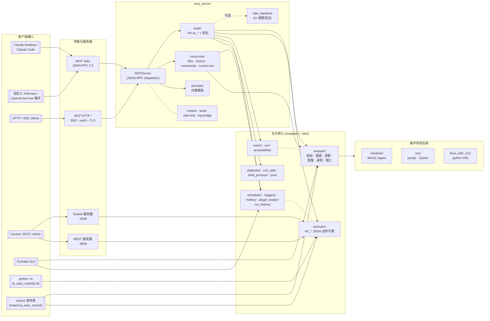

# AutoControl

[](https://pypi.org/project/je_auto_control/)
[](https://pypi.org/project/je_auto_control/)
[](../LICENSE)

**AutoControl** 是一个跨平台的 Python GUI 自动化框架，提供鼠标控制、键盘输入、图像识别、屏幕捕获、脚本执行与报告生成等功能 — 通过统一的 API 在 Windows、macOS 和 Linux (X11) 上运行。

**[English](../README.md)** | **[繁體中文](README_zh-TW.md)**

---

## 目录

- [功能特性](#功能特性)
- [架构](#架构)
- [安装](#安装)
- [系统要求](#系统要求)
- [快速开始](#快速开始)
  - [鼠标控制](#鼠标控制)
  - [键盘控制](#键盘控制)
  - [图像识别](#图像识别)
  - [Accessibility 元件搜索](#accessibility-元件搜索)
  - [AI 元件定位（VLM）](#ai-元件定位vlm)
  - [OCR 屏幕文字识别](#ocr-屏幕文字识别)
  - [剪贴板](#剪贴板)
  - [截图](#截图)
  - [动作录制与回放](#动作录制与回放)
  - [JSON 脚本执行器](#json-脚本执行器)
  - [MCP 服务器（让 Claude 使用 AutoControl）](#mcp-服务器让-claude-使用-autocontrol)
  - [调度器（Interval & Cron）](#调度器interval--cron)
  - [全局热键](#全局热键)
  - [事件触发器](#事件触发器)
  - [执行历史](#执行历史)
  - [报告生成](#报告生成)
  - [远程自动化（Socket / REST）](#远程自动化socket--rest)
  - [插件加载器](#插件加载器)
  - [Shell 命令执行](#shell-命令执行)
  - [屏幕录制](#屏幕录制)
  - [回调执行器](#回调执行器)
  - [包管理器](#包管理器)
  - [项目管理](#项目管理)
  - [窗口管理](#窗口管理)
  - [GUI 应用程序](#gui-应用程序)
- [命令行界面](#命令行界面)
- [平台支持](#平台支持)
- [开发](#开发)
- [许可证](#许可证)

---

## 功能特性

- **鼠标自动化** — 移动、点击、按下、释放、拖拽、滚动，支持精确坐标控制
- **键盘自动化** — 按下/释放单一按键、输入字符串、组合键、按键状态检测
- **图像识别** — 使用 OpenCV 模板匹配在屏幕上定位 UI 元素，支持可配置的检测阈值
- **Accessibility 元件搜索** — 通过操作系统无障碍树（Windows UIA / macOS AX）按名称/角色定位按钮、菜单、控件
- **AI 元件定位（VLM）** — 用自然语言描述 UI 元素，由视觉语言模型（Anthropic / OpenAI）返回屏幕坐标
- **OCR** — 使用 Tesseract 从屏幕提取文字，可搜索、点击或等待文字出现
- **剪贴板** — 于 Windows / macOS / Linux 读写系统剪贴板文本
- **截图与屏幕录制** — 捕获全屏或指定区域为图片，录制屏幕为视频（AVI/MP4）
- **动作录制与回放** — 录制鼠标/键盘事件并重新播放
- **JSON 脚本执行** — 使用 JSON 动作文件定义并执行自动化流程（支持 dry-run 与逐步调试）
- **调度器** — 以 interval 或 cron 表达式执行脚本，两类调度可同时存在
- **全局热键** — 将 OS 热键绑定到 action 脚本（当前支持 Windows，macOS/Linux 保留扩展接口）
- **事件触发器** — 检测到图像出现、窗口出现、像素变化或文件变动时自动执行脚本
- **执行历史** — 使用 SQLite 记录 scheduler / triggers / hotkeys / REST 的执行结果；错误时自动附带截图
- **报告生成** — 将测试记录导出为 HTML、JSON 或 XML 报告，包含成功/失败状态
- **MCP 服务器** — JSON-RPC 2.0 Model Context Protocol 服务（stdio + HTTP/SSE），让 Claude Desktop / Claude Code / 自定义 tool-use 循环直接驱动 AutoControl。约 90 个工具,完整协议支持(resources、prompts、sampling、roots、logging、progress、cancellation、elicitation),Bearer token 验证 + TLS、审计 log、rate limit、plugin 热加载、CI fake backend
- **远程自动化** — 同时提供 TCP Socket 服务器与 REST API 服务器
- **插件加载器** — 将定义 `AC_*` 可调用对象的 `.py` 文件放入目录，运行时即可注册为 executor 命令
- **Shell 集成** — 在自动化流程中执行 Shell 命令，支持异步输出捕获
- **回调执行器** — 触发自动化函数后自动调用回调函数，实现操作串联
- **动态包加载** — 在运行时导入外部 Python 包，扩展执行器功能
- **项目与模板管理** — 快速创建包含 keyword/executor 目录结构的自动化项目
- **窗口管理** — 直接将键盘/鼠标事件发送至指定窗口（Windows/Linux）
- **GUI 应用程序** — 内置 PySide6 图形界面，支持即时切换语言（English / 繁體中文 / 简体中文 / 日本語）
- **CLI 运行器** — `python -m je_auto_control.cli run|list-jobs|start-server|start-rest`
- **跨平台** — 统一 API，支持 Windows、macOS、Linux（X11）

---

## 架构

运行时是分层的:**客户端接口**(CLI、GUI、MCP/REST/Socket 服务
器)位于最上层,下面是**无头 API**(`wrapper/` + `utils/`),最后
解析到 `wrapper/platform_wrapper.py` 在 import 时选定的**操作系统
后端**。包 façade(`je_auto_control/__init__.py`)会 re-export 所
有公开名称,使用者只需要 `import je_auto_control`,无论用哪个接口
或后端都一样。



```
je_auto_control/
├── wrapper/                    # 平台无关 API 层
│   ├── platform_wrapper.py     # 自动检测操作系统并加载对应后端
│   ├── auto_control_mouse.py   # 鼠标操作
│   ├── auto_control_keyboard.py# 键盘操作
│   ├── auto_control_image.py   # 图像识别（OpenCV 模板匹配）
│   ├── auto_control_screen.py  # 截图、屏幕大小、像素颜色
│   ├── auto_control_window.py  # 跨平台窗口管理 facade
│   └── auto_control_record.py  # 动作录制/回放
├── windows/                    # Windows 专用后端（Win32 API / ctypes）
├── osx/                        # macOS 专用后端（pyobjc / Quartz）
├── linux_with_x11/             # Linux 专用后端（python-Xlib）
├── gui/                        # PySide6 GUI 应用程序
└── utils/
    ├── mcp_server/             # MCP 服务器（stdio + HTTP/SSE）— server / tools / resources / prompts / audit / rate_limit / fake_backend / plugin_watcher
    ├── executor/               # JSON 动作执行引擎
    ├── callback/               # 回调函数执行器
    ├── cv2_utils/              # OpenCV 截图、模板匹配、视频录制
    ├── accessibility/          # UIA (Windows) / AX (macOS) 元件搜索
    ├── vision/                 # VLM 元件定位（Anthropic / OpenAI）
    ├── ocr/                    # Tesseract 文字定位
    ├── clipboard/              # 跨平台剪贴板（文字 + 图像）
    ├── scheduler/              # Interval + cron 调度器
    ├── hotkey/                 # 全局热键守护进程
    ├── triggers/               # 图像/窗口/像素/文件 触发器
    ├── run_history/            # SQLite 执行记录 + 错误截图
    ├── rest_api/               # 纯 stdlib HTTP/REST 服务器
    ├── plugin_loader/          # 动态 AC_* 插件搜索与注册
    ├── socket_server/          # TCP Socket 服务器（远程自动化）
    ├── shell_process/          # Shell 命令管理器
    ├── generate_report/        # HTML / JSON / XML 报告生成器
    ├── test_record/            # 测试动作记录
    ├── script_vars/            # 脚本变量插值
    ├── watcher/                # 鼠标 / 像素 / log 监视器（Live HUD）
    ├── recording_edit/         # 录制内容的裁剪、过滤、缩放
    ├── json/                   # JSON 动作文件读写
    ├── project/                # 项目创建与模板
    ├── package_manager/        # 动态包加载
    ├── logging/                # 日志记录
    └── exception/              # 自定义异常类
```

`platform_wrapper.py` 模块会自动检测当前的操作系统并导入对应的后端，因此所有 wrapper 函数在不同平台上的行为完全一致。

---

## 安装

### 基本安装

```bash
pip install je_auto_control
```

### 安装 GUI 支持（PySide6）

```bash
pip install je_auto_control[gui]
```

### Linux 前置要求

在 Linux 上安装前，请先安装以下系统包：

```bash
sudo apt-get install cmake libssl-dev
```

---

## 系统要求

- **Python** >= 3.10
- **pip** >= 19.3

### 依赖包

| 包 | 用途 |
|---|---|
| `je_open_cv` | 图像识别（OpenCV 模板匹配） |
| `pillow` | 截图捕获 |
| `mss` | 快速多屏幕截图 |
| `pyobjc` | macOS 后端（在 macOS 上自动安装） |
| `python-Xlib` | Linux X11 后端（在 Linux 上自动安装） |
| `PySide6` | GUI 应用程序（可选，使用 `[gui]` 安装） |
| `qt-material` | GUI 主题（可选，使用 `[gui]` 安装） |
| `uiautomation` | Windows Accessibility 后端（可选，首次使用时加载） |
| `pytesseract` + Tesseract | OCR 文字识别（可选，首次使用时加载） |
| `anthropic` | VLM 定位 — Anthropic 后端（可选，首次使用时加载） |
| `openai` | VLM 定位 — OpenAI 后端（可选，首次使用时加载） |

完整第三方依赖及其许可证请见 [Third_Party_License.md](../Third_Party_License.md)。

---

## 快速开始

### 鼠标控制

```python
import je_auto_control

# 获取当前鼠标位置
x, y = je_auto_control.get_mouse_position()
print(f"鼠标位置: ({x}, {y})")

# 移动鼠标到指定坐标
je_auto_control.set_mouse_position(500, 300)

# 在当前位置左键点击（使用按键名称）
je_auto_control.click_mouse("mouse_left")

# 在指定坐标右键点击
je_auto_control.click_mouse("mouse_right", x=800, y=400)

# 向下滚动
je_auto_control.mouse_scroll(scroll_value=5)
```

### 键盘控制

```python
import je_auto_control

# 按下并释放单一按键
je_auto_control.type_keyboard("a")

# 逐字输入整个字符串
je_auto_control.write("Hello World")

# 组合键（例如 Ctrl+C）
je_auto_control.hotkey(["ctrl_l", "c"])

# 检查某个按键是否正在被按下
is_pressed = je_auto_control.check_key_is_press("shift_l")
```

### 图像识别

```python
import je_auto_control

# 在屏幕上找出所有匹配的图像
positions = je_auto_control.locate_all_image("button.png", detect_threshold=0.9)
# 返回: [[x1, y1, x2, y2], ...]

# 找出单一图像并获取其中心坐标
cx, cy = je_auto_control.locate_image_center("icon.png", detect_threshold=0.85)
print(f"找到位置: ({cx}, {cy})")

# 找出图像并自动点击
je_auto_control.locate_and_click("submit_button.png", mouse_keycode="mouse_left")
```

### Accessibility 元件搜索

通过操作系统无障碍树按名称/角色/App 搜索控件（Windows UIA，via
`uiautomation`；macOS AX）。

```python
import je_auto_control

# 列出 Calculator 中所有可见按钮
elements = je_auto_control.list_accessibility_elements(app_name="Calculator")

# 查找特定元件
ok = je_auto_control.find_accessibility_element(name="OK", role="Button")
if ok is not None:
    print(ok.bounds, ok.center)

# 一步定位并点击
je_auto_control.click_accessibility_element(name="OK", app_name="Calculator")
```

当前平台无可用后端时会抛出 `AccessibilityNotAvailableError`。

### AI 元件定位（VLM）

当模板匹配与 Accessibility 都失效时，可用自然语言描述元件，交给视觉
语言模型返回坐标。

```python
import je_auto_control

# 默认优先 Anthropic（若已设置 ANTHROPIC_API_KEY），否则使用 OpenAI
x, y = je_auto_control.locate_by_description("绿色的 Submit 按钮")

# 一步定位并点击
je_auto_control.click_by_description(
    "Cookie 横幅上的『全部接受』按钮",
    screen_region=[0, 800, 1920, 1080],   # 可选：只在该区域内搜索
)
```

配置（仅从环境变量读取 — 密钥不会写入代码或日志）：

| 变量 | 作用 |
|---|---|
| `ANTHROPIC_API_KEY` | 启用 Anthropic 后端 |
| `OPENAI_API_KEY` | 启用 OpenAI 后端 |
| `AUTOCONTROL_VLM_BACKEND` | 强制指定 `anthropic` 或 `openai` |
| `AUTOCONTROL_VLM_MODEL` | 覆盖默认模型（如 `claude-opus-4-7`、`gpt-4o-mini`） |

若两个 SDK 均未安装或未设置 API key，会抛出 `VLMNotAvailableError`。

### OCR 屏幕文字识别

```python
import je_auto_control as ac

# 查找所有匹配的文字位置
matches = ac.find_text_matches("Submit")

# 获取第一个匹配的中心坐标（找不到返回 None）
cx, cy = ac.locate_text_center("Submit")

# 一步定位并点击
ac.click_text("Submit")

# 等待文字出现（或 timeout）
ac.wait_for_text("加载完成", timeout=15.0)
```

若 Tesseract 不在 `PATH` 中，可手动指定路径：

```python
ac.set_tesseract_cmd(r"C:\Program Files\Tesseract-OCR\tesseract.exe")
```

### 剪贴板

```python
import je_auto_control as ac
ac.set_clipboard("hello")
text = ac.get_clipboard()
```

后端：Windows（Win32 + ctypes）、macOS（`pbcopy`/`pbpaste`）、Linux
（`xclip` 或 `xsel`）。

### 截图

```python
import je_auto_control

# 捕获全屏截图并保存
je_auto_control.pil_screenshot("screenshot.png")

# 捕获指定区域的截图 [x1, y1, x2, y2]
je_auto_control.pil_screenshot("region.png", screen_region=[100, 100, 500, 400])

# 获取屏幕分辨率
width, height = je_auto_control.screen_size()

# 获取指定坐标的像素颜色
color = je_auto_control.get_pixel(500, 300)
```

### 动作录制与回放

```python
import je_auto_control
import time

# 开始录制鼠标和键盘事件
je_auto_control.record()

time.sleep(10)  # 录制 10 秒

# 停止录制并获取动作列表
actions = je_auto_control.stop_record()

# 重新播放录制的动作
je_auto_control.execute_action(actions)
```

### JSON 脚本执行器

创建 JSON 动作文件（`actions.json`）：

```json
[
    ["AC_set_mouse_position", {"x": 500, "y": 300}],
    ["AC_click_mouse", {"mouse_keycode": "mouse_left"}],
    ["AC_write", {"write_string": "Hello from AutoControl"}],
    ["AC_screenshot", {"file_path": "result.png"}],
    ["AC_hotkey", {"key_code_list": ["ctrl_l", "s"]}]
]
```

执行方式：

```python
import je_auto_control

# 从文件执行
je_auto_control.execute_action(je_auto_control.read_action_json("actions.json"))

# 或直接从列表执行
je_auto_control.execute_action([
    ["AC_set_mouse_position", {"x": 100, "y": 200}],
    ["AC_click_mouse", {"mouse_keycode": "mouse_left"}]
])
```

**可用的动作命令：**

| 类别 | 命令 |
|---|---|
| 鼠标 | `AC_click_mouse`, `AC_set_mouse_position`, `AC_get_mouse_position`, `AC_press_mouse`, `AC_release_mouse`, `AC_mouse_scroll`, `AC_mouse_left`, `AC_mouse_right`, `AC_mouse_middle` |
| 键盘 | `AC_type_keyboard`, `AC_press_keyboard_key`, `AC_release_keyboard_key`, `AC_write`, `AC_hotkey`, `AC_check_key_is_press` |
| 图像 | `AC_locate_all_image`, `AC_locate_image_center`, `AC_locate_and_click` |
| 屏幕 | `AC_screen_size`, `AC_screenshot` |
| Accessibility | `AC_a11y_list`, `AC_a11y_find`, `AC_a11y_click` |
| VLM（AI 定位） | `AC_vlm_locate`, `AC_vlm_click` |
| OCR | `AC_locate_text`, `AC_click_text`, `AC_wait_text` |
| 剪贴板 | `AC_clipboard_get`, `AC_clipboard_set` |
| 录制 | `AC_record`, `AC_stop_record` |
| 报告 | `AC_generate_html`, `AC_generate_json`, `AC_generate_xml`, `AC_generate_html_report`, `AC_generate_json_report`, `AC_generate_xml_report` |
| 项目 | `AC_create_project` |
| Shell | `AC_shell_command` |
| 进程 | `AC_execute_process` |
| 执行器 | `AC_execute_action`, `AC_execute_files` |

### MCP 服务器（让 Claude 使用 AutoControl）

把 AutoControl 包装成 Model Context Protocol 服务,任何支持 MCP 的
client(Claude Desktop、Claude Code、自定义 Anthropic / OpenAI tool-use
循环)都能驱动本机桌面。纯 stdlib — JSON-RPC 2.0 走 stdio 或 HTTP+
SSE。

**注册到 Claude Code:**

```bash
claude mcp add autocontrol -- python -m je_auto_control.utils.mcp_server
```

**注册到 Claude Desktop**(`claude_desktop_config.json`):

```json
{
  "mcpServers": {
    "autocontrol": {
      "command": "python",
      "args": ["-m", "je_auto_control.utils.mcp_server"]
    }
  }
}
```

**程序启动:**

```python
import je_auto_control as ac

# Stdio(会阻塞直到 stdin 关闭)
ac.start_mcp_stdio_server()

# 或 HTTP / SSE,带 Bearer token 验证 + 可选 TLS
ac.start_mcp_http_server(host="127.0.0.1", port=9940,
                         auth_token="hunter2")
```

**不启动服务器、只看目录:**

```bash
je_auto_control_mcp --list-tools
je_auto_control_mcp --list-tools --read-only
je_auto_control_mcp --list-resources
je_auto_control_mcp --list-prompts
```

**功能总览:**

| 面向 | 涵盖 |
|---|---|
| 工具(约 90 个) | 鼠标 · 键盘 · drag · 屏幕 / 多屏 · 截图回 image · diff · OCR · 图像 · 窗口(move/min/max/restore/...) · 剪贴板文字+图像 · 进程 / shell · 动作录制 · 屏幕录像 · scheduler / triggers / hotkeys · accessibility tree · VLM · executor · history |
| 别名 | `click`、`type`、`screenshot`、`find_image`、`drag`、`shell`、`wait_image`...,以 `JE_AUTOCONTROL_MCP_ALIASES=0` 关闭 |
| Resources | `autocontrol://files/<name>`、`autocontrol://history`、`autocontrol://commands`、`autocontrol://screen/live`(支持 `resources/subscribe`)|
| Prompts | `automate_ui_task`、`record_and_generalize`、`compare_screenshots`、`find_widget`、`explain_action_file` |
| 协议 | tools / resources / prompts / sampling / roots / logging / progress / cancellation / list_changed / elicitation |
| 传输 | stdio、HTTP `POST /mcp`、`Accept: text/event-stream` 时走 SSE 流 |
| 安全 | 工具注解 · `JE_AUTOCONTROL_MCP_READONLY` · `JE_AUTOCONTROL_MCP_CONFIRM_DESTRUCTIVE` · 审计 log · token-bucket rate limiter · 工具失败自动截图 |
| 部署 | Bearer token 验证 · 通过 `ssl_context` 启用 TLS · `PluginWatcher` 热加载 · `JE_AUTOCONTROL_FAKE_BACKEND=1` 给 CI |

完整参考请见 [docs/source/Zh/doc/mcp_server/mcp_server_doc.rst](docs/source/Zh/doc/mcp_server/mcp_server_doc.rst)
(英文版本在 [docs/source/Eng/doc/mcp_server/mcp_server_doc.rst](docs/source/Eng/doc/mcp_server/mcp_server_doc.rst))。

> ⚠️ MCP 服务器可以移动鼠标、发送键盘事件、截图、执行任意 `AC_*`
> 动作。请只注册给可信任的 client。HTTP 默认绑 `127.0.0.1`,要对外
> 必须有明确理由,**并且**搭配 `auth_token` 与 `ssl_context`。

### 调度器（Interval & Cron）

```python
import je_auto_control as ac

# Interval：每 30 秒执行一次
job = ac.default_scheduler.add_job(
    script_path="scripts/poll.json", interval_seconds=30, repeat=True,
)

# Cron：周一到周五 09:00（字段为 minute hour dom month dow）
cron_job = ac.default_scheduler.add_cron_job(
    script_path="scripts/daily.json", cron_expression="0 9 * * 1-5",
)

ac.default_scheduler.start()
```

两种调度可同时存在，通过 `job.is_cron` 区分类型。

### 全局热键

将 OS 热键绑定到 action JSON 脚本（Windows 后端；macOS / Linux 的
`start()` 目前会抛出 `NotImplementedError`，接口已按 Strategy pattern
保留）。

```python
from je_auto_control import default_hotkey_daemon

default_hotkey_daemon.bind("ctrl+alt+1", "scripts/greet.json")
default_hotkey_daemon.start()
```

### 事件触发器

轮询式触发器，检测到条件成立时自动执行脚本：

```python
from je_auto_control import (
    default_trigger_engine, ImageAppearsTrigger,
    WindowAppearsTrigger, PixelColorTrigger, FilePathTrigger,
)

default_trigger_engine.add(ImageAppearsTrigger(
    trigger_id="", script_path="scripts/click_ok.json",
    image_path="templates/ok_button.png", threshold=0.85, repeat=True,
))
default_trigger_engine.start()
```

### 执行历史

调度器、触发器、热键、REST API 及 GUI 手动回放的每一次执行都会写入
`~/.je_auto_control/history.db`。错误时会自动在
`~/.je_auto_control/artifacts/run_{id}_{ms}.png` 附上截图以便排查。

```python
from je_auto_control import default_history_store

for run in default_history_store.list_runs(limit=20):
    print(run.id, run.source, run.status, run.artifact_path)
```

GUI **执行历史** 标签页提供筛选 / 刷新 / 清除功能，并可双击截图列打开
附件。

### 报告生成

```python
import je_auto_control

# 先启用测试记录
je_auto_control.test_record_instance.set_record_enable(True)

# ... 执行自动化动作 ...
je_auto_control.set_mouse_position(100, 200)
je_auto_control.click_mouse("mouse_left")

# 生成报告
je_auto_control.generate_html_report("test_report")   # -> test_report.html
je_auto_control.generate_json_report("test_report")   # -> test_report.json
je_auto_control.generate_xml_report("test_report")    # -> test_report.xml

# 或获取报告内容为字符串
html_string = je_auto_control.generate_html()
json_string = je_auto_control.generate_json()
xml_string = je_auto_control.generate_xml()
```

报告内容包含：每个记录动作的函数名称、参数、时间戳及异常信息（如有）。HTML 报告中成功的动作以青色显示，失败的动作以红色显示。

### 远程自动化（Socket / REST）

提供两种服务器：原始 TCP socket 与纯 stdlib HTTP/REST。默认均绑定
`127.0.0.1`，绑定到 `0.0.0.0` 需显式指定。

```python
import je_auto_control as ac

# TCP Socket 服务器（默认：127.0.0.1:9938）
ac.start_autocontrol_socket_server(host="127.0.0.1", port=9938)

# REST API 服务器（默认：127.0.0.1:9939）
ac.start_rest_api_server(host="127.0.0.1", port=9939)
# 端点：
#   GET  /health           存活检查
#   GET  /jobs             列出调度任务
#   POST /execute          body: {"actions": [...]}
```

### 插件加载器

将定义顶层 `AC_*` 可调用对象的 `.py` 文件放入一个目录，运行时即可注
册为 executor 命令：

```python
from je_auto_control import (
    load_plugin_directory, register_plugin_commands,
)

commands = load_plugin_directory("./my_plugins")
register_plugin_commands(commands)

# 之后任何 JSON 脚本都能使用：
# [["AC_greet", {"name": "world"}]]
```

> **警告：** 插件文件会直接执行任意 Python，请仅加载自己信任的目录。

### Shell 命令执行

```python
import je_auto_control

# 使用默认的 Shell 管理器
je_auto_control.default_shell_manager.exec_shell("echo Hello")
je_auto_control.default_shell_manager.pull_text()  # 输出捕获的结果

# 或创建自定义的 ShellManager
shell = je_auto_control.ShellManager(shell_encoding="utf-8")
shell.exec_shell("ls -la")
shell.pull_text()
shell.exit_program()
```

### 屏幕录制

```python
import je_auto_control
import time

# 方法一：ScreenRecorder（管理多个录像）
recorder = je_auto_control.ScreenRecorder()
recorder.start_new_record(
    recorder_name="my_recording",
    path_and_filename="output.avi",
    codec="XVID",
    frame_per_sec=30,
    resolution=(1920, 1080)
)
time.sleep(10)
recorder.stop_record("my_recording")

# 方法二：RecordingThread（简易单一录像，输出 MP4）
recording = je_auto_control.RecordingThread(video_name="my_video", fps=20)
recording.start()
time.sleep(10)
recording.stop()
```

### 回调执行器

执行自动化函数后自动触发回调函数：

```python
import je_auto_control

def my_callback():
    print("动作完成！")

# 执行 set_mouse_position 后调用 my_callback
je_auto_control.callback_executor.callback_function(
    trigger_function_name="AC_set_mouse_position",
    callback_function=my_callback,
    x=500, y=300
)

# 带有参数的回调
def on_done(message):
    print(f"完成: {message}")

je_auto_control.callback_executor.callback_function(
    trigger_function_name="AC_click_mouse",
    callback_function=on_done,
    callback_function_param={"message": "点击完成"},
    callback_param_method="kwargs",
    mouse_keycode="mouse_left"
)
```

### 包管理器

在运行时动态加载外部 Python 包到执行器中：

```python
import je_auto_control

# 将包的所有函数/类加入执行器
je_auto_control.package_manager.add_package_to_executor("os")

# 现在可以在 JSON 动作脚本中使用 os 函数：
# ["os_getcwd", {}]
# ["os_listdir", {"path": "."}]
```

### 项目管理

快速创建包含模板文件的项目目录结构：

```python
import je_auto_control

# 创建项目结构
je_auto_control.create_project_dir(project_path="./my_project", parent_name="AutoControl")

# 会创建以下结构：
# my_project/
# └── AutoControl/
#     ├── keyword/
#     │   ├── keyword1.json        # 模板动作文件
#     │   ├── keyword2.json        # 模板动作文件
#     │   └── bad_keyword_1.json   # 错误处理模板
#     └── executor/
#         ├── executor_one_file.py  # 执行单一文件示例
#         ├── executor_folder.py    # 执行文件夹示例
#         └── executor_bad_file.py  # 错误处理示例
```

### 窗口管理

直接将事件发送至指定窗口（仅限 Windows 和 Linux）：

```python
import je_auto_control

# 通过窗口标题发送键盘事件
je_auto_control.send_key_event_to_window("Notepad", keycode="a")

# 通过窗口 handle 发送鼠标事件
je_auto_control.send_mouse_event_to_window(window_handle, mouse_keycode="mouse_left", x=100, y=50)
```

### GUI 应用程序

启动内置图形界面（需安装 `[gui]` 扩展）：

```python
import je_auto_control
je_auto_control.start_autocontrol_gui()
```

或通过命令行：

```bash
python -m je_auto_control
```

---

## 命令行界面

AutoControl 可直接从命令行使用：

```bash
# 执行单一动作文件
python -m je_auto_control -e actions.json

# 执行目录中所有动作文件
python -m je_auto_control -d ./action_files/

# 直接执行 JSON 字符串
python -m je_auto_control --execute_str '[["AC_screenshot", {"file_path": "test.png"}]]'

# 创建项目模板
python -m je_auto_control -c ./my_project
```

另外还有以 headless API 为基础的子命令 CLI：

```bash
# 执行脚本（可带变量或 dry-run）
python -m je_auto_control.cli run script.json
python -m je_auto_control.cli run script.json --var name=alice --dry-run

# 列出调度任务
python -m je_auto_control.cli list-jobs

# 启动 Socket / REST 服务器
python -m je_auto_control.cli start-server --port 9938
python -m je_auto_control.cli start-rest   --port 9939
```

`--var name=value` 优先以 JSON 解析（`count=10` 会变成 int），解析失败
则视为字符串。

---

## 平台支持

| 平台 | 状态 | 后端 | 备注 |
|---|---|---|---|
| Windows 10 / 11 | 支持 | Win32 API (ctypes) | 完整功能支持 |
| macOS 10.15+ | 支持 | pyobjc / Quartz | 不支持动作录制；不支持 `send_key_event_to_window` / `send_mouse_event_to_window` |
| Linux（X11） | 支持 | python-Xlib | 完整功能支持 |
| Linux（Wayland） | 暂不支持 | — | 未来版本可能加入支持 |
| Raspberry Pi 3B / 4B | 支持 | python-Xlib | 在 X11 上运行 |

---

## 开发

### 环境配置

```bash
git clone https://github.com/Intergration-Automation-Testing/AutoControl.git
cd AutoControl
pip install -r dev_requirements.txt
```

### 运行测试

```bash
# 单元测试
python -m pytest test/unit_test/

# 集成测试
python -m pytest test/integrated_test/
```

### 项目链接

- **主页**: https://github.com/Intergration-Automation-Testing/AutoControl
- **文档**: https://autocontrol.readthedocs.io/en/latest/
- **PyPI**: https://pypi.org/project/je_auto_control/

---

## 许可证

[MIT License](../LICENSE) © JE-Chen。
第三方依赖的许可证请见
[Third_Party_License.md](../Third_Party_License.md)。
