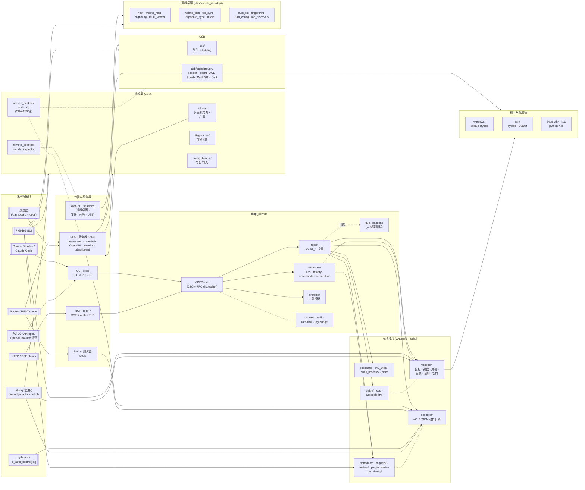

# AutoControl

[](https://pypi.org/project/je_auto_control/)
[](https://pypi.org/project/je_auto_control/)
[](../LICENSE)

**AutoControl** 是一个跨平台的 Python GUI 自动化框架，提供鼠标控制、键盘输入、图像识别、屏幕捕获、脚本执行与报告生成等功能 — 通过统一的 API 在 Windows、macOS 和 Linux (X11) 上运行。

**[English](../README.md)** | **[繁體中文](README_zh-TW.md)**

---

## 目录

- [本次更新 (2026-05)](#本次更新-2026-05)
- [功能特性](#功能特性)
- [架构](#架构)
- [安装](#安装)
- [系统要求](#系统要求)
- [快速开始](#快速开始)
  - [鼠标控制](#鼠标控制)
  - [键盘控制](#键盘控制)
  - [图像识别](#图像识别)
  - [Accessibility 元件搜索](#accessibility-元件搜索)
  - [AI 元件定位（VLM）](#ai-元件定位vlm)
  - [OCR 屏幕文字识别](#ocr-屏幕文字识别)
  - [LLM 动作规划器](#llm-动作规划器)
  - [运行期变量与流程控制](#运行期变量与流程控制)
  - [远程桌面](#远程桌面)
  - [剪贴板](#剪贴板)
  - [截图](#截图)
  - [动作录制与回放](#动作录制与回放)
  - [JSON 脚本执行器](#json-脚本执行器)
  - [MCP 服务器（让 Claude 使用 AutoControl）](#mcp-服务器让-claude-使用-autocontrol)
  - [调度器（Interval & Cron）](#调度器interval--cron)
  - [全局热键](#全局热键)
  - [事件触发器](#事件触发器)
  - [执行历史](#执行历史)
  - [报告生成](#报告生成)
  - [可观测性（Prometheus / OpenTelemetry）](#可观测性prometheus--opentelemetry)
  - [远程自动化（Socket / REST）](#远程自动化socket--rest)
  - [插件加载器](#插件加载器)
  - [Shell 命令执行](#shell-命令执行)
  - [屏幕录制](#屏幕录制)
  - [回调执行器](#回调执行器)
  - [包管理器](#包管理器)
  - [项目管理](#项目管理)
  - [窗口管理](#窗口管理)
  - [GUI 应用程序](#gui-应用程序)
- [命令行界面](#命令行界面)
- [平台支持](#平台支持)
- [开发](#开发)
- [许可证](#许可证)

---

## 本次更新 (2026-05)

新增 23 个功能，覆盖更聪明的定位器、更深的 IDE / 运维工具、两个新平台后端，
以及几个新集成。每个功能都遵循框架既有模式：headless Python API、
`AC_*` executor 命令、`ac_*` MCP 工具，以及（适用时）Qt GUI 选项卡。
完整参考页面：
[`docs/source/Zh/doc/new_features/v2_features_doc.rst`](../docs/source/Zh/doc/new_features/v2_features_doc.rst)。

**定位器与选择器智能化**
- **自愈定位器** — `image_template → VLM` 后备并写入 JSON-lines 审计记录（`AC_self_heal_locate / _click`）。
- **锚点定位器** — 按空间关系（`above` / `below` / `left_of` / `right_of` / `near`）找到目标；锚点与目标可使用不同 backend（image / OCR / VLM / a11y）。
- **结构化 OCR** — 将原始 OCR match 聚合为 rows、tables、`label:value` 表单字段（`AC_ocr_read_structure`）。
- **智能等待** — `wait_until_screen_stable`、`wait_until_pixel_changes`、`wait_until_region_idle`：用 frame-diff 取代 `time.sleep`。
- **A/B 定位器框架** — 并行跑 N 个策略，依持久化的历史成绩推荐最佳。

**运维与可观测性**
- **LLM 成本遥测** — 每次调用的 token / USD 记录，按天 / 模型 / 提供方汇总（`record_llm_call`、`summarise_llm_costs`）。
- **追踪回放 UI** — 在现有 time-travel 录像上拖动时间轴并逐步显示动作。
- **失败 → 工单自动化** — 调度器／触发器／REST 任务失败时自动分发 Jira / Linear / GitHub Issues。
- **容器化 CI 模板** — GitHub Actions + GitLab CI workflow：构建镜像、跑 headless pytest（Xvfb 容器内）、smoke-test REST entrypoint；另含 XFCE+x11vnc Dockerfile 变体。
- **跨主机 DAG 编排** — 跨 local + admin-console 已注册主机并行执行，失败时下游 cascade 为 `skipped`（`run_dag`、`AC_run_dag`）。
- **多 viewer 名单** — 为远程桌面提供控制者 / 观察者角色，纯 Python `PresenceRegistry` 独立于 aiortc。

**代理与集成**
- **Computer-use 高阶 API** — `run_computer_use(goal, ...)` 封装 `ComputerUseAgentBackend` + `AgentLoop`；自动检测屏幕大小；以 `max_steps` / `wall_seconds` 为预算。
- **WebRunner 便利命令** — 在既有 `je_web_runner` 桥接之上的 `web_open` / `web_quit` / `web_screenshot` / `web_current_url`；同步以 `AC_web_*`、`ac_web_*` 暴露。
- **Chat-ops 机器人** — 传输层中立的 `CommandRouter` + Slack polling adapter。内置命令：`/help`、`/scripts`、`/run`、`/screenshot`、`/status`。RBAC 通过 `required_role`。

**平台覆盖**
- **Wayland CLI 后端** — `wtype` / `ydotool` / `grim`，按 `XDG_SESSION_TYPE` 自动检测，CLI 工具未装时回退到 X11 (XWayland)；可用 `JE_AUTOCONTROL_LINUX_DISPLAY_SERVER=x11|wayland|auto` 覆盖。
- **Wayland libei 原生后端** — 对 `libei.so.*` 的 ctypes 绑定，绕过 CLI shim 取得微秒级延迟；以 `JE_AUTOCONTROL_WAYLAND_INPUT_BACKEND=libei|cli|auto` 启用，默认在 libei 可加载时用 libei。
- **macOS Accessibility 强化** — 递归 `dump_accessibility_tree()` 与 polling `AccessibilityRecorder`，捕捉 focus / bounds 事件。

**开发者体验**
- **autocontrol-lsp 完整化** — 追踪 `didOpen` / `didChange` / `didClose`、发布 JSON 与未知 `AC_*` 命令的 diagnostics、由即时的 executor 表生成 signature help。
- **`.pyi` stub 生成器** — `python -m je_auto_control.utils.stubs.generator je_auto_control/actions.pyi` 写出 IDE 端 stub 文件，所有 `AC_*` 命令在 IDE 内可 autocomplete 并显示参数提示。
- **VS Code 扩展** — 内置扩展新增 `AutoControl: Run / Screenshot / Preview` 命令，直接打本机 REST API。
- **浏览器扩展录制器** — `browser-extension/` 下的 Manifest V3 扩展：捕捉标签页的点击、输入、导航与表单提交，导出为 `AC_web_*` / `WR_*` JSON。
- **pytest plugin + Gherkin BDD** — `pytest11` entry point 自动加载；`@pytest.mark.autocontrol` 开启失败自动截屏；`bdd_steps.register_pytest_bdd_steps(pytest_bdd)` 一次把 `Given/When/Then` 对应到每一个 `AC_*` verb。
- **可视化流程编辑器** — node-based 视图与既有 list-based Script Builder 使用同一份 JSON 格式，互相兼容。

---

## 功能特性

- **鼠标自动化** — 移动、点击、按下、释放、拖拽、滚动，支持精确坐标控制
- **键盘自动化** — 按下/释放单一按键、输入字符串、组合键、按键状态检测
- **图像识别** — 使用 OpenCV 模板匹配在屏幕上定位 UI 元素，支持可配置的检测阈值
- **Accessibility 元件搜索** — 通过操作系统无障碍树（Windows UIA / macOS AX）按名称/角色定位按钮、菜单、控件
- **AI 元件定位（VLM）** — 用自然语言描述 UI 元素，由视觉语言模型（Anthropic / OpenAI）返回屏幕坐标
- **OCR** — 三个可插拔后端（Tesseract 用于 ASCII、EasyOCR 无外部可执行文件且支持 CJK、PaddleOCR 中／日／韩质量最高），统一 API 与标准语言代码；后端由 `backend=` 参数、`AUTOCONTROL_OCR_BACKEND` 环境变量或自动探测决定。可搜索、点击或等待文字出现；支持 regex 搜索与整块区域 dump
- **LLM 动作规划器** — 用 Claude 把自然语言描述翻译成验证过的 `AC_*` 动作清单
- **运行期变量与流程控制** — 执行时 `${var}` 替换，加上 `AC_set_var` / `AC_inc_var` / `AC_if_var` / `AC_for_each` / `AC_loop` / `AC_retry` 让脚本数据驱动
- **远程桌面** — 用 token 认证的 TCP 协议串流本机画面并接收输入，**或** 连接到他机观看与控制（host + viewer GUI 内置）。可选 TLS（HTTPS 级加密）、WebSocket 传输（``ws://`` + ``wss://``，穿墙／浏览器友好）、持久化 9 位数 Host ID、host→viewer 音频串流、双向剪贴板同步（文字 + 图片）、分块文件传输（拖放 + 进度条；任意目的路径；无大小上限）。另含文件夹同步（增量镜像 — 本地删除不会传出去）与自建 coturn TURN 配置包生成器（turnserver.conf + systemd unit + docker-compose + README）。**AnyDesk 风格弹出窗口**：viewer 认证成功后远程桌面会开在独立的可调整大小顶层窗口，控制面板保持简洁；Remote Desktop 子分页外层包了 `QScrollArea`，小窗口下可滚动、4K 屏幕下会铺满。同时支持 headless API 与 MCP 工具 (`ac_remote_*`) 直接驱动
- **驱动级输入后端（可选）** — 针对忽略 SendInput（Win）或 XTest（Linux）的游戏／应用：**Interception driver 后端**（Windows，HID 层鍵鼠注入，使用 Oblita WHQL-signed driver，通过 `JE_AUTOCONTROL_WIN32_BACKEND=interception` 启用）、**uinput 后端**（Linux，kernel `/dev/uinput` 合成 HID 设备，通过 `JE_AUTOCONTROL_LINUX_BACKEND=uinput` 启用），以及 **ViGEm 虚拟手柄**（Windows，针对只认手柄的游戏，提供虚拟 Xbox 360 手柄 + 友善的 button / dpad / stick / trigger API，并暴露为 `AC_gamepad_*` 执行器命令与 `ac_gamepad_*` MCP 工具）。三者在 driver 没装时都会优雅 fallback，不影响既有部署
- **剪贴板** — 于 Windows / macOS / Linux 读写系统剪贴板文本
- **截图与屏幕录制** — 捕获全屏或指定区域为图片，录制屏幕为视频（AVI/MP4）
- **动作录制与回放** — 录制鼠标/键盘事件并重新播放
- **JSON 脚本执行** — 使用 JSON 动作文件定义并执行自动化流程（支持 dry-run 与逐步调试）
- **调度器** — 以 interval 或 cron 表达式执行脚本，两类调度可同时存在
- **全局热键** — 跨平台绑定 OS 热键到 action 脚本：Windows (`RegisterHotKey`)、macOS (`CGEventTap`，需 Accessibility 权限)、Linux X11 (`XGrabKey`，含 NumLock / CapsLock 变体掩码)。Wayland 不支持。三个平台共享同一个 API；`backends/` 在 `start()` 时自动挑后端
- **事件触发器** — 检测到图像出现、窗口出现、像素变化或文件变动时自动执行脚本
- **执行历史** — 使用 SQLite 记录 scheduler / triggers / hotkeys / REST 的执行结果；错误时自动附带截图
- **报告生成** — 将测试记录导出为 HTML、JSON 或 XML 报告，包含成功/失败状态
- **MCP 服务器** — JSON-RPC 2.0 Model Context Protocol 服务（stdio + HTTP/SSE），让 Claude Desktop / Claude Code / 自定义 tool-use 循环直接驱动 AutoControl。约 100 个工具,完整协议支持(resources、prompts、sampling、roots、logging、progress、cancellation、elicitation),Bearer token 验证 + TLS、审计 log、rate limit、plugin 热加载、CI fake backend。**本次新增** `ac_remote_host_start` / `ac_remote_host_stop` / `ac_remote_host_status` / `ac_remote_viewer_connect` / `ac_remote_viewer_disconnect` / `ac_remote_viewer_status` / `ac_remote_viewer_send_input` 包装 GUI 远程桌面分页所用的 process-global registry，模型可以直接启动 host、连线 viewer、转发 mouse／keyboard／type／hotkey 动作
- **远程自动化** — TCP Socket 服务器 **加上** 强化版 REST API：bearer token 认证、per-IP 速率限制 + 失败锁定、SQLite 审计 hook、Prometheus `/metrics`、完整端点列表（`/health`、`/screen_size`、`/sessions`、`/screenshot`、`/execute`、`/audit/list`、`/audit/verify`、`/inspector/recent`、`/usb/devices`、`/diagnose`、…），以及 vanilla-JS 的浏览器 dashboard `/dashboard`（任何能 HTTP 连到主机的手机都能监控）
- **插件加载器** — 将定义 `AC_*` 可调用对象的 `.py` 文件放入目录，运行时即可注册为 executor 命令
- **Shell 集成** — 在自动化流程中执行 Shell 命令，支持异步输出捕获
- **回调执行器** — 触发自动化函数后自动调用回调函数，实现操作串联
- **动态包加载** — 在运行时导入外部 Python 包，扩展执行器功能
- **项目与模板管理** — 快速创建包含 keyword/executor 目录结构的自动化项目
- **窗口管理** — 直接将键盘/鼠标事件发送至指定窗口（Windows/Linux）
- **GUI 应用程序** — 内置 PySide6 图形界面，支持即时切换语言（English / 繁體中文 / 简体中文 / 日本語）
- **CLI 运行器** — `python -m je_auto_control.cli run|list-jobs|start-server|start-rest`
- **跨平台** — 统一 API，支持 Windows、macOS、Linux（X11）
- **多主机管理控制台** — 在一份通讯录中注册 N 个远程 AutoControl REST 端点，并行轮询 health/sessions/jobs，把同一份动作清单广播给全部主机。储存于 `~/.je_auto_control/admin_hosts.json`（POSIX 上模式 0600）。Token 错误的主机会以实际 HTTP 错误显示为不健康
- **可检测篡改的审计日志** — SQLite events 表加上 SHA-256 哈希链（每条记录含 `prev_hash` + `row_hash`）；修改任何过去记录都会打断哈希链。`verify_chain()` 自顶向下走访并报告第一个断点。既有数据表会在启动时回填（"初次使用即信任"）
- **WebRTC 包监测** — 由既有 WebRTC stats 轮询喂入的进程级 `StatsSnapshot` 滚动窗口（默认 600 条 / 1 Hz 约 10 分钟）。对 RTT、FPS、bitrate、丢包率、jitter 各回 `last/min/max/avg/p95`
- **USB 设备列举** — 只读的跨平台 USB 设备列举。优先尝试 pyusb（libusb）；若无则退回平台特定命令（Windows `Get-PnpDevice`、macOS `system_profiler`、Linux `/sys/bus/usb/devices`）。第二阶段（passthrough）刻意延后待设计审查
- **系统诊断** — 一键"目前正常吗？"探测：平台、可选依赖包、executor 命令数、审计链、截图、鼠标、磁盘空间、REST registry。CLI 全绿 exit 0／否则 1；REST `/diagnose`；按严重度上色的 GUI 分页
- **USB Hotplug 事件** — 轮询式 hotplug 监测（`UsbHotplugWatcher`），含 bounded ring buffer 与带序号的事件；`GET /usb/events?since=N` 让晚加入的订阅者补上进度。USB 分页有自动刷新切换钮。
- **OpenAPI 3.1 + Swagger UI** — `GET /openapi.json`（auth-gated，从活的路由表生成）+ `GET /docs`（浏览器版 Swagger UI 含 bearer token 栏）。CI 上有 drift 测试，新加路由忘记写 metadata 会被拦下。
- **配置包导出／导入** — 单一 JSON 文件，导出／导入用户配置（admin hosts、address book、trusted viewers、known hosts、host service、IDs）。原子写入加 `<name>.bak.<时间戳>` 备份；CLI `python -m je_auto_control.utils.config_bundle export|import`；`POST /config/{export,import}`；REST API 分页有按钮。
- **USB Passthrough（实验性、需主动启用）** — wire-level 协议走 WebRTC `usb` DataChannel（10 个 opcode、CREDIT 流量控制、16 KiB payload 上限）。Host 端 `UsbPassthroughSession` 在 Linux libusb backend 上端到端运行；Windows `WinUSB` backend 含完整 ctypes 接线（硬件未验证）；macOS `IOKit` 为骨架。Viewer 端阻塞式 client（`UsbPassthroughClient` → `ClientHandle.control_transfer / bulk_transfer / interrupt_transfer`）。持久化 ACL（`~/.je_auto_control/usb_acl.json`，默认 deny，POSIX mode 0600），含 host 端 prompt QDialog 与可检测篡改审计日志整合。默认 off — 用 `enable_usb_passthrough(True)` 或 `JE_AUTOCONTROL_USB_PASSTHROUGH=1` 启用。Phase 2e 外部安全审查清单已附；默认启用前需要签核。

---

## 架构

运行时是分层的:**客户端接口**(CLI、GUI、MCP/REST/Socket 服务
器)位于最上层,下面是**无头 API**(`wrapper/` + `utils/`),最后
解析到 `wrapper/platform_wrapper.py` 在 import 时选定的**操作系统
后端**。包 façade(`je_auto_control/__init__.py`)会 re-export 所
有公开名称,使用者只需要 `import je_auto_control`,无论用哪个接口
或后端都一样。



```
je_auto_control/
├── wrapper/                    # 平台无关 API 层
│   ├── platform_wrapper.py     # 自动检测操作系统并加载对应后端
│   ├── auto_control_mouse.py   # 鼠标操作
│   ├── auto_control_keyboard.py# 键盘操作
│   ├── auto_control_image.py   # 图像识别（OpenCV 模板匹配）
│   ├── auto_control_screen.py  # 截图、屏幕大小、像素颜色
│   ├── auto_control_window.py  # 跨平台窗口管理 facade
│   └── auto_control_record.py  # 动作录制/回放
├── windows/                    # Windows 专用后端（Win32 API / ctypes）
├── osx/                        # macOS 专用后端（pyobjc / Quartz）
├── linux_with_x11/             # Linux 专用后端（python-Xlib）
├── gui/                        # PySide6 GUI 应用程序
└── utils/
    ├── mcp_server/             # MCP 服务器（stdio + HTTP/SSE）— server / tools / resources / prompts / audit / rate_limit / fake_backend / plugin_watcher
    ├── executor/               # JSON 动作执行引擎
    ├── callback/               # 回调函数执行器
    ├── cv2_utils/              # OpenCV 截图、模板匹配、视频录制
    ├── accessibility/          # UIA (Windows) / AX (macOS) 元件搜索
    ├── vision/                 # VLM 元件定位（Anthropic / OpenAI）
    ├── ocr/                    # Tesseract 文字定位
    ├── clipboard/              # 跨平台剪贴板（文字 + 图像）
    ├── llm/                    # 自然语言 → AC_* 动作规划器
    ├── scheduler/              # Interval + cron 调度器
    ├── hotkey/                 # 全局热键守护进程
    ├── triggers/               # 图像/窗口/像素/文件 触发器
    ├── run_history/            # SQLite 执行记录 + 错误截图
    ├── rest_api/               # 纯 stdlib HTTP/REST 服务器 — auth · audit · rate-limit · OpenAPI · /metrics · dashboard · Swagger UI
    ├── admin/                  # 多主机 AdminConsoleClient（轮询 + 广播）
    ├── diagnostics/            # 系统自我诊断 + CLI
    ├── config_bundle/          # 单文件用户配置导出／导入
    ├── usb/                    # 跨平台列举、hotplug 事件、passthrough/{protocol, session, viewer client, ACL, libusb / WinUSB / IOKit}
    ├── remote_desktop/         # WebRTC host + viewer、signalling、multi-viewer、文件／剪贴板／音频同步、审计日志（哈希链）、信任列表、TURN 配置、mDNS 发现、WebRTC stats inspector
    ├── plugin_loader/          # 动态 AC_* 插件搜索与注册
    ├── socket_server/          # TCP Socket 服务器（远程自动化）
    ├── shell_process/          # Shell 命令管理器
    ├── generate_report/        # HTML / JSON / XML 报告生成器
    ├── test_record/            # 测试动作记录
    ├── script_vars/            # 脚本变量插值
    ├── watcher/                # 鼠标 / 像素 / log 监视器（Live HUD）
    ├── recording_edit/         # 录制内容的裁剪、过滤、缩放
    ├── json/                   # JSON 动作文件读写
    ├── project/                # 项目创建与模板
    ├── package_manager/        # 动态包加载
    ├── logging/                # 日志记录
    └── exception/              # 自定义异常类
```

`platform_wrapper.py` 模块会自动检测当前的操作系统并导入对应的后端，因此所有 wrapper 函数在不同平台上的行为完全一致。

---

## 安装

### 基本安装

```bash
pip install je_auto_control
```

### 安装 GUI 支持（PySide6）

```bash
pip install je_auto_control[gui]
```

### Linux 前置要求

在 Linux 上安装前，请先安装以下系统包：

```bash
sudo apt-get install cmake libssl-dev
```

---

## 系统要求

- **Python** >= 3.10
- **pip** >= 19.3

### 依赖包

| 包 | 用途 |
|---|---|
| `je_open_cv` | 图像识别（OpenCV 模板匹配） |
| `pillow` | 截图捕获 |
| `mss` | 快速多屏幕截图 |
| `pyobjc` | macOS 后端（在 macOS 上自动安装） |
| `python-Xlib` | Linux X11 后端（在 Linux 上自动安装） |
| `PySide6` | GUI 应用程序（可选，使用 `[gui]` 安装） |
| `qt-material` | GUI 主题（可选，使用 `[gui]` 安装） |
| `uiautomation` | Windows Accessibility 后端（可选，首次使用时加载） |
| `pytesseract` + Tesseract | OCR 文字识别（可选，首次使用时加载） |
| `anthropic` | VLM 定位 — Anthropic 后端（可选，首次使用时加载） |
| `openai` | VLM 定位 — OpenAI 后端（可选，首次使用时加载） |

完整第三方依赖及其许可证请见 [Third_Party_License.md](../Third_Party_License.md)。

---

## 快速开始

想要可以直接复制粘贴的完整脚本而不只是 API 片段？
[`examples/`](../examples/) 目录收录 17 个独立示例：截屏+点击、OCR、
调度器、远程桌面、agent loop、可观测性、录制/回放、运行期变量、
窗口管理、热键、图像触发器、HTML 报告、MCP stdio bridge、REST API、
secret vault，以及插件加载。

### 鼠标控制

```python
import je_auto_control

# 获取当前鼠标位置
x, y = je_auto_control.get_mouse_position()
print(f"鼠标位置: ({x}, {y})")

# 移动鼠标到指定坐标
je_auto_control.set_mouse_position(500, 300)

# 在当前位置左键点击（使用按键名称）
je_auto_control.click_mouse("mouse_left")

# 在指定坐标右键点击
je_auto_control.click_mouse("mouse_right", x=800, y=400)

# 向下滚动
je_auto_control.mouse_scroll(scroll_value=5)
```

### 键盘控制

```python
import je_auto_control

# 按下并释放单一按键
je_auto_control.type_keyboard("a")

# 逐字输入整个字符串
je_auto_control.write("Hello World")

# 组合键（例如 Ctrl+C）
je_auto_control.hotkey(["ctrl_l", "c"])

# 检查某个按键是否正在被按下
is_pressed = je_auto_control.check_key_is_press("shift_l")
```

### 图像识别

```python
import je_auto_control

# 在屏幕上找出所有匹配的图像
positions = je_auto_control.locate_all_image("button.png", detect_threshold=0.9)
# 返回: [[x1, y1, x2, y2], ...]

# 找出单一图像并获取其中心坐标
cx, cy = je_auto_control.locate_image_center("icon.png", detect_threshold=0.85)
print(f"找到位置: ({cx}, {cy})")

# 找出图像并自动点击
je_auto_control.locate_and_click("submit_button.png", mouse_keycode="mouse_left")
```

### Accessibility 元件搜索

通过操作系统无障碍树按名称/角色/App 搜索控件（Windows UIA，via
`uiautomation`；macOS AX）。

```python
import je_auto_control

# 列出 Calculator 中所有可见按钮
elements = je_auto_control.list_accessibility_elements(app_name="Calculator")

# 查找特定元件
ok = je_auto_control.find_accessibility_element(name="OK", role="Button")
if ok is not None:
    print(ok.bounds, ok.center)

# 一步定位并点击
je_auto_control.click_accessibility_element(name="OK", app_name="Calculator")
```

当前平台无可用后端时会抛出 `AccessibilityNotAvailableError`。

### AI 元件定位（VLM）

当模板匹配与 Accessibility 都失效时，可用自然语言描述元件，交给视觉
语言模型返回坐标。

```python
import je_auto_control

# 默认优先 Anthropic（若已设置 ANTHROPIC_API_KEY），否则使用 OpenAI
x, y = je_auto_control.locate_by_description("绿色的 Submit 按钮")

# 一步定位并点击
je_auto_control.click_by_description(
    "Cookie 横幅上的『全部接受』按钮",
    screen_region=[0, 800, 1920, 1080],   # 可选：只在该区域内搜索
)
```

配置（仅从环境变量读取 — 密钥不会写入代码或日志）：

| 变量 | 作用 |
|---|---|
| `ANTHROPIC_API_KEY` | 启用 Anthropic 后端 |
| `OPENAI_API_KEY` | 启用 OpenAI 后端 |
| `AUTOCONTROL_VLM_BACKEND` | 强制指定 `anthropic` 或 `openai` |
| `AUTOCONTROL_VLM_MODEL` | 覆盖默认模型（如 `claude-opus-4-7`、`gpt-4o-mini`） |

若两个 SDK 均未安装或未设置 API key，会抛出 `VLMNotAvailableError`。

### OCR 屏幕文字识别

```python
import je_auto_control as ac

# 查找所有匹配的文字位置
matches = ac.find_text_matches("Submit")

# 获取第一个匹配的中心坐标（找不到返回 None）
cx, cy = ac.locate_text_center("Submit")

# 一步定位并点击
ac.click_text("Submit")

# 等待文字出现（或 timeout）
ac.wait_for_text("加载完成", timeout=15.0)
```

选择后端 — 设置 ``AUTOCONTROL_OCR_BACKEND=tesseract|easyocr|paddleocr``
或在调用时传入 ``backend=``；都不设置时会自动挑第一个 import 成功的：

```python
ac.find_text_matches("登录", lang="chi_sim", backend="easyocr")
ac.click_text("Sign in", backend="tesseract")
```

若 Tesseract 不在 `PATH` 中，可手动指定路径：

```python
ac.set_tesseract_cmd(r"C:\Program Files\Tesseract-OCR\tesseract.exe")
```

各后端安装路径与标准语言代码表见
[docs/source/Eng/doc/ocr_backends/ocr_backends_doc.rst](../docs/source/Eng/doc/ocr_backends/ocr_backends_doc.rst)
或[繁体中文版本](../docs/source/Zh/doc/ocr_backends/ocr_backends_doc.rst)。

把区域（或整屏）内所有识别到的文字 dump 出来，或用 regex 搜索变动内容：

```python
import je_auto_control as ac

# TextMatch 列表，含文字、边界框、置信度
for match in ac.read_text_in_region(region=[0, 0, 800, 600]):
    print(match.text, match.center, match.confidence)

# Regex（接受字符串或 compiled re.Pattern）
for match in ac.find_text_regex(r"Order#\d+"):
    print(match.text, match.center)
```

GUI：**OCR Reader** 分页。

### LLM 动作规划器

把自然语言描述交给 LLM（默认 Anthropic Claude），翻译成验证过的 `AC_*` 动作清单。输出采用宽松解析（剥 code fence、从散文中抽出第一个 JSON array），再用 executor 同样的 schema 验证，所以结果可以直接喂给 `execute_action`：

```python
import je_auto_control as ac
from je_auto_control.utils.executor.action_executor import executor

actions = ac.plan_actions(
    "点击 Submit 按钮，然后输入 'done' 并保存",
    known_commands=executor.known_commands(),
)
executor.execute_action(actions)

# 或者一行做完：
ac.run_from_description("打开记事本并输入 hello", executor=executor)
```

| 变量 | 效果 |
|---|---|
| `ANTHROPIC_API_KEY` | 启用 Anthropic 后端 |
| `AUTOCONTROL_LLM_BACKEND` | 强制指定 `anthropic` |
| `AUTOCONTROL_LLM_MODEL` | 覆盖默认模型（如 `claude-opus-4-7`） |

GUI：**LLM Planner** 分页 — 描述输入框、`QThread` 后台执行的 *Plan* 按钮、预览指令清单，以及 *Run plan* 按钮。

### 运行期变量与流程控制

executor 改成「每次调用」才解析 `${var}` placeholder（不会事先展平），所以嵌套的 `body` / `then` / `else` 列表会保留 placeholder，每次重复执行时重新绑定。配合新的变量修改命令，脚本可以数据驱动而不需要 Python 黏合：

```json
[
    ["AC_set_var", {"name": "items", "value": ["alpha", "beta"]}],
    ["AC_set_var", {"name": "i", "value": 0}],
    ["AC_for_each", {
        "items": "${items}", "as": "name",
        "body": [
            ["AC_inc_var", {"name": "i"}],
            ["AC_if_var", {
                "name": "i", "op": "ge", "value": 2,
                "then": [["AC_break"]], "else": []
            }]
        ]
    }]
]
```

`AC_if_var` 比较运算符：`eq`、`ne`、`lt`、`le`、`gt`、`ge`、`contains`、`startswith`、`endswith`。GUI：**Variables** 分页 — 实时查看 `executor.variables`，支持单条设置、JSON 批量 seed、清空。

### 远程桌面

把本机画面串流给别人看 / 控制，**或** 观看并控制别人的机器。协议是 raw TCP 上的长度前缀框架（不引入额外依赖），先做一轮 HMAC-SHA256 challenge / response 认证；认证失败的 viewer 在看到任何画面前就被踢掉。JPEG frame 按照配置的 FPS / 质量产生，通过共享 latest-frame slot 广播给通过认证的 viewers，慢的 viewer 只会丢 frame 而不会卡其他人。Viewer 输入消息是 JSON，host 端用允许列表验证后才通过既有 wrapper 派发。

```python
# 被远程 — 启动 host 把 token + port 给对方
from je_auto_control import RemoteDesktopHost
host = RemoteDesktopHost(token="hunter2", bind="127.0.0.1",
                          port=0, fps=10, quality=70)
host.start()
print("listening on", host.port, "viewers:", host.connected_clients)
```

```python
# 控制他机 — 连接 viewer 并发送输入
from je_auto_control import RemoteDesktopViewer
viewer = RemoteDesktopViewer(host="10.0.0.5", port=51234, token="hunter2",
                              on_frame=lambda jpeg: ...)
viewer.connect()
viewer.send_input({"action": "mouse_move", "x": 100, "y": 200})
viewer.send_input({"action": "type", "text": "hello"})
viewer.disconnect()
```

GUI：**Remote Desktop** 分页默认打开的是 **快速连线**（AnyDesk 风格）— 一边是超大本机 Host ID，另一边一个输入框接受 `host:port`、`ws://`、`wss://` 或 9 位数字 Host ID，搭配 *连接* 与 *开始被远程* 两个主要按钮。近期连线会跨 session 记住。进阶的逐传输子分页（既有 TCP / WS host + viewer、WebRTC host + viewer 含手动 SDP / 自定义编码器 / TLS pinning）仍只差一个 click。WebRTC 子分页采延迟载入，没装 `[webrtc]` extra 也能正常开启整个分页。

> ⚠️ 取得 host:port 与 token 的人，等同拥有本机完整鼠标 / 键盘控制权。默认仅绑 `127.0.0.1`；要对外暴露请务必搭配 SSH tunnel 或 TLS 前端。Token 是唯一防线 — 请当作密码保管。

**快速连线的 headless API**。撑起 GUI 输入框的 transport coordinator 也对外开放，脚本可以走同样的解析路径：

```python
from je_auto_control import parse_remote_desktop_target
parse_remote_desktop_target("192.168.1.10:5555")
# ConnectTarget(kind='tcp', host='192.168.1.10', port=5555, ...)
parse_remote_desktop_target("ws://hub:8765/desk")
# ConnectTarget(kind='ws', host='hub', port=8765, path='/desk')
parse_remote_desktop_target("123-456-789")
# ConnectTarget(kind='webrtc_id', host_id='123456789')
```

**连接审批 + 仅检视模式**。可选 callback 守住每一个 incoming session，AnyDesk 风格。返回 `"view_only"` admit 但丢掉 viewer 的 `INPUT`；返回 falsy（或 raise）就送 `AUTH_FAIL "rejected by host"`：

```python
from je_auto_control import RemoteDesktopHost, PendingViewer

def gate(p: PendingViewer) -> str:
    if p.address[0].startswith("10."):
        return "view_only"
    return "full"  # 或 True

host = RemoteDesktopHost(token="tok", on_pending_viewer=gate)
```

**IP 白名单（CIDR + 单一 IP）**。在 TLS / auth 之前就拒绝范围外的对端，攻击者连探测都不行：

```python
host = RemoteDesktopHost(
    token="tok", ip_allowlist=["10.0.0.0/8", "192.168.1.100"],
)
```

**一次性分享码** — 额外的 token，认证成功一次后自毁；客服支援流程很好用：

```python
host = RemoteDesktopHost(token="tok", single_use_tokens=["abc123"])
host.add_single_use_token("9k4ndx")    # 运行时加
host.revoke_single_use_token("abc123") # 还没被用就先撤销
```

**TOTP 2FA（RFC 6238，纯 stdlib）**。在 token 之上加一层 6 位数字 OTP；host 接受 ±1 时间步的 clock drift：

```python
from je_auto_control.utils.remote_desktop.totp import (
    generate_secret, generate_code, provisioning_uri,
)
secret = generate_secret()
print(provisioning_uri(secret, account="alice"))  # 给 QR code 用的 otpauth:// URI

host = RemoteDesktopHost(token="tok", totp_secret=secret)
viewer = RemoteDesktopViewer(
    host=..., token="tok", totp_code=generate_code(secret),
)
```

**多屏幕选择**。指定某一屏幕截取，而非合并虚拟桌面：

```python
from je_auto_control import list_host_monitors, RemoteDesktopHost
print(list_host_monitors())
# [{'index': 0, 'is_combined': True, ...},
#  {'index': 1, ...},
#  {'index': 2, ...}]
host = RemoteDesktopHost(token="tok", monitor_index=1)
```

**远程光标 overlay**。host 每秒 30 Hz 广播 cursor 位置（静止桌面去重）；viewer 的弹出窗口会在 JPEG 流上叠一个箭头，看得到 host 鼠标位置。可用 `enable_cursor_broadcast=False` 关掉。

**多 viewer 协作光标 + 文字 chat**。两个新 message type（`CHAT` 与 `CURSOR` 带 `viewer_id`）。搭配 `MultiViewerHost` 把一个 viewer 的指针 echo 给其他人；chat channel 给操作者之间临时对话用：

```python
host = RemoteDesktopHost(
    token="tok", on_chat=lambda sender, text: print(sender, ":", text),
)
host.broadcast_chat("session starts in 30s")
host.broadcast_viewer_cursor("alice", 200, 300)

viewer = RemoteDesktopViewer(
    host=..., on_chat=lambda s, t: ...,
    on_viewer_cursor=lambda vid, x, y: ...,
)
viewer.send_chat("ack")
```

**相对鼠标模式（FPS / CAD）**。新输入 action 送 delta 而非绝对坐标：

```python
viewer.send_input({"action": "mouse_move_relative", "dx": 5, "dy": -3})
```

**动态截取**。capture loop 会 hash 每张编码后的 JPEG；重复 frame 直接跳过，所以静止桌面几乎零带宽。新 viewer 在 auth 后立即拿到最新 frame，不会看到一片黑。

**即时统计**（FPS / kbps / 累计 — 3 秒滑动窗口）：

```python
viewer.stats()
# {'fps': 24.3, 'kbps': 4801.2, 'frames': 720.0, 'bytes': 1.8e7, 'uptime': 30.2}
```

**JPEG 序列录影（不需要 PyAV）**。TCP path 的 session 录影：每张 frame 写到磁盘，再加一份 `manifest.json` 让播放器可以原速重放：

```python
from je_auto_control.utils.remote_desktop.jpeg_recorder import (
    JpegSequenceRecorder,
)
rec = JpegSequenceRecorder("~/recordings/2026-05-23")
rec.start()
viewer = RemoteDesktopViewer(host=..., on_frame=rec.record_frame)
# ... session ...
rec.stop()  # 在 .jpg 旁边写出 manifest.json
```

**TCP relay（WebRTC fallback）**。当 P2P 失败（严格 NAT、移动 CGNAT、酒店 Wi-Fi），两端都向 relay 主动连线、交换一个 32-byte session ID，relay 在中间互转 bytes。同一模块附 `encode_handshake(role, session_id)` 给 client 用：

```python
from je_auto_control.utils.remote_desktop.relay import RelayServer
relay = RelayServer(bind="0.0.0.0", port=9000)  # NOSONAR  # 对外 relay
relay.start()
```

**服务安装器（无人值守 host）**。`python -m je_auto_control.utils.remote_desktop.host_service ...` 提供 `configure` / `init` / `run`，以及每个平台的安装命令：`install-windows-service` / `uninstall-windows-service`（需 pywin32）、`generate-launchd` / `uninstall-launchd`、`generate-systemd` / `uninstall-systemd`。

**加密传输与替代协议**：传 `ssl_context` 给 `RemoteDesktopHost` 或 `RemoteDesktopViewer` 即套上 TLS。要穿墙／给浏览器接，用内置的 WebSocket 版本（无额外依赖），加 `ssl_context` 即 `wss://`：

```python
from je_auto_control import (
    WebSocketDesktopHost, WebSocketDesktopViewer,
)
host = WebSocketDesktopHost(token="hunter2", ssl_context=server_ctx)
viewer = WebSocketDesktopViewer(
    host="example.com", port=443, token="hunter2",
    ssl_context=client_ctx, expected_host_id="123456789",
)
```

**持久化 Host ID**：每台 host 有稳定的 9 位数字 ID（存在 `~/.je_auto_control/remote_host_id`），在 `AUTH_OK` 中声明，viewer 通过 `expected_host_id` 验证：

```python
print(host.host_id)            # 例如 "123456789"
viewer = RemoteDesktopViewer(
    host=..., port=..., token=...,
    expected_host_id="123456789",   # 不一致就抛 AuthenticationError
)
```

**音频串流（host → viewer）**：可选 `sounddevice` 依赖；host 用 `AudioCaptureConfig` 开启，viewer 端接 `AudioPlayer`（或自己的 callback）：

```python
from je_auto_control.utils.remote_desktop import AudioCaptureConfig
host = RemoteDesktopHost(
    token="tok",
    audio_config=AudioCaptureConfig(enabled=True),    # 默认 mic
)
# 或指定 loopback / monitor 设备:
# audio_config=AudioCaptureConfig(enabled=True, device=12)

from je_auto_control.utils.remote_desktop import AudioPlayer
player = AudioPlayer(); player.start()
viewer = RemoteDesktopViewer(host=..., on_audio=player.play)
```

**剪贴板同步（文字 + 图片，双向）**：明确调用，没有自动 polling 循环。图片剪贴板在 Windows（CF_DIB via ctypes）和 Linux（`xclip -t image/png`）支持；macOS get 走 Pillow ImageGrab、set 暂时需要 PyObjC。

```python
viewer.send_clipboard_text("hello")
viewer.send_clipboard_image(open("logo.png", "rb").read())
host.broadcast_clipboard_text("greetings")
```

**文件传输 + 进度**：双向、分块、目的路径任意、无大小上限；GUI viewer 还可以拖放：

```python
viewer.send_file(
    "local.bin", "/tmp/uploaded.bin",
    on_progress=lambda tid, done, total: print(done, total),
)
host.send_file_to_viewers("local.bin", "/tmp/from_host.bin")
```

> ⚠️ 路径无限制、大小无上限。任何拿到 token 的人都能把任意文件写到任意位置，也能塞满磁盘 — 必须等同信任 token 持有者，或自己继承 `FileReceiver` 在 `handle_begin` 内验证 dest_path。

### 剪贴板

```python
import je_auto_control as ac
ac.set_clipboard("hello")
text = ac.get_clipboard()
```

后端：Windows（Win32 + ctypes）、macOS（`pbcopy`/`pbpaste`）、Linux
（`xclip` 或 `xsel`）。

### 截图

```python
import je_auto_control

# 捕获全屏截图并保存
je_auto_control.pil_screenshot("screenshot.png")

# 捕获指定区域的截图 [x1, y1, x2, y2]
je_auto_control.pil_screenshot("region.png", screen_region=[100, 100, 500, 400])

# 获取屏幕分辨率
width, height = je_auto_control.screen_size()

# 获取指定坐标的像素颜色
color = je_auto_control.get_pixel(500, 300)
```

### 动作录制与回放

```python
import je_auto_control
import time

# 开始录制鼠标和键盘事件
je_auto_control.record()

time.sleep(10)  # 录制 10 秒

# 停止录制并获取动作列表
actions = je_auto_control.stop_record()

# 重新播放录制的动作
je_auto_control.execute_action(actions)
```

### JSON 脚本执行器

创建 JSON 动作文件（`actions.json`）：

```json
[
    ["AC_set_mouse_position", {"x": 500, "y": 300}],
    ["AC_click_mouse", {"mouse_keycode": "mouse_left"}],
    ["AC_write", {"write_string": "Hello from AutoControl"}],
    ["AC_screenshot", {"file_path": "result.png"}],
    ["AC_hotkey", {"key_code_list": ["ctrl_l", "s"]}]
]
```

执行方式：

```python
import je_auto_control

# 从文件执行
je_auto_control.execute_action(je_auto_control.read_action_json("actions.json"))

# 或直接从列表执行
je_auto_control.execute_action([
    ["AC_set_mouse_position", {"x": 100, "y": 200}],
    ["AC_click_mouse", {"mouse_keycode": "mouse_left"}]
])
```

**可用的动作命令：**

| 类别 | 命令 |
|---|---|
| 鼠标 | `AC_click_mouse`, `AC_set_mouse_position`, `AC_get_mouse_position`, `AC_get_mouse_table`, `AC_press_mouse`, `AC_release_mouse`, `AC_mouse_scroll`, `AC_mouse_left`, `AC_mouse_right`, `AC_mouse_middle` |
| 键盘 | `AC_type_keyboard`, `AC_press_keyboard_key`, `AC_release_keyboard_key`, `AC_write`, `AC_hotkey`, `AC_check_key_is_press`, `AC_get_keyboard_keys_table` |
| 图像 | `AC_locate_all_image`, `AC_locate_image_center`, `AC_locate_and_click` |
| 屏幕 | `AC_screen_size`, `AC_screenshot` |
| Accessibility | `AC_a11y_list`, `AC_a11y_find`, `AC_a11y_click` |
| VLM（AI 定位） | `AC_vlm_locate`, `AC_vlm_click` |
| OCR | `AC_locate_text`, `AC_click_text`, `AC_wait_text`, `AC_read_text_in_region`, `AC_find_text_regex` |
| LLM 规划器 | `AC_llm_plan`, `AC_llm_run` |
| 剪贴板 | `AC_clipboard_get`, `AC_clipboard_set` |
| 窗口 | `AC_list_windows`, `AC_focus_window`, `AC_wait_window`, `AC_close_window` |
| 流程控制 | `AC_loop`, `AC_break`, `AC_continue`, `AC_if_image_found`, `AC_if_pixel`, `AC_if_var`, `AC_while_image`, `AC_for_each`, `AC_wait_image`, `AC_wait_pixel`, `AC_sleep`, `AC_retry` |
| 变量 | `AC_set_var`, `AC_get_var`, `AC_inc_var` |
| 远程桌面 | `AC_start_remote_host`, `AC_stop_remote_host`, `AC_remote_host_status`, `AC_remote_connect`, `AC_remote_disconnect`, `AC_remote_viewer_status`, `AC_remote_send_input` |
| 录制 | `AC_record`, `AC_stop_record`, `AC_set_record_enable` |
| 报告 | `AC_generate_html`, `AC_generate_json`, `AC_generate_xml`, `AC_generate_html_report`, `AC_generate_json_report`, `AC_generate_xml_report` |
| 执行记录 | `AC_history_list`, `AC_history_clear` |
| 项目 | `AC_create_project` |
| Shell | `AC_shell_command` |
| 进程 | `AC_execute_process` |
| 执行器 | `AC_execute_action`, `AC_execute_files`, `AC_add_package_to_executor`, `AC_add_package_to_callback_executor` |
| MCP 服务器 | `AC_start_mcp_server`, `AC_start_mcp_http_server` |

### MCP 服务器（让 Claude 使用 AutoControl）

把 AutoControl 包装成 Model Context Protocol 服务,任何支持 MCP 的
client(Claude Desktop、Claude Code、自定义 Anthropic / OpenAI tool-use
循环)都能驱动本机桌面。纯 stdlib — JSON-RPC 2.0 走 stdio 或 HTTP+
SSE。

**注册到 Claude Code:**

```bash
claude mcp add autocontrol -- python -m je_auto_control.utils.mcp_server
```

**注册到 Claude Desktop**(`claude_desktop_config.json`):

```json
{
  "mcpServers": {
    "autocontrol": {
      "command": "python",
      "args": ["-m", "je_auto_control.utils.mcp_server"]
    }
  }
}
```

**程序启动:**

```python
import je_auto_control as ac

# Stdio(会阻塞直到 stdin 关闭)
ac.start_mcp_stdio_server()

# 或 HTTP / SSE,带 Bearer token 验证 + 可选 TLS
ac.start_mcp_http_server(host="127.0.0.1", port=9940,
                         auth_token="hunter2")
```

**不启动服务器、只看目录:**

```bash
je_auto_control_mcp --list-tools
je_auto_control_mcp --list-tools --read-only
je_auto_control_mcp --list-resources
je_auto_control_mcp --list-prompts
```

**功能总览:**

| 面向 | 涵盖 |
|---|---|
| 工具(约 90 个) | 鼠标 · 键盘 · drag · 屏幕 / 多屏 · 截图回 image · diff · OCR · 图像 · 窗口(move/min/max/restore/...) · 剪贴板文字+图像 · 进程 / shell · 动作录制 · 屏幕录像 · scheduler / triggers / hotkeys · accessibility tree · VLM · executor · history |
| 别名 | `click`、`type`、`screenshot`、`find_image`、`drag`、`shell`、`wait_image`...,以 `JE_AUTOCONTROL_MCP_ALIASES=0` 关闭 |
| Resources | `autocontrol://files/<name>`、`autocontrol://history`、`autocontrol://commands`、`autocontrol://screen/live`(支持 `resources/subscribe`)|
| Prompts | `automate_ui_task`、`record_and_generalize`、`compare_screenshots`、`find_widget`、`explain_action_file` |
| 协议 | tools / resources / prompts / sampling / roots / logging / progress / cancellation / list_changed / elicitation |
| 传输 | stdio、HTTP `POST /mcp`、`Accept: text/event-stream` 时走 SSE 流 |
| 安全 | 工具注解 · `JE_AUTOCONTROL_MCP_READONLY` · `JE_AUTOCONTROL_MCP_CONFIRM_DESTRUCTIVE` · 审计 log · token-bucket rate limiter · 工具失败自动截图 |
| 部署 | Bearer token 验证 · 通过 `ssl_context` 启用 TLS · `PluginWatcher` 热加载 · `JE_AUTOCONTROL_FAKE_BACKEND=1` 给 CI |

完整参考请见 [docs/source/Zh/doc/mcp_server/mcp_server_doc.rst](docs/source/Zh/doc/mcp_server/mcp_server_doc.rst)
(英文版本在 [docs/source/Eng/doc/mcp_server/mcp_server_doc.rst](docs/source/Eng/doc/mcp_server/mcp_server_doc.rst))。

> ⚠️ MCP 服务器可以移动鼠标、发送键盘事件、截图、执行任意 `AC_*`
> 动作。请只注册给可信任的 client。HTTP 默认绑 `127.0.0.1`,要对外
> 必须有明确理由,**并且**搭配 `auth_token` 与 `ssl_context`。

### 调度器（Interval & Cron）

```python
import je_auto_control as ac

# Interval：每 30 秒执行一次
job = ac.default_scheduler.add_job(
    script_path="scripts/poll.json", interval_seconds=30, repeat=True,
)

# Cron：周一到周五 09:00（字段为 minute hour dom month dow）
cron_job = ac.default_scheduler.add_cron_job(
    script_path="scripts/daily.json", cron_expression="0 9 * * 1-5",
)

ac.default_scheduler.start()
```

两种调度可同时存在，通过 `job.is_cron` 区分类型。

### 全局热键

将 OS 热键绑定到 action JSON 脚本。跨平台 — Windows 用
`RegisterHotKey`、macOS 用 `CGEventTap`（需要 Accessibility 权限）、
Linux X11 用 `XGrabKey`（不支持 Wayland）。三个平台同一个 API；daemon
在 `start()` 时自动挑后端。

```python
from je_auto_control import default_hotkey_daemon

default_hotkey_daemon.bind("ctrl+alt+1", "scripts/greet.json")
default_hotkey_daemon.start()
```

### 事件触发器

轮询式触发器，检测到条件成立时自动执行脚本：

```python
from je_auto_control import (
    default_trigger_engine, ImageAppearsTrigger,
    WindowAppearsTrigger, PixelColorTrigger, FilePathTrigger,
)

default_trigger_engine.add(ImageAppearsTrigger(
    trigger_id="", script_path="scripts/click_ok.json",
    image_path="templates/ok_button.png", threshold=0.85, repeat=True,
))
default_trigger_engine.start()
```

### 执行历史

调度器、触发器、热键、REST API 及 GUI 手动回放的每一次执行都会写入
`~/.je_auto_control/history.db`。错误时会自动在
`~/.je_auto_control/artifacts/run_{id}_{ms}.png` 附上截图以便排查。

```python
from je_auto_control import default_history_store

for run in default_history_store.list_runs(limit=20):
    print(run.id, run.source, run.status, run.artifact_path)
```

GUI **执行历史** 标签页提供筛选 / 刷新 / 清除功能，并可双击截图列打开
附件。

### 报告生成

```python
import je_auto_control

# 先启用测试记录
je_auto_control.test_record_instance.set_record_enable(True)

# ... 执行自动化动作 ...
je_auto_control.set_mouse_position(100, 200)
je_auto_control.click_mouse("mouse_left")

# 生成报告
je_auto_control.generate_html_report("test_report")   # -> test_report.html
je_auto_control.generate_json_report("test_report")   # -> test_report.json
je_auto_control.generate_xml_report("test_report")    # -> test_report.xml

# 或获取报告内容为字符串
html_string = je_auto_control.generate_html()
json_string = je_auto_control.generate_json()
xml_string = je_auto_control.generate_xml()
```

报告内容包含：每个记录动作的函数名称、参数、时间戳及异常信息（如有）。HTML 报告中成功的动作以青色显示，失败的动作以红色显示。

### 可观测性（Prometheus / OpenTelemetry）

纯标准库的 metric 原语加上 OpenTelemetry 兼容 tracer，
executor 与 agent loop 会自动发送调用次数与延迟分布 metric，
不用手动 instrument。

```python
import je_auto_control as ac

# 在 http://127.0.0.1:9090 开放 /metrics，给 Prometheus scrape。
exporter = ac.default_metrics_exporter()
exporter.start()

# 自定义 metric — 形状与 prometheus_client 相同。
counter = ac.default_metric_registry().register(ac.MetricCounter(
    "myapp_widgets_built_total", "widgets built",
    label_names=("kind",),
))
counter.inc(labels={"kind": "blue"})

# 把 callable 包进 span — 未安装 opentelemetry-api 时为 no-op。
@ac.traced("my_pipeline.process_one")
def process_one(item): ...
```

内建 metric 清单见
[docs/source/Eng/doc/observability/observability_doc.rst](../docs/source/Eng/doc/observability/observability_doc.rst)
或[繁体中文版](../docs/source/Zh/doc/observability/observability_doc.rst)。

### 远程自动化（Socket / REST）

提供两种服务器：原始 TCP socket 与纯 stdlib HTTP/REST。默认均绑定
`127.0.0.1`，绑定到 `0.0.0.0` 需显式指定。

```python
import je_auto_control as ac

# TCP Socket 服务器（默认：127.0.0.1:9938）
ac.start_autocontrol_socket_server(host="127.0.0.1", port=9938)

# REST API 服务器（默认：127.0.0.1:9939）
ac.start_rest_api_server(host="127.0.0.1", port=9939)
# 端点：
#   GET  /health           存活检查
#   GET  /jobs             列出调度任务
#   POST /execute          body: {"actions": [...]}
```

### 插件加载器

将定义顶层 `AC_*` 可调用对象的 `.py` 文件放入一个目录，运行时即可注
册为 executor 命令：

```python
from je_auto_control import (
    load_plugin_directory, register_plugin_commands,
)

commands = load_plugin_directory("./my_plugins")
register_plugin_commands(commands)

# 之后任何 JSON 脚本都能使用：
# [["AC_greet", {"name": "world"}]]
```

> **警告：** 插件文件会直接执行任意 Python，请仅加载自己信任的目录。

### Shell 命令执行

```python
import je_auto_control

# 使用默认的 Shell 管理器
je_auto_control.default_shell_manager.exec_shell("echo Hello")
je_auto_control.default_shell_manager.pull_text()  # 输出捕获的结果

# 或创建自定义的 ShellManager
shell = je_auto_control.ShellManager(shell_encoding="utf-8")
shell.exec_shell("ls -la")
shell.pull_text()
shell.exit_program()
```

### 屏幕录制

```python
import je_auto_control
import time

# 方法一：ScreenRecorder（管理多个录像）
recorder = je_auto_control.ScreenRecorder()
recorder.start_new_record(
    recorder_name="my_recording",
    path_and_filename="output.avi",
    codec="XVID",
    frame_per_sec=30,
    resolution=(1920, 1080)
)
time.sleep(10)
recorder.stop_record("my_recording")

# 方法二：RecordingThread（简易单一录像，输出 MP4）
recording = je_auto_control.RecordingThread(video_name="my_video", fps=20)
recording.start()
time.sleep(10)
recording.stop()
```

### 回调执行器

执行自动化函数后自动触发回调函数：

```python
import je_auto_control

def my_callback():
    print("动作完成！")

# 执行 set_mouse_position 后调用 my_callback
je_auto_control.callback_executor.callback_function(
    trigger_function_name="AC_set_mouse_position",
    callback_function=my_callback,
    x=500, y=300
)

# 带有参数的回调
def on_done(message):
    print(f"完成: {message}")

je_auto_control.callback_executor.callback_function(
    trigger_function_name="AC_click_mouse",
    callback_function=on_done,
    callback_function_param={"message": "点击完成"},
    callback_param_method="kwargs",
    mouse_keycode="mouse_left"
)
```

### 包管理器

在运行时动态加载外部 Python 包到执行器中：

```python
import je_auto_control

# 将包的所有函数/类加入执行器
je_auto_control.package_manager.add_package_to_executor("os")

# 现在可以在 JSON 动作脚本中使用 os 函数：
# ["os_getcwd", {}]
# ["os_listdir", {"path": "."}]
```

### 项目管理

快速创建包含模板文件的项目目录结构：

```python
import je_auto_control

# 创建项目结构
je_auto_control.create_project_dir(project_path="./my_project", parent_name="AutoControl")

# 会创建以下结构：
# my_project/
# └── AutoControl/
#     ├── keyword/
#     │   ├── keyword1.json        # 模板动作文件
#     │   ├── keyword2.json        # 模板动作文件
#     │   └── bad_keyword_1.json   # 错误处理模板
#     └── executor/
#         ├── executor_one_file.py  # 执行单一文件示例
#         ├── executor_folder.py    # 执行文件夹示例
#         └── executor_bad_file.py  # 错误处理示例
```

### 窗口管理

直接将事件发送至指定窗口（仅限 Windows 和 Linux）：

```python
import je_auto_control

# 通过窗口标题发送键盘事件
je_auto_control.send_key_event_to_window("Notepad", keycode="a")

# 通过窗口 handle 发送鼠标事件
je_auto_control.send_mouse_event_to_window(window_handle, mouse_keycode="mouse_left", x=100, y=50)
```

### GUI 应用程序

启动内置图形界面（需安装 `[gui]` 扩展）：

```python
import je_auto_control
je_auto_control.start_autocontrol_gui()
```

或通过命令行：

```bash
python -m je_auto_control
```

---

## 命令行界面

AutoControl 可直接从命令行使用：

```bash
# 执行单一动作文件
python -m je_auto_control -e actions.json

# 执行目录中所有动作文件
python -m je_auto_control -d ./action_files/

# 直接执行 JSON 字符串
python -m je_auto_control --execute_str '[["AC_screenshot", {"file_path": "test.png"}]]'

# 创建项目模板
python -m je_auto_control -c ./my_project
```

另外还有以 headless API 为基础的子命令 CLI：

```bash
# 执行脚本（可带变量或 dry-run）
python -m je_auto_control.cli run script.json
python -m je_auto_control.cli run script.json --var name=alice --dry-run

# 列出调度任务
python -m je_auto_control.cli list-jobs

# 启动 Socket / REST 服务器
python -m je_auto_control.cli start-server --port 9938
python -m je_auto_control.cli start-rest   --port 9939
```

`--var name=value` 优先以 JSON 解析（`count=10` 会变成 int），解析失败
则视为字符串。

---

## 平台支持

| 平台 | 状态 | 后端 | 备注 |
|---|---|---|---|
| Windows 10 / 11 | 支持 | Win32 API (ctypes) | 完整功能支持 |
| macOS 10.15+ | 支持 | pyobjc / Quartz | 不支持动作录制；不支持 `send_key_event_to_window` / `send_mouse_event_to_window` |
| Linux（X11） | 支持 | python-Xlib | 完整功能支持 |
| Linux（Wayland） | 暂不支持 | — | 未来版本可能加入支持 |
| Raspberry Pi 3B / 4B | 支持 | python-Xlib | 在 X11 上运行 |

---

## 开发

### 环境配置

```bash
git clone https://github.com/Intergration-Automation-Testing/AutoControl.git
cd AutoControl
pip install -r dev_requirements.txt
```

可复现的安装走已 commit 的 `uv.lock`：

```bash
uv sync               # 依锁文件同步整条依赖链
uv lock --upgrade     # 编辑 pyproject.toml 后重新锁
```

### 运行测试

```bash
# 单元测试
python -m pytest test/unit_test/

# 集成测试
python -m pytest test/integrated_test/
```

### 项目链接

- **主页**: https://github.com/Intergration-Automation-Testing/AutoControl
- **文档**: https://autocontrol.readthedocs.io/en/latest/
- **PyPI**: https://pypi.org/project/je_auto_control/

---

## 许可证

[MIT License](../LICENSE) © JE-Chen。
第三方依赖的许可证请见
[Third_Party_License.md](../Third_Party_License.md)。
