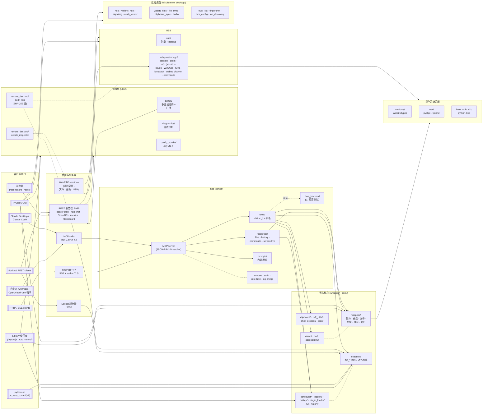

# AutoControl

[](https://pypi.org/project/je_auto_control/)
[](https://pypi.org/project/je_auto_control/)
[](../LICENSE)

**AutoControl** 是一个跨平台的 Python GUI 自动化框架，提供鼠标控制、键盘输入、图像识别、屏幕捕获、脚本执行与报告生成等功能 — 通过统一的 API 在 Windows、macOS 和 Linux (X11) 上运行。

**[English](../README.md)** | **[繁體中文](README_zh-TW.md)**

---

## 目录

- [本次更新 (2026-06-22) — multipart/form-data 构建与解析](#本次更新-2026-06-22--multipartform-data-构建与解析)
- [本次更新 (2026-06-22) — 配置与日志的机密脱敏](#本次更新-2026-06-22--配置与日志的机密脱敏)
- [本次更新 (2026-06-22) — RFC 8288 Link 标头与分页](#本次更新-2026-06-22--rfc-8288-link-标头与分页)
- [本次更新 (2026-06-22) — 参照完整性检查](#本次更新-2026-06-22--参照完整性检查)
- [本次更新 (2026-06-22) — URI-Scheme 值引用](#本次更新-2026-06-22--uri-scheme-值引用)
- [本次更新 (2026-06-21) — W3C Baggage 传播](#本次更新-2026-06-21--w3c-baggage-传播)
- [本次更新 (2026-06-21) — 数据集差异(数据行变更报告)](#本次更新-2026-06-21--数据集差异数据行变更报告)
- [本次更新 (2026-06-21) — 分布漂移检测](#本次更新-2026-06-21--分布漂移检测)
- [本次更新 (2026-06-21) — 分层配置解析器](#本次更新-2026-06-21--分层配置解析器)
- [本次更新 (2026-06-21) — Server-Sent Events (SSE) 客户端解析器](#本次更新-2026-06-21--server-sent-events-sse-客户端解析器)
- [本次更新 (2026-06-21) — Dotenv (.env) 解析](#本次更新-2026-06-21--dotenv-env-解析)
- [本次更新 (2026-06-21) — RFC 9457 Problem Details 解析](#本次更新-2026-06-21--rfc-9457-problem-details-解析)
- [本次更新 (2026-06-21) — 数据剖析与结构推断](#本次更新-2026-06-21--数据剖析与结构推断)
- [本次更新 (2026-06-21) — W3C Trace Context 传播](#本次更新-2026-06-21--w3c-trace-context-传播)
- [本次更新 (2026-06-21) — HTTP 录制与重播卡带](#本次更新-2026-06-21--http-录制与重播卡带)
- [本次更新 (2026-06-21) — 隔舱与速率限制标头](#本次更新-2026-06-21--隔舱与速率限制标头)
- [本次更新 (2026-06-21) — 流式延迟百分位](#本次更新-2026-06-21--流式延迟百分位)
- [本次更新 (2026-06-21) — 服务等级目标(SLO)](#本次更新-2026-06-21--服务等级目标slo)
- [本次更新 (2026-06-21) — 混沌实验](#本次更新-2026-06-21--混沌实验)
- [本次更新 (2026-06-21) — JSON 合约与快照比对](#本次更新-2026-06-21--json-合约与快照比对)
- [本次更新 (2026-06-21) — SLSA 构建来源证明](#本次更新-2026-06-21--slsa-构建来源证明)
- [本次更新 (2026-06-21) — 功能旗标](#本次更新-2026-06-21--功能旗标)
- [本次更新 (2026-06-21) — 文本 Diff、应用与三方合并](#本次更新-2026-06-21--文本-diff应用与三方合并)
- [本次更新 (2026-06-21) — 日历周期规则(RRULE)](#本次更新-2026-06-21--日历周期规则rrule)
- [本次更新 (2026-06-21) — 统计与 A/B 显著性](#本次更新-2026-06-21--统计与-ab-显著性)
- [本次更新 (2026-06-21) — 全文搜索(BM25)](#本次更新-2026-06-21--全文搜索bm25)
- [本次更新 (2026-06-21) — JSON Pointer、Patch 与 Merge Patch](#本次更新-2026-06-21--json-pointerpatch-与-merge-patch)
- [本次更新 (2026-06-21) — 客户端速率限制](#本次更新-2026-06-21--客户端速率限制)
- [本次更新 (2026-06-21) — JSON Web Token(JWT)](#本次更新-2026-06-21--json-web-tokenjwt)
- [本次更新 (2026-06-21) — 许可证策略闸门](#本次更新-2026-06-21--许可证策略闸门)
- [本次更新 (2026-06-21) — OpenVEX 漏洞分级](#本次更新-2026-06-21--openvex-漏洞分级)
- [本次更新 (2026-06-21) — 依赖项漏洞扫描(OSV)](#本次更新-2026-06-21--依赖项漏洞扫描osv)
- [本次更新 (2026-06-21) — JSON Schema 验证](#本次更新-2026-06-21--json-schema-验证)
- [本次更新 (2026-06-20) — SARIF 2.1.0 发现项目导出](#本次更新-2026-06-20--sarif-210-发现项目导出)
- [本次更新 (2026-06-20) — 文本 PII 检测与遮蔽](#本次更新-2026-06-20--文本-pii-检测与遮蔽)
- [本次更新 (2026-06-20) — 自我修复定位器回写](#本次更新-2026-06-20--自我修复定位器回写)
- [本次更新 (2026-06-20) — DMN 式决策表](#本次更新-2026-06-20--dmn-式决策表)
- [本次更新 (2026-06-20) — Saga / 补偿回滚](#本次更新-2026-06-20--saga--补偿回滚)
- [本次更新 (2026-06-20) — JSONPath 查询](#本次更新-2026-06-20--jsonpath-查询)
- [本次更新 (2026-06-20) — 多通道 Webhook 通知](#本次更新-2026-06-20--多通道-webhook-通知)
- [本次更新 (2026-06-20) — 对外 CloudEvents 发送器](#本次更新-2026-06-20--对外-cloudevents-发送器)
- [本次更新 (2026-06-20) — 环境范围的带类型资产存储](#本次更新-2026-06-20--环境范围的带类型资产存储)
- [本次更新 (2026-06-20) — 任务 / 流程挖掘(自动化候选发现)](#本次更新-2026-06-20--任务--流程挖掘自动化候选发现)
- [本次更新 (2026-06-20) — 卡循环守卫(Agent Loop 进度检测)](#本次更新-2026-06-20--卡循环守卫agent-loop-进度检测)
- [本次更新 (2026-06-20) — 坐标空间映射(模型网格 ⇄ 物理像素)](#本次更新-2026-06-20--坐标空间映射模型网格--物理像素)
- [本次更新 (2026-06-20) — 语音指令路由器](#本次更新-2026-06-20--语音指令路由器)
- [本次更新 (2026-06-20) — 区域设置感知的数字、货币与日期解析](#本次更新-2026-06-20--区域设置感知的数字货币与日期解析)
- [本次更新 (2026-06-20) — 感知哈希图像去重](#本次更新-2026-06-20--感知哈希图像去重)
- [本次更新 (2026-06-20) — S3 兼容成品存储](#本次更新-2026-06-20--s3-兼容成品存储)
- [本次更新 (2026-06-20) — 模糊字符串匹配与去重](#本次更新-2026-06-20--模糊字符串匹配与去重)
- [本次更新 (2026-06-19) — 视频步骤叠加报告](#本次更新-2026-06-19--视频步骤叠加报告)
- [本次更新 (2026-06-19) — Agent 可观测性(GenAI OpenTelemetry Spans)](#本次更新-2026-06-19--agent-可观测性genai-opentelemetry-spans)
- [本次更新 (2026-06-19) — 合规控制报告(SOC2 / ISO 27001)](#本次更新-2026-06-19--合规控制报告soc2--iso-27001)
- [本次更新 (2026-06-19) — Agent 轨迹评估](#本次更新-2026-06-19--agent-轨迹评估)
- [本次更新 (2026-06-19) — 核准式测试(Golden-Master 基准)](#本次更新-2026-06-19--核准式测试golden-master-基准)
- [本次更新 (2026-06-19) — 网络出口允许清单守卫](#本次更新-2026-06-19--网络出口允许清单守卫)
- [本次更新 (2026-06-19) — 即时凭证租约](#本次更新-2026-06-19--即时凭证租约)
- [本次更新 (2026-06-19) — Maker-Checker 审批闸门](#本次更新-2026-06-19--maker-checker-审批闸门)
- [本次更新 (2026-06-19) — Plugin SDK](#本次更新-2026-06-19--plugin-sdk)
- [本次更新 (2026-06-19) — MCP 结构化输出](#本次更新-2026-06-19--mcp-结构化输出)
- [本次更新 (2026-06-19) — 缓动拖拽](#本次更新-2026-06-19--缓动拖拽)
- [本次更新 (2026-06-19) — 流程文档(SOP)生成器](#本次更新-2026-06-19--流程文档sop生成器)
- [本次更新 (2026-06-19) — 修复分析与机密扫描](#本次更新-2026-06-19--修复分析与机密扫描)
- [本次更新 (2026-06-19) — CI 注解与剪贴板历史](#本次更新-2026-06-19--ci-注解与剪贴板历史)
- [本次更新 (2026-06-19) — 韧性原语](#本次更新-2026-06-19--韧性原语)
- [本次更新 (2026-06-19) — 计时输入宏](#本次更新-2026-06-19--计时输入宏)
- [本次更新 (2026-06-19) — 语义屏幕状态](#本次更新-2026-06-19--语义屏幕状态)
- [本次更新 (2026-06-19) — Set-of-Marks 叠图](#本次更新-2026-06-19--set-of-marks-叠图)
- [本次更新 (2026-06-19) — 检查点与续跑](#本次更新-2026-06-19--检查点与续跑)
- [本次更新 (2026-06-19) — i18n / l10n 测试](#本次更新-2026-06-19--i18n--l10n-测试)
- [本次更新 (2026-06-19) — 数据质量](#本次更新-2026-06-19--数据质量)
- [本次更新 (2026-06-19) — SBOM 与测试分片](#本次更新-2026-06-19--sbom-与测试分片)
- [本次更新 (2026-06-19) — 反应式观察器](#本次更新-2026-06-19--反应式观察器)
- [本次更新 (2026-06-19) — WCAG 2.2 审计](#本次更新-2026-06-19--wcag-22-审计)
- [本次更新 (2026-06-19) — 记忆与确定性](#本次更新-2026-06-19--记忆与确定性)
- [本次更新 (2026-06-19) — Office 读写](#本次更新-2026-06-19--office-读写)
- [本次更新 (2026-06-19) — Agent 工具组](#本次更新-2026-06-19--agent-工具组)
- [本次更新 (2026-06-19) — 编写与调试](#本次更新-2026-06-19--编写与调试)
- [本次更新 (2026-06-19) — 测试与工具三件套](#本次更新-2026-06-19--测试与工具三件套)
- [本次更新 (2026-06-19) — 事务式工作队列](#本次更新-2026-06-19--事务式工作队列)
- [本次更新 (2026-06-19) — 无人值守可靠性](#本次更新-2026-06-19--无人值守可靠性)
- [本次更新 (2026-06-19) — 弹窗看门狗](#本次更新-2026-06-19--弹窗看门狗)
- [本次更新 (2026-06-19) — 原生 UI 控制](#本次更新-2026-06-19--原生-ui-控制)
- [本次更新 (2026-06-19)](#本次更新-2026-06-19)
- [本次更新 (2026-06-18)](#本次更新-2026-06-18)
- [本次更新 (2026-06-17)](#本次更新-2026-06-17)
- [本次更新 (2026-06)](#本次更新-2026-06)
- [本次更新 (2026-05)](#本次更新-2026-05)
- [功能特性](#功能特性)
- [架构](#架构)
- [安装](#安装)
- [系统要求](#系统要求)
- [快速开始](#快速开始)
  - [鼠标控制](#鼠标控制)
  - [键盘控制](#键盘控制)
  - [图像识别](#图像识别)
  - [Accessibility 元件搜索](#accessibility-元件搜索)
  - [AI 元件定位（VLM）](#ai-元件定位vlm)
  - [OCR 屏幕文字识别](#ocr-屏幕文字识别)
  - [LLM 动作规划器](#llm-动作规划器)
  - [运行期变量与流程控制](#运行期变量与流程控制)
  - [远程桌面](#远程桌面)
  - [剪贴板](#剪贴板)
  - [截图](#截图)
  - [动作录制与回放](#动作录制与回放)
  - [JSON 脚本执行器](#json-脚本执行器)
  - [MCP 服务器（让 Claude 使用 AutoControl）](#mcp-服务器让-claude-使用-autocontrol)
  - [调度器（Interval & Cron）](#调度器interval--cron)
  - [全局热键](#全局热键)
  - [事件触发器](#事件触发器)
  - [执行历史](#执行历史)
  - [报告生成](#报告生成)
  - [可观测性（Prometheus / OpenTelemetry）](#可观测性prometheus--opentelemetry)
  - [远程自动化（Socket / REST）](#远程自动化socket--rest)
  - [插件加载器](#插件加载器)
  - [Shell 命令执行](#shell-命令执行)
  - [屏幕录制](#屏幕录制)
  - [回调执行器](#回调执行器)
  - [包管理器](#包管理器)
  - [项目管理](#项目管理)
  - [窗口管理](#窗口管理)
  - [GUI 应用程序](#gui-应用程序)
- [命令行界面](#命令行界面)
- [平台支持](#平台支持)
- [开发](#开发)
- [许可证](#许可证)

---

## 本次更新 (2026-06-22) — multipart/form-data 构建与解析

构建文件上传内文。完整参考:[`docs/source/Zh/doc/new_features/v89_features_doc.rst`](../docs/source/Zh/doc/new_features/v89_features_doc.rst)。

- **`build_multipart` / `parse_multipart` / `MultipartFile`**(`AC_build_multipart`、`AC_parse_multipart`):`http_request` 只发 JSON/原始 —— 没有文件上传,且解析 multipart 的标准库 `cgi` 已在 3.13 移除。本功能以可注入的 boundary(字节稳定)从文本字段与文件组装 `multipart/form-data` 内文,并能解析回 `{fields, files}`。纯标准库、确定。

## 本次更新 (2026-06-22) — 配置与日志的机密脱敏

在记录或导出前脱敏机密。完整参考:[`docs/source/Zh/doc/new_features/v88_features_doc.rst`](../docs/source/Zh/doc/new_features/v88_features_doc.rst)。

- **`redact_config` / `redact_secret_text`**(`AC_redact_config`、`AC_redact_secret_text`):`utils/redaction` 只模糊截图,`secrets_scan` 只*检测* —— 两者都不返回脱敏后的副本。本功能重用 `secrets_scan` 检测器(键名模式、AWS/bearer 格式、高熵)返回配置结构的脱敏深层副本,并脱敏自由文本日志行中看似机密的 token(保留周围文本)。vault 引用(`${secrets.*}`)保持不变。纯标准库、确定。

## 本次更新 (2026-06-22) — RFC 8288 Link 标头与分页

解析 `Link` 标头并跟随 `rel="next"`。完整参考:[`docs/source/Zh/doc/new_features/v87_features_doc.rst`](../docs/source/Zh/doc/new_features/v87_features_doc.rst)。

- **`parse_link_header` / `next_url` / `links_by_rel` / `paginate`**(`AC_parse_link_header`、`AC_next_url`):分页的 REST API 返回 `Link: <...>; rel="next"`,但没有东西解析它。本功能解析该标头(含逗号的引号值、多个链接)、按关系索引,`paginate` 通过注入的 `fetch`(传输/卡带)跟随 `rel="next"`,上限为 `max_pages`。纯标准库、确定。

## 本次更新 (2026-06-22) — 参照完整性检查

跨数据表的外键、唯一键、accepted-values 与行数检查。完整参考:[`docs/source/Zh/doc/new_features/v86_features_doc.rst`](../docs/source/Zh/doc/new_features/v86_features_doc.rst)。

- **`check_foreign_key` / `check_unique_key` / `check_accepted_values` / `check_row_count`**(`AC_check_foreign_key`、`AC_check_unique_key`、`AC_check_accepted_values`、`AC_check_row_count`):`validate_rows` 是单行、单表(其 `unique` 只在单批次内去重)。本功能补上 dbt 风格通用检查 —— 跨两表的父子外键、单一/复合键唯一性、accepted-values、行数范围 —— 作用于 `load_rows`/`query_sqlite` 的数据行。纯标准库、确定。

## 本次更新 (2026-06-22) — URI-Scheme 值引用

在配置中存储指针而非机密。完整参考:[`docs/source/Zh/doc/new_features/v85_features_doc.rst`](../docs/source/Zh/doc/new_features/v85_features_doc.rst)。

- **`resolve_ref` / `resolve_refs_in` / `is_ref` / `RefResolver`**(`AC_resolve_ref`、`AC_resolve_refs`):`interpolate` 只写死 `${secrets.NAME}`,`AssetStore` 引用仅限 vault 名称 —— 没有通用的读取时间接。本功能解析 `env://VAR`、`file://path`(可选 `base_dir` 防穿越保护)与 `secret://name`(可注入解析器或 governance broker),并遍历嵌套结构解析每个引用。env 读取器 / secret 解析器 / 基目录均可注入。纯标准库、确定。

## 本次更新 (2026-06-21) — W3C Baggage 传播

跨 HTTP 携带横切键值上下文。完整参考:[`docs/source/Zh/doc/new_features/v84_features_doc.rst`](../docs/source/Zh/doc/new_features/v84_features_doc.rst)。

- **`Baggage` / `parse_baggage` / `format_baggage` / `inject_baggage` / `extract_baggage`**(`AC_baggage_parse`、`AC_baggage_format`):`trace_context` 携带 trace/span 身份,但没有东西传播横切上下文(`run_id`/`tenant`/`experiment`)。本功能实现 W3C Baggage 标头 —— percent-encoded 的 `key=value` 列表 —— 以不可变的 `Baggage`(set/remove 返回新实例)与不分大小写的 inject/extract。与 `trace_context` 搭配。纯标准库、确定。

## 本次更新 (2026-06-21) — 数据集差异(数据行变更报告)

按键比对两份表格式提取。完整参考:[`docs/source/Zh/doc/new_features/v83_features_doc.rst`](../docs/source/Zh/doc/new_features/v83_features_doc.rst)。

- **`diff_rows` / `cell_changes` / `summarize_diff`**(`AC_diff_rows`、`AC_cell_changes`):框架能比对画面/快照,但没有任何东西能按键比对两个**表格式**数据行集合。本功能为两侧建键索引并报告 `{added, removed, changed, unchanged}`(changed 带 `{key, old, new}`),展开逐列 `{key, column, old, new}` 变更,并统计每个分类。支持复合键;重复键以最后一行为准。纯标准库、确定。

## 本次更新 (2026-06-21) — 分布漂移检测

检查今天的数据形状是否与基准一致。完整参考:[`docs/source/Zh/doc/new_features/v82_features_doc.rst`](../docs/source/Zh/doc/new_features/v82_features_doc.rst)。

- **`psi` / `ks_two_sample` / `categorical_drift` / `detect_drift`**(`AC_detect_drift`、`AC_categorical_drift`):`stats` 有 A/B 实验检定,但没有 Population Stability Index,也没有针对 reference-vs-current 分布的 KS 双样本检定。本功能加入 PSI(分位分箱的 log-ratio)、KS 统计量与 Kolmogorov p 值,以及类别卡方 + total-variation 摘要 —— 与 `data_profile` 搭配。`detect_drift` 给出一次性的 `{psi, drifted, ks}` 判定。纯标准库、确定。

## 本次更新 (2026-06-21) — 分层配置解析器

以 `defaults < file < env < CLI` 优先级组合配置。完整参考:[`docs/source/Zh/doc/new_features/v81_features_doc.rst`](../docs/source/Zh/doc/new_features/v81_features_doc.rst)。

- **`LayeredConfig` / `deep_merge` / `SourceTrace`**(`AC_resolve_config`、`AC_explain_config`):`json_patch.merge_patch` 只合并两份文档,`config_sync` 是 last-write-wins,`AssetStore` 是每环境扁平 —— 都无法组成有序优先级堆叠并深度合并,也无法报告每个键由哪层胜出。`add_layer(name, mapping, priority)` 后 `resolve()` 深度合并(嵌套 dict 递归、标量/list 替换);`explain("db.host")` 标明胜出层。各层由调用端提供(env 由外部传入,绝不隐含 `os.environ`)。纯标准库、确定。

## 本次更新 (2026-06-21) — Server-Sent Events (SSE) 客户端解析器

消费 `text/event-stream` 响应。完整参考:[`docs/source/Zh/doc/new_features/v80_features_doc.rst`](../docs/source/Zh/doc/new_features/v80_features_doc.rst)。

- **`parse_event_stream` / `SSEParser` / `SSEEvent`**(`AC_parse_sse`):MCP 的 HTTP 传输会发出 SSE,但没有任何东西消费它 —— 一个流式的 LLM/agent/chatops 端点会让 `http_request` 拿到原始 blob。本功能实现 WHATWG event-stream 解析算法(`event`/`data`/`id`/`retry`、注释、前导空格规则、空行派发),并提供逐块的增量 `feed` 与一次性的 `parse_event_stream`。纯标准库、完全确定。

## 本次更新 (2026-06-21) — Dotenv (.env) 解析

把 12-factor `.env` 文件读进配置。完整参考:[`docs/source/Zh/doc/new_features/v79_features_doc.rst`](../docs/source/Zh/doc/new_features/v79_features_doc.rst)。

- **`parse_dotenv` / `load_dotenv` / `dotenv_values` / `dump_dotenv`**(`AC_parse_dotenv`、`AC_load_dotenv`):`load_vars_from_json` 载入扁平 JSON,但没有任何东西读取 de-facto 的 `.env` 文件。本功能把 `KEY=VALUE` 行(`export` 前缀、单/双引号、`\n`/`\t` 转义、行内注释)解析成纯 dict —— 不依赖 `python-dotenv`。载入器合并进调用端提供的 mapping 而非变动 `os.environ`,因此安全且确定。纯标准库。

## 本次更新 (2026-06-21) — RFC 9457 Problem Details 解析

从 HTTP 响应读取标准化的 API 错误。完整参考:[`docs/source/Zh/doc/new_features/v78_features_doc.rst`](../docs/source/Zh/doc/new_features/v78_features_doc.rst)。

- **`parse_problem` / `is_problem` / `raise_for_problem` / `ProblemDetails`**(`AC_parse_problem`):`http_request` 返回的非 2xx 内文未经解析,因此流程与 `assert_http` 无法以结构化方式读取标准化的 API 错误。本功能解析 RFC 9457 `application/problem+json` 文档 —— 已注册的 `type`/`title`/`status`/`detail`/`instance` 成员加上 vendor 扩展字段 —— 对非 problem 响应返回 `None`,或抛出 `HttpProblemError`。纯标准库、完全确定。

## 本次更新 (2026-06-21) — 数据剖析与结构推断

扫描数据行集合并提出验证结构。完整参考:[`docs/source/Zh/doc/new_features/v77_features_doc.rst`](../docs/source/Zh/doc/new_features/v77_features_doc.rst)。

- **`profile_rows` / `infer_schema`**(`AC_profile_rows`、`AC_infer_schema`):`validate_rows` 消费手写结构,`stats.describe` 只汇总单一数值列表 —— 没有任何东西扫描整个数据行集合。本功能剖析每列(空值比例、基数、推断类型、最常见值、数值 min/max/mean)并推断出 `validate_rows` 兼容结构(无空值即 required、相异即 unique、数值边界)—— 馈入既有验证器的剖析步骤。纯标准库、完全确定。

## 本次更新 (2026-06-21) — W3C Trace Context 传播

跨 HTTP 边界关联 span 与日志。完整参考:[`docs/source/Zh/doc/new_features/v76_features_doc.rst`](../docs/source/Zh/doc/new_features/v76_features_doc.rst)。

- **`SpanContext` / `new_root_context` / `child_context` / `inject_context` / `extract_context`**(`AC_trace_inject`、`AC_trace_extract`):既有追踪器与 `agent_trace` 的 span 不带 ID,因此一次 HTTP 调用一端的 span 无法与它在另一端触发的工作关联。本功能实现 W3C Trace Context 标准 —— 生成/解析/传播 `traceparent` + `tracestate` 标头(version-`00`,拒绝格式不符/全零 ID),并以可注入 RNG 让测试中的 ID 确定。纯标准库。

## 本次更新 (2026-06-21) — HTTP 录制与重播卡带

在 CI 中重跑 API 流程,无需在线服务器。完整参考:[`docs/source/Zh/doc/new_features/v75_features_doc.rst`](../docs/source/Zh/doc/new_features/v75_features_doc.rst)。

- **`Cassette` / `CassetteMissError`**(`AC_http_replay`):HTTP 客户端把 `urllib` 传输写死,因此驱动真实 API 的流程无法离线重跑。客户端现在开放 `build_call` / `urllib_transport` 接缝,本功能加入 VCR 风格卡带 —— `replay` 为相符请求返回已录制响应(纯粹、不联网,对 CI 最有价值的一半),`recording_transport` 则是在实际传输之上的薄薄转送。可按 `method`/`url`(可加 `body`)匹配;以 JSON `save`/`load` 卡带。纯标准库。

## 本次更新 (2026-06-21) — 隔舱与速率限制标头

限制并发、遵守服务器退避。完整参考:[`docs/source/Zh/doc/new_features/v74_features_doc.rst`](../docs/source/Zh/doc/new_features/v74_features_doc.rst)。

- **`Bulkhead` / `next_delay` / `parse_retry_after` / `parse_ratelimit`**(`AC_bulkhead_run`、`AC_retry_after`):`resilience` 恢复、`rate_limit` 调速,但没有任何东西限制*同时*进行的调用(缓慢依赖会耗尽所有 worker),且 HTTP 客户端忽略 `Retry-After`/`RateLimit-*`。本功能补上隔舱(满载时以 `BulkheadFullError` 卸除负载的 bounded-concurrency 许可)以及服务器建议延迟(delta 秒或 HTTP-date)的解析器。非阻塞许可计数 → 确定、测试免线程。纯标准库。

## 本次更新 (2026-06-21) — 流式延迟百分位

load/soak 测试的可合并 p99。完整参考:[`docs/source/Zh/doc/new_features/v73_features_doc.rst`](../docs/source/Zh/doc/new_features/v73_features_doc.rst)。

- **`LatencyDigest` / `exact_percentiles`**(`AC_percentiles`):`stats.percentile` 需要完整已排序列表;本功能补上 HdrHistogram 风格的 digest,具 O(1) `record`、内存有界(有效位数分桶)以及跨分片汇聚的 `merge` —— 这正是从各 worker 结果计算正确汇聚 p99 所需的特性。`exact_percentiles` 涵盖小样本集情况(任意分位)。纯标准库 `math`。

## 本次更新 (2026-06-21) — 服务等级目标(SLO)

SLI、错误预算与燃烧率告警。完整参考:[`docs/source/Zh/doc/new_features/v72_features_doc.rst`](../docs/source/Zh/doc/new_features/v72_features_doc.rst)。

- **`evaluate_slo` / `burn_rate` / `burn_alerts` / `default_burn_rules`**(`AC_evaluate_slo`、`AC_burn_alerts`):框架会发出原始信号却没有 SLO 层。本功能在结果记录(`[{timestamp, ok}]`)上计算 SLI、对目标计算错误预算,以及 Google SRE workbook 的**多窗口多燃烧率**告警(1h 达 14.4×、6h 达 6× 呼叫;3d 达 1× 开单 —— 只有当长短窗口双双超过阈值才触发)。记录为纯数据、时钟可注入、完全确定。纯标准库。

## 本次更新 (2026-06-21) — 混沌实验

注入故障、验证系统仍成立。完整参考:[`docs/source/Zh/doc/new_features/v71_features_doc.rst`](../docs/source/Zh/doc/new_features/v71_features_doc.rst)。

- **`ChaosExperiment` / `run_experiment` / `Probe` / `latency_fault` / `exception_fault`**(`AC_run_chaos`):`resilience` 从失败中*恢复*;这则*制造*失败并检查稳态假设是否仍成立(Chaos Toolkit 生命周期 —— 之前验证、注入故障、之后验证、LIFO 回滚)。探针/故障/回滚皆为 callable;时钟/RNG/sleep 可注入,因此实验在测试中**确定地**执行,无真正失败或睡眠。`AC_run_chaos` 以动作列表 spec 驱动。纯标准库。

## 本次更新 (2026-06-21) — JSON 合约与快照比对

比对、取差异与快照 JSON 内容。完整参考:[`docs/source/Zh/doc/new_features/v70_features_doc.rst`](../docs/source/Zh/doc/new_features/v70_features_doc.rst)。

- **`match_json` / `diff_json` / `normalize_json` / `snapshot_json`**(`AC_match_json`、`AC_diff_json`):`json_schema` 以撰写的 schema 验证、`jsonpath` 提取,但没有任何东西能以宽松规则比对两份内容或逐路径取差异。本功能补上合约/快照比对 —— `partial`(子集)、`match_type`(Pact 风格 `like`)、`ignore` 易变路径 —— 返回 `{path, kind}` 不符(`missing`/`extra`/`changed`),外加 golden-master `snapshot_json`。与 `json_schema` + `json_patch` 互补;纯标准库。

## 本次更新 (2026-06-21) — SLSA 构建来源证明

证明构建产生了什么。完整参考:[`docs/source/Zh/doc/new_features/v69_features_doc.rst`](../docs/source/Zh/doc/new_features/v69_features_doc.rst)。

- **`build_provenance` / `subject_for` / `verify_provenance` / `write_provenance`**(`AC_build_provenance`、`AC_verify_provenance`):框架能签署动作文件并盘点依赖项(SBOM),却无法证明*哪个构建产生了什么*。本功能补上 in-toto v1 Statement,携带覆盖文件 `sha256` 摘要的 SLSA v1 provenance predicate,并附上会重新哈希产物的验证器(篡改 → 不符)。与 `action_signing` + `sbom` 互补;纯标准库 `hashlib`+`json`,完全离线。

## 本次更新 (2026-06-21) — 功能旗标

以目标规则与推出切换行为。完整参考:[`docs/source/Zh/doc/new_features/v68_features_doc.rst`](../docs/source/Zh/doc/new_features/v68_features_doc.rst)。

- **`FlagStore` / `evaluate_flag` / `is_enabled` / `assign_variant`**(`AC_evaluate_flag`、`AC_flag_enabled`):`decision_table` 是一次性 DMN,`ab_locator` 是定位器 A/B —— 两者都不是带黏性 % 推出的产品旗标存储库。本功能补上 OpenFeature 形状引擎:目标规则(`eq`/`in`/`semver_*`…)、加权变体、kill switch,以及一致哈希分桶(`sha256(key.salt.context_key)`)使主体具**黏性**。返回 `{value, variant, reason}`(`TARGETING_MATCH`/`SPLIT`/`DISABLED`/`ERROR`)。纯标准库、确定。

## 本次更新 (2026-06-21) — 文本 Diff、应用与三方合并

应用并合并文本 diff。完整参考:[`docs/source/Zh/doc/new_features/v67_features_doc.rst`](../docs/source/Zh/doc/new_features/v67_features_doc.rst)。

- **`unified_diff` / `apply_unified` / `three_way_merge`**(`AC_unified_diff`、`AC_apply_unified`、`AC_three_way_merge`):`difflib` 会*生成* unified diff,但标准库无法*应用*,也没有三方合并。本功能补上缺少的应用器(走访 `@@` 块、验证 context、不符即抛出)与以行为单位的三方合并(不重叠编辑干净合并;重叠则产生 `<<<<<<<` 冲突标记)。与 `json_patch`(结构化 JSON)互补;纯标准库 `difflib`。

## 本次更新 (2026-06-21) — 日历周期规则(RRULE)

排程「每月第 2 个星期二」。完整参考:[`docs/source/Zh/doc/new_features/v66_features_doc.rst`](../docs/source/Zh/doc/new_features/v66_features_doc.rst)。

- **`parse_rrule` / `occurrences` / `next_occurrence`**(`AC_rrule_occurrences`、`AC_rrule_next`):排程器的 cron 只是 5 字段间隔式 —— 无法表达「每月第 2 个星期二」、「每月最后一个工作日」或「连续 10 次的每个工作日」。本功能补上 RFC 5545(iCalendar)RRULE 解析器 + 发生时刻展开器,支持 `FREQ`/`INTERVAL`/`COUNT`/`UNTIL`/`BYDAY`(含序数如 `2MO`/`-1FR`)/`BYMONTHDAY`/`BYMONTH`/`BYSETPOS`/`WKST`。纯标准库 `datetime`+`calendar`,时钟可注入使 `next_occurrence` 确定。

## 本次更新 (2026-06-21) — 统计与 A/B 显著性

判断差异是否为真。完整参考:[`docs/source/Zh/doc/new_features/v65_features_doc.rst`](../docs/source/Zh/doc/new_features/v65_features_doc.rst)。

- **`describe` / `percentile` / `two_proportion_z_test` / `welch_t_test` / `cohens_d` / `chi_square_2x2`**(`AC_describe_stats`、`AC_ab_significance`):`ab_locator` 以原始成功率排名,`run_history` 存储时长,但没有任何东西计算百分位或显著性。本功能补上分析层 —— 摘要统计 + p50/p90/p95/p99、双比例 z 检验(含置信区间)、Welch t 检验(以不完全 beta 取得精确 t 分布 p 值,免 SciPy)、Cohen's d,以及 2×2 卡方。正态 CDF 以 `math.erf` 精确计算;已对齐教科书数值(含 chi²=z² 恒等式)。纯标准库 `math`+`statistics`。

## 本次更新 (2026-06-21) — 全文搜索(BM25)

依相关性对文档语料排名。完整参考:[`docs/source/Zh/doc/new_features/v64_features_doc.rst`](../docs/source/Zh/doc/new_features/v64_features_doc.rst)。

- **`SearchIndex` / `search_documents` / `tokenize`**(`AC_search_documents`、`ac_search_documents`):`fuzzy` 是成对的,`skill_library` 以字母序匹配子字符串 —— 两者都不会依相关性对语料排名。本功能补上以倒排索引、用 Okapi BM25(`k1=1.5`、`b=0.75`、`IDF = ln(1+(N−df+0.5)/(df+0.5))`)或 TF-IDF 排名的搜索,因此罕见词胜过常见词、词频会饱和、长文档被规范化下调。增量 `add`/`remove`、可选停用词、结果确定。纯标准库 `math`+`collections`+`re` —— 无需数据库。

## 本次更新 (2026-06-21) — JSON Pointer、Patch 与 Merge Patch

定址、取差异并修补 JSON。完整参考:[`docs/source/Zh/doc/new_features/v63_features_doc.rst`](../docs/source/Zh/doc/new_features/v63_features_doc.rst)。

- **`resolve_pointer` / `make_patch` / `apply_patch` / `merge_patch` / `make_merge_patch`**(`AC_resolve_pointer`、`AC_apply_json_patch`、`AC_make_json_patch`、`AC_merge_patch`):`jsonpath` 是只读的,`approval` 比较整份产物 —— 没有任何东西能定址单一位置、计算结构化差异或套用部分更新。本功能补上三个 IETF 原语 —— JSON Pointer(RFC 6901)、JSON Patch(RFC 6902,全六种操作,**原子**套用)、JSON Merge Patch(RFC 7386,`null` 删除)—— 适用于配置漂移检测、部分更新、HTTP PATCH 内容与 golden-master 差异。纯标准库 `json`+`copy`,以 RFC 测试向量验证。

## 本次更新 (2026-06-21) — 客户端速率限制

守在 API 配额之内。完整参考:[`docs/source/Zh/doc/new_features/v62_features_doc.rst`](../docs/source/Zh/doc/new_features/v62_features_doc.rst)。

- **`TokenBucket` / `SlidingWindowLimiter` / `throttle`**(`AC_rate_limit`、`ac_rate_limit`):`RetryPolicy`/`CircuitBreaker` 从失败中复原,但没有任何东西塑形调用的*速率*。本功能补上 token bucket(平滑速率 + 突发)、sliding-window 限制器(Cloudflare 的 O(1) 加权计数)以及前缘 throttle 装饰器。每个限制器都接受可注入的 `clock`(`acquire` 另接受 `sleep`),因此在 CI 完全确定、没有真正延迟。`AC_rate_limit` 以具名 bucket 闸控动作,返回 `{acquired, tokens, wait}`。

## 本次更新 (2026-06-21) — JSON Web Token(JWT)

为你自动化的 API 签发与验证 bearer token。完整参考:[`docs/source/Zh/doc/new_features/v61_features_doc.rst`](../docs/source/Zh/doc/new_features/v61_features_doc.rst)。

- **`encode_jwt` / `decode_jwt` / `ClaimsPolicy`**(`AC_jwt_encode`、`AC_jwt_decode`):框架过去有 HMAC *文件*签名与绑定 ACME 的 RS256 JWS,却没有可签发/验证精简 bearer JWT 的工具。本功能补上纯标准库的 HS256/384/512 编解码器,含完整声明验证(`exp`/`nbf`/`aud`/`iss`、可注入时钟),可直接接上 `http_request` 的 bearer 验证。默认即安全:拒绝 `alg:none`、强制算法允许列表(防混淆),并以 `hmac.compare_digest` 比对签名。`AC_jwt_decode` 返回 `{ok, claims}`,让流程不必抛异常即可分支。

## 本次更新 (2026-06-21) — 许可证策略闸门

标记不被允许的依赖项许可证。完整参考:[`docs/source/Zh/doc/new_features/v60_features_doc.rst`](../docs/source/Zh/doc/new_features/v60_features_doc.rst)。

- **`evaluate_sbom` / `evaluate_license` / `normalize_spdx` / `license_findings_to_sarif`**(`AC_check_licenses`、`ac_check_licenses`):SBOM 记录了每个依赖项的许可证名称却从未*判断*它。本功能把许可证字符串规范化为 SPDX id,以允许列表/拒绝列表(内建 `DEFAULT_COPYLEFT` 集合)评估,理解 SPDX 表达式(`OR` = 择一、`AND` = 全部),再把违规桥接到 SARIF(`denied`→error、`unknown`→warning)。纯标准库、完全离线 —— 与 OSV 漏洞通道并列的许可证合规通道。

## 本次更新 (2026-06-21) — OpenVEX 漏洞分级

抑制不影响你的漏洞。完整参考:[`docs/source/Zh/doc/new_features/v59_features_doc.rst`](../docs/source/Zh/doc/new_features/v59_features_doc.rst)。

- **`vex_statement` / `build_vex` / `apply_vex`**(`AC_apply_vex`、`ac_apply_vex`):OSV 扫描器会让每个已知 CVE 一直出现 —— 没有办法记录「我们查过了,这个不影响我们」。本功能撰写 [OpenVEX](https://openvex.dev) 0.2.0 陈述并套用到扫描器的发现项目:`not_affected`/`fixed` **抑制**一项发现,`affected`/`under_investigation` **标注**它。陈述以漏洞 id *或*别名配对,并可限定产品;`not_affected` 需附理由或冲击说明。纯标准库;可直接接在 `AC_scan_vulns` 之后。

## 本次更新 (2026-06-21) — 依赖项漏洞扫描(OSV)

以 SBOM 比对已知 CVE。完整参考:[`docs/source/Zh/doc/new_features/v58_features_doc.rst`](../docs/source/Zh/doc/new_features/v58_features_doc.rst)。

- **`scan_components` / `match_package` / `is_affected` / `findings_to_sarif`**(`AC_scan_vulns`、`ac_scan_vulns`):`build_sbom` 只会*盘点*依赖项,`to_sarif` 只会*导出*发现项目 —— 从未真正**产生**漏洞发现项目。本功能以 SBOM 的 `(ecosystem, name, version)` 组件比对 [OSV](https://osv.dev) 咨询数据库(扫描 `introduced`/`fixed`/`last_affected` 范围、PEP-503 名称规范化、严重度对应 SARIF 等级),并把结果桥接到既有 SARIF 导出器供 GitHub/Azure DevOps 代码扫描。咨询数据库以**数据注入**(离线、确定性);线上 `osv.dev` 查询为可选的 `fetcher` 接缝。纯标准库 `re`。

## 本次更新 (2026-06-21) — JSON Schema 验证

以真正的 schema 验证嵌套 JSON。完整参考:[`docs/source/Zh/doc/new_features/v57_features_doc.rst`](../docs/source/Zh/doc/new_features/v57_features_doc.rst)。

- **`validate_json` / `is_valid` / `assert_schema`**(`AC_validate_json`、`ac_validate_json`):框架过去只会*产生* JSON Schema,而 `data_quality` 是扁平的逐列检查器 —— 两者都无法验证嵌套的 API 请求/响应内容。本功能补上消费端:一个 JSON Schema(Draft 2020-12 子集)验证器,将**每一个**违规以 `{path, keyword, message}` 报告(例如 `$.age maximum`)。涵盖 `type`(含整数值浮点数的 `integer`)、`enum`/`const`、数字/字符串界限、数组与对象关键字、`allOf`/`anyOf`/`oneOf`/`not`、布尔 schema 与本地 `$ref`。纯标准库 `re`;与 `json_query` 及 `http_request` 辅助函数搭配。

## 本次更新 (2026-06-20) — SARIF 2.1.0 发现项目导出

统一扫描结果供 GitHub 代码扫描。完整参考:[`docs/source/Zh/doc/new_features/v56_features_doc.rst`](../docs/source/Zh/doc/new_features/v56_features_doc.rst)。

- **`to_sarif` / `write_sarif` / `make_finding` / `from_lint_issues` / `from_audit_findings`**(`AC_export_sarif`、`ac_export_sarif`):框架的发现项目产生器(action-lint、密钥扫描、WCAG 审计、guardrail)缺乏共通导出。本功能建立 SARIF 2.1.0 文件(自动规则目录 + 稳定 `partialFingerprints` 跨运行去重),供 GitHub/Azure DevOps 代码扫描以定位到行的警示导入。纯标准库 `json`+`hashlib`;转接器规范化既有 lint/audit 形状。

## 本次更新 (2026-06-20) — 文本 PII 检测与遮蔽

在文本泄漏前遮蔽 PII。完整参考:[`docs/source/Zh/doc/new_features/v55_features_doc.rst`](../docs/source/Zh/doc/new_features/v55_features_doc.rst)。

- **`detect_pii` / `redact_pii_text`**(`AC_detect_pii` / `AC_redact_pii`、`ac_*`):图像遮蔽已存在,但文本(OCR、剪贴板、LLM I/O、日志)无字符串级 PII 处理。本功能在纯文本上检测邮件/电话/SSN/信用卡/IPv4/IBAN 并以 `label`/`mask`/`partial`/`hash` 遮蔽。重叠区段会去重(卡号不会同时是电话);模式无回溯风险。纯标准库 `re`+`hashlib`。

## 本次更新 (2026-06-20) — 自我修复定位器回写

保存修正定位器,使修复不被遗忘。完整参考:[`docs/source/Zh/doc/new_features/v54_features_doc.rst`](../docs/source/Zh/doc/new_features/v54_features_doc.rst)。

- **`RepairStore` / `repair_from_heal`**(`AC_repair_record` / `AC_repair_resolved` / `AC_repair_pending` / `AC_repair_approve`、`ac_*`):运行期自我修复过去会**丢弃**修正后的位置,因此每次都重新修复。本功能记录该次修复的修正定位器(坐标/VLM 描述/方法),在 `confidence >= auto_threshold`(默认 0.9)时**自动套用**或排入可审查建议,`resolved(key)` 返回已学到的修正供重用。封闭「修复→持久修正」循环;纯标准库、可完整测试。

## 本次更新 (2026-06-20) — DMN 式决策表

将分支外部化为可审查的规则表。完整参考:[`docs/source/Zh/doc/new_features/v53_features_doc.rst`](../docs/source/Zh/doc/new_features/v53_features_doc.rst)。

- **`evaluate_table` / `DecisionTable`**(`AC_decision_table`、`ac_decision_table`):以一列列的 `conditions -> outputs` 加命中政策(`UNIQUE`/`FIRST`/`PRIORITY`/`COLLECT`)取代嵌套 `AC_if_var` 链。单元格条件为通配符 / 字面值 / `{op, value}`,使用执行器标准比较子(重用,不重复)。纯标准库、可完整测试;DMN 让业务规则数据驱动的方式。

## 本次更新 (2026-06-20) — Saga / 补偿回滚

后续步骤失败时回滚已完成步骤。完整参考:[`docs/source/Zh/doc/new_features/v52_features_doc.rst`](../docs/source/Zh/doc/new_features/v52_features_doc.rst)。

- **`Saga` / `run_saga`**(`AC_run_saga`、`ac_run_saga`):为每个步骤记录补偿动作;任何失败时以 **LIFO** 顺序对已完成步骤执行补偿 —— 单一区块的 `AC_try` 无法提供的持久性事务原语。前向动作/补偿为可调用对象(或 JSON 动作列表),因此可在无副作用下完整单元测试;补偿为尽力而为(失败的回滚会记录,回滚继续)。返回 `{ok, completed, compensated, failed_step, error}`。

## 本次更新 (2026-06-20) — JSONPath 查询

以通配符、递归、过滤查询 API/DB JSON。完整参考:[`docs/source/Zh/doc/new_features/v51_features_doc.rst`](../docs/source/Zh/doc/new_features/v51_features_doc.rst)。

- **`json_query` / `json_query_one` / `json_extract`**(`AC_json_query` / `AC_json_extract`、`ac_*`):执行器的路径遍历只会以 `.` 切分并索引 —— 本功能在已解析 JSON 上加入 JSONPath 子集(`$`、`.key`、`[n]`/`[-n]`、`*`/`[*]`、`..` 递归下降、`[?(@.k op v)]` 过滤),让含数组的 API/DB 响应易于提取。`json_extract` 以 `{key: path}` 映射提取成扁平 dict。纯标准库 `re`;这是 `AC_http_to_var` 与 DB-row 流程所缺的路径引擎。

## 本次更新 (2026-06-20) — 多通道 Webhook 通知

通知 Teams/Discord/Slack/webhook。完整参考:[`docs/source/Zh/doc/new_features/v50_features_doc.rst`](../docs/source/Zh/doc/new_features/v50_features_doc.rst)。

- **`notify_webhook` / `WebhookChannel`**(`AC_notify_webhook`、`ac_notify_webhook`):`notify` 仅限桌面弹窗、ChatOps 只内建 Slack —— 本功能可发送到 **Slack / Discord / Microsoft Teams / raw** webhook,组出对应传输的载荷(Slack 与 Teams MessageCard 用 `text`,Discord 用 `content`)并通过受出口守卫保护的 HTTP 客户端 POST。`poster` 传输可注入(或 `set_default_poster`),因此发送在无网络下即可单元测试。

## 本次更新 (2026-06-20) — 对外 CloudEvents 发送器

将运行/自动化事件以 CloudEvents 发送。完整参考:[`docs/source/Zh/doc/new_features/v49_features_doc.rst`](../docs/source/Zh/doc/new_features/v49_features_doc.rst)。

- **`to_cloudevent` / `EventEmitter` / `post_cloudevent`**(`AC_emit_event`、`ac_emit_event`):本项目能接收 webhook 却无法**发送**事件 —— 本功能将运行生命周期/断言/失败数据包进 CloudEvents 1.0(CNCF)信封,并可通过受出口守卫保护的 HTTP 客户端 POST 出去(与 Knative、Azure Event Grid、iPaaS、一般 webhook 互通)。`sink`/`poster` 传输可注入,因此发送在无网络下即可单元测试。

## 本次更新 (2026-06-20) — 环境范围的带类型资产存储

依环境的带类型配置 + credential 引用。完整参考:[`docs/source/Zh/doc/new_features/v48_features_doc.rst`](../docs/source/Zh/doc/new_features/v48_features_doc.rst)。

- **`AssetStore` / `active_environment`**(`AC_set_asset` / `AC_get_asset` / `AC_list_assets`、`ac_*`):orchestrator 的「Assets/lockers」支柱 —— 集中管理、依环境(dev/staging/prod)而异且带类型(`text`/`int`/`bool`/`credential`)的配置值。`get` 转成声明类型并退回 default 环境;`credential` 资产持有密钥*引用*,由 `resolve` 通过注入解析器转成真实值(仅限 Python,因此密钥永不进入 `get`/executor 记录)。补足密钥保险库(仅密钥)与 config-sync(整块)的缺口。

## 本次更新 (2026-06-20) — 任务 / 流程挖掘(自动化候选发现)

从录制的动作日志发现该自动化什么。完整参考:[`docs/source/Zh/doc/new_features/v47_features_doc.rst`](../docs/source/Zh/doc/new_features/v47_features_doc.rst)。

- **`mine_action_log` / `find_repeated_sequences` / `directly_follows` / `rank_automation_candidates`**(`AC_mine_actions`、`ac_mine_actions`):挖掘录制的动作日志中频繁、可重复的指令 n-gram,建立 directly-follows 图,并依 `count × length` 为自动化候选排名 —— 这是 AutoControl 一直在录数据却从未分析的 RPA「任务挖掘」支柱。纯标准库;作用于既有动作列表结构;一个经常重现且横跨多步的候选,是「抽成 skill」的强烈信号。

## 本次更新 (2026-06-20) — 卡循环守卫(Agent Loop 进度检测)

捕捉卡在无进展循环的 agent。完整参考:[`docs/source/Zh/doc/new_features/v46_features_doc.rst`](../docs/source/Zh/doc/new_features/v46_features_doc.rst)。

- **`LoopGuard` / `digest_result`**(`AC_loop_guard_observe` / `AC_loop_guard_reset`、`ac_*`):电脑操作最主要的失败模式是 agent 重复一个无效果的动作 —— 而模型看不到自己的循环。`LoopGuard` 观察 `(tool, args, result)` 流并标记 `repeat`(相同调用 N 次)、`ping_pong`(A-B-A-B)与 `no_op`(观察摘要不变),依执行长度由 `ok`→`warn`→`critical` 升级。与步数/时间预算及离线轨迹评估互补;纯标准库、具确定性。

## 本次更新 (2026-06-20) — 坐标空间映射(模型网格 ⇄ 物理像素)

将电脑操作模型的点击转成物理像素。完整参考:[`docs/source/Zh/doc/new_features/v45_features_doc.rst`](../docs/source/Zh/doc/new_features/v45_features_doc.rst)。

- **`CoordinateSpace` / `xga_space` / `normalized_space` / `downscale_png`**(`AC_to_physical` / `AC_to_model`、`ac_*`):电脑操作/VLA 模型以固定网格点击(Anthropic 缩小到 XGA;Gemini 返回 1000×1000 网格),而非物理像素。本功能双向映射(四舍五入 + 夹限),`xga_space` 保持长宽比且不放大,`downscale_png` 将截图缩到模型输入尺寸(Pillow,已是核心)。纯算术映射 —— 无需模型/GPU 即可单元测试。

## 本次更新 (2026-06-20) — 语音指令路由器

以已识别语音免手动触发流程。完整参考:[`docs/source/Zh/doc/new_features/v44_features_doc.rst`](../docs/source/Zh/doc/new_features/v44_features_doc.rst)。

- **`VoiceRouter`**(`AC_voice_register` / `AC_voice_dispatch` / `AC_voice_list` / `AC_voice_clear`、`ac_*`):将语音触发短语映射到 `AC_*` 动作列表;喂入已识别文本即执行最接近的已注册指令(短语匹配重用模糊匹配器,因此「save the file」会触发「save file」)。**语音转文本不在范围内且可注入** —— 路由器接受文本与 `recognizer`/`runner` 可调用对象,因此路由在无音频、无任何语音依赖下完整单元测试(真实 Vosk/麦克风识别器接入 `listen_once`)。

## 本次更新 (2026-06-20) — 区域设置感知的数字、货币与日期解析

解析本地化的数字/货币/日期。完整参考:[`docs/source/Zh/doc/new_features/v43_features_doc.rst`](../docs/source/Zh/doc/new_features/v43_features_doc.rst)。

- **`parse_decimal` / `parse_number` / `format_decimal` / `format_currency` / `format_date`**(`AC_parse_decimal` / `AC_parse_number` / `AC_format_decimal` / `AC_format_currency` / `AC_format_date`、`ac_*`):像 `"1.234,56"`(de_DE)这样的 OCR/UI 文本会通过 **Babel** 的 CLDR 数据正确解析为 `1234.56`,值也能依区域设置格式化回去。`babel` 为可选 `[locale]` extra,采延迟导入;功能测试以 `importorskip` 运行(wiring/facade 一律验证)。

## 本次更新 (2026-06-20) — 感知哈希图像去重

收合近乎相同的屏幕截图。完整参考:[`docs/source/Zh/doc/new_features/v42_features_doc.rst`](../docs/source/Zh/doc/new_features/v42_features_doc.rst)。

- **`average_hash` / `dhash` / `hamming_distance` / `images_similar` / `dedupe_images`**(`AC_image_hash` / `AC_dedupe_images`、`ac_*`):感知哈希将视觉相似的图像映射到接近的指纹,因此录像或步骤报告中的近似重复画面可依汉明距离分群并收合为一个代表。使用 **Pillow**(已是核心 —— 无额外依赖);去重/比较逻辑为纯 Python 且 `hasher` 可注入,因此分群在无任何图像下单元测试,实际 Pillow 路径以 `importorskip` 测试。

## 本次更新 (2026-06-20) — S3 兼容成品存储

将运行成品推送到对象存储。完整参考:[`docs/source/Zh/doc/new_features/v41_features_doc.rst`](../docs/source/Zh/doc/new_features/v41_features_doc.rst)。

- **`S3ArtifactStore`**(`AC_s3_upload` / `AC_s3_download` / `AC_s3_list` / `AC_s3_delete`、`ac_*`):对任何 S3 兼容存储桶(AWS S3、MinIO、R2)上传/下载/列出/删除报告、屏幕截图与录像。`boto3` 为**可选** `[s3]` extra,且 client **可注入**,因此存储体逻辑(含 executor 路径)以假 client 完整单元测试(无 boto3/网络);实际 AWS 路径诚实标注为 CI 无法验证。整个 API 相对于存储体 `prefix`。模块级的默认存储体支撑这些指令。

## 本次更新 (2026-06-20) — 模糊字符串匹配与去重

稳健匹配含噪声的 OCR/UI 文本。完整参考:[`docs/source/Zh/doc/new_features/v40_features_doc.rst`](../docs/source/Zh/doc/new_features/v40_features_doc.rst)。

- **`fuzzy_ratio` / `fuzzy_best_match` / `fuzzy_matches` / `fuzzy_dedupe`**(`AC_fuzzy_ratio` / `AC_fuzzy_best_match` / `AC_fuzzy_dedupe`、`ac_*`):为相似度评分(0..1)、从列表挑最接近的候选,或收合近似重复 —— 让流程可针对「*看起来像* Submit 的按钮」动作,而非精确标签。默认后端为标准库 `difflib`(**无额外依赖**);可选的 `[fuzzy]` extra 加入 `rapidfuzz` 以加速,两者分数皆归一化。支持 `ignore_case` 与 `score_cutoff`。

## 本次更新 (2026-06-19) — 视频步骤叠加报告

将屏幕截图加上字幕制成走查视频。完整参考:[`docs/source/Zh/doc/new_features/v39_features_doc.rst`](../docs/source/Zh/doc/new_features/v39_features_doc.rst)。

- **`write_step_video`**(`AC_write_step_video`、`ac_write_step_video`):将各步骤的屏幕截图转成可分享的视频,每个画面停留数秒并烧入其字幕与通过/失败色彩横幅。组装逻辑(`build_overlay_plan` / `render_overlay_frame`)通过可注入的 `loader`/`drawer`/`writer_factory` 钩子与 OpenCV 分离 —— 可用假物件单元测试、无 `cv2`/`numpy` 依赖;真实路径仅在缺少这些钩子时才延迟导入 `cv2`。为 HTML/JSON 报告的视觉伙伴。

## 本次更新 (2026-06-19) — Agent 可观测性(GenAI OpenTelemetry Spans)

LLM 运行的 OTel GenAI 惯例 spans。完整参考:[`docs/source/Zh/doc/new_features/v38_features_doc.rst`](../docs/source/Zh/doc/new_features/v38_features_doc.rst)。

- **`AgentTrace`**(`AC_trace_record` / `AC_trace_summary` / `AC_trace_export` / `AC_trace_reset`、`ac_*`):记录的 span 其属性遵循 OpenTelemetry **GenAI 语意惯例**(`gen_ai.operation.name`、`gen_ai.system`、`gen_ai.request.model`、`gen_ai.usage.input_tokens`/`output_tokens`、`gen_ai.tool.name`)与 `"{operation} {model}"` span 名称。`to_otel()` 可送入 OTLP exporter;`summary()` 汇整 token 成本与延迟;`operation()` 上下文管理器为实时区块计时并标记错误。纯标准库(无 `opentelemetry` 依赖)、可注入时钟;与轨迹评估互补(在此记录、在那里评分)。

## 本次更新 (2026-06-19) — 合规控制报告(SOC2 / ISO 27001)

将治理证据映射到具名控制项。完整参考:[`docs/source/Zh/doc/new_features/v37_features_doc.rst`](../docs/source/Zh/doc/new_features/v37_features_doc.rst)。

- **`build_compliance_report`**(`AC_compliance_report`、`ac_compliance_report`):框架已内建审计员关注的控制项 —— 出口允许清单、JIT 凭证租约、maker-checker 审批、密钥扫描器、审计记录、CycloneDX SBOM。本功能将扁平的 `evidence` 映射表映射到 SOC2(CC6.1/CC6.3/CC6.8/CC7.3/CC8.1)与 ISO 27001(A.5.23/A.8.16/A.8.30)控制项,每项标记为 `satisfied`/`gap`/`not_assessed`,并输出 JSON 或独立 HTML 表格。治理套件的收尾 —— 为报告辅助,非认证。

## 本次更新 (2026-06-19) — Agent 轨迹评估

依评分标准为 agent 运行评分。完整参考:[`docs/source/Zh/doc/new_features/v36_features_doc.rst`](../docs/source/Zh/doc/new_features/v36_features_doc.rst)。

- **`evaluate_trajectory`**(`AC_evaluate_trajectory`、`ac_evaluate_trajectory`):依声明式评分标准 —— `required_actions`(+`ordered`)、`forbidden_actions`、`max_steps`、`success_contains` —— 为一次记录的轨迹(有序 `{action, args, observation}` 步骤)评分。返回 `{passed, score, steps, checks}`,其中 `score` 为通过的适用检查占比,每个 `check` 精准指出被违反的期望。为 agent 回归测试提供确定性、无依赖的信号;rubric 为纯数据,可存于 JSON action 文件并经 MCP 传递。

## 本次更新 (2026-06-19) — 核准式测试(Golden-Master 基准)

将输出锁定到人工核准的基准。完整参考:[`docs/source/Zh/doc/new_features/v35_features_doc.rst`](../docs/source/Zh/doc/new_features/v35_features_doc.rst)。

- **`verify_artifact` / `approve_artifact`**(`AC_verify_artifact` / `AC_approve_artifact` / `AC_pending_artifacts`、`ac_*`):对*任何*产物(文本、JSON、OCR 输出、屏幕截图字节)进行 golden-master / snapshot 测试。`verify_artifact` 将产出内容与 `<name>.approved.<ext>` 比对;不符或缺少基准会写入 `<name>.received.<ext>` 供审查并失败,`approve_artifact` 则将审查后的 received 文件晋升为基准。以与测试一起提交、受审查把关的基准补强逐像素比对;名称会经过路径穿越检查。

## 本次更新 (2026-06-19) — 网络出口允许清单守卫

钉选自动化可连线的主机。完整参考:[`docs/source/Zh/doc/new_features/v34_features_doc.rst`](../docs/source/Zh/doc/new_features/v34_features_doc.rst)。

- **`EgressPolicy` / `set_egress_policy`**(`AC_egress_allow` / `AC_egress_check` / `AC_egress_reset`、`ac_*`):允许清单(默认拒绝)与/或拒绝清单,使用 `fnmatch` 主机通配符(`*.example.com`),由**每一次** `http_request` 咨询(因此 `AC_http` 与所有以其为基础的功能一次涵盖)。被封锁的主机会在 socket 打开**之前**抛出 `EgressBlocked`。以 allow-all 模式启动 —— 操作者锁定前不改变任何行为。封闭无人值守自动化的数据外泄面。

## 本次更新 (2026-06-19) — 即时凭证租约

密钥的零常驻权限。完整参考:[`docs/source/Zh/doc/new_features/v33_features_doc.rst`](../docs/source/Zh/doc/new_features/v33_features_doc.rst)。

- **`CredentialBroker`**(`AC_lease_secret` / `AC_lease_valid` / `AC_revoke_lease` / `AC_lease_active`、`ac_*`):使用者取得短效*租约*(绑定密钥名称 + 到期时间的 token);真正的值仅在 `redeem` 时、且仅在有效期间,通过可插拔解析器(已解锁的 `SecretManager`、环境变量、vault)取得。密钥值永不进入 executor/MCP 记录 —— executor/MCP/Builder 接口仅管理租约生命周期;`redeem` 是刻意设计的仅限 Python API 逃生门。时钟与解析器皆可注入。

## 本次更新 (2026-06-19) — Maker-Checker 审批闸门

高风险步骤的职责分离。完整参考:[`docs/source/Zh/doc/new_features/v32_features_doc.rst`](../docs/source/Zh/doc/new_features/v32_features_doc.rst)。

- **`ApprovalGate`**(`AC_approval_request` / `AC_approval_approve` / `AC_approval_reject` / `AC_approval_status`、`ac_*`):由 *maker* 提出高风险动作并取得 token;*checker*(必须为**不同**主体)核准或驳回;只有在 `is_approved` 为真后动作才继续。状态为选用的共享 JSON 文件,让派发器与人工审批者可分属不同进程。纯标准库,SOC2 式四眼原则控制。

## 本次更新 (2026-06-19) — Plugin SDK

通过 entry points 注册第三方 `AC_*` 指令。完整参考:[`docs/source/Zh/doc/new_features/v31_features_doc.rst`](../docs/source/Zh/doc/new_features/v31_features_doc.rst)。

- **`discover_plugins` / `load_plugins`**(`AC_list_plugins` / `AC_load_plugins`、`ac_*`):pip 包以 `je_auto_control.commands` entry-point 组声明式注册新执行器指令;AutoControl 于运行期发现并注册(立即可用于 JSON 流程、socket server、调度器、MCP)。坏插件会跳过;为运行期路径加载器的声明式、带命名空间对应物。

## 本次更新 (2026-06-19) — MCP 结构化输出

MCP 2025-06-18 结构化工具输出。完整参考:[`docs/source/Zh/doc/new_features/v30_features_doc.rst`](../docs/source/Zh/doc/new_features/v30_features_doc.rst)。

- **`MCPTool(output_schema=...)`** — 工具可声明 `outputSchema`;其 dict 结果会在 `tools/call` 响应以 `structuredContent` 返回,让客户端/LLM 消费类型化、经 schema 验证的对象而非重新解析文本。`to_descriptor()` 会在 `tools/list` 公告;非 dict 结果与未声明 schema 的工具行为不变。`ac_validate_rows` 为首个采用。

## 本次更新 (2026-06-19) — 缓动拖拽

确定性的缓动拖拽。完整参考:[`docs/source/Zh/doc/new_features/v29_features_doc.rst`](../docs/source/Zh/doc/new_features/v29_features_doc.rst)。

- **`tween_points` / `tween_drag` / `easing_names`**(`AC_tween_drag`、`ac_tween_drag`):沿缓动曲线从 `start` 拖到 `end`(linear / ease_in_out_quad / ease_out_cubic / ease_in_cubic)——确定性、纯数学路径、测试可注入 sink;补足人性化抖动。

## 本次更新 (2026-06-19) — 流程文档(SOP)生成器

把动作列表转成逐步 SOP。完整参考:[`docs/source/Zh/doc/new_features/v28_features_doc.rst`](../docs/source/Zh/doc/new_features/v28_features_doc.rst)。

- **`generate_sop` / `write_sop`**(`AC_generate_sop`、`ac_generate_sop`):把录制/编写的动作列表映射成编号、人类可读步骤 + HTML 文档(UiPath Task-Capture 产出);内容 HTML 转义,未知指令优雅降级。

## 本次更新 (2026-06-19) — 修复分析与机密扫描

两项纯标准库的审计/分析工具。完整参考:[`docs/source/Zh/doc/new_features/v27_features_doc.rst`](../docs/source/Zh/doc/new_features/v27_features_doc.rst)。

- **自我修复分析** — `analyze_heal_log` / `heal_stats`(`AC_heal_stats`、`ac_heal_stats`):把自我修复记录汇总成 heal-rate、策略组合、fallback-rate、平均延迟与最脆弱定位器——在选择器衰退失效前抓出来。
- **机密扫描** — `scan_secrets(data)`(`AC_scan_secrets`、`ac_scan_secrets`):标记 action JSON 中应改用 `${secrets.*}` 的硬编码机密(依键名、值样式或高熵);保险库引用会略过、预览掩码。

## 本次更新 (2026-06-19) — CI 注解与剪贴板历史

两项纯标准库工具。完整参考:[`docs/source/Zh/doc/new_features/v26_features_doc.rst`](../docs/source/Zh/doc/new_features/v26_features_doc.rst)。

- **CI 注解** — `emit_annotations(results)`(`AC_ci_annotations`、`ac_ci_annotations`):把结果 dict 转成 GitHub Actions 工作流命令(`::error file=...,line=...::msg`),让失败在 PR 行内显示,免 reporter action。
- **剪贴板历史** — `ClipboardHistory` / `default_clipboard_history`(`AC_clip_history_capture`/`list`/`search`/`start`/`stop`、`ac_clip_history_*`):有上限、可搜索、最新在前的复制文本环形缓冲,含可选后台轮询器。

## 本次更新 (2026-06-19) — 韧性原语

可重用的 retry 与断路器原语。完整参考:[`docs/source/Zh/doc/new_features/v25_features_doc.rst`](../docs/source/Zh/doc/new_features/v25_features_doc.rst)。

- **RetryPolicy** — `RetryPolicy(...).run(fn)` / `retry_call(fn)`:在配置的异常上以指数退避重试(可注入 sleep)。(既有 `AC_retry` 流程指令已能对动作 body 重试;这是可重用的可调用包装器。)
- **CircuitBreaker** — `CircuitBreaker` / `CircuitOpenError`(`AC_circuit_call`、`ac_circuit_call`):连续失败 N 次后打开、短路至重置超时、再半开——避免重试风暴打垮已故障依赖。可注入 clock;`AC_circuit_call` 让动作列表通过具名断路器执行。

## 本次更新 (2026-06-19) — 计时输入宏

以时间保真度重播输入 + 按住-放开 DSL,走完整五层。完整参考:[`docs/source/Zh/doc/new_features/v24_features_doc.rst`](../docs/source/Zh/doc/new_features/v24_features_doc.rst)。

- **计时时间轴重播** — `replay_timeline(events, speed=...)`(`AC_replay_timeline`、`ac_replay_timeline`):遵守每个 `delta_ms` 间隔、按 `speed` 缩放且可夹限;op = move/click/scroll/press/release/key。
- **输入序列 DSL** — `run_sequence(steps)`(`AC_input_sequence`、`ac_input_sequence`):声明式按住-放开组合键 + `repeat`/`wait`。两者均可注入 sink+sleep 做确定性测试。

## 本次更新 (2026-06-19) — 语义屏幕状态

像素差异的语义对应物,走完整五层。完整参考:[`docs/source/Zh/doc/new_features/v23_features_doc.rst`](../docs/source/Zh/doc/new_features/v23_features_doc.rst)。

- **快照与差异** — `snapshot` / `diff_snapshots` / `snapshot_screen` / `screen_changed`(`AC_screen_snapshot` / `AC_screen_diff` / `AC_screen_changed`、`ac_*`):把 a11y 树规范化为 `{role, name, bbox}`,报告**出现 / 消失 / 移动**并附人类可读摘要——agent 验证某步效果所需的反馈信号(「Save 对话框出现了」)。
- **描述屏幕** — `describe_screen`(`AC_describe_screen`、`ac_describe_screen`):廉价的「我在哪」——各 role 计数 + 交互控件标签。

## 本次更新 (2026-06-19) — Set-of-Marks 叠图

VLM 定位的标准格式,走完整五层。完整参考:[`docs/source/Zh/doc/new_features/v22_features_doc.rst`](../docs/source/Zh/doc/new_features/v22_features_doc.rst)。

- **元素标号** — `mark_elements` / `render_marks` / `resolve_mark`(纯函数 + Pillow):为可交互元素指派 `1..N`(含中心/role/text),在截图上画编号红框,并把选到的编号对应回元素——让 VLM 挑*编号*而非猜像素(直接强化既有 VLM locator)。
- **标号后点击循环** — `mark_screen(render_path=...)` / `mark_click(n)`(`AC_mark_screen` / `AC_mark_click`、`ac_*`):为实时 a11y 树标号(+可选叠图截图),把 marks+图像喂给模型,再点击第 `n` 号。

## 本次更新 (2026-06-19) — 检查点与续跑

长流程的耐久执行 + `py.typed` 标记,走完整五层。完整参考:[`docs/source/Zh/doc/new_features/v21_features_doc.rst`](../docs/source/Zh/doc/new_features/v21_features_doc.rst)。

- **流程检查点与续跑** — `run_resumable(actions, run_id=..., store=...)` / `CheckpointStore`(`AC_run_resumable` / `AC_checkpoint_status` / `AC_checkpoint_clear`、`ac_*`):每步后持久化 step-index + 变量;以相同 `run_id` 再执行时快进略过已完成步骤并还原变量——在第 400 步崩溃的流程会从 400 续跑,而非从 0。可抽换(默认 SQLite),完成后清除。
- **`py.typed` 标记** — 附带 PEP 561 标记,让 Mypy/Pyright/Pylance 在下游代码采用 AutoControl 的内嵌类型注解(此前类型化 API 对类型检查器是隐形的)。

## 本次更新 (2026-06-19) — i18n / l10n 测试

三项可互相搭配的纯标准库国际化/本地化测试辅助工具,走完整五层。完整参考:[`docs/source/Zh/doc/new_features/v20_features_doc.rst`](../docs/source/Zh/doc/new_features/v20_features_doc.rst)。

- **伪本地化** — `pseudo_localize` / `pseudo_localize_catalog`(`AC_pseudo_localize`、`ac_pseudo_localize`):为 UI 字符串加重音与填充(保留占位符、以 `⟦…⟧` 包裹),在真正翻译前揪出硬编码文本并对版面施压。
- **文本溢出检测** — `check_overflow(elements)`(`AC_check_overflow`、`ac_check_overflow`):标记估计宽度超过控件边界的文本(本地化头号 bug),由 AutoControl 既有读取的 a11y 边界计算。
- **目录完整性** — `check_catalog(base, target)`(`AC_check_catalog`、`ac_check_catalog`):比对翻译目录的缺失/多余/空白键与占位符不一致——防止空白 UI 的 CI 闸。

## 本次更新 (2026-06-19) — 数据质量

三项纯标准库的数据质量辅助工具(介于 `load_rows`/OCR 与下游输入之间的闸),走完整五层。完整参考:[`docs/source/Zh/doc/new_features/v19_features_doc.rst`](../docs/source/Zh/doc/new_features/v19_features_doc.rst)。

- **数据行 schema 验证** — `validate_rows(rows, schema)`(`AC_validate_rows`、`ac_validate_rows`):声明式逐字段规则(type/required/regex/min/max/min_len/max_len/allowed/unique);返回 `{ok, valid, invalid, errors}`,在坏掉的抓取/OCR 数据污染 ERP/表单前拦下。
- **字段提取** — `extract_fields(text, fields, patterns)`(`AC_extract_fields`、`ac_extract_fields`):具名 regex 预设(email/url/ipv4/phone/date_iso/amount/hashtag)+自定义 patterns,作用于自由文本 / OCR 文本块。
- **数据行掩码** — `mask_rows(rows, rules)`(`AC_mask_rows`、`ac_mask_rows`):导出前掩码字段——`redact` / `hash`(SHA-256)/ `partial`(保留末 4 字);补足仅针对截图的脱敏。

## 本次更新 (2026-06-19) — SBOM 与测试分片

来自安全与规模研究角度的两项纯标准库运维工具,走完整五层。完整参考:[`docs/source/Zh/doc/new_features/v18_features_doc.rst`](../docs/source/Zh/doc/new_features/v18_features_doc.rst)。

- **CycloneDX SBOM** — `build_sbom` / `write_sbom`(`AC_generate_sbom`、`ac_generate_sbom`):为供应链合规(欧盟 CRA / EO 14028)输出 CycloneDX 1.6 依赖 SBOM(name/version/purl/许可证);`root` 限定某包的闭包,`extra_components` 可纳入 action 文件。无第三方依赖。
- **时长感知套件分片** — `shard_flows` / `merge_results`(`AC_shard_suite` / `AC_merge_results`):依每个流程历史时长把流程装箱成 N 片(让最慢的 worker 而非测试数量决定总时长),再把各分片报告合并为一份汇总。

## 本次更新 (2026-06-19) — 反应式观察器

非阻塞的屏幕观察器(SikuliX `observe` 模型),走完整五层(facade、`AC_*`、MCP、Script Builder)。完整参考:[`docs/source/Zh/doc/new_features/v17_features_doc.rst`](../docs/source/Zh/doc/new_features/v17_features_doc.rst)。

- **`ScreenObserver`**(`AC_observe_add` / `AC_observe_remove` / `AC_observe_list` / `AC_observe_poll` / `AC_observe_start` / `AC_observe_stop`、`ac_observe_*`):注册监看,在图像/文本/像素的 **appear** / **vanish** / **change** 时触发回调或执行 action list——在主流程继续的同时对对话框/进度/状态做出反应。
- **为可测试而设计**——检测是可注入的 `predicate`;转换逻辑用 `poll_once()` 以合成值做单元测试。内建 `image_predicate` / `text_predicate` / `pixel_predicate` 包装既有的 locate/OCR/pixel 辅助函数。

## 本次更新 (2026-06-19) — WCAG 2.2 审计

无障碍审计新增 WCAG 2.2 / EN 301 549 成功准则层,走完整五层(facade、`AC_*`、MCP、Script Builder)。完整参考:[`docs/source/Zh/doc/new_features/v16_features_doc.rst`](../docs/source/Zh/doc/new_features/v16_features_doc.rst)。

- **WCAG 标注合规审计** — `wcag_audit(level="AA")`(`AC_wcag_audit`、`ac_wcag_audit`):为每个缺陷标注 WCAG 成功准则编号/等级/影响(4.1.2、1.4.3、1.4.10),返回含 `by_criterion`/`by_impact` 计数的合规报告,按 A/AA/AAA 过滤——可对应 EN 301 549 作为 EAA 合规证据。
- **目标尺寸(SC 2.5.8)** — `audit_target_size(elements, min_px=24)`:WCAG 2.2 新规则,由元素 bounds 标记小于 24×24 px 的交互目标;`tag_issue` 可为任何既有审计问题加上 SC 标注。

## 本次更新 (2026-06-19) — 记忆与确定性

由 agent/QA 研究轮找出的两项纯标准库工具,走完整五层(facade、`AC_*`、MCP、Script Builder)。完整参考:[`docs/source/Zh/doc/new_features/v15_features_doc.rst`](../docs/source/Zh/doc/new_features/v15_features_doc.rst)。

- **Agent 情节记忆** — `AgentMemory`(`AC_memory_remember` / `AC_memory_recall` / `AC_memory_recent` / `AC_memory_forget` / `AC_memory_stats`、`ac_memory_*`):以 SQLite 存储 `(目标 → 轨迹 → 结果)` 情节,依关键字召回过往经验注入规划器上下文——跨执行学习,免向量依赖。
- **确定性执行** — `DeterministicRun` / `seed_everything`(`AC_seed_everything`、`ac_seed_everything`):在 `with` 块内固定 RNG 种子并冻结 `time.time`(记录选择以便重现),消除时间/随机造成的不稳定;`time.monotonic` 保持不变,超时仍正常。

## 本次更新 (2026-06-19) — Office 读写

Excel/Word/PowerPoint 的 headless 读写,走完整五层(facade、`AC_*`、MCP、Script Builder)。可选 extra:`pip install je_auto_control[office]`。完整参考:[`docs/source/Zh/doc/new_features/v14_features_doc.rst`](../docs/source/Zh/doc/new_features/v14_features_doc.rst)。

- **Excel** — `read_workbook` / `write_workbook`(`AC_read_workbook` / `AC_write_workbook`、`ac_read_workbook` / `ac_write_workbook`):把 `.xlsx` 工作表读成数据行字典(第一行为键)并写回,不需 GUI。
- **Word** — `read_document` / `write_document`(`AC_read_document` / `AC_write_document`):读写 `.docx` 段落。
- **PowerPoint** — `read_presentation` / `write_presentation`(`AC_read_presentation` / `AC_write_presentation`):读取每张幻灯片文本;以 `{title, body:[...]}` 写入幻灯片。

背后函式库(`openpyxl`/`python-docx`/`python-pptx`)为可选——缺少时每个调用会抛出清楚错误,且 `import je_auto_control` 不会载入它们。

## 本次更新 (2026-06-19) — Agent 工具组

三项供 LLM / agent 驱动自动化使用的纯标准库工具,走完整五层(facade、`AC_*`、MCP、Script Builder)。完整参考:[`docs/source/Zh/doc/new_features/v13_features_doc.rst`](../docs/source/Zh/doc/new_features/v13_features_doc.rst)。

- **技能 / playbook 库** — `SkillLibrary`(`AC_skill_save` / `AC_skill_run` / `AC_skill_list` / `AC_skill_remove` / `AC_skill_search`、`ac_skill_*`):把具名、可重用的动作序列存到磁盘,依名称/说明/标签搜索,并跨执行重播——内存内宏的持久化对应物。
- **Prompt-injection 防御闸** — `assess_text` / `scan_text` / `redact_text`(`AC_guard_text`、`ac_guard_text`):在把不可信的屏幕/OCR 文本喂给 LLM 前,扫描注入样式(指令覆写、系统提示外泄、jailbreak/聊天模板标记…);返回 `{suspicious, score, findings, redacted}`。
- **A2A agent card** — `build_agent_card` / `write_agent_card`(`AC_agent_card`、`ac_agent_card`):发布 A2A agent card,让其他 agent 把 AutoControl 当成 GUI 自动化伙伴发现并调用。

## 本次更新 (2026-06-19) — 编写与调试

两项纯标准库的编写期工具,走完整五层(facade、`AC_*`、MCP、Script Builder)。完整参考:[`docs/source/Zh/doc/new_features/v12_features_doc.rst`](../docs/source/Zh/doc/new_features/v12_features_doc.rst)。

- **元素库** — `ElementRepository`(`AC_element_save` / `AC_element_find` / `AC_element_click` / `AC_element_remove` / `AC_element_list`、`ac_element_*`):把原生 UI 定位器以友好名称存起来(object repository)重用——用 `repo.click("login.submit")` 取代到处重复 name/role;UI 变动只需改一处。
- **步进调试器 / 追踪器** — `FlowDebugger`(断点、`step`/`continue_`/`run_to_end`、实时 `variables()`)与 `trace_actions`(`AC_debug_trace`、`ac_debug_trace`):把动作列表一次跑一个指令、变量跨步保留,或获取每步 `{index, command, result}` 追踪(用 `dry_run` 只规划不执行)。

## 本次更新 (2026-06-19) — 测试与工具三件套

三项纯标准库的生产力工具,走完整五层(facade、`AC_*`、MCP、Script Builder)。完整参考:[`docs/source/Zh/doc/new_features/v11_features_doc.rst`](../docs/source/Zh/doc/new_features/v11_features_doc.rst)。

- **合成测试数据** — `generate_rows(schema, count, seed=...)` / `write_dataset`(`AC_generate_data`、`ac_generate_data`):生成可重现的假数据行(name/email/phone/int/choice/date…),驱动数据驱动执行而不需真实 PII;无需 Faker。
- **MCP registry 清单** — `write_server_manifest("server.json", include_tools=True)`(`AC_mcp_manifest`、`ac_mcp_manifest`):生成符合 registry 规范的 `server.json`,让 MCP agent/IDE 能发现此服务器。
- **风险导向测试选择** — `rank_flows` / `select_flows`(`AC_rank_tests` / `AC_select_tests`):依最近失败、不稳定、陈旧与从未跑过,从 run history 排序流程;先跑最高风险或只跑前 k 个。

## 本次更新 (2026-06-19) — 事务式工作队列

把 AutoControl 从「跑脚本」升级成「跑机器人」。以 SQLite 为底的工作队列实作生产级 RPA dispatcher/performer:入列项目、一次处理一项、具每项状态/去重/重试,使上千项执行能**崩溃后续跑**且可并行化。纯标准库、走完整五层。完整参考:[`docs/source/Eng/doc/new_features/v10_features_doc.rst`](../docs/source/Eng/doc/new_features/v10_features_doc.rst)。

- **Dispatcher/performer** — `WorkQueue.add()` 入列(依 reference 去重);`get_next()` 原子认领最旧项;`complete()` / `fail()` 记录结果。`AC_queue_add` / `AC_queue_next` / `AC_queue_complete` / `AC_queue_fail` / `AC_queue_stats`。
- **失败语义** — application 错误重试至 `max_retries`;**business** 错误(`BusinessError` / `kind="business"`)永不重试。`stats()` 给各状态计数供仪表板。

## 本次更新 (2026-06-19) — 无人值守可靠性

三个无人值守/登录自动化的社区痛点修复,均 headless 且走完整五层。完整参考:[`docs/source/Eng/doc/new_features/v9_features_doc.rst`](../docs/source/Eng/doc/new_features/v9_features_doc.rst)。

- **2FA 的 OTP / TOTP** — `generate_totp` / `verify_totp`(`AC_otp_to_var`、`ac_generate_otp`):从 base32 secret 生成当下 6 位码,填进登录表单(重用远程桌面 TOTP 引擎)。
- **原生文件对话框** — `handle_file_dialog`(`AC_handle_file_dialog`):等 OS 打开/保存/文件夹对话框、输入路径、确认,一次完成,driver 可注入。
- **锁定会话守卫** — `ensure_interactive_session` / `is_session_locked`(`AC_assert_session_active`):工作站锁定/断开时清楚失败,而非发出幽灵点击。

## 本次更新 (2026-06-19) — 弹窗看门狗

无人值守自动化失败的第一大主因,是脚本没写到的意外对话框(UAC、"会话过期"、Windows Update、modal)。弹窗看门狗以并行守卫线程监看注册 pattern,独立于主流程把它们关掉。由社区痛点研究指出为无人值守头号失败主因;走完整五层(facade、`AC_*`、MCP、Script Builder),完全 headless。完整参考:[`docs/source/Eng/doc/new_features/v8_features_doc.rst`](../docs/source/Eng/doc/new_features/v8_features_doc.rst)。

- **自动关闭弹窗** — `default_popup_watchdog.add_window_rule(title, action="close")` 后 `.start()`(`AC_watchdog_add` / `AC_watchdog_start` / `AC_watchdog_stop` / `AC_watchdog_list`):窗口出现时关闭它或按键(`enter`/`esc`)。
- **自定义规则** — `PopupWatchdog` / `WatchdogRule` 把任意检测器(图/a11y/文本)配对关闭器;坏规则只记录并跳过,绝不让守卫循环停摆。

## 本次更新 (2026-06-19) — 原生 UI 控制

对象级桌面自动化:通过 OS 无障碍 API(以 name / role / app / **AutomationId** 定位)读取与操作原生控件,而非点像素或 OCR——对原生 app 可靠得多。无障碍层先前只能 list/find/click,现在还能操作。走完整五层(facade、`AC_*`、MCP、Script Builder),提供 Windows UIAutomation 后端;不支持的后端会抛清楚错误。完整参考:[`docs/source/Eng/doc/new_features/v7_features_doc.rst`](../docs/source/Eng/doc/new_features/v7_features_doc.rst)。

- **读取 / 设置值** — `control_get_value` / `control_set_value`(`AC_control_get_value` / `AC_control_set_value`):读 textbox/combo 值(不用 OCR),一次设置值(不必逐键输入)。
- **调用 / 切换** — `control_invoke` / `control_toggle`(`AC_control_invoke` / `AC_control_toggle`):通过控件模式按按钮或切换复选框。
- **读取表格/列表** — `read_control_table`(`AC_read_table`):把 grid/list/table 控件抓成逐行单元格字符串——不用 OCR 的桌面数据提取。
- 以 `name` / `role` / `app_name` / `automation_id`(Windows 稳定标识符)定位,版面/本地化改变也不坏。

## 本次更新 (2026-06-19)

两个早已存在、却没接上其余各层的 headless 核心,现在成为一级功能。两者都新增 facade re-export、`AC_*` 执行器指令、MCP 工具与 Script Builder 项目,并有 headless 测试。完整参考:
[`docs/source/Eng/doc/new_features/v6_features_doc.rst`](../docs/source/Eng/doc/new_features/v6_features_doc.rst)。

- **视觉回归(黄金图像)** — `take_golden` / `compare_to_golden`(`AC_take_golden` / `AC_assert_visual`):捕获基准截图,画面偏离超过像素容差时判失败,并输出高亮差异图与遮罩区域。`AC_assert_visual` 首跑会自动建立基准。纯 PIL。
- **有限状态机** — `run_state_machine`(`AC_run_state_machine`):把脚本当成声明式 `{initial, states}` spec 驱动,`on_enter` 动作经执行器执行,transition 依 `after` / `if_var_eq` / predicate 触发,并以 `max_steps` / `global_timeout_s` 限制。

## 本次更新 (2026-06-18)

八项 headless 能力,补齐脚本化、集成与 CI 场景:真正的命令行界面、把录制转成代码,以及一级的 HTTP / SQL / Email / PDF / 等待步骤。每项都附带 headless API、`AC_*` 执行器指令、MCP 工具与可视化脚本构建器项目,并有 headless 测试(网络 / SMTP / PDF 后端均注入,不接触外部系统)。完整参考页:
[`docs/source/Eng/doc/new_features/v5_features_doc.rst`](../docs/source/Eng/doc/new_features/v5_features_doc.rst)。

**命令行界面**
- **`je_auto_control` console script** — 在 shell／CI 运行与检查动作文件:`run`(含 `--var`、`--dry-run`)、`validate`(别名 `lint`)、`list-commands`、`fmt`、`record`、`codegen`、`version`。

**代码生成**
- **录制 → 代码** — `generate_code` / `generate_code_file`(`AC_generate_code`、`je_auto_control codegen`):把录制或动作文件转成 pytest／独立 Python／Robot 脚本。默认 `calls` 风格生成可读的 `ac.<fn>(...)`,流程控制退回 `ac.execute_action([...])`。

**集成**
- **HTTP / API** — `http_request`(`AC_http_request`):method、headers、JSON／原始 body、basic／bearer 认证、明确超时;非 2xx 返回而非抛异常。`AC_http_to_var` 现共用此客户端,可发送 body。
- **SQL** — `query_sqlite`(`AC_sql_to_var` / `AC_assert_db`):只读、参数绑定的 SQLite 查询,存入变量或做标量断言。
- **Email(SMTP)** — `send_email`(`AC_send_email`):标准库 SMTP,默认 TLS(STARTTLS／SSL、已验证证书),支持附件与多收件人。
- **PDF** — `extract_pdf_text` / `pdf_metadata` / `assert_pdf_text`(`AC_pdf_to_var` / `AC_assert_pdf_text`):文本提取与内容断言,后端为可选 `pypdf`(`pip install je_auto_control[pdf]`)。

**智能等待**
- **等待文件** — `wait_until_file`(`AC_wait_for_file`):等到文件存在且大小停止增长(下载写完)。
- **等待 TCP 端口** — `wait_until_port`(`AC_wait_for_port`):等到 `host:port` 可连接(与 `launch_process` 互补)。
- **等待进程** — `wait_until_process`(`AC_wait_for_process`):等到进程出现或退出(与 `launch_process` / `kill_process` 互补;需 psutil)。

**安全性** — HTTP／SMTP 强制 http/https 或已验证 TLS 与明确超时;SQL 只读且参数绑定;文件路径 I/O 前以 `realpath` 解析。

## 本次更新 (2026-06-17)

新增 30+ 个自动化原语，涵盖输入拟真、视觉、流程控制、触发器、窗口管理与文件安全，
另加“可还原删除（回收站）”与“编辑器 Undo”。每个都附带 headless API、`AC_*` 执行器
指令，以及可视化脚本构建器项；视觉与窗口功能的 geometry / IO 操作皆可注入，逻辑完全
单元测试。完整参考页：
[`docs/source/Eng/doc/new_features/v4_features_doc.rst`](../docs/source/Eng/doc/new_features/v4_features_doc.rst)。

**拟人化输入**
- **拟人化鼠标移动** — `move_mouse_humanized`：eased bezier 曲线 + overshoot + jitter，seed 可重现（`AC_human_move`）。
- **拟人化打字** — `type_text_humanized`：每字随机微延迟 + 偶尔停顿，seed 可重现（`AC_human_type`）。

**视觉**
- **VLM 自然语言断言** — `assert_by_description`：用 VLM 判断画面是否符合描述（`AC_assert_vlm`）。
- **滚动找元素** — `scroll_until_visible`：往某方向滚动直到图／文字出现（`AC_scroll_to_find`）。
- **区域颜色统计** — `region_color_stats`：平均色 + 主色 + 占比（`AC_region_color_stats`）。
- **读 QR code** — `read_qr_codes`：OpenCV QRCodeDetector 从屏幕区域解 QR（`AC_read_qr`）。

**流程控制与变量**
- **可重用宏** — `AC_define_macro` / `AC_call_macro`：具名、带参数的动作子程序，`${arg}` 绑定。
- **同进程并行** — `AC_parallel`：多分支并行，各自独立 executor，变量不互相 race。
- **性能预算断言** — `assert_duration` / `AC_assert_duration`：超过毫秒预算就判失败。
- **读进变量** — `AC_ocr_to_var`、`AC_shell_to_var`、`AC_read_file_to_var`、`AC_http_to_var`（body 或 dotted JSON path）、`AC_now_to_var`（strftime）、`AC_random_to_var`（seeded）。
- **变量转换** — `AC_transform_var`：upper／lower／strip／title／replace／regex 取出／slice。
- **断言变量** — `assert_variable` / `AC_assert_var`：eq／ne／lt／gt／contains／regex。

**触发器与智能等待**
- **复合触发器** — `AllOfTrigger` / `AnyOfTrigger` / `SequenceTrigger`：布尔 AND／OR／顺序组合任何现有触发器。
- **Cron 触发器** — `CronTrigger`：五字段 cron 排程，每分钟最多一次，可与布尔触发器组合。
- **更多智能等待** — `wait_until_clipboard_changes`（`AC_wait_clipboard_change`）、`wait_until_window_closed`（`AC_wait_window_closed`）。

**窗口管理**
- **单一窗口截图** — `capture_window`：依标题截出该窗口（`AC_capture_window`）。
- **布局存／还原** — `save_window_layout` / `restore_window_layout`：快照所有窗口位置 → JSON → 一键还原。
- **贴齐／分割** — `snap_window`：左／右半、四角、最大化（`AC_snap_window`）。

**文件安全**
- **动作文件签名** — `sign_action_file` / `verify_action_file`（HMAC-SHA256）；`execute_files` 可在 `JE_AUTOCONTROL_REQUIRE_SIGNED_ACTIONS` 下强制验签。
- **动作文件加密** — `encrypt_action_file` / `decrypt_action_file`（Fernet）。
- **可还原删除** — `move_to_trash`：送进操作系统回收站（`AC_move_to_trash`）。

**报告与通知**
- **截图标注** — `annotate_screenshot`：画带标签方框／高亮／箭头／文字（`AC_annotate_screenshot`）。
- **桌面通知** — `notify`：跨平台 toast，injection-safe（`AC_notify`）。

**GUI**
- **录制编辑器 Undo** — 每个编辑都快照；**Ctrl+Z** 与 Undo 按钮还原。
- **触发器页** — “Combine selected”把选中的触发器组成复合；新增 **Cron** 类型。
- **断言页** — 新增 **VLM** 断言类型。
- 所有新 `AC_*` 指令都在可视化 **脚本构建器** 可用。

**修复** — 修了 PySide6 6.11.1 上 USB 授权弹窗的 `Q_ARG(object)` crash、8 个 stale／损坏的测试、2 个丢失异常链，并把 13 个函数拉回 CC≤10。

## 本次更新 (2026-06)

新增 9 个功能，把自动化原语升级成一套完整的 **QA / 测试框架**：验证画面状态、
用数据驱动脚本、检测并隔离不稳定测试、执行计分套件、输出 CI 原生报告、
审计无障碍 / i18n、跨设备矩阵并行执行，以及对音频 / 视频做断言。
每个功能都遵循框架既有模式：headless Python API、`AC_*` executor 命令、
`ac_*` MCP 工具，以及 Qt GUI 选项卡。完整参考页面：
[`docs/source/Zh/doc/new_features/v3_features_doc.rst`](../docs/source/Zh/doc/new_features/v3_features_doc.rst)。

**断言**
- **断言 DSL** — 验证画面状态而不只是操作：`assert_text`（OCR，`regex` + `present=False` 断言不存在）、`assert_image`、`assert_pixel`、`assert_window`、`assert_clipboard`（`equals` / `contains` / `regex`，`present=False` 可确认机密已清除）、`assert_process`（指定名称的进程是否运行中，通过 psutil）。返回 `AssertionResult`，不符时抛出 `AutoControlAssertionException`，可选失败截图（`AC_assert_text / _image / _pixel / _window / _clipboard / _process`）。
- **画面外断言** — `assert_file`（文件存在 / 子串 / SHA-256 / 最小大小，验证下载或导出结果）与 `assert_http`（http/https 端点返回状态码 + 可选正文，一律带显式 timeout）。两者把 DSL 延伸到画面之外，并能接到下方的组合器（`AC_assert_file / AC_assert_http`）。
- **断言组合器** — `assert_all([...specs])` 以*软断言*方式跑完整批（逐一检查、收齐所有失败才抛出）并返回 `GroupAssertionResult`；`assert_any([...specs])` 是 OR 互补（任一通过即通过、短路 — 例如登录成功对话框*或*重定向其一出现即可）；`assert_eventually(spec, timeout, interval)` 重试单个声明式 spec 直到通过或超时（例如轮询健康检查端点直到返回 200，或等待下载文件出现）。均以 spec 驱动（`{"kind": "text", "text": "Saved"}`、`{"kind": "http", "url": "..."}`），在 Python、JSON、MCP 中行为一致,涵盖全部断言类型 — text/image/pixel/window/clipboard/process/file/http（`AC_assert_all / AC_assert_any / AC_assert_eventually`）。
- **媒体断言** — `assert_audio_activity`（录音 + RMS 阈值判断有声 / 静音）与 `assert_video_changes`（视频区段相邻帧平均差异判断动态 / 静止）；纯数值核心，`sounddevice` / OpenCV 延迟加载（`AC_assert_audio / AC_assert_video_changes`）。

**数据驱动执行**
- **数据源** — `load_rows` 支持 CSV / JSON / SQLite / Excel / 内联；`AC_for_each_row` 块命令每行执行一次 body，字段以 `${row.column}` 取用。SQLite 仅允许单句只读 `SELECT`/`WITH`，路径经 `realpath` 校验。`${var}` 插值现在支持点号路径（dict 键 / list 索引）并保留类型（`AC_load_data`）。

**不稳定检测与隔离**
- **不稳定报告** — 从执行历史以通过↔失败翻转率给间歇性失败评分，按 script / source 分组（`AC_flaky_report`）。
- **隔离区** — 套件执行器会遵守的持久化（0600）跳过清单；`auto_quarantine_from_flakiness` 按翻转率阈值自动填入（`AC_quarantine_add / _remove / _list / _clear / _auto`）。

**套件执行器 + CI 报告**
- **QA 套件编排** — `run_suite` 把 action list 变成具 setup / teardown、标签与数据驱动展开的计分用例；断言失败 → failed、其他异常 → error、被隔离 → skipped（`AC_run_suite`）。
- **JUnit / Allure 报告** — `write_junit_xml` + `write_allure_results`（或 `AC_run_suite` 的 `junit_path` / `allure_dir`），输出 Jenkins / GitHub Actions / GitLab CI / Allure 原生解析的报告。

**审计、矩阵、媒体**
- **无障碍 / i18n 审计** — 反向利用 a11y 树 + OCR，找出缺失的可访问名称、WCAG 对比度不足与省略号截断字符串（`AC_audit_accessibility / AC_audit_contrast`）。
- **移动设备矩阵** — 将单一 action list 并行分发到多台 Android / iOS 设备，每台独立 executor，通过 `${device.*}` 锁定当前设备；逐设备通过 / 失败，失败相互隔离（`AC_run_device_matrix`）。

## 本次更新 (2026-05)

新增 27 个功能，覆盖更聪明的定位器、更深的 IDE / 运维工具、
四个新平台后端（Wayland、Wayland-libei、Android widget tree、iOS）、
截屏 PII 脱敏，以及通用 plan-execute-verify agent 循环。
每个功能都遵循框架既有模式：headless Python API、`AC_*` executor 命令、
`ac_*` MCP 工具，以及（适用时）Qt GUI 选项卡。完整参考页面：
[`docs/source/Zh/doc/new_features/v2_features_doc.rst`](../docs/source/Zh/doc/new_features/v2_features_doc.rst)。

**定位器与选择器智能化**
- **自愈定位器** — `image_template → VLM` 后备并写入 JSON-lines 审计记录（`AC_self_heal_locate / _click`）。
- **锚点定位器** — 按空间关系（`above` / `below` / `left_of` / `right_of` / `near`）找到目标；锚点与目标可使用不同 backend（image / OCR / VLM / a11y）。
- **结构化 OCR** — 将原始 OCR match 聚合为 rows、tables、`label:value` 表单字段（`AC_ocr_read_structure`）。
- **智能等待** — `wait_until_screen_stable`、`wait_until_pixel_changes`、`wait_until_region_idle`：用 frame-diff 取代 `time.sleep`。
- **A/B 定位器框架** — 并行跑 N 个策略，依持久化的历史成绩推荐最佳。

**运维与可观测性**
- **LLM 成本遥测** — 每次调用的 token / USD 记录，按天 / 模型 / 提供方汇总（`record_llm_call`、`summarise_llm_costs`）。
- **追踪回放 UI** — 在现有 time-travel 录像上拖动时间轴并逐步显示动作。
- **失败 → 工单自动化** — 调度器／触发器／REST 任务失败时自动分发 Jira / Linear / GitHub Issues。
- **容器化 CI 模板** — GitHub Actions + GitLab CI workflow：构建镜像、跑 headless pytest（Xvfb 容器内）、smoke-test REST entrypoint；另含 XFCE+x11vnc Dockerfile 变体。
- **跨主机 DAG 编排** — 跨 local + admin-console 已注册主机并行执行，失败时下游 cascade 为 `skipped`（`run_dag`、`AC_run_dag`）。
- **多 viewer 名单** — 为远程桌面提供控制者 / 观察者角色，纯 Python `PresenceRegistry` 独立于 aiortc。

**代理与集成**
- **Computer-use 高阶 API** — `run_computer_use(goal, ...)` 封装 `ComputerUseAgentBackend` + `AgentLoop`；自动检测屏幕大小；以 `max_steps` / `wall_seconds` 为预算。
- **通用 agent 循环 JSON / MCP 接入** — `AC_run_agent` / `ac_run_agent` 把闭环 `AgentLoop`（规划 → 执行 → 验证 → 重试）开放给 JSON action 和 MCP 客户端，支持 Anthropic / OpenAI 两种 backend；既有的 Anthropic 原生 Computer-Use 路径仍通过 `AC_computer_use` 提供。
- **WebRunner 便利命令** — 在既有 `je_web_runner` 桥接之上的 `web_open` / `web_quit` / `web_screenshot` / `web_current_url`；同步以 `AC_web_*`、`ac_web_*` 暴露。
- **Chat-ops 机器人** — 传输层中立的 `CommandRouter` + Slack polling adapter。内置命令：`/help`、`/scripts`、`/run`、`/screenshot`、`/status`。RBAC 通过 `required_role`。

**隐私与安全**
- **截屏 PII 脱敏** — `RedactionEngine` 内置检测：email / 信用卡 / SSN / 电话（regex 比对调用方提供的 OCR token）以及 accessibility tree 标记的 secure-text 字段；可指定强制模糊区域。默认策略通过环境变量 `JE_AUTOCONTROL_REDACTION=off|moderate|strict` 控制。执行器命令 `AC_redact_screenshot` 与 MCP `ac_redact_screenshot` 都已接入。

**平台覆盖**
- **Wayland CLI 后端** — `wtype` / `ydotool` / `grim`，按 `XDG_SESSION_TYPE` 自动检测，CLI 工具未装时回退到 X11 (XWayland)；可用 `JE_AUTOCONTROL_LINUX_DISPLAY_SERVER=x11|wayland|auto` 覆盖。
- **Wayland libei 原生后端** — 对 `libei.so.*` 的 ctypes 绑定，绕过 CLI shim 取得微秒级延迟；以 `JE_AUTOCONTROL_WAYLAND_INPUT_BACKEND=libei|cli|auto` 启用，默认在 libei 可加载时用 libei。
- **macOS Accessibility 强化** — 递归 `dump_accessibility_tree()` 与 polling `AccessibilityRecorder`，捕捉 focus / bounds 事件。
- **Android — adb shell 原语** — `AC_android_tap/swipe/key/text/screenshot` 直接通过 `adb` 驱动任何 USB / Wi-Fi adb 连接的手机，不需要常驻 daemon。
- **Android — uiautomator2 widget tree** — `AC_android_find_element/click_element/dump_hierarchy` 在 adb 路径之上加上 selector（`text` / `resource_id` / `description` / `class_name`）查找与实时 XML hierarchy dump。
- **iOS — WebDriverAgent / XCUITest** — 新的 `je_auto_control.ios.*` 命名空间：`tap`、`swipe`、`long_press`、`type_text`、`press_key`、`screenshot`、`screen_size`、`find_element` / `click_element`（XCUITest selector：`name`、`class_name`、`predicate`）、`dump_source`。新增七个 `AC_ios_*` executor 命令与对应 `ac_ios_*` MCP 工具。`facebook-wda` 为可选 pip 依赖、懒加载，非 macOS 主机 import 仍可成功。

**开发者体验**
- **autocontrol-lsp 完整化** — 追踪 `didOpen` / `didChange` / `didClose`、发布 JSON 与未知 `AC_*` 命令的 diagnostics、由即时的 executor 表生成 signature help。
- **`.pyi` stub 生成器** — `python -m je_auto_control.utils.stubs.generator je_auto_control/actions.pyi` 写出 IDE 端 stub 文件，所有 `AC_*` 命令在 IDE 内可 autocomplete 并显示参数提示。
- **VS Code 扩展** — 内置扩展新增 `AutoControl: Run / Screenshot / Preview` 命令，直接打本机 REST API。
- **浏览器扩展录制器** — `browser-extension/` 下的 Manifest V3 扩展：捕捉标签页的点击、输入、导航与表单提交，导出为 `AC_web_*` / `WR_*` JSON。
- **pytest plugin + Gherkin BDD** — `pytest11` entry point 自动加载；`@pytest.mark.autocontrol` 开启失败自动截屏；`bdd_steps.register_pytest_bdd_steps(pytest_bdd)` 一次把 `Given/When/Then` 对应到每一个 `AC_*` verb。
- **可视化流程编辑器** — node-based 视图与既有 list-based Script Builder 使用同一份 JSON 格式，互相兼容。

---

## 功能特性

- **QA / 测试框架** — 断言 DSL（`assert_text` / `_image` / `_pixel` / `_window` / `_clipboard` / `_process` / `_file` / `_http` 加上音频/视频断言,以及 `assert_all` / `assert_any` / `assert_eventually` 组合器）、数据驱动执行（CSV / JSON / SQLite / Excel → `AC_for_each_row`）、具 setup/teardown/标签的计分 `run_suite`、JUnit + Allure 报告输出、不稳定测试检测与自动隔离、无障碍 / i18n 审计（缺失标签、WCAG 对比度、截断），以及并行的移动设备矩阵。详见 [本次更新 (2026-06)](#本次更新-2026-06)
- **鼠标自动化** — 移动、点击、按下、释放、拖拽、滚动，支持精确坐标控制
- **键盘自动化** — 按下/释放单一按键、输入字符串、组合键、按键状态检测
- **图像识别** — 使用 OpenCV 模板匹配在屏幕上定位 UI 元素，支持可配置的检测阈值
- **Accessibility 元件搜索** — 通过操作系统无障碍树（Windows UIA / macOS AX）按名称/角色定位按钮、菜单、控件
- **AI 元件定位（VLM）** — 用自然语言描述 UI 元素，由视觉语言模型（Anthropic / OpenAI）返回屏幕坐标
- **OCR** — 三个可插拔后端（Tesseract 用于 ASCII、EasyOCR 无外部可执行文件且支持 CJK、PaddleOCR 中／日／韩质量最高），统一 API 与标准语言代码；后端由 `backend=` 参数、`AUTOCONTROL_OCR_BACKEND` 环境变量或自动探测决定。可搜索、点击或等待文字出现；支持 regex 搜索与整块区域 dump
- **LLM 动作规划器** — 用 Claude 把自然语言描述翻译成验证过的 `AC_*` 动作清单
- **运行期变量与流程控制** — 执行时 `${var}` 替换，加上 `AC_set_var` / `AC_inc_var` / `AC_if_var` / `AC_for_each` / `AC_loop` / `AC_while_var` / `AC_retry` / `AC_try` 让脚本数据驱动。`AC_while_var` 在变量比较成立时持续循环（每轮重新判断，`max_iter` 安全上限）；`AC_try` 提供 try/catch/finally：`body` 失败时改走 `catch` 恢复分支而非中止、`finally` 必定执行、错误通过 `error_var` 暴露、可在清理后 `reraise`（循环 `break`/`continue` 仍能穿透）
- **远程桌面** — 用 token 认证的 TCP 协议串流本机画面并接收输入，**或** 连接到他机观看与控制（host + viewer GUI 内置）。可选 TLS（HTTPS 级加密）、WebSocket 传输（``ws://`` + ``wss://``，穿墙／浏览器友好）、持久化 9 位数 Host ID、host→viewer 音频串流、双向剪贴板同步（文字 + 图片）、分块文件传输（拖放 + 进度条；任意目的路径；无大小上限）。另含文件夹同步（增量镜像 — 本地删除不会传出去）与自建 coturn TURN 配置包生成器（turnserver.conf + systemd unit + docker-compose + README）。**AnyDesk 风格弹出窗口**：viewer 认证成功后远程桌面会开在独立的可调整大小顶层窗口，控制面板保持简洁；Remote Desktop 子分页外层包了 `QScrollArea`，小窗口下可滚动、4K 屏幕下会铺满。同时支持 headless API 与 MCP 工具 (`ac_remote_*`) 直接驱动
- **驱动级输入后端（可选）** — 针对忽略 SendInput（Win）或 XTest（Linux）的游戏／应用：**Interception driver 后端**（Windows，HID 层鍵鼠注入，使用 Oblita WHQL-signed driver，通过 `JE_AUTOCONTROL_WIN32_BACKEND=interception` 启用）、**uinput 后端**（Linux，kernel `/dev/uinput` 合成 HID 设备，通过 `JE_AUTOCONTROL_LINUX_BACKEND=uinput` 启用），以及 **ViGEm 虚拟手柄**（Windows，针对只认手柄的游戏，提供虚拟 Xbox 360 手柄 + 友善的 button / dpad / stick / trigger API，并暴露为 `AC_gamepad_*` 执行器命令与 `ac_gamepad_*` MCP 工具）。三者在 driver 没装时都会优雅 fallback，不影响既有部署
- **剪贴板** — 于 Windows / macOS / Linux 读写系统剪贴板文本
- **截图与屏幕录制** — 捕获全屏或指定区域为图片，录制屏幕为视频（AVI/MP4）
- **动作录制与回放** — 录制鼠标/键盘事件并重新播放
- **JSON 脚本执行** — 使用 JSON 动作文件定义并执行自动化流程（支持 dry-run 与逐步调试）
- **调度器** — 以 interval 或 cron 表达式执行脚本，两类调度可同时存在
- **全局热键** — 跨平台绑定 OS 热键到 action 脚本：Windows (`RegisterHotKey`)、macOS (`CGEventTap`，需 Accessibility 权限)、Linux X11 (`XGrabKey`，含 NumLock / CapsLock 变体掩码)。Wayland 不支持。三个平台共享同一个 API；`backends/` 在 `start()` 时自动挑后端
- **事件触发器** — 检测到图像出现、窗口出现、像素变化或文件变动时自动执行脚本
- **执行历史** — 使用 SQLite 记录 scheduler / triggers / hotkeys / REST 的执行结果；错误时自动附带截图
- **报告生成** — 将测试记录导出为 HTML、JSON 或 XML 报告，包含成功/失败状态
- **MCP 服务器** — JSON-RPC 2.0 Model Context Protocol 服务（stdio + HTTP/SSE），让 Claude Desktop / Claude Code / 自定义 tool-use 循环直接驱动 AutoControl。约 100 个工具,完整协议支持(resources、prompts、sampling、roots、logging、progress、cancellation、elicitation),Bearer token 验证 + TLS、审计 log、rate limit、plugin 热加载、CI fake backend。**本次新增** `ac_remote_host_start` / `ac_remote_host_stop` / `ac_remote_host_status` / `ac_remote_viewer_connect` / `ac_remote_viewer_disconnect` / `ac_remote_viewer_status` / `ac_remote_viewer_send_input` 包装 GUI 远程桌面分页所用的 process-global registry，模型可以直接启动 host、连线 viewer、转发 mouse／keyboard／type／hotkey 动作
- **远程自动化** — TCP Socket 服务器 **加上** 强化版 REST API：bearer token 认证、per-IP 速率限制 + 失败锁定、SQLite 审计 hook、Prometheus `/metrics`、完整端点列表（`/health`、`/screen_size`、`/sessions`、`/screenshot`、`/execute`、`/audit/list`、`/audit/verify`、`/inspector/recent`、`/usb/devices`、`/diagnose`、…），以及 vanilla-JS 的浏览器 dashboard `/dashboard`（任何能 HTTP 连到主机的手机都能监控）
- **插件加载器** — 将定义 `AC_*` 可调用对象的 `.py` 文件放入目录，运行时即可注册为 executor 命令
- **Shell 集成** — 在自动化流程中执行 Shell 命令，支持异步输出捕获
- **回调执行器** — 触发自动化函数后自动调用回调函数，实现操作串联
- **动态包加载** — 在运行时导入外部 Python 包，扩展执行器功能
- **项目与模板管理** — 快速创建包含 keyword/executor 目录结构的自动化项目
- **窗口管理** — 直接将键盘/鼠标事件发送至指定窗口（Windows/Linux）
- **GUI 应用程序** — 内置 PySide6 图形界面，支持即时切换语言（English / 繁體中文 / 简体中文 / 日本語）
- **CLI 运行器** — `python -m je_auto_control.cli run|list-jobs|start-server|start-rest`
- **跨平台** — 统一 API，支持 Windows、macOS、Linux（X11 + Wayland）、Android（adb + uiautomator2）、iOS（WebDriverAgent / facebook-wda）
- **截屏 PII 脱敏** — `RedactionEngine` 在截屏上传 VLM、写入 audit log 或通过 REST 返回前，把 email / 信用卡号 / SSN / 电话 / secure-text 字段 / 强制区域模糊掉。通过环境变量 `JE_AUTOCONTROL_REDACTION=off|moderate|strict` 或逐次调用指定策略
- **多主机管理控制台** — 在一份通讯录中注册 N 个远程 AutoControl REST 端点，并行轮询 health/sessions/jobs，把同一份动作清单广播给全部主机。储存于 `~/.je_auto_control/admin_hosts.json`（POSIX 上模式 0600）。Token 错误的主机会以实际 HTTP 错误显示为不健康
- **可检测篡改的审计日志** — SQLite events 表加上 SHA-256 哈希链（每条记录含 `prev_hash` + `row_hash`）；修改任何过去记录都会打断哈希链。`verify_chain()` 自顶向下走访并报告第一个断点。既有数据表会在启动时回填（"初次使用即信任"）
- **WebRTC 包监测** — 由既有 WebRTC stats 轮询喂入的进程级 `StatsSnapshot` 滚动窗口（默认 600 条 / 1 Hz 约 10 分钟）。对 RTT、FPS、bitrate、丢包率、jitter 各回 `last/min/max/avg/p95`
- **USB 设备列举** — 只读的跨平台 USB 设备列举。优先尝试 pyusb（libusb）；若无则退回平台特定命令（Windows `Get-PnpDevice`、macOS `system_profiler`、Linux `/sys/bus/usb/devices`）。第二阶段 passthrough 构建于此（见下）
- **系统诊断** — 一键"目前正常吗？"探测：平台、可选依赖包、executor 命令数、审计链、截图、鼠标、磁盘空间、REST registry。CLI 全绿 exit 0／否则 1；REST `/diagnose`；按严重度上色的 GUI 分页
- **USB Hotplug 事件** — 轮询式 hotplug 监测（`UsbHotplugWatcher`），含 bounded ring buffer 与带序号的事件；`GET /usb/events?since=N` 让晚加入的订阅者补上进度。USB 分页有自动刷新切换钮。
- **OpenAPI 3.1 + Swagger UI** — `GET /openapi.json`（auth-gated，从活的路由表生成）+ `GET /docs`（浏览器版 Swagger UI 含 bearer token 栏）。CI 上有 drift 测试，新加路由忘记写 metadata 会被拦下。
- **配置包导出／导入** — 单一 JSON 文件，导出／导入用户配置（admin hosts、address book、trusted viewers、known hosts、host service、IDs）。原子写入加 `<name>.bak.<时间戳>` 备份；CLI `python -m je_auto_control.utils.config_bundle export|import`；`POST /config/{export,import}`；REST API 分页有按钮。
- **USB Passthrough（需主动启用）** — 让远端 viewer 使用实体插在 host 上的 USB 设备，走 WebRTC `usb` DataChannel。Wire-level 协议（11 个 opcode 含 `RESUME`、CREDIT 流量控制、16 KiB payload 上限，超量传输以 EOF 分片）。八个原始未决问题全部解决：可靠有序 channel、LIST 走 channel（ACL 过滤）、per-claim credit、Linux kernel driver detach/reattach、ACL **HMAC-SHA256 完整性**（篡改 fail-closed；密钥可插拔 — Windows DPAPI 或 passphrase vault）。**Backend：**`LibusbBackend`（production）、`WinusbBackend`（ctypes）、`IokitBackend`（原生 IOKit 列举 + libusb 传输）— Windows/macOS *硬件未验证*；`default_passthrough_backend()` 依 OS 自动挑。Viewer 端阻塞式 client（`control/bulk/interrupt_transfer`、`list_devices`、`resume`）；in-process `UsbLoopback` 让同机可走完整堆栈 share+use。**已接入 WebRTC** host/viewer（`viewer.usb_client()`）并含断线可续租的 **resume token**。持久化 ACL（默认 deny、mode 0600），含 host 端 prompt 对话框、滥用 **rate-limit / lockout** 与可检测篡改审计整合。五个驱动面：AnyDesk 风 **GUI 面板**（分享 + ACL 允许/封锁 + 本机/远端使用）、`AC_usb_*` executor 命令（JSON / socket / 调度器）、**REST** `/usb/...`、一级 **MCP** `ac_usb_*` 工具、以及 Python API。默认 off — 用 `enable_usb_passthrough(True)` 或 `JE_AUTOCONTROL_USB_PASSTHROUGH=1` 启用；默认启用仍待 Phase 2e 外部安全签核 + 实机硬件验证。

---

## 架构

运行时是分层的:**客户端接口**(CLI、GUI、MCP/REST/Socket 服务
器)位于最上层,下面是**无头 API**(`wrapper/` + `utils/`),最后
解析到 `wrapper/platform_wrapper.py` 在 import 时选定的**操作系统
后端**。包 façade(`je_auto_control/__init__.py`)会 re-export 所
有公开名称,使用者只需要 `import je_auto_control`,无论用哪个接口
或后端都一样。


```mermaid
flowchart LR
    subgraph Clients["客户端接口"]
        direction TB
        Claude[["Claude Desktop /<br/>Claude Code"]]
        APIUser[["自定义 Anthropic /<br/>OpenAI tool-use 循环"]]
        HTTPClient[["HTTP / SSE clients"]]
        TCPClient[["Socket / REST clients"]]
        Browser[["浏览器<br/>(/dashboard · /docs)"]]
        GUIUser[["PySide6 GUI"]]
        CLIUser[["python -m<br/>je_auto_control[.cli]"]]
        Library[["Library 使用者<br/>(import je_auto_control)"]]
    end

    subgraph Transports["传输与服务器"]
        direction TB
        Stdio["MCP stdio<br/>JSON-RPC 2.0"]
        HTTPMCP["MCP HTTP /<br/>SSE + auth + TLS"]
        REST["REST 服务器 :9939<br/>bearer auth · rate-limit ·<br/>OpenAPI · /metrics · /dashboard"]
        Socket["Socket 服务器<br/>:9938"]
        WebRTC["WebRTC sessions<br/>(远程桌面 ·<br/>文件 · 音频 · USB)"]
    end

    subgraph MCP["mcp_server/"]
        direction TB
        Dispatcher["MCPServer<br/>(JSON-RPC dispatcher)"]
        Tools["tools/<br/>~90 ac_* + 别名"]
        Resources["resources/<br/>files · history ·<br/>commands · screen-live"]
        Prompts["prompts/<br/>内置模板"]
        Context["context · audit ·<br/>rate-limit · log-bridge"]
        FakeBE["fake_backend<br/>(CI 烟雾测试)"]
    end

    subgraph Core["无头核心 (wrapper/ + utils/)"]
        direction TB
        Wrapper["wrapper/<br/>鼠标 · 键盘 · 屏幕 ·<br/>图像 · 录制 · 窗口"]
        Executor["executor/<br/>AC_* JSON 动作引擎"]
        Vision["vision/ · ocr/ ·<br/>accessibility/"]
        Recorder["scheduler/ · triggers/ ·<br/>hotkey/ · plugin_loader/<br/>run_history/"]
        IOUtils["clipboard/ · cv2_utils/ ·<br/>shell_process/ · json/"]
    end

    subgraph Ops["运维层 (utils/)"]
        direction TB
        Admin["admin/<br/>多主机轮询 +<br/>广播"]
        Audit["remote_desktop/<br/>audit_log<br/>(SHA-256 链)"]
        Inspector["remote_desktop/<br/>webrtc_inspector"]
        Diag["diagnostics/<br/>自我诊断"]
        ConfigB["config_bundle/<br/>导出/导入"]
    end

    subgraph USB["USB"]
        direction TB
        UsbEnum["usb/<br/>列举 + hotplug"]
        UsbPass["usb/passthrough/<br/>session · client · ACL(HMAC) ·<br/>libusb · WinUSB · IOKit ·<br/>loopback · webrtc channel · commands"]
    end

    subgraph Remote["远程桌面 (utils/remote_desktop/)"]
        direction TB
        RDHost["host · webrtc_host ·<br/>signaling · multi_viewer"]
        RDFiles["webrtc_files · file_sync ·<br/>clipboard_sync · audio"]
        RDTrust["trust_list · fingerprint ·<br/>turn_config · lan_discovery"]
    end

    subgraph Backends["操作系统后端"]
        direction TB
        Win["windows/<br/>Win32 ctypes"]
        Mac["osx/<br/>pyobjc · Quartz"]
        X11["linux_with_x11/<br/>python-Xlib"]
    end

    Claude --> Stdio
    APIUser --> Stdio
    HTTPClient --> HTTPMCP
    TCPClient --> Socket
    TCPClient --> REST
    Browser --> REST

    Stdio --> Dispatcher
    HTTPMCP --> Dispatcher
    Dispatcher --> Tools
    Dispatcher --> Resources
    Dispatcher --> Prompts
    Dispatcher -.- Context
    Tools -.可选.-> FakeBE

    Tools --> Wrapper
    Tools --> Executor
    Tools --> Vision
    Tools --> Recorder
    Tools --> IOUtils
    Resources --> Recorder
    Resources --> Wrapper

    REST --> Executor
    REST --> Ops
    REST --> USB
    Socket --> Executor
    WebRTC --> Remote
    WebRTC --> UsbPass

    GUIUser --> Wrapper
    GUIUser --> Recorder
    GUIUser --> Ops
    GUIUser --> USB
    GUIUser --> Remote
    CLIUser --> Executor
    Library --> Wrapper
    Library --> Executor
    Library --> Ops

    Admin --> REST
    Inspector -.- WebRTC
    Audit -.- REST
    Audit -.- USB
    UsbPass --> Backends

    Wrapper --> Backends
    Vision -.- Wrapper
    Recorder -.- Executor
```

```
je_auto_control/
├── wrapper/                    # 平台无关 API 层
│   ├── platform_wrapper.py     # 自动检测操作系统并加载对应后端
│   ├── auto_control_mouse.py   # 鼠标操作
│   ├── auto_control_keyboard.py# 键盘操作
│   ├── auto_control_image.py   # 图像识别（OpenCV 模板匹配）
│   ├── auto_control_screen.py  # 截图、屏幕大小、像素颜色
│   ├── auto_control_window.py  # 跨平台窗口管理 facade
│   └── auto_control_record.py  # 动作录制/回放
├── windows/                    # Windows 专用后端（Win32 API / ctypes）
├── osx/                        # macOS 专用后端（pyobjc / Quartz）
├── linux_with_x11/             # Linux 专用后端（python-Xlib）
├── gui/                        # PySide6 GUI 应用程序
└── utils/
    ├── mcp_server/             # MCP 服务器（stdio + HTTP/SSE）— server / tools / resources / prompts / audit / rate_limit / fake_backend / plugin_watcher
    ├── executor/               # JSON 动作执行引擎
    ├── callback/               # 回调函数执行器
    ├── cv2_utils/              # OpenCV 截图、模板匹配、视频录制
    ├── accessibility/          # UIA (Windows) / AX (macOS) 元件搜索
    ├── vision/                 # VLM 元件定位（Anthropic / OpenAI）
    ├── ocr/                    # Tesseract 文字定位
    ├── clipboard/              # 跨平台剪贴板（文字 + 图像）
    ├── llm/                    # 自然语言 → AC_* 动作规划器
    ├── scheduler/              # Interval + cron 调度器
    ├── hotkey/                 # 全局热键守护进程
    ├── triggers/               # 图像/窗口/像素/文件 触发器
    ├── run_history/            # SQLite 执行记录 + 错误截图
    ├── rest_api/               # 纯 stdlib HTTP/REST 服务器 — auth · audit · rate-limit · OpenAPI · /metrics · dashboard · Swagger UI
    ├── admin/                  # 多主机 AdminConsoleClient（轮询 + 广播）
    ├── diagnostics/            # 系统自我诊断 + CLI
    ├── config_bundle/          # 单文件用户配置导出／导入
    ├── usb/                    # 跨平台列举、hotplug 事件、passthrough/{protocol, session, viewer client, loopback, webrtc channel, ACL+HMAC, descriptor, key providers, commands, libusb / WinUSB / IOKit}
    ├── remote_desktop/         # WebRTC host + viewer、signalling、multi-viewer、文件／剪贴板／音频同步、审计日志（哈希链）、信任列表、TURN 配置、mDNS 发现、WebRTC stats inspector
    ├── plugin_loader/          # 动态 AC_* 插件搜索与注册
    ├── socket_server/          # TCP Socket 服务器（远程自动化）
    ├── shell_process/          # Shell 命令管理器
    ├── generate_report/        # HTML / JSON / XML 报告生成器
    ├── test_record/            # 测试动作记录
    ├── script_vars/            # 脚本变量插值
    ├── watcher/                # 鼠标 / 像素 / log 监视器（Live HUD）
    ├── recording_edit/         # 录制内容的裁剪、过滤、缩放
    ├── json/                   # JSON 动作文件读写
    ├── project/                # 项目创建与模板
    ├── package_manager/        # 动态包加载
    ├── logging/                # 日志记录
    └── exception/              # 自定义异常类
```

`platform_wrapper.py` 模块会自动检测当前的操作系统并导入对应的后端，因此所有 wrapper 函数在不同平台上的行为完全一致。

---

## 安装

### 基本安装

```bash
pip install je_auto_control
```

### 安装 GUI 支持（PySide6）

```bash
pip install je_auto_control[gui]
```

### Linux 前置要求

在 Linux 上安装前，请先安装以下系统包：

```bash
sudo apt-get install cmake libssl-dev
```

---

## 系统要求

- **Python** >= 3.10
- **pip** >= 19.3

### 依赖包

| 包 | 用途 |
|---|---|
| `je_open_cv` | 图像识别（OpenCV 模板匹配） |
| `pillow` | 截图捕获 |
| `mss` | 快速多屏幕截图 |
| `pyobjc` | macOS 后端（在 macOS 上自动安装） |
| `python-Xlib` | Linux X11 后端（在 Linux 上自动安装） |
| `PySide6` | GUI 应用程序（可选，使用 `[gui]` 安装） |
| `qt-material` | GUI 主题（可选，使用 `[gui]` 安装） |
| `uiautomation` | Windows Accessibility 后端（可选，首次使用时加载） |
| `pytesseract` + Tesseract | OCR 文字识别（可选，首次使用时加载） |
| `anthropic` | VLM 定位 — Anthropic 后端（可选，首次使用时加载） |
| `openai` | VLM 定位 — OpenAI 后端（可选，首次使用时加载） |

完整第三方依赖及其许可证请见 [Third_Party_License.md](../Third_Party_License.md)。

---

## 快速开始

想要可以直接复制粘贴的完整脚本而不只是 API 片段？
[`examples/`](../examples/) 目录收录 17 个独立示例：截屏+点击、OCR、
调度器、远程桌面、agent loop、可观测性、录制/回放、运行期变量、
窗口管理、热键、图像触发器、HTML 报告、MCP stdio bridge、REST API、
secret vault，以及插件加载。

### 鼠标控制

```python
import je_auto_control

# 获取当前鼠标位置
x, y = je_auto_control.get_mouse_position()
print(f"鼠标位置: ({x}, {y})")

# 移动鼠标到指定坐标
je_auto_control.set_mouse_position(500, 300)

# 在当前位置左键点击（使用按键名称）
je_auto_control.click_mouse("mouse_left")

# 在指定坐标右键点击
je_auto_control.click_mouse("mouse_right", x=800, y=400)

# 向下滚动
je_auto_control.mouse_scroll(scroll_value=5)
```

### 键盘控制

```python
import je_auto_control

# 按下并释放单一按键
je_auto_control.type_keyboard("a")

# 逐字输入整个字符串
je_auto_control.write("Hello World")

# 组合键（例如 Ctrl+C）
je_auto_control.hotkey(["ctrl_l", "c"])

# 检查某个按键是否正在被按下
is_pressed = je_auto_control.check_key_is_press("shift_l")
```

### 图像识别

```python
import je_auto_control

# 在屏幕上找出所有匹配的图像
positions = je_auto_control.locate_all_image("button.png", detect_threshold=0.9)
# 返回: [[x1, y1, x2, y2], ...]

# 找出单一图像并获取其中心坐标
cx, cy = je_auto_control.locate_image_center("icon.png", detect_threshold=0.85)
print(f"找到位置: ({cx}, {cy})")

# 找出图像并自动点击
je_auto_control.locate_and_click("submit_button.png", mouse_keycode="mouse_left")
```

### Accessibility 元件搜索

通过操作系统无障碍树按名称/角色/App 搜索控件（Windows UIA，via
`uiautomation`；macOS AX）。

```python
import je_auto_control

# 列出 Calculator 中所有可见按钮
elements = je_auto_control.list_accessibility_elements(app_name="Calculator")

# 查找特定元件
ok = je_auto_control.find_accessibility_element(name="OK", role="Button")
if ok is not None:
    print(ok.bounds, ok.center)

# 一步定位并点击
je_auto_control.click_accessibility_element(name="OK", app_name="Calculator")
```

当前平台无可用后端时会抛出 `AccessibilityNotAvailableError`。

### AI 元件定位（VLM）

当模板匹配与 Accessibility 都失效时，可用自然语言描述元件，交给视觉
语言模型返回坐标。

```python
import je_auto_control

# 默认优先 Anthropic（若已设置 ANTHROPIC_API_KEY），否则使用 OpenAI
x, y = je_auto_control.locate_by_description("绿色的 Submit 按钮")

# 一步定位并点击
je_auto_control.click_by_description(
    "Cookie 横幅上的『全部接受』按钮",
    screen_region=[0, 800, 1920, 1080],   # 可选：只在该区域内搜索
)
```

配置（仅从环境变量读取 — 密钥不会写入代码或日志）：

| 变量 | 作用 |
|---|---|
| `ANTHROPIC_API_KEY` | 启用 Anthropic 后端 |
| `OPENAI_API_KEY` | 启用 OpenAI 后端 |
| `AUTOCONTROL_VLM_BACKEND` | 强制指定 `anthropic` 或 `openai` |
| `AUTOCONTROL_VLM_MODEL` | 覆盖默认模型（如 `claude-opus-4-7`、`gpt-4o-mini`） |

若两个 SDK 均未安装或未设置 API key，会抛出 `VLMNotAvailableError`。

### OCR 屏幕文字识别

```python
import je_auto_control as ac

# 查找所有匹配的文字位置
matches = ac.find_text_matches("Submit")

# 获取第一个匹配的中心坐标（找不到返回 None）
cx, cy = ac.locate_text_center("Submit")

# 一步定位并点击
ac.click_text("Submit")

# 等待文字出现（或 timeout）
ac.wait_for_text("加载完成", timeout=15.0)
```

选择后端 — 设置 ``AUTOCONTROL_OCR_BACKEND=tesseract|easyocr|paddleocr``
或在调用时传入 ``backend=``；都不设置时会自动挑第一个 import 成功的：

```python
ac.find_text_matches("登录", lang="chi_sim", backend="easyocr")
ac.click_text("Sign in", backend="tesseract")
```

若 Tesseract 不在 `PATH` 中，可手动指定路径：

```python
ac.set_tesseract_cmd(r"C:\Program Files\Tesseract-OCR\tesseract.exe")
```

各后端安装路径与标准语言代码表见
[docs/source/Eng/doc/ocr_backends/ocr_backends_doc.rst](../docs/source/Eng/doc/ocr_backends/ocr_backends_doc.rst)
或[繁体中文版本](../docs/source/Zh/doc/ocr_backends/ocr_backends_doc.rst)。

把区域（或整屏）内所有识别到的文字 dump 出来，或用 regex 搜索变动内容：

```python
import je_auto_control as ac

# TextMatch 列表，含文字、边界框、置信度
for match in ac.read_text_in_region(region=[0, 0, 800, 600]):
    print(match.text, match.center, match.confidence)

# Regex（接受字符串或 compiled re.Pattern）
for match in ac.find_text_regex(r"Order#\d+"):
    print(match.text, match.center)
```

GUI：**OCR Reader** 分页。

### LLM 动作规划器

把自然语言描述交给 LLM（默认 Anthropic Claude），翻译成验证过的 `AC_*` 动作清单。输出采用宽松解析（剥 code fence、从散文中抽出第一个 JSON array），再用 executor 同样的 schema 验证，所以结果可以直接喂给 `execute_action`：

```python
import je_auto_control as ac
from je_auto_control.utils.executor.action_executor import executor

actions = ac.plan_actions(
    "点击 Submit 按钮，然后输入 'done' 并保存",
    known_commands=executor.known_commands(),
)
executor.execute_action(actions)

# 或者一行做完：
ac.run_from_description("打开记事本并输入 hello", executor=executor)
```

| 变量 | 效果 |
|---|---|
| `ANTHROPIC_API_KEY` | 启用 Anthropic 后端 |
| `AUTOCONTROL_LLM_BACKEND` | 强制指定 `anthropic` |
| `AUTOCONTROL_LLM_MODEL` | 覆盖默认模型（如 `claude-opus-4-7`） |

GUI：**LLM Planner** 分页 — 描述输入框、`QThread` 后台执行的 *Plan* 按钮、预览指令清单，以及 *Run plan* 按钮。

### 运行期变量与流程控制

executor 改成「每次调用」才解析 `${var}` placeholder（不会事先展平），所以嵌套的 `body` / `then` / `else` 列表会保留 placeholder，每次重复执行时重新绑定。配合新的变量修改命令，脚本可以数据驱动而不需要 Python 黏合：

```json
[
    ["AC_set_var", {"name": "items", "value": ["alpha", "beta"]}],
    ["AC_set_var", {"name": "i", "value": 0}],
    ["AC_for_each", {
        "items": "${items}", "as": "name",
        "body": [
            ["AC_inc_var", {"name": "i"}],
            ["AC_if_var", {
                "name": "i", "op": "ge", "value": 2,
                "then": [["AC_break"]], "else": []
            }]
        ]
    }]
]
```

`AC_if_var` 比较运算符：`eq`、`ne`、`lt`、`le`、`gt`、`ge`、`contains`、`startswith`、`endswith`。GUI：**Variables** 分页 — 实时查看 `executor.variables`，支持单条设置、JSON 批量 seed、清空。

### 远程桌面

把本机画面串流给别人看 / 控制，**或** 观看并控制别人的机器。协议是 raw TCP 上的长度前缀框架（不引入额外依赖），先做一轮 HMAC-SHA256 challenge / response 认证；认证失败的 viewer 在看到任何画面前就被踢掉。JPEG frame 按照配置的 FPS / 质量产生，通过共享 latest-frame slot 广播给通过认证的 viewers，慢的 viewer 只会丢 frame 而不会卡其他人。Viewer 输入消息是 JSON，host 端用允许列表验证后才通过既有 wrapper 派发。

```python
# 被远程 — 启动 host 把 token + port 给对方
from je_auto_control import RemoteDesktopHost
host = RemoteDesktopHost(token="hunter2", bind="127.0.0.1",
                          port=0, fps=10, quality=70)
host.start()
print("listening on", host.port, "viewers:", host.connected_clients)
```

```python
# 控制他机 — 连接 viewer 并发送输入
from je_auto_control import RemoteDesktopViewer
viewer = RemoteDesktopViewer(host="10.0.0.5", port=51234, token="hunter2",
                              on_frame=lambda jpeg: ...)
viewer.connect()
viewer.send_input({"action": "mouse_move", "x": 100, "y": 200})
viewer.send_input({"action": "type", "text": "hello"})
viewer.disconnect()
```

GUI：**Remote Desktop** 分页默认打开的是 **快速连线**（AnyDesk 风格）— 一边是超大本机 Host ID，另一边一个输入框接受 `host:port`、`ws://`、`wss://` 或 9 位数字 Host ID，搭配 *连接* 与 *开始被远程* 两个主要按钮。近期连线会跨 session 记住。进阶的逐传输子分页（既有 TCP / WS host + viewer、WebRTC host + viewer 含手动 SDP / 自定义编码器 / TLS pinning）仍只差一个 click。WebRTC 子分页采延迟载入，没装 `[webrtc]` extra 也能正常开启整个分页。

> ⚠️ 取得 host:port 与 token 的人，等同拥有本机完整鼠标 / 键盘控制权。默认仅绑 `127.0.0.1`；要对外暴露请务必搭配 SSH tunnel 或 TLS 前端。Token 是唯一防线 — 请当作密码保管。

**快速连线的 headless API**。撑起 GUI 输入框的 transport coordinator 也对外开放，脚本可以走同样的解析路径：

```python
from je_auto_control import parse_remote_desktop_target
parse_remote_desktop_target("192.168.1.10:5555")
# ConnectTarget(kind='tcp', host='192.168.1.10', port=5555, ...)
parse_remote_desktop_target("ws://hub:8765/desk")
# ConnectTarget(kind='ws', host='hub', port=8765, path='/desk')
parse_remote_desktop_target("123-456-789")
# ConnectTarget(kind='webrtc_id', host_id='123456789')
```

**连接审批 + 仅检视模式**。可选 callback 守住每一个 incoming session，AnyDesk 风格。返回 `"view_only"` admit 但丢掉 viewer 的 `INPUT`；返回 falsy（或 raise）就送 `AUTH_FAIL "rejected by host"`：

```python
from je_auto_control import RemoteDesktopHost, PendingViewer

def gate(p: PendingViewer) -> str:
    if p.address[0].startswith("10."):
        return "view_only"
    return "full"  # 或 True

host = RemoteDesktopHost(token="tok", on_pending_viewer=gate)
```

**IP 白名单（CIDR + 单一 IP）**。在 TLS / auth 之前就拒绝范围外的对端，攻击者连探测都不行：

```python
host = RemoteDesktopHost(
    token="tok", ip_allowlist=["10.0.0.0/8", "192.168.1.100"],
)
```

**一次性分享码** — 额外的 token，认证成功一次后自毁；客服支援流程很好用：

```python
host = RemoteDesktopHost(token="tok", single_use_tokens=["abc123"])
host.add_single_use_token("9k4ndx")    # 运行时加
host.revoke_single_use_token("abc123") # 还没被用就先撤销
```

**TOTP 2FA（RFC 6238，纯 stdlib）**。在 token 之上加一层 6 位数字 OTP；host 接受 ±1 时间步的 clock drift：

```python
from je_auto_control.utils.remote_desktop.totp import (
    generate_secret, generate_code, provisioning_uri,
)
secret = generate_secret()
print(provisioning_uri(secret, account="alice"))  # 给 QR code 用的 otpauth:// URI

host = RemoteDesktopHost(token="tok", totp_secret=secret)
viewer = RemoteDesktopViewer(
    host=..., token="tok", totp_code=generate_code(secret),
)
```

**多屏幕选择**。指定某一屏幕截取，而非合并虚拟桌面：

```python
from je_auto_control import list_host_monitors, RemoteDesktopHost
print(list_host_monitors())
# [{'index': 0, 'is_combined': True, ...},
#  {'index': 1, ...},
#  {'index': 2, ...}]
host = RemoteDesktopHost(token="tok", monitor_index=1)
```

**远程光标 overlay**。host 每秒 30 Hz 广播 cursor 位置（静止桌面去重）；viewer 的弹出窗口会在 JPEG 流上叠一个箭头，看得到 host 鼠标位置。可用 `enable_cursor_broadcast=False` 关掉。

**多 viewer 协作光标 + 文字 chat**。两个新 message type（`CHAT` 与 `CURSOR` 带 `viewer_id`）。搭配 `MultiViewerHost` 把一个 viewer 的指针 echo 给其他人；chat channel 给操作者之间临时对话用：

```python
host = RemoteDesktopHost(
    token="tok", on_chat=lambda sender, text: print(sender, ":", text),
)
host.broadcast_chat("session starts in 30s")
host.broadcast_viewer_cursor("alice", 200, 300)

viewer = RemoteDesktopViewer(
    host=..., on_chat=lambda s, t: ...,
    on_viewer_cursor=lambda vid, x, y: ...,
)
viewer.send_chat("ack")
```

**相对鼠标模式（FPS / CAD）**。新输入 action 送 delta 而非绝对坐标：

```python
viewer.send_input({"action": "mouse_move_relative", "dx": 5, "dy": -3})
```

**动态截取**。capture loop 会 hash 每张编码后的 JPEG；重复 frame 直接跳过，所以静止桌面几乎零带宽。新 viewer 在 auth 后立即拿到最新 frame，不会看到一片黑。

**即时统计**（FPS / kbps / 累计 — 3 秒滑动窗口）：

```python
viewer.stats()
# {'fps': 24.3, 'kbps': 4801.2, 'frames': 720.0, 'bytes': 1.8e7, 'uptime': 30.2}
```

**JPEG 序列录影（不需要 PyAV）**。TCP path 的 session 录影：每张 frame 写到磁盘，再加一份 `manifest.json` 让播放器可以原速重放：

```python
from je_auto_control.utils.remote_desktop.jpeg_recorder import (
    JpegSequenceRecorder,
)
rec = JpegSequenceRecorder("~/recordings/2026-05-23")
rec.start()
viewer = RemoteDesktopViewer(host=..., on_frame=rec.record_frame)
# ... session ...
rec.stop()  # 在 .jpg 旁边写出 manifest.json
```

**TCP relay（WebRTC fallback）**。当 P2P 失败（严格 NAT、移动 CGNAT、酒店 Wi-Fi），两端都向 relay 主动连线、交换一个 32-byte session ID，relay 在中间互转 bytes。同一模块附 `encode_handshake(role, session_id)` 给 client 用：

```python
from je_auto_control.utils.remote_desktop.relay import RelayServer
relay = RelayServer(bind="0.0.0.0", port=9000)  # NOSONAR  # 对外 relay
relay.start()
```

**服务安装器（无人值守 host）**。`python -m je_auto_control.utils.remote_desktop.host_service ...` 提供 `configure` / `init` / `run`，以及每个平台的安装命令：`install-windows-service` / `uninstall-windows-service`（需 pywin32）、`generate-launchd` / `uninstall-launchd`、`generate-systemd` / `uninstall-systemd`。

**加密传输与替代协议**：传 `ssl_context` 给 `RemoteDesktopHost` 或 `RemoteDesktopViewer` 即套上 TLS。要穿墙／给浏览器接，用内置的 WebSocket 版本（无额外依赖），加 `ssl_context` 即 `wss://`：

```python
from je_auto_control import (
    WebSocketDesktopHost, WebSocketDesktopViewer,
)
host = WebSocketDesktopHost(token="hunter2", ssl_context=server_ctx)
viewer = WebSocketDesktopViewer(
    host="example.com", port=443, token="hunter2",
    ssl_context=client_ctx, expected_host_id="123456789",
)
```

**持久化 Host ID**：每台 host 有稳定的 9 位数字 ID（存在 `~/.je_auto_control/remote_host_id`），在 `AUTH_OK` 中声明，viewer 通过 `expected_host_id` 验证：

```python
print(host.host_id)            # 例如 "123456789"
viewer = RemoteDesktopViewer(
    host=..., port=..., token=...,
    expected_host_id="123456789",   # 不一致就抛 AuthenticationError
)
```

**音频串流（host → viewer）**：可选 `sounddevice` 依赖；host 用 `AudioCaptureConfig` 开启，viewer 端接 `AudioPlayer`（或自己的 callback）：

```python
from je_auto_control.utils.remote_desktop import AudioCaptureConfig
host = RemoteDesktopHost(
    token="tok",
    audio_config=AudioCaptureConfig(enabled=True),    # 默认 mic
)
# 或指定 loopback / monitor 设备:
# audio_config=AudioCaptureConfig(enabled=True, device=12)

from je_auto_control.utils.remote_desktop import AudioPlayer
player = AudioPlayer(); player.start()
viewer = RemoteDesktopViewer(host=..., on_audio=player.play)
```

**剪贴板同步（文字 + 图片，双向）**：明确调用，没有自动 polling 循环。图片剪贴板在 Windows（CF_DIB via ctypes）和 Linux（`xclip -t image/png`）支持；macOS get 走 Pillow ImageGrab、set 暂时需要 PyObjC。

```python
viewer.send_clipboard_text("hello")
viewer.send_clipboard_image(open("logo.png", "rb").read())
host.broadcast_clipboard_text("greetings")
```

**文件传输 + 进度**：双向、分块、目的路径任意、无大小上限；GUI viewer 还可以拖放：

```python
viewer.send_file(
    "local.bin", "/tmp/uploaded.bin",
    on_progress=lambda tid, done, total: print(done, total),
)
host.send_file_to_viewers("local.bin", "/tmp/from_host.bin")
```

> ⚠️ 路径无限制、大小无上限。任何拿到 token 的人都能把任意文件写到任意位置，也能塞满磁盘 — 必须等同信任 token 持有者，或自己继承 `FileReceiver` 在 `handle_begin` 内验证 dest_path。

### 剪贴板

```python
import je_auto_control as ac
ac.set_clipboard("hello")
text = ac.get_clipboard()
```

后端：Windows（Win32 + ctypes）、macOS（`pbcopy`/`pbpaste`）、Linux
（`xclip` 或 `xsel`）。

### 截图

```python
import je_auto_control

# 捕获全屏截图并保存
je_auto_control.pil_screenshot("screenshot.png")

# 捕获指定区域的截图 [x1, y1, x2, y2]
je_auto_control.pil_screenshot("region.png", screen_region=[100, 100, 500, 400])

# 获取屏幕分辨率
width, height = je_auto_control.screen_size()

# 获取指定坐标的像素颜色
color = je_auto_control.get_pixel(500, 300)
```

### 动作录制与回放

```python
import je_auto_control
import time

# 开始录制鼠标和键盘事件
je_auto_control.record()

time.sleep(10)  # 录制 10 秒

# 停止录制并获取动作列表
actions = je_auto_control.stop_record()

# 回放前先清理录制内容：把连续的鼠标移动采样压缩成最后位置
#（通常能把原始录制缩小一个数量级，且不改变回放行为）
actions = je_auto_control.dedupe_moves(actions)

# 重新播放录制的动作
je_auto_control.execute_action(actions)
```

> 非破坏式录制编辑器（均返回新的 list）：`dedupe_moves`（压缩鼠标移动）、`merge_sleeps`（合并连续 `AC_sleep`）、`trim_actions`、`insert_action`、`remove_action`、`filter_actions`、`adjust_delays`（缩放 `AC_sleep` 延迟）、`scale_coordinates`（以不同分辨率回放）。通过 MCP 暴露为 `ac_dedupe_moves` / `ac_merge_sleeps` / `ac_trim_actions` / `ac_adjust_delays` / `ac_scale_coordinates`。

### JSON 脚本执行器

创建 JSON 动作文件（`actions.json`）：

```json
[
    ["AC_set_mouse_position", {"x": 500, "y": 300}],
    ["AC_click_mouse", {"mouse_keycode": "mouse_left"}],
    ["AC_write", {"write_string": "Hello from AutoControl"}],
    ["AC_screenshot", {"file_path": "result.png"}],
    ["AC_hotkey", {"key_code_list": ["ctrl_l", "s"]}]
]
```

执行方式：

```python
import je_auto_control

# 从文件执行
je_auto_control.execute_action(je_auto_control.read_action_json("actions.json"))

# 或直接从列表执行
je_auto_control.execute_action([
    ["AC_set_mouse_position", {"x": 100, "y": 200}],
    ["AC_click_mouse", {"mouse_keycode": "mouse_left"}]
])
```

**可用的动作命令：**

| 类别 | 命令 |
|---|---|
| 鼠标 | `AC_click_mouse`, `AC_set_mouse_position`, `AC_get_mouse_position`, `AC_get_mouse_table`, `AC_press_mouse`, `AC_release_mouse`, `AC_mouse_scroll`, `AC_mouse_left`, `AC_mouse_right`, `AC_mouse_middle` |
| 键盘 | `AC_type_keyboard`, `AC_press_keyboard_key`, `AC_release_keyboard_key`, `AC_write`, `AC_hotkey`, `AC_check_key_is_press`, `AC_get_keyboard_keys_table` |
| 图像 | `AC_locate_all_image`, `AC_locate_image_center`, `AC_locate_and_click` |
| 屏幕 | `AC_screen_size`, `AC_screenshot` |
| Accessibility | `AC_a11y_list`, `AC_a11y_find`, `AC_a11y_click` |
| VLM（AI 定位） | `AC_vlm_locate`, `AC_vlm_click` |
| OCR | `AC_locate_text`, `AC_click_text`, `AC_wait_text`, `AC_read_text_in_region`, `AC_find_text_regex` |
| LLM 规划器 | `AC_llm_plan`, `AC_llm_run` |
| 剪贴板 | `AC_clipboard_get`, `AC_clipboard_set` |
| 窗口 | `AC_list_windows`, `AC_focus_window`, `AC_wait_window`, `AC_close_window` |
| 流程控制 | `AC_loop`, `AC_break`, `AC_continue`, `AC_if_image_found`, `AC_if_pixel`, `AC_if_var`, `AC_while_image`, `AC_while_var`, `AC_for_each`, `AC_wait_image`, `AC_wait_pixel`, `AC_sleep`, `AC_retry`, `AC_try` |
| 变量 | `AC_set_var`, `AC_get_var`, `AC_inc_var` |
| 远程桌面 | `AC_start_remote_host`, `AC_stop_remote_host`, `AC_remote_host_status`, `AC_remote_connect`, `AC_remote_disconnect`, `AC_remote_viewer_status`, `AC_remote_send_input` |
| 录制 | `AC_record`, `AC_stop_record`, `AC_set_record_enable` |
| 报告 | `AC_generate_html`, `AC_generate_json`, `AC_generate_xml`, `AC_generate_html_report`, `AC_generate_json_report`, `AC_generate_xml_report` |
| 执行记录 | `AC_history_list`, `AC_history_clear` |
| 项目 | `AC_create_project` |
| Shell | `AC_shell_command` |
| 进程 | `AC_execute_process` |
| 执行器 | `AC_execute_action`, `AC_execute_files`, `AC_add_package_to_executor`, `AC_add_package_to_callback_executor` |
| MCP 服务器 | `AC_start_mcp_server`, `AC_start_mcp_http_server` |

### MCP 服务器（让 Claude 使用 AutoControl）

把 AutoControl 包装成 Model Context Protocol 服务,任何支持 MCP 的
client(Claude Desktop、Claude Code、自定义 Anthropic / OpenAI tool-use
循环)都能驱动本机桌面。纯 stdlib — JSON-RPC 2.0 走 stdio 或 HTTP+
SSE。

**注册到 Claude Code:**

```bash
claude mcp add autocontrol -- python -m je_auto_control.utils.mcp_server
```

**注册到 Claude Desktop**(`claude_desktop_config.json`):

```json
{
  "mcpServers": {
    "autocontrol": {
      "command": "python",
      "args": ["-m", "je_auto_control.utils.mcp_server"]
    }
  }
}
```

**程序启动:**

```python
import je_auto_control as ac

# Stdio(会阻塞直到 stdin 关闭)
ac.start_mcp_stdio_server()

# 或 HTTP / SSE,带 Bearer token 验证 + 可选 TLS
ac.start_mcp_http_server(host="127.0.0.1", port=9940,
                         auth_token="hunter2")
```

**不启动服务器、只看目录:**

```bash
je_auto_control_mcp --list-tools
je_auto_control_mcp --list-tools --read-only
je_auto_control_mcp --list-resources
je_auto_control_mcp --list-prompts
```

**功能总览:**

| 面向 | 涵盖 |
|---|---|
| 工具(约 90 个) | 鼠标 · 键盘 · drag · 屏幕 / 多屏 · 截图回 image · diff · OCR · 图像 · 窗口(move/min/max/restore/...) · 剪贴板文字+图像 · 进程 / shell · 动作录制 · 屏幕录像 · scheduler / triggers / hotkeys · accessibility tree · VLM · executor · history |
| 别名 | `click`、`type`、`screenshot`、`find_image`、`drag`、`shell`、`wait_image`...,以 `JE_AUTOCONTROL_MCP_ALIASES=0` 关闭 |
| Resources | `autocontrol://files/<name>`、`autocontrol://history`、`autocontrol://commands`、`autocontrol://screen/live`(支持 `resources/subscribe`)|
| Prompts | `automate_ui_task`、`record_and_generalize`、`compare_screenshots`、`find_widget`、`explain_action_file` |
| 协议 | tools / resources / prompts / sampling / roots / logging / progress / cancellation / list_changed / elicitation |
| 传输 | stdio、HTTP `POST /mcp`、`Accept: text/event-stream` 时走 SSE 流 |
| 安全 | 工具注解 · `JE_AUTOCONTROL_MCP_READONLY` · `JE_AUTOCONTROL_MCP_CONFIRM_DESTRUCTIVE` · 审计 log · token-bucket rate limiter · 工具失败自动截图 |
| 部署 | Bearer token 验证 · 通过 `ssl_context` 启用 TLS · `PluginWatcher` 热加载 · `JE_AUTOCONTROL_FAKE_BACKEND=1` 给 CI |

完整参考请见 [docs/source/Zh/doc/mcp_server/mcp_server_doc.rst](docs/source/Zh/doc/mcp_server/mcp_server_doc.rst)
(英文版本在 [docs/source/Eng/doc/mcp_server/mcp_server_doc.rst](docs/source/Eng/doc/mcp_server/mcp_server_doc.rst))。

> ⚠️ MCP 服务器可以移动鼠标、发送键盘事件、截图、执行任意 `AC_*`
> 动作。请只注册给可信任的 client。HTTP 默认绑 `127.0.0.1`,要对外
> 必须有明确理由,**并且**搭配 `auth_token` 与 `ssl_context`。

### 调度器（Interval & Cron）

```python
import je_auto_control as ac

# Interval：每 30 秒执行一次
job = ac.default_scheduler.add_job(
    script_path="scripts/poll.json", interval_seconds=30, repeat=True,
)

# Cron：周一到周五 09:00（字段为 minute hour dom month dow）
cron_job = ac.default_scheduler.add_cron_job(
    script_path="scripts/daily.json", cron_expression="0 9 * * 1-5",
)

ac.default_scheduler.start()
```

两种调度可同时存在，通过 `job.is_cron` 区分类型。

### 全局热键

将 OS 热键绑定到 action JSON 脚本。跨平台 — Windows 用
`RegisterHotKey`、macOS 用 `CGEventTap`（需要 Accessibility 权限）、
Linux X11 用 `XGrabKey`（不支持 Wayland）。三个平台同一个 API；daemon
在 `start()` 时自动挑后端。

```python
from je_auto_control import default_hotkey_daemon

default_hotkey_daemon.bind("ctrl+alt+1", "scripts/greet.json")
default_hotkey_daemon.start()
```

### 事件触发器

轮询式触发器，检测到条件成立时自动执行脚本：

```python
from je_auto_control import (
    default_trigger_engine, ImageAppearsTrigger,
    WindowAppearsTrigger, PixelColorTrigger, FilePathTrigger,
)

default_trigger_engine.add(ImageAppearsTrigger(
    trigger_id="", script_path="scripts/click_ok.json",
    image_path="templates/ok_button.png", threshold=0.85, repeat=True,
))
default_trigger_engine.start()
```

### 执行历史

调度器、触发器、热键、REST API 及 GUI 手动回放的每一次执行都会写入
`~/.je_auto_control/history.db`。错误时会自动在
`~/.je_auto_control/artifacts/run_{id}_{ms}.png` 附上截图以便排查。

```python
from je_auto_control import default_history_store

for run in default_history_store.list_runs(limit=20):
    print(run.id, run.source, run.status, run.artifact_path)
```

GUI **执行历史** 标签页提供筛选 / 刷新 / 清除功能，并可双击截图列打开
附件。

### 报告生成

```python
import je_auto_control

# 先启用测试记录
je_auto_control.test_record_instance.set_record_enable(True)

# ... 执行自动化动作 ...
je_auto_control.set_mouse_position(100, 200)
je_auto_control.click_mouse("mouse_left")

# 生成报告
je_auto_control.generate_html_report("test_report")   # -> test_report.html
je_auto_control.generate_json_report("test_report")   # -> test_report.json
je_auto_control.generate_xml_report("test_report")    # -> test_report.xml

# 或获取报告内容为字符串
html_string = je_auto_control.generate_html()
json_string = je_auto_control.generate_json()
xml_string = je_auto_control.generate_xml()
```

报告内容包含：每个记录动作的函数名称、参数、时间戳及异常信息（如有）。HTML 报告中成功的动作以青色显示，失败的动作以红色显示。

### 可观测性（Prometheus / OpenTelemetry）

纯标准库的 metric 原语加上 OpenTelemetry 兼容 tracer，
executor 与 agent loop 会自动发送调用次数与延迟分布 metric，
不用手动 instrument。

```python
import je_auto_control as ac

# 在 http://127.0.0.1:9090 开放 /metrics，给 Prometheus scrape。
exporter = ac.default_metrics_exporter()
exporter.start()

# 自定义 metric — 形状与 prometheus_client 相同。
counter = ac.default_metric_registry().register(ac.MetricCounter(
    "myapp_widgets_built_total", "widgets built",
    label_names=("kind",),
))
counter.inc(labels={"kind": "blue"})

# 把 callable 包进 span — 未安装 opentelemetry-api 时为 no-op。
@ac.traced("my_pipeline.process_one")
def process_one(item): ...
```

内建 metric 清单见
[docs/source/Eng/doc/observability/observability_doc.rst](../docs/source/Eng/doc/observability/observability_doc.rst)
或[繁体中文版](../docs/source/Zh/doc/observability/observability_doc.rst)。

### 远程自动化（Socket / REST）

提供两种服务器：原始 TCP socket 与纯 stdlib HTTP/REST。默认均绑定
`127.0.0.1`，绑定到 `0.0.0.0` 需显式指定。

```python
import je_auto_control as ac

# TCP Socket 服务器（默认：127.0.0.1:9938）
ac.start_autocontrol_socket_server(host="127.0.0.1", port=9938)

# REST API 服务器（默认：127.0.0.1:9939）
ac.start_rest_api_server(host="127.0.0.1", port=9939)
# 端点：
#   GET  /health           存活检查
#   GET  /jobs             列出调度任务
#   POST /execute          body: {"actions": [...]}
```

### 插件加载器

将定义顶层 `AC_*` 可调用对象的 `.py` 文件放入一个目录，运行时即可注
册为 executor 命令：

```python
from je_auto_control import (
    load_plugin_directory, register_plugin_commands,
)

commands = load_plugin_directory("./my_plugins")
register_plugin_commands(commands)

# 之后任何 JSON 脚本都能使用：
# [["AC_greet", {"name": "world"}]]
```

> **警告：** 插件文件会直接执行任意 Python，请仅加载自己信任的目录。

### Shell 命令执行

```python
import je_auto_control

# 使用默认的 Shell 管理器
je_auto_control.default_shell_manager.exec_shell("echo Hello")
je_auto_control.default_shell_manager.pull_text()  # 输出捕获的结果

# 或创建自定义的 ShellManager
shell = je_auto_control.ShellManager(shell_encoding="utf-8")
shell.exec_shell("ls -la")
shell.pull_text()
shell.exit_program()
```

### 屏幕录制

```python
import je_auto_control
import time

# 方法一：ScreenRecorder（管理多个录像）
recorder = je_auto_control.ScreenRecorder()
recorder.start_new_record(
    recorder_name="my_recording",
    path_and_filename="output.avi",
    codec="XVID",
    frame_per_sec=30,
    resolution=(1920, 1080)
)
time.sleep(10)
recorder.stop_record("my_recording")

# 方法二：RecordingThread（简易单一录像，输出 MP4）
recording = je_auto_control.RecordingThread(video_name="my_video", fps=20)
recording.start()
time.sleep(10)
recording.stop()
```

### 回调执行器

执行自动化函数后自动触发回调函数：

```python
import je_auto_control

def my_callback():
    print("动作完成！")

# 执行 set_mouse_position 后调用 my_callback
je_auto_control.callback_executor.callback_function(
    trigger_function_name="AC_set_mouse_position",
    callback_function=my_callback,
    x=500, y=300
)

# 带有参数的回调
def on_done(message):
    print(f"完成: {message}")

je_auto_control.callback_executor.callback_function(
    trigger_function_name="AC_click_mouse",
    callback_function=on_done,
    callback_function_param={"message": "点击完成"},
    callback_param_method="kwargs",
    mouse_keycode="mouse_left"
)
```

### 包管理器

在运行时动态加载外部 Python 包到执行器中：

```python
import je_auto_control

# 将包的所有函数/类加入执行器
je_auto_control.package_manager.add_package_to_executor("os")

# 现在可以在 JSON 动作脚本中使用 os 函数：
# ["os_getcwd", {}]
# ["os_listdir", {"path": "."}]
```

### 项目管理

快速创建包含模板文件的项目目录结构：

```python
import je_auto_control

# 创建项目结构
je_auto_control.create_project_dir(project_path="./my_project", parent_name="AutoControl")

# 会创建以下结构：
# my_project/
# └── AutoControl/
#     ├── keyword/
#     │   ├── keyword1.json        # 模板动作文件
#     │   ├── keyword2.json        # 模板动作文件
#     │   └── bad_keyword_1.json   # 错误处理模板
#     └── executor/
#         ├── executor_one_file.py  # 执行单一文件示例
#         ├── executor_folder.py    # 执行文件夹示例
#         └── executor_bad_file.py  # 错误处理示例
```

### 窗口管理

直接将事件发送至指定窗口（仅限 Windows 和 Linux）：

```python
import je_auto_control

# 通过窗口标题发送键盘事件
je_auto_control.send_key_event_to_window("Notepad", keycode="a")

# 通过窗口 handle 发送鼠标事件
je_auto_control.send_mouse_event_to_window(window_handle, mouse_keycode="mouse_left", x=100, y=50)
```

### GUI 应用程序

启动内置图形界面（需安装 `[gui]` 扩展）：

```python
import je_auto_control
je_auto_control.start_autocontrol_gui()
```

或通过命令行：

```bash
python -m je_auto_control
```

---

## 命令行界面

AutoControl 可直接从命令行使用：

```bash
# 执行单一动作文件
python -m je_auto_control -e actions.json

# 执行目录中所有动作文件
python -m je_auto_control -d ./action_files/

# 直接执行 JSON 字符串
python -m je_auto_control --execute_str '[["AC_screenshot", {"file_path": "test.png"}]]'

# 创建项目模板
python -m je_auto_control -c ./my_project
```

另外还有以 headless API 为基础的子命令 CLI：

```bash
# 执行脚本（可带变量或 dry-run）
python -m je_auto_control.cli run script.json
python -m je_auto_control.cli run script.json --var name=alice --dry-run

# 列出调度任务
python -m je_auto_control.cli list-jobs

# 启动 Socket / REST 服务器
python -m je_auto_control.cli start-server --port 9938
python -m je_auto_control.cli start-rest   --port 9939
```

`--var name=value` 优先以 JSON 解析（`count=10` 会变成 int），解析失败
则视为字符串。

---

## 平台支持

| 平台 | 状态 | 后端 | 备注 |
|---|---|---|---|
| Windows 10 / 11 | 支持 | Win32 API (ctypes) | 完整功能支持 |
| macOS 10.15+ | 支持 | pyobjc / Quartz | 不支持动作录制；不支持 `send_key_event_to_window` / `send_mouse_event_to_window` |
| Linux（X11） | 支持 | python-Xlib | 完整功能支持 |
| Linux（Wayland） | 暂不支持 | — | 未来版本可能加入支持 |
| Raspberry Pi 3B / 4B | 支持 | python-Xlib | 在 X11 上运行 |

---

## 开发

### 环境配置

```bash
git clone https://github.com/Intergration-Automation-Testing/AutoControl.git
cd AutoControl
pip install -r dev_requirements.txt
```

可复现的安装走已 commit 的 `uv.lock`：

```bash
uv sync               # 依锁文件同步整条依赖链
uv lock --upgrade     # 编辑 pyproject.toml 后重新锁
```

### 运行测试

```bash
# 单元测试
python -m pytest test/unit_test/

# 集成测试
python -m pytest test/integrated_test/
```

### 项目链接

- **主页**: https://github.com/Intergration-Automation-Testing/AutoControl
- **文档**: https://autocontrol.readthedocs.io/en/latest/
- **PyPI**: https://pypi.org/project/je_auto_control/

---

## 许可证

[MIT License](../LICENSE) © JE-Chen。
第三方依赖的许可证请见
[Third_Party_License.md](../Third_Party_License.md)。
