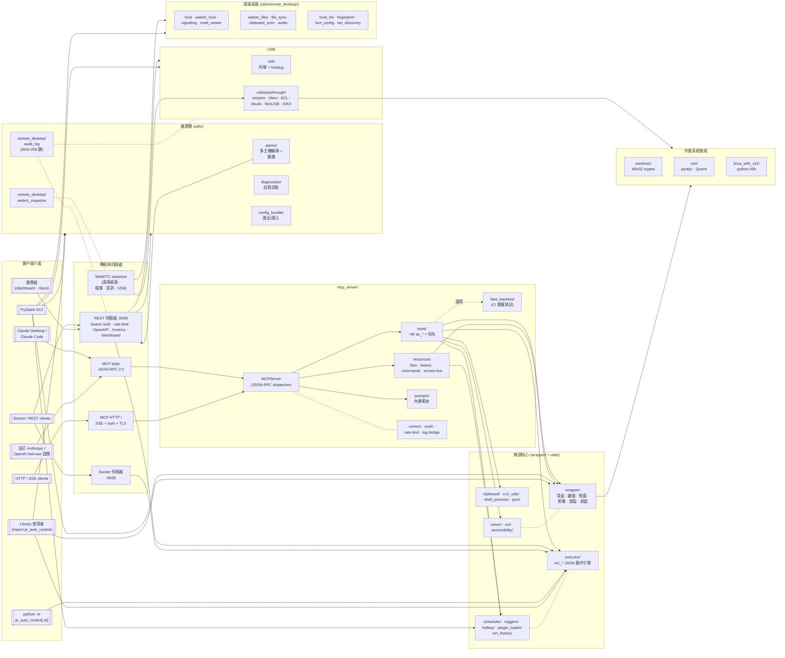

# AutoControl

[](https://pypi.org/project/je_auto_control/)
[](https://pypi.org/project/je_auto_control/)
[](../LICENSE)

**AutoControl** 是一個跨平台的 Python GUI 自動化框架，提供滑鼠控制、鍵盤輸入、圖像辨識、螢幕擷取、腳本執行與報告產生等功能 — 透過統一的 API 在 Windows、macOS 和 Linux (X11) 上運作。

**[English](../README.md)** | **[简体中文](README_zh-CN.md)**

---

## 目錄

- [功能特色](#功能特色)
- [架構](#架構)
- [安裝](#安裝)
- [系統需求](#系統需求)
- [快速開始](#快速開始)
  - [滑鼠控制](#滑鼠控制)
  - [鍵盤控制](#鍵盤控制)
  - [圖像辨識](#圖像辨識)
  - [Accessibility 元件搜尋](#accessibility-元件搜尋)
  - [AI 元件定位（VLM）](#ai-元件定位vlm)
  - [OCR 螢幕文字辨識](#ocr-螢幕文字辨識)
  - [LLM 動作規劃器](#llm-動作規劃器)
  - [執行期變數與流程控制](#執行期變數與流程控制)
  - [遠端桌面](#遠端桌面)
  - [剪貼簿](#剪貼簿)
  - [截圖](#截圖)
  - [動作錄製與回放](#動作錄製與回放)
  - [JSON 腳本執行器](#json-腳本執行器)
  - [MCP 伺服器（讓 Claude 使用 AutoControl）](#mcp-伺服器讓-claude-使用-autocontrol)
  - [排程器（Interval & Cron）](#排程器interval--cron)
  - [全域熱鍵](#全域熱鍵)
  - [事件觸發器](#事件觸發器)
  - [執行歷史](#執行歷史)
  - [報告產生](#報告產生)
  - [遠端自動化（Socket / REST）](#遠端自動化socket--rest)
  - [外掛載入器](#外掛載入器)
  - [Shell 命令執行](#shell-命令執行)
  - [螢幕錄製](#螢幕錄製)
  - [回呼執行器](#回呼執行器)
  - [套件管理器](#套件管理器)
  - [專案管理](#專案管理)
  - [視窗管理](#視窗管理)
  - [GUI 應用程式](#gui-應用程式)
- [命令列介面](#命令列介面)
- [平台支援](#平台支援)
- [開發](#開發)
- [授權條款](#授權條款)

---

## 功能特色

- **滑鼠自動化** — 移動、點擊、按下、釋放、拖曳、滾動，支援精確座標控制
- **鍵盤自動化** — 按下/釋放單一按鍵、輸入字串、組合鍵、按鍵狀態偵測
- **圖像辨識** — 使用 OpenCV 模板匹配在螢幕上定位 UI 元素，支援可設定的偵測閾值
- **Accessibility 元件搜尋** — 透過作業系統無障礙樹（Windows UIA / macOS AX）依名稱/角色定位按鈕、選單、控制項
- **AI 元件定位（VLM）** — 用自然語言描述 UI 元素，交由視覺語言模型（Anthropic / OpenAI）取得螢幕座標
- **OCR** — 使用 Tesseract 從螢幕擷取文字，可搜尋、點擊或等待文字出現；支援 regex 搜尋與整塊區域 dump
- **LLM 動作規劃器** — 用 Claude 把自然語言描述翻譯成驗證過的 `AC_*` 動作清單
- **執行期變數與流程控制** — 執行時 `${var}` 取代，加上 `AC_set_var` / `AC_inc_var` / `AC_if_var` / `AC_for_each` / `AC_loop` / `AC_retry` 讓腳本資料驅動
- **遠端桌面** — 用 token 認證的 TCP 協定串流本機畫面並接收輸入，**或** 連線到他機觀看與控制（host + viewer GUI 皆內建）。可選 TLS（HTTPS 級加密）、WebSocket 傳輸（``ws://`` + ``wss://``，穿牆／瀏覽器友善）、持久化 9 位數 Host ID、host→viewer 音訊串流、雙向剪貼簿同步（文字 + 圖片）、分塊檔案傳輸（拖放 + 進度條；任意目的路徑；無大小上限）。另含資料夾同步（增量鏡像 — 本地刪除不會傳出去）與自架 coturn TURN 設定包產生器（turnserver.conf + systemd unit + docker-compose + README）
- **剪貼簿** — 於 Windows / macOS / Linux 讀寫系統剪貼簿文字
- **截圖與螢幕錄製** — 擷取全螢幕或指定區域為圖片，錄製螢幕為影片（AVI/MP4）
- **動作錄製與回放** — 錄製滑鼠/鍵盤事件並重新播放
- **JSON 腳本執行** — 使用 JSON 動作檔案定義並執行自動化流程（支援 dry-run 與逐步除錯）
- **排程器** — 以 interval 或 cron 表示式執行腳本，interval 與 cron job 可同時存在
- **全域熱鍵** — 將 OS 熱鍵綁定到 action 腳本（目前為 Windows，macOS/Linux 保留擴充介面）
- **事件觸發器** — 偵測到影像出現、視窗出現、像素變化或檔案變動時自動執行腳本
- **執行歷史** — 以 SQLite 紀錄 scheduler / triggers / hotkeys / REST 的執行結果；錯誤時自動附上截圖
- **報告產生** — 將測試紀錄匯出為 HTML、JSON 或 XML 報告，包含成功/失敗狀態
- **MCP 伺服器** — JSON-RPC 2.0 Model Context Protocol 服務（stdio + HTTP/SSE），讓 Claude Desktop / Claude Code / 自訂 tool-use 迴圈直接驅動 AutoControl。約 90 個工具,完整協定支援(resources、prompts、sampling、roots、logging、progress、cancellation、elicitation),Bearer token 驗證 + TLS、稽核 log、rate limit、plugin 熱重載、CI fake backend
- **遠端自動化** — TCP Socket 伺服器 **加上** 強化版 REST API：bearer token 認證、per-IP 速率限制 + 失敗鎖定、SQLite 稽核 hook、Prometheus `/metrics`、完整端點清單（`/health`、`/screen_size`、`/sessions`、`/screenshot`、`/execute`、`/audit/list`、`/audit/verify`、`/inspector/recent`、`/usb/devices`、`/diagnose`、…），以及 vanilla-JS 的瀏覽器 dashboard `/dashboard`（任何能 HTTP 連到主機的手機都能監看）
- **外掛載入器** — 將定義 `AC_*` 可呼叫物的 `.py` 檔放入目錄，執行時即可註冊成 executor 指令
- **Shell 整合** — 在自動化流程中執行 Shell 命令，支援非同步輸出擷取
- **回呼執行器** — 觸發自動化函式後自動呼叫回呼函式，實現操作串接
- **動態套件載入** — 在執行時匯入外部 Python 套件，擴充執行器功能
- **專案與範本管理** — 快速建立包含 keyword/executor 目錄結構的自動化專案
- **視窗管理** — 直接將鍵盤/滑鼠事件送至指定視窗（Windows/Linux）
- **GUI 應用程式** — 內建 PySide6 圖形介面，支援即時切換語系（English / 繁體中文 / 简体中文 / 日本語）
- **CLI 執行介面** — `python -m je_auto_control.cli run|list-jobs|start-server|start-rest`
- **跨平台** — 統一 API，支援 Windows、macOS、Linux（X11）
- **多主機管理主控台** — 在一份通訊錄中註冊 N 個遠端 AutoControl REST 端點，並行輪詢 health/sessions/jobs，把同一份動作清單廣播給全部主機。儲存於 `~/.je_auto_control/admin_hosts.json`（POSIX 上模式 0600）。Token 錯誤的主機會以實際 HTTP 錯誤呈現為不健康
- **可偵測竄改的稽核紀錄** — SQLite events 表加上 SHA-256 雜湊鏈（每筆紀錄含 `prev_hash` + `row_hash`）；修改任何過去紀錄都會打斷雜湊鏈。`verify_chain()` 由上往下走訪並回報第一個斷點。既有資料表會在啟動時回填（「初次使用即信任」）
- **WebRTC 封包監測** — 由既有 WebRTC stats 輪詢餵入的程序級 `StatsSnapshot` 滾動視窗（預設 600 筆 / 1 Hz 約 10 分鐘）。對 RTT、FPS、bitrate、封包遺失、jitter 各回 `last/min/max/avg/p95`
- **USB 裝置列舉** — 唯讀的跨平台 USB 裝置列舉。優先嘗試 pyusb（libusb）；若無則退回平台特定指令（Windows `Get-PnpDevice`、macOS `system_profiler`、Linux `/sys/bus/usb/devices`）。第二階段（passthrough）刻意延後待設計審查
- **系統診斷** — 一鍵「目前正常嗎？」探測：平台、選用相依套件、executor 指令數、稽核鏈、截圖、滑鼠、硬碟空間、REST registry。CLI 全綠 exit 0／否則 1；REST `/diagnose`；依嚴重度上色的 GUI 分頁
- **USB Hotplug 事件** — 輪詢式 hotplug 監測（`UsbHotplugWatcher`），含 bounded ring buffer 與帶序號的事件；`GET /usb/events?since=N` 讓晚加入的訂閱者補上進度。USB 分頁有自動更新切換鈕。
- **OpenAPI 3.1 + Swagger UI** — `GET /openapi.json`（auth-gated，從活的路由表生成）+ `GET /docs`（瀏覽器版 Swagger UI 含 bearer token 列）。CI 上有 drift 測試，新加路由忘記寫 metadata 會被擋下。
- **設定包匯出／匯入** — 單一 JSON 檔，匯出／匯入使用者設定（admin hosts、address book、trusted viewers、known hosts、host service、IDs）。原子寫入加 `<name>.bak.<時間戳>` 備份；CLI `python -m je_auto_control.utils.config_bundle export|import`；`POST /config/{export,import}`；REST API 分頁有按鈕。
- **USB Passthrough（實驗中、需主動啟用）** — wire-level 協定走 WebRTC `usb` DataChannel（10 個 opcode、CREDIT 流量控制、16 KiB payload 上限）。Host 端 `UsbPassthroughSession` 在 Linux libusb backend 上端到端運作；Windows `WinUSB` backend 含完整 ctypes 接線（硬體未驗證）；macOS `IOKit` 為骨架。Viewer 端阻塞式 client（`UsbPassthroughClient` → `ClientHandle.control_transfer / bulk_transfer / interrupt_transfer`）。持久化 ACL（`~/.je_auto_control/usb_acl.json`，預設 deny，POSIX mode 0600），含 host 端 prompt QDialog 與可偵測竄改稽核紀錄整合。預設 off — 用 `enable_usb_passthrough(True)` 或 `JE_AUTOCONTROL_USB_PASSTHROUGH=1` 開啟。Phase 2e 外部安全審查清單已附；預設啟用前需要簽核。

---

## 架構

執行階段是分層的：**客戶端介面**(CLI、GUI、MCP/REST/Socket 伺服
器)位於最上層,底下是**無頭 API**(`wrapper/` + `utils/`),最後
解析到 `wrapper/platform_wrapper.py` 在 import 時挑選的**作業系統
後端**。套件 façade(`je_auto_control/__init__.py`)會 re-export 所
有公開名稱,使用者只需要 `import je_auto_control`,不論用哪個介面或
後端都一樣。



```
je_auto_control/
├── wrapper/                    # 平台無關 API 層
│   ├── platform_wrapper.py     # 自動偵測作業系統並載入對應後端
│   ├── auto_control_mouse.py   # 滑鼠操作
│   ├── auto_control_keyboard.py# 鍵盤操作
│   ├── auto_control_image.py   # 圖像辨識（OpenCV 模板匹配）
│   ├── auto_control_screen.py  # 截圖、螢幕大小、像素顏色
│   ├── auto_control_window.py  # 跨平台視窗管理 facade
│   └── auto_control_record.py  # 動作錄製/回放
├── windows/                    # Windows 專用後端（Win32 API / ctypes）
├── osx/                        # macOS 專用後端（pyobjc / Quartz）
├── linux_with_x11/             # Linux 專用後端（python-Xlib）
├── gui/                        # PySide6 GUI 應用程式
└── utils/
    ├── mcp_server/             # MCP 伺服器（stdio + HTTP/SSE）— server / tools / resources / prompts / audit / rate_limit / fake_backend / plugin_watcher
    ├── executor/               # JSON 動作執行引擎
    ├── callback/               # 回呼函式執行器
    ├── cv2_utils/              # OpenCV 截圖、模板匹配、影片錄製
    ├── accessibility/          # UIA (Windows) / AX (macOS) 元件搜尋
    ├── vision/                 # VLM 元件定位（Anthropic / OpenAI）
    ├── ocr/                    # Tesseract 文字定位
    ├── clipboard/              # 跨平台剪貼簿（文字 + 圖像）
    ├── llm/                    # 自然語言 → AC_* 動作規劃器
    ├── scheduler/              # Interval + cron 排程器
    ├── hotkey/                 # 全域熱鍵守護程序
    ├── triggers/               # 影像/視窗/像素/檔案 觸發器
    ├── run_history/            # SQLite 執行紀錄 + 錯誤截圖
    ├── rest_api/               # 純 stdlib HTTP/REST 伺服器 — auth · audit · rate-limit · OpenAPI · /metrics · dashboard · Swagger UI
    ├── admin/                  # 多主機 AdminConsoleClient（輪詢 + 廣播）
    ├── diagnostics/            # 系統自我診斷 + CLI
    ├── config_bundle/          # 單檔使用者設定匯出／匯入
    ├── usb/                    # 跨平台列舉、hotplug 事件、passthrough/{protocol, session, viewer client, ACL, libusb / WinUSB / IOKit}
    ├── remote_desktop/         # WebRTC host + viewer、signalling、multi-viewer、檔案／剪貼簿／音訊同步、稽核紀錄（雜湊鏈）、信任清單、TURN 設定、mDNS 發現、WebRTC stats inspector
    ├── plugin_loader/          # 動態 AC_* 外掛搜尋與註冊
    ├── socket_server/          # TCP Socket 伺服器（遠端自動化）
    ├── shell_process/          # Shell 命令管理器
    ├── generate_report/        # HTML / JSON / XML 報告產生器
    ├── test_record/            # 測試動作紀錄
    ├── script_vars/            # 腳本變數插值
    ├── watcher/                # 滑鼠 / 像素 / log 監看器（Live HUD）
    ├── recording_edit/         # 錄製內容的修剪、過濾、縮放
    ├── json/                   # JSON 動作檔案讀寫
    ├── project/                # 專案建立與範本
    ├── package_manager/        # 動態套件載入
    ├── logging/                # 日誌紀錄
    └── exception/              # 自訂例外類別
```

`platform_wrapper.py` 模組會自動偵測目前的作業系統並匯入對應的後端，因此所有 wrapper 函式在不同平台上的行為完全一致。

---

## 安裝

### 基本安裝

```bash
pip install je_auto_control
```

### 安裝 GUI 支援（PySide6）

```bash
pip install je_auto_control[gui]
```

### Linux 前置需求

在 Linux 上安裝前，請先安裝以下系統套件：

```bash
sudo apt-get install cmake libssl-dev
```

---

## 系統需求

- **Python** >= 3.10
- **pip** >= 19.3

### 相依套件

| 套件 | 用途 |
|---|---|
| `je_open_cv` | 圖像辨識（OpenCV 模板匹配） |
| `pillow` | 截圖擷取 |
| `mss` | 快速多螢幕截圖 |
| `pyobjc` | macOS 後端（在 macOS 上自動安裝） |
| `python-Xlib` | Linux X11 後端（在 Linux 上自動安裝） |
| `PySide6` | GUI 應用程式（選用，使用 `[gui]` 安裝） |
| `qt-material` | GUI 主題（選用，使用 `[gui]` 安裝） |
| `uiautomation` | Windows Accessibility 後端（選用，首次使用時載入） |
| `pytesseract` + Tesseract | OCR 文字辨識（選用，首次使用時載入） |
| `anthropic` | VLM 定位 — Anthropic 後端（選用，首次使用時載入） |
| `openai` | VLM 定位 — OpenAI 後端（選用，首次使用時載入） |

完整第三方相依套件與授權資訊請見 [Third_Party_License.md](../Third_Party_License.md)。

---

## 快速開始

### 滑鼠控制

```python
import je_auto_control

# 取得目前滑鼠位置
x, y = je_auto_control.get_mouse_position()
print(f"滑鼠位置: ({x}, {y})")

# 移動滑鼠到指定座標
je_auto_control.set_mouse_position(500, 300)

# 在目前位置左鍵點擊（使用按鍵名稱）
je_auto_control.click_mouse("mouse_left")

# 在指定座標右鍵點擊
je_auto_control.click_mouse("mouse_right", x=800, y=400)

# 向下滾動
je_auto_control.mouse_scroll(scroll_value=5)
```

### 鍵盤控制

```python
import je_auto_control

# 按下並釋放單一按鍵
je_auto_control.type_keyboard("a")

# 逐字輸入整個字串
je_auto_control.write("Hello World")

# 組合鍵（例如 Ctrl+C）
je_auto_control.hotkey(["ctrl_l", "c"])

# 檢查某個按鍵是否正在被按下
is_pressed = je_auto_control.check_key_is_press("shift_l")
```

### 圖像辨識

```python
import je_auto_control

# 在螢幕上找出所有符合的圖像
positions = je_auto_control.locate_all_image("button.png", detect_threshold=0.9)
# 回傳: [[x1, y1, x2, y2], ...]

# 找出單一圖像並取得其中心座標
cx, cy = je_auto_control.locate_image_center("icon.png", detect_threshold=0.85)
print(f"找到位置: ({cx}, {cy})")

# 找出圖像並自動點擊
je_auto_control.locate_and_click("submit_button.png", mouse_keycode="mouse_left")
```

### Accessibility 元件搜尋

透過作業系統無障礙樹依名稱/角色/App 搜尋控制項（Windows UIA，via
`uiautomation`；macOS AX）。

```python
import je_auto_control

# 列出 Calculator 中所有可見按鈕
elements = je_auto_control.list_accessibility_elements(app_name="Calculator")

# 搜尋特定元件
ok = je_auto_control.find_accessibility_element(name="OK", role="Button")
if ok is not None:
    print(ok.bounds, ok.center)

# 一步定位並點擊
je_auto_control.click_accessibility_element(name="OK", app_name="Calculator")
```

若當前平台無可用後端，會拋出 `AccessibilityNotAvailableError`。

### AI 元件定位（VLM）

當模板匹配與 Accessibility 都失效時，可用自然語言描述元件，交給視覺
語言模型取得座標。

```python
import je_auto_control

# 預設偏好 Anthropic（若有設定 ANTHROPIC_API_KEY），否則用 OpenAI
x, y = je_auto_control.locate_by_description("綠色的 Submit 按鈕")

# 一次定位並點擊
je_auto_control.click_by_description(
    "Cookie 橫幅中的『全部接受』按鈕",
    screen_region=[0, 800, 1920, 1080],   # 可選：只在此區域找
)
```

設定（僅從環境變數讀取 — 金鑰不會被寫入程式碼或日誌）：

| 變數 | 作用 |
|---|---|
| `ANTHROPIC_API_KEY` | 啟用 Anthropic 後端 |
| `OPENAI_API_KEY` | 啟用 OpenAI 後端 |
| `AUTOCONTROL_VLM_BACKEND` | 強制指定 `anthropic` 或 `openai` |
| `AUTOCONTROL_VLM_MODEL` | 覆寫預設模型（如 `claude-opus-4-7`、`gpt-4o-mini`） |

若兩個 SDK 皆未安裝或未設定 API key，會拋出 `VLMNotAvailableError`。

### OCR 螢幕文字辨識

```python
import je_auto_control as ac

# 找出所有吻合的文字位置
matches = ac.find_text_matches("Submit")

# 取得第一個吻合位置的中心座標（找不到則回傳 None）
cx, cy = ac.locate_text_center("Submit")

# 一步定位並點擊
ac.click_text("Submit")

# 等待文字出現（或 timeout）
ac.wait_for_text("載入完成", timeout=15.0)
```

若 Tesseract 不在 `PATH` 中，可手動指定路徑：

```python
ac.set_tesseract_cmd(r"C:\Program Files\Tesseract-OCR\tesseract.exe")
```

把區域（或整螢幕）內所有辨識到的文字 dump 出來，或用 regex 搜尋變動內容：

```python
import je_auto_control as ac

# TextMatch 列表，含文字、邊界框、信心度
for match in ac.read_text_in_region(region=[0, 0, 800, 600]):
    print(match.text, match.center, match.confidence)

# Regex（接受字串或 compiled re.Pattern）
for match in ac.find_text_regex(r"Order#\d+"):
    print(match.text, match.center)
```

GUI：**OCR Reader** 分頁。

### LLM 動作規劃器

把自然語言描述交給 LLM（預設 Anthropic Claude），翻譯成驗證過的 `AC_*` 動作清單。輸出採寬鬆解析（會剝 code fence、從散文中抽出第一個 JSON array），再用 executor 同樣的 schema 驗證，所以結果可以直接餵給 `execute_action`：

```python
import je_auto_control as ac
from je_auto_control.utils.executor.action_executor import executor

actions = ac.plan_actions(
    "點擊 Submit 按鈕，然後輸入 'done' 並儲存",
    known_commands=executor.known_commands(),
)
executor.execute_action(actions)

# 或者一行做完：
ac.run_from_description("開記事本，輸入 hello", executor=executor)
```

| 變數 | 效果 |
|---|---|
| `ANTHROPIC_API_KEY` | 啟用 Anthropic 後端 |
| `AUTOCONTROL_LLM_BACKEND` | 強制指定 `anthropic` |
| `AUTOCONTROL_LLM_MODEL` | 覆寫預設模型（如 `claude-opus-4-7`） |

GUI：**LLM Planner** 分頁 — 描述輸入框、`QThread` 背景執行的 *Plan* 按鈕、預覽指令清單，以及 *Run plan* 按鈕。

### 執行期變數與流程控制

executor 改成「每次呼叫」才解析 `${var}` placeholder（不會事先攤平），所以巢狀的 `body` / `then` / `else` 清單會保留 placeholder，每次重複執行時重新繫結。搭配新的變數修改指令，腳本可以資料驅動而不需要 Python 黏合：

```json
[
    ["AC_set_var", {"name": "items", "value": ["alpha", "beta"]}],
    ["AC_set_var", {"name": "i", "value": 0}],
    ["AC_for_each", {
        "items": "${items}", "as": "name",
        "body": [
            ["AC_inc_var", {"name": "i"}],
            ["AC_if_var", {
                "name": "i", "op": "ge", "value": 2,
                "then": [["AC_break"]], "else": []
            }]
        ]
    }]
]
```

`AC_if_var` 比較運算子：`eq`、`ne`、`lt`、`le`、`gt`、`ge`、`contains`、`startswith`、`endswith`。GUI：**Variables** 分頁 — 即時檢視 `executor.variables`，可單筆設定、JSON 整批 seed、清空。

### 遠端桌面

把本機畫面串流給別人看／控制，**或** 觀看並控制別人的機器。協定是 raw TCP 上的長度前綴框架（沒有額外相依），先做一輪 HMAC-SHA256 challenge / response 認證；認證失敗的 viewer 在看到任何畫面前就被踢掉。JPEG frame 依設定的 FPS / 品質產生，透過共享 latest-frame slot 廣播給通過認證的 viewers，慢的 viewer 只會掉 frame 而不會卡其他人。Viewer 輸入訊息是 JSON，host 端用允許清單驗證後才透過既有 wrapper 派送。

```python
# 被遠端 — 啟動 host 把 token + port 給對方
from je_auto_control import RemoteDesktopHost
host = RemoteDesktopHost(token="hunter2", bind="127.0.0.1",
                          port=0, fps=10, quality=70)
host.start()
print("listening on", host.port, "viewers:", host.connected_clients)
```

```python
# 控制他機 — 連線 viewer 並送出輸入
from je_auto_control import RemoteDesktopViewer
viewer = RemoteDesktopViewer(host="10.0.0.5", port=51234, token="hunter2",
                              on_frame=lambda jpeg: ...)
viewer.connect()
viewer.send_input({"action": "mouse_move", "x": 100, "y": 200})
viewer.send_input({"action": "type", "text": "hello"})
viewer.disconnect()
```

GUI：**Remote Desktop** 分頁，內含兩個子分頁。

- **Host**（被遠端的本機）— Token 欄位附 *產生* 按鈕、bind 位址安全提示、啟動／停止控制、即時刷新的 port + viewer 數量狀態列，以及 4fps 預覽面板讓被遠端的人看到 viewer 看到的畫面。
- **Viewer**（控制他機）— 位址 / port / token 表單、*連線* / *中斷連線*，自繪 frame display widget，會把 JPEG 等比縮放繪入。display 上的滑鼠 / 滾輪 / 鍵盤事件會用最新 frame 的尺寸映射回原始遠端螢幕的像素座標，再用 `INPUT` 訊息送回。

> ⚠️ 取得 host:port 與 token 的人，等同擁有本機完整滑鼠 / 鍵盤控制權。預設只綁 `127.0.0.1`；要對外暴露請務必搭配 SSH tunnel 或 TLS 前端。Token 是唯一防線 — 請當作密碼來保管。

**加密傳輸與替代協定**：傳 `ssl_context` 給 `RemoteDesktopHost` 或 `RemoteDesktopViewer` 即套上 TLS。要穿牆／給瀏覽器接，用內建的 WebSocket 版本（無額外相依），加 `ssl_context` 就變 `wss://`：

```python
from je_auto_control import (
    WebSocketDesktopHost, WebSocketDesktopViewer,
)
host = WebSocketDesktopHost(token="hunter2", ssl_context=server_ctx)
viewer = WebSocketDesktopViewer(
    host="example.com", port=443, token="hunter2",
    ssl_context=client_ctx, expected_host_id="123456789",
)
```

**持久化 Host ID**：每台 host 有穩定的 9 位數字 ID（存在 `~/.je_auto_control/remote_host_id`），在 `AUTH_OK` 中宣告，viewer 透過 `expected_host_id` 驗證：

```python
print(host.host_id)            # 例如 "123456789"
viewer = RemoteDesktopViewer(
    host=..., port=..., token=...,
    expected_host_id="123456789",   # 不一致就拋 AuthenticationError
)
```

**音訊串流（host → viewer）**：選用 `sounddevice` 相依；host 用 `AudioCaptureConfig` 開啟，viewer 端接 `AudioPlayer`（或自己的 callback）：

```python
from je_auto_control.utils.remote_desktop import AudioCaptureConfig
host = RemoteDesktopHost(
    token="tok",
    audio_config=AudioCaptureConfig(enabled=True),    # 預設 mic
)
# 或指定 loopback / monitor 裝置：
# audio_config=AudioCaptureConfig(enabled=True, device=12)

from je_auto_control.utils.remote_desktop import AudioPlayer
player = AudioPlayer(); player.start()
viewer = RemoteDesktopViewer(host=..., on_audio=player.play)
```

**剪貼簿同步（文字 + 圖片，雙向）**：明確呼叫，沒有自動 polling 迴圈。圖片剪貼簿在 Windows（CF_DIB via ctypes）跟 Linux（`xclip -t image/png`）支援；macOS get 走 Pillow ImageGrab、set 暫時需要 PyObjC。

```python
viewer.send_clipboard_text("hello")
viewer.send_clipboard_image(open("logo.png", "rb").read())
host.broadcast_clipboard_text("greetings")
```

**檔案傳輸 + 進度**：雙向、分塊、目的路徑任意、無大小上限；GUI viewer 還可以拖放：

```python
viewer.send_file(
    "local.bin", "/tmp/uploaded.bin",
    on_progress=lambda tid, done, total: print(done, total),
)
host.send_file_to_viewers("local.bin", "/tmp/from_host.bin")
```

> ⚠️ 路徑無限制、大小無上限。任何拿到 token 的人都能把任意檔案寫到任意位置，也能塞滿磁碟 — 必須等同信任 token 持有者，或自己繼承 `FileReceiver` 在 `handle_begin` 內驗證 dest_path。

### 剪貼簿

```python
import je_auto_control as ac
ac.set_clipboard("hello")
text = ac.get_clipboard()
```

後端：Windows（Win32 + ctypes）、macOS（`pbcopy`/`pbpaste`）、Linux
（`xclip` 或 `xsel`）。

### 截圖

```python
import je_auto_control

# 擷取全螢幕截圖並儲存
je_auto_control.pil_screenshot("screenshot.png")

# 擷取指定區域的截圖 [x1, y1, x2, y2]
je_auto_control.pil_screenshot("region.png", screen_region=[100, 100, 500, 400])

# 取得螢幕解析度
width, height = je_auto_control.screen_size()

# 取得指定座標的像素顏色
color = je_auto_control.get_pixel(500, 300)
```

### 動作錄製與回放

```python
import je_auto_control
import time

# 開始錄製滑鼠和鍵盤事件
je_auto_control.record()

time.sleep(10)  # 錄製 10 秒

# 停止錄製並取得動作列表
actions = je_auto_control.stop_record()

# 重新播放錄製的動作
je_auto_control.execute_action(actions)
```

### JSON 腳本執行器

建立 JSON 動作檔案（`actions.json`）：

```json
[
    ["AC_set_mouse_position", {"x": 500, "y": 300}],
    ["AC_click_mouse", {"mouse_keycode": "mouse_left"}],
    ["AC_write", {"write_string": "Hello from AutoControl"}],
    ["AC_screenshot", {"file_path": "result.png"}],
    ["AC_hotkey", {"key_code_list": ["ctrl_l", "s"]}]
]
```

執行方式：

```python
import je_auto_control

# 從檔案執行
je_auto_control.execute_action(je_auto_control.read_action_json("actions.json"))

# 或直接從列表執行
je_auto_control.execute_action([
    ["AC_set_mouse_position", {"x": 100, "y": 200}],
    ["AC_click_mouse", {"mouse_keycode": "mouse_left"}]
])
```

**可用的動作命令：**

| 類別 | 命令 |
|---|---|
| 滑鼠 | `AC_click_mouse`, `AC_set_mouse_position`, `AC_get_mouse_position`, `AC_get_mouse_table`, `AC_press_mouse`, `AC_release_mouse`, `AC_mouse_scroll`, `AC_mouse_left`, `AC_mouse_right`, `AC_mouse_middle` |
| 鍵盤 | `AC_type_keyboard`, `AC_press_keyboard_key`, `AC_release_keyboard_key`, `AC_write`, `AC_hotkey`, `AC_check_key_is_press`, `AC_get_keyboard_keys_table` |
| 圖像 | `AC_locate_all_image`, `AC_locate_image_center`, `AC_locate_and_click` |
| 螢幕 | `AC_screen_size`, `AC_screenshot` |
| Accessibility | `AC_a11y_list`, `AC_a11y_find`, `AC_a11y_click` |
| VLM（AI 定位） | `AC_vlm_locate`, `AC_vlm_click` |
| OCR | `AC_locate_text`, `AC_click_text`, `AC_wait_text`, `AC_read_text_in_region`, `AC_find_text_regex` |
| LLM 規劃器 | `AC_llm_plan`, `AC_llm_run` |
| 剪貼簿 | `AC_clipboard_get`, `AC_clipboard_set` |
| 視窗 | `AC_list_windows`, `AC_focus_window`, `AC_wait_window`, `AC_close_window` |
| 流程控制 | `AC_loop`, `AC_break`, `AC_continue`, `AC_if_image_found`, `AC_if_pixel`, `AC_if_var`, `AC_while_image`, `AC_for_each`, `AC_wait_image`, `AC_wait_pixel`, `AC_sleep`, `AC_retry` |
| 變數 | `AC_set_var`, `AC_get_var`, `AC_inc_var` |
| 遠端桌面 | `AC_start_remote_host`, `AC_stop_remote_host`, `AC_remote_host_status`, `AC_remote_connect`, `AC_remote_disconnect`, `AC_remote_viewer_status`, `AC_remote_send_input` |
| 錄製 | `AC_record`, `AC_stop_record`, `AC_set_record_enable` |
| 報告 | `AC_generate_html`, `AC_generate_json`, `AC_generate_xml`, `AC_generate_html_report`, `AC_generate_json_report`, `AC_generate_xml_report` |
| 執行紀錄 | `AC_history_list`, `AC_history_clear` |
| 專案 | `AC_create_project` |
| Shell | `AC_shell_command` |
| 程序 | `AC_execute_process` |
| 執行器 | `AC_execute_action`, `AC_execute_files`, `AC_add_package_to_executor`, `AC_add_package_to_callback_executor` |
| MCP 伺服器 | `AC_start_mcp_server`, `AC_start_mcp_http_server` |

### MCP 伺服器（讓 Claude 使用 AutoControl）

把 AutoControl 包裝成 Model Context Protocol 服務,任何支援 MCP 的
client(Claude Desktop、Claude Code、自訂 Anthropic / OpenAI tool-use
迴圈)都能驅動本機桌面。純 stdlib — JSON-RPC 2.0 走 stdio 或 HTTP+
SSE。

**註冊到 Claude Code:**

```bash
claude mcp add autocontrol -- python -m je_auto_control.utils.mcp_server
```

**註冊到 Claude Desktop**(`claude_desktop_config.json`):

```json
{
  "mcpServers": {
    "autocontrol": {
      "command": "python",
      "args": ["-m", "je_auto_control.utils.mcp_server"]
    }
  }
}
```

**程式啟動:**

```python
import je_auto_control as ac

# Stdio(會阻塞直到 stdin 關閉)
ac.start_mcp_stdio_server()

# 或 HTTP / SSE,含 Bearer token 驗證 + 可選 TLS
ac.start_mcp_http_server(host="127.0.0.1", port=9940,
                         auth_token="hunter2")
```

**不啟動伺服器、只看目錄:**

```bash
je_auto_control_mcp --list-tools
je_auto_control_mcp --list-tools --read-only
je_auto_control_mcp --list-resources
je_auto_control_mcp --list-prompts
```

**功能總覽:**

| 面向 | 涵蓋 |
|---|---|
| 工具(約 90 個) | 滑鼠 · 鍵盤 · drag · 螢幕 / 多螢幕 · 截圖回 image · diff · OCR · 影像 · 視窗(move/min/max/restore/...) · 剪貼簿文字+圖像 · 程序 / shell · 動作錄製 · 螢幕錄影 · scheduler / triggers / hotkeys · accessibility tree · VLM · executor · history |
| 別名 | `click`、`type`、`screenshot`、`find_image`、`drag`、`shell`、`wait_image`...,以 `JE_AUTOCONTROL_MCP_ALIASES=0` 關閉 |
| Resources | `autocontrol://files/<name>`、`autocontrol://history`、`autocontrol://commands`、`autocontrol://screen/live`(支援 `resources/subscribe`)|
| Prompts | `automate_ui_task`、`record_and_generalize`、`compare_screenshots`、`find_widget`、`explain_action_file` |
| 協定 | tools / resources / prompts / sampling / roots / logging / progress / cancellation / list_changed / elicitation |
| 傳輸 | stdio、HTTP `POST /mcp`、`Accept: text/event-stream` 時走 SSE 串流 |
| 安全 | 工具註記 · `JE_AUTOCONTROL_MCP_READONLY` · `JE_AUTOCONTROL_MCP_CONFIRM_DESTRUCTIVE` · 稽核 log · token-bucket rate limiter · 工具失敗自動截圖 |
| 部署 | Bearer token 驗證 · 透過 `ssl_context` 啟用 TLS · `PluginWatcher` 熱重載 · `JE_AUTOCONTROL_FAKE_BACKEND=1` 給 CI |

完整參考請見 [docs/source/Zh/doc/mcp_server/mcp_server_doc.rst](docs/source/Zh/doc/mcp_server/mcp_server_doc.rst)
(英文版本在 [docs/source/Eng/doc/mcp_server/mcp_server_doc.rst](docs/source/Eng/doc/mcp_server/mcp_server_doc.rst))。

> ⚠️ MCP 伺服器可以移動滑鼠、送鍵盤事件、截圖、執行任意 `AC_*` 動
> 作。請只註冊給可信任的 client。HTTP 預設綁 `127.0.0.1`,要對外
> 必須要有明確理由,**並且**搭配 `auth_token` 與 `ssl_context`。

### 排程器（Interval & Cron）

```python
import je_auto_control as ac

# Interval：每 30 秒執行一次
job = ac.default_scheduler.add_job(
    script_path="scripts/poll.json", interval_seconds=30, repeat=True,
)

# Cron：週一到週五 09:00（欄位為 minute hour dom month dow）
cron_job = ac.default_scheduler.add_cron_job(
    script_path="scripts/daily.json", cron_expression="0 9 * * 1-5",
)

ac.default_scheduler.start()
```

兩種排程可同時存在，可由 `job.is_cron` 判斷類型。

### 全域熱鍵

將 OS 熱鍵綁定到 action JSON 腳本（Windows 後端；macOS / Linux 的
`start()` 目前會拋出 `NotImplementedError`，介面已依 Strategy pattern
預留）。

```python
from je_auto_control import default_hotkey_daemon

default_hotkey_daemon.bind("ctrl+alt+1", "scripts/greet.json")
default_hotkey_daemon.start()
```

### 事件觸發器

輪詢式觸發器，偵測到條件成立時自動執行腳本：

```python
from je_auto_control import (
    default_trigger_engine, ImageAppearsTrigger,
    WindowAppearsTrigger, PixelColorTrigger, FilePathTrigger,
)

default_trigger_engine.add(ImageAppearsTrigger(
    trigger_id="", script_path="scripts/click_ok.json",
    image_path="templates/ok_button.png", threshold=0.85, repeat=True,
))
default_trigger_engine.start()
```

### 執行歷史

排程器、觸發器、熱鍵、REST API 與 GUI 手動回放的每一次執行都會被寫入
`~/.je_auto_control/history.db`。錯誤時會自動在
`~/.je_auto_control/artifacts/run_{id}_{ms}.png` 附上截圖以便除錯。

```python
from je_auto_control import default_history_store

for run in default_history_store.list_runs(limit=20):
    print(run.id, run.source, run.status, run.artifact_path)
```

GUI **執行歷史** 分頁提供篩選 / 更新 / 清除功能，並可雙擊截圖欄位開啟
附件。

### 報告產生

```python
import je_auto_control

# 先啟用測試紀錄
je_auto_control.test_record_instance.set_record_enable(True)

# ... 執行自動化動作 ...
je_auto_control.set_mouse_position(100, 200)
je_auto_control.click_mouse("mouse_left")

# 產生報告
je_auto_control.generate_html_report("test_report")   # -> test_report.html
je_auto_control.generate_json_report("test_report")   # -> test_report.json
je_auto_control.generate_xml_report("test_report")    # -> test_report.xml

# 或取得報告內容為字串
html_string = je_auto_control.generate_html()
json_string = je_auto_control.generate_json()
xml_string = je_auto_control.generate_xml()
```

報告內容包含：每個紀錄動作的函式名稱、參數、時間戳記及例外資訊（如有）。HTML 報告中成功的動作以青色顯示，失敗的動作以紅色顯示。

### 遠端自動化（Socket / REST）

提供兩種伺服器：原始 TCP socket 與純 stdlib HTTP/REST。預設均綁定
`127.0.0.1`，綁定到 `0.0.0.0` 須明確指定。

```python
import je_auto_control as ac

# TCP Socket 伺服器（預設：127.0.0.1:9938）
ac.start_autocontrol_socket_server(host="127.0.0.1", port=9938)

# REST API 伺服器（預設：127.0.0.1:9939）
ac.start_rest_api_server(host="127.0.0.1", port=9939)
# 端點：
#   GET  /health           存活檢查
#   GET  /jobs             列出排程工作
#   POST /execute          body: {"actions": [...]}
```

### 外掛載入器

將定義頂層 `AC_*` 可呼叫物的 `.py` 檔放進一個目錄，執行時即可註冊成
executor 指令：

```python
from je_auto_control import (
    load_plugin_directory, register_plugin_commands,
)

commands = load_plugin_directory("./my_plugins")
register_plugin_commands(commands)

# 之後任何 JSON 腳本都能使用：
# [["AC_greet", {"name": "world"}]]
```

> **警告：** 外掛檔案會直接執行任意 Python，請僅載入自己信任的目錄。

### Shell 命令執行

```python
import je_auto_control

# 使用預設的 Shell 管理器
je_auto_control.default_shell_manager.exec_shell("echo Hello")
je_auto_control.default_shell_manager.pull_text()  # 輸出擷取的結果

# 或建立自訂的 ShellManager
shell = je_auto_control.ShellManager(shell_encoding="utf-8")
shell.exec_shell("ls -la")
shell.pull_text()
shell.exit_program()
```

### 螢幕錄製

```python
import je_auto_control
import time

# 方法一：ScreenRecorder（管理多個錄影）
recorder = je_auto_control.ScreenRecorder()
recorder.start_new_record(
    recorder_name="my_recording",
    path_and_filename="output.avi",
    codec="XVID",
    frame_per_sec=30,
    resolution=(1920, 1080)
)
time.sleep(10)
recorder.stop_record("my_recording")

# 方法二：RecordingThread（簡易單一錄影，輸出 MP4）
recording = je_auto_control.RecordingThread(video_name="my_video", fps=20)
recording.start()
time.sleep(10)
recording.stop()
```

### 回呼執行器

執行自動化函式後自動觸發回呼函式：

```python
import je_auto_control

def my_callback():
    print("動作完成！")

# 執行 set_mouse_position 後呼叫 my_callback
je_auto_control.callback_executor.callback_function(
    trigger_function_name="AC_set_mouse_position",
    callback_function=my_callback,
    x=500, y=300
)

# 帶有參數的回呼
def on_done(message):
    print(f"完成: {message}")

je_auto_control.callback_executor.callback_function(
    trigger_function_name="AC_click_mouse",
    callback_function=on_done,
    callback_function_param={"message": "點擊完成"},
    callback_param_method="kwargs",
    mouse_keycode="mouse_left"
)
```

### 套件管理器

在執行時動態載入外部 Python 套件到執行器中：

```python
import je_auto_control

# 將套件的所有函式/類別加入執行器
je_auto_control.package_manager.add_package_to_executor("os")

# 現在可以在 JSON 動作腳本中使用 os 函式：
# ["os_getcwd", {}]
# ["os_listdir", {"path": "."}]
```

### 專案管理

快速建立包含範本檔案的專案目錄結構：

```python
import je_auto_control

# 建立專案結構
je_auto_control.create_project_dir(project_path="./my_project", parent_name="AutoControl")

# 會建立以下結構：
# my_project/
# └── AutoControl/
#     ├── keyword/
#     │   ├── keyword1.json        # 範本動作檔案
#     │   ├── keyword2.json        # 範本動作檔案
#     │   └── bad_keyword_1.json   # 錯誤處理範本
#     └── executor/
#         ├── executor_one_file.py  # 執行單一檔案範例
#         ├── executor_folder.py    # 執行資料夾範例
#         └── executor_bad_file.py  # 錯誤處理範例
```

### 視窗管理

直接將事件送至指定視窗（僅限 Windows 和 Linux）：

```python
import je_auto_control

# 透過視窗標題送出鍵盤事件
je_auto_control.send_key_event_to_window("Notepad", keycode="a")

# 透過視窗 handle 送出滑鼠事件
je_auto_control.send_mouse_event_to_window(window_handle, mouse_keycode="mouse_left", x=100, y=50)
```

### GUI 應用程式

啟動內建圖形介面（需安裝 `[gui]` 擴充）：

```python
import je_auto_control
je_auto_control.start_autocontrol_gui()
```

或透過命令列：

```bash
python -m je_auto_control
```

---

## 命令列介面

AutoControl 可直接從命令列使用：

```bash
# 執行單一動作檔案
python -m je_auto_control -e actions.json

# 執行目錄中所有動作檔案
python -m je_auto_control -d ./action_files/

# 直接執行 JSON 字串
python -m je_auto_control --execute_str '[["AC_screenshot", {"file_path": "test.png"}]]'

# 建立專案範本
python -m je_auto_control -c ./my_project
```

另外還有以 headless API 為基礎的子命令 CLI：

```bash
# 執行腳本（可帶變數或 dry-run）
python -m je_auto_control.cli run script.json
python -m je_auto_control.cli run script.json --var name=alice --dry-run

# 列出排程工作
python -m je_auto_control.cli list-jobs

# 啟動 Socket / REST 伺服器
python -m je_auto_control.cli start-server --port 9938
python -m je_auto_control.cli start-rest   --port 9939
```

`--var name=value` 會優先以 JSON 解析（`count=10` 會變成 int），失敗
則視為字串。

---

## 平台支援

| 平台 | 狀態 | 後端 | 備註 |
|---|---|---|---|
| Windows 10 / 11 | 支援 | Win32 API (ctypes) | 完整功能支援 |
| macOS 10.15+ | 支援 | pyobjc / Quartz | 不支援動作錄製；不支援 `send_key_event_to_window` / `send_mouse_event_to_window` |
| Linux（X11） | 支援 | python-Xlib | 完整功能支援 |
| Linux（Wayland） | 尚未支援 | — | 未來版本可能加入支援 |
| Raspberry Pi 3B / 4B | 支援 | python-Xlib | 在 X11 上運行 |

---

## 開發

### 環境設定

```bash
git clone https://github.com/Intergration-Automation-Testing/AutoControl.git
cd AutoControl
pip install -r dev_requirements.txt
```

### 執行測試

```bash
# 單元測試
python -m pytest test/unit_test/

# 整合測試
python -m pytest test/integrated_test/
```

### 專案連結

- **首頁**: https://github.com/Intergration-Automation-Testing/AutoControl
- **文件**: https://autocontrol.readthedocs.io/en/latest/
- **PyPI**: https://pypi.org/project/je_auto_control/

---

## 授權條款

[MIT License](../LICENSE) © JE-Chen。
第三方相依套件之授權請見
[Third_Party_License.md](../Third_Party_License.md)。
