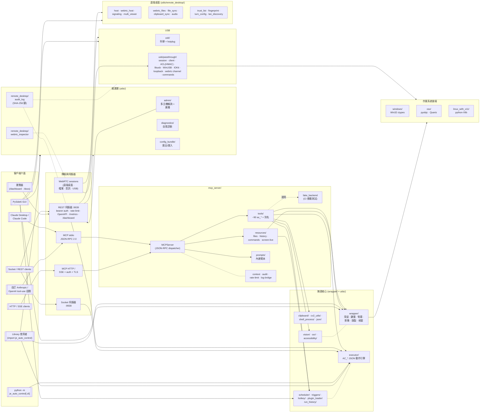

# AutoControl

[](https://pypi.org/project/je_auto_control/)
[](https://pypi.org/project/je_auto_control/)
[](../LICENSE)

**AutoControl** 是一個跨平台的 Python GUI 自動化框架，提供滑鼠控制、鍵盤輸入、圖像辨識、螢幕擷取、腳本執行與報告產生等功能 — 透過統一的 API 在 Windows、macOS 和 Linux (X11) 上運作。

**[English](../README.md)** | **[简体中文](README_zh-CN.md)**

---

## 目錄

- [本次更新 (2026-06-21) — 分布漂移偵測](#本次更新-2026-06-21--分布漂移偵測)
- [本次更新 (2026-06-21) — 分層設定解析器](#本次更新-2026-06-21--分層設定解析器)
- [本次更新 (2026-06-21) — Server-Sent Events (SSE) 用戶端解析器](#本次更新-2026-06-21--server-sent-events-sse-用戶端解析器)
- [本次更新 (2026-06-21) — Dotenv (.env) 解析](#本次更新-2026-06-21--dotenv-env-解析)
- [本次更新 (2026-06-21) — RFC 9457 Problem Details 解析](#本次更新-2026-06-21--rfc-9457-problem-details-解析)
- [本次更新 (2026-06-21) — 資料剖析與結構推斷](#本次更新-2026-06-21--資料剖析與結構推斷)
- [本次更新 (2026-06-21) — W3C Trace Context 傳播](#本次更新-2026-06-21--w3c-trace-context-傳播)
- [本次更新 (2026-06-21) — HTTP 錄製與重播卡帶](#本次更新-2026-06-21--http-錄製與重播卡帶)
- [本次更新 (2026-06-21) — 隔艙與速率限制標頭](#本次更新-2026-06-21--隔艙與速率限制標頭)
- [本次更新 (2026-06-21) — 串流延遲百分位](#本次更新-2026-06-21--串流延遲百分位)
- [本次更新 (2026-06-21) — 服務等級目標(SLO)](#本次更新-2026-06-21--服務等級目標slo)
- [本次更新 (2026-06-21) — 混沌實驗](#本次更新-2026-06-21--混沌實驗)
- [本次更新 (2026-06-21) — JSON 合約與快照比對](#本次更新-2026-06-21--json-合約與快照比對)
- [本次更新 (2026-06-21) — SLSA 建置來源證明](#本次更新-2026-06-21--slsa-建置來源證明)
- [本次更新 (2026-06-21) — 功能旗標](#本次更新-2026-06-21--功能旗標)
- [本次更新 (2026-06-21) — 文字 Diff、套用與三方合併](#本次更新-2026-06-21--文字-diff套用與三方合併)
- [本次更新 (2026-06-21) — 行事曆週期規則(RRULE)](#本次更新-2026-06-21--行事曆週期規則rrule)
- [本次更新 (2026-06-21) — 統計與 A/B 顯著性](#本次更新-2026-06-21--統計與-ab-顯著性)
- [本次更新 (2026-06-21) — 全文搜尋(BM25)](#本次更新-2026-06-21--全文搜尋bm25)
- [本次更新 (2026-06-21) — JSON Pointer、Patch 與 Merge Patch](#本次更新-2026-06-21--json-pointerpatch-與-merge-patch)
- [本次更新 (2026-06-21) — 用戶端速率限制](#本次更新-2026-06-21--用戶端速率限制)
- [本次更新 (2026-06-21) — JSON Web Token(JWT)](#本次更新-2026-06-21--json-web-tokenjwt)
- [本次更新 (2026-06-21) — 授權政策閘門](#本次更新-2026-06-21--授權政策閘門)
- [本次更新 (2026-06-21) — OpenVEX 漏洞分級](#本次更新-2026-06-21--openvex-漏洞分級)
- [本次更新 (2026-06-21) — 相依套件漏洞掃描(OSV)](#本次更新-2026-06-21--相依套件漏洞掃描osv)
- [本次更新 (2026-06-21) — JSON Schema 驗證](#本次更新-2026-06-21--json-schema-驗證)
- [本次更新 (2026-06-20) — SARIF 2.1.0 發現項目匯出](#本次更新-2026-06-20--sarif-210-發現項目匯出)
- [本次更新 (2026-06-20) — 文字 PII 偵測與遮蔽](#本次更新-2026-06-20--文字-pii-偵測與遮蔽)
- [本次更新 (2026-06-20) — 自我修復定位器回寫](#本次更新-2026-06-20--自我修復定位器回寫)
- [本次更新 (2026-06-20) — DMN 式決策表](#本次更新-2026-06-20--dmn-式決策表)
- [本次更新 (2026-06-20) — Saga / 補償回溯](#本次更新-2026-06-20--saga--補償回溯)
- [本次更新 (2026-06-20) — JSONPath 查詢](#本次更新-2026-06-20--jsonpath-查詢)
- [本次更新 (2026-06-20) — 多通道 Webhook 通知](#本次更新-2026-06-20--多通道-webhook-通知)
- [本次更新 (2026-06-20) — 對外 CloudEvents 發送器](#本次更新-2026-06-20--對外-cloudevents-發送器)
- [本次更新 (2026-06-20) — 環境範圍的具型別資產儲存](#本次更新-2026-06-20--環境範圍的具型別資產儲存)
- [本次更新 (2026-06-20) — 任務 / 流程探勘(自動化候選發現)](#本次更新-2026-06-20--任務--流程探勘自動化候選發現)
- [本次更新 (2026-06-20) — 卡迴圈守衛(Agent Loop 進度偵測)](#本次更新-2026-06-20--卡迴圈守衛agent-loop-進度偵測)
- [本次更新 (2026-06-20) — 座標空間對映(模型網格 ⇄ 實體像素)](#本次更新-2026-06-20--座標空間對映模型網格--實體像素)
- [本次更新 (2026-06-20) — 語音指令路由器](#本次更新-2026-06-20--語音指令路由器)
- [本次更新 (2026-06-20) — 區域設定感知的數字、貨幣與日期解析](#本次更新-2026-06-20--區域設定感知的數字貨幣與日期解析)
- [本次更新 (2026-06-20) — 感知雜湊影像去重](#本次更新-2026-06-20--感知雜湊影像去重)
- [本次更新 (2026-06-20) — S3 相容成品儲存](#本次更新-2026-06-20--s3-相容成品儲存)
- [本次更新 (2026-06-20) — 模糊字串比對與去重](#本次更新-2026-06-20--模糊字串比對與去重)
- [本次更新 (2026-06-19) — 影片步驟疊加報告](#本次更新-2026-06-19--影片步驟疊加報告)
- [本次更新 (2026-06-19) — Agent 可觀測性(GenAI OpenTelemetry Spans)](#本次更新-2026-06-19--agent-可觀測性genai-opentelemetry-spans)
- [本次更新 (2026-06-19) — 合規控制報告(SOC2 / ISO 27001)](#本次更新-2026-06-19--合規控制報告soc2--iso-27001)
- [本次更新 (2026-06-19) — Agent 軌跡評估](#本次更新-2026-06-19--agent-軌跡評估)
- [本次更新 (2026-06-19) — 核准式測試(Golden-Master 基準)](#本次更新-2026-06-19--核准式測試golden-master-基準)
- [本次更新 (2026-06-19) — 網路出口允許清單守衛](#本次更新-2026-06-19--網路出口允許清單守衛)
- [本次更新 (2026-06-19) — 即時憑證租約](#本次更新-2026-06-19--即時憑證租約)
- [本次更新 (2026-06-19) — Maker-Checker 審批閘門](#本次更新-2026-06-19--maker-checker-審批閘門)
- [本次更新 (2026-06-19) — Plugin SDK](#本次更新-2026-06-19--plugin-sdk)
- [本次更新 (2026-06-19) — MCP 結構化輸出](#本次更新-2026-06-19--mcp-結構化輸出)
- [本次更新 (2026-06-19) — 緩動拖曳](#本次更新-2026-06-19--緩動拖曳)
- [本次更新 (2026-06-19) — 流程文件(SOP)產生器](#本次更新-2026-06-19--流程文件sop產生器)
- [本次更新 (2026-06-19) — 修復分析與機密掃描](#本次更新-2026-06-19--修復分析與機密掃描)
- [本次更新 (2026-06-19) — CI 註解與剪貼簿歷史](#本次更新-2026-06-19--ci-註解與剪貼簿歷史)
- [本次更新 (2026-06-19) — 韌性原語](#本次更新-2026-06-19--韌性原語)
- [本次更新 (2026-06-19) — 計時輸入巨集](#本次更新-2026-06-19--計時輸入巨集)
- [本次更新 (2026-06-19) — 語意螢幕狀態](#本次更新-2026-06-19--語意螢幕狀態)
- [本次更新 (2026-06-19) — Set-of-Marks 疊圖](#本次更新-2026-06-19--set-of-marks-疊圖)
- [本次更新 (2026-06-19) — 檢查點與續跑](#本次更新-2026-06-19--檢查點與續跑)
- [本次更新 (2026-06-19) — i18n / l10n 測試](#本次更新-2026-06-19--i18n--l10n-測試)
- [本次更新 (2026-06-19) — 資料品質](#本次更新-2026-06-19--資料品質)
- [本次更新 (2026-06-19) — SBOM 與測試分片](#本次更新-2026-06-19--sbom-與測試分片)
- [本次更新 (2026-06-19) — 反應式觀察器](#本次更新-2026-06-19--反應式觀察器)
- [本次更新 (2026-06-19) — WCAG 2.2 稽核](#本次更新-2026-06-19--wcag-22-稽核)
- [本次更新 (2026-06-19) — 記憶與決定性](#本次更新-2026-06-19--記憶與決定性)
- [本次更新 (2026-06-19) — Office 讀寫](#本次更新-2026-06-19--office-讀寫)
- [本次更新 (2026-06-19) — Agent 工具組](#本次更新-2026-06-19--agent-工具組)
- [本次更新 (2026-06-19) — 編寫與除錯](#本次更新-2026-06-19--編寫與除錯)
- [本次更新 (2026-06-19) — 測試與工具三件套](#本次更新-2026-06-19--測試與工具三件套)
- [本次更新 (2026-06-19) — 交易式工作佇列](#本次更新-2026-06-19--交易式工作佇列)
- [本次更新 (2026-06-19) — 無人值守可靠性](#本次更新-2026-06-19--無人值守可靠性)
- [本次更新 (2026-06-19) — 彈窗看門狗](#本次更新-2026-06-19--彈窗看門狗)
- [本次更新 (2026-06-19) — 原生 UI 控制](#本次更新-2026-06-19--原生-ui-控制)
- [本次更新 (2026-06-19)](#本次更新-2026-06-19)
- [本次更新 (2026-06-18)](#本次更新-2026-06-18)
- [本次更新 (2026-06-17)](#本次更新-2026-06-17)
- [本次更新 (2026-06)](#本次更新-2026-06)
- [本次更新 (2026-05)](#本次更新-2026-05)
- [功能特色](#功能特色)
- [架構](#架構)
- [安裝](#安裝)
- [系統需求](#系統需求)
- [快速開始](#快速開始)
  - [滑鼠控制](#滑鼠控制)
  - [鍵盤控制](#鍵盤控制)
  - [圖像辨識](#圖像辨識)
  - [Accessibility 元件搜尋](#accessibility-元件搜尋)
  - [AI 元件定位（VLM）](#ai-元件定位vlm)
  - [OCR 螢幕文字辨識](#ocr-螢幕文字辨識)
  - [LLM 動作規劃器](#llm-動作規劃器)
  - [執行期變數與流程控制](#執行期變數與流程控制)
  - [遠端桌面](#遠端桌面)
  - [剪貼簿](#剪貼簿)
  - [截圖](#截圖)
  - [動作錄製與回放](#動作錄製與回放)
  - [JSON 腳本執行器](#json-腳本執行器)
  - [MCP 伺服器（讓 Claude 使用 AutoControl）](#mcp-伺服器讓-claude-使用-autocontrol)
  - [排程器（Interval & Cron）](#排程器interval--cron)
  - [全域熱鍵](#全域熱鍵)
  - [事件觸發器](#事件觸發器)
  - [執行歷史](#執行歷史)
  - [報告產生](#報告產生)
  - [可觀測性（Prometheus / OpenTelemetry）](#可觀測性prometheus--opentelemetry)
  - [遠端自動化（Socket / REST）](#遠端自動化socket--rest)
  - [外掛載入器](#外掛載入器)
  - [Shell 命令執行](#shell-命令執行)
  - [螢幕錄製](#螢幕錄製)
  - [回呼執行器](#回呼執行器)
  - [套件管理器](#套件管理器)
  - [專案管理](#專案管理)
  - [視窗管理](#視窗管理)
  - [GUI 應用程式](#gui-應用程式)
- [命令列介面](#命令列介面)
- [平台支援](#平台支援)
- [開發](#開發)
- [授權條款](#授權條款)

---

## 本次更新 (2026-06-21) — 分布漂移偵測

檢查今天的資料形狀是否與基準一致。完整參考:[`docs/source/Zh/doc/new_features/v82_features_doc.rst`](../docs/source/Zh/doc/new_features/v82_features_doc.rst)。

- **`psi` / `ks_two_sample` / `categorical_drift` / `detect_drift`**(`AC_detect_drift`、`AC_categorical_drift`):`stats` 有 A/B 實驗檢定,但沒有 Population Stability Index,也沒有針對 reference-vs-current 分布的 KS 雙樣本檢定。本功能加入 PSI(分位分箱的 log-ratio)、KS 統計量與 Kolmogorov p 值,以及類別卡方 + total-variation 摘要 —— 與 `data_profile` 搭配。`detect_drift` 給出一次性的 `{psi, drifted, ks}` 判定。純標準函式庫、具決定性。

## 本次更新 (2026-06-21) — 分層設定解析器

以 `defaults < file < env < CLI` 優先序組合設定。完整參考:[`docs/source/Zh/doc/new_features/v81_features_doc.rst`](../docs/source/Zh/doc/new_features/v81_features_doc.rst)。

- **`LayeredConfig` / `deep_merge` / `SourceTrace`**(`AC_resolve_config`、`AC_explain_config`):`json_patch.merge_patch` 只合併兩份文件,`config_sync` 是 last-write-wins,`AssetStore` 是每環境扁平 —— 都無法組成有序優先序堆疊並深度合併,也無法回報每個鍵由哪層勝出。`add_layer(name, mapping, priority)` 後 `resolve()` 深度合併(巢狀 dict 遞迴、純量/list 取代);`explain("db.host")` 標明勝出層。各層由呼叫端提供(env 由外部傳入,絕不隱含 `os.environ`)。純標準函式庫、具決定性。

## 本次更新 (2026-06-21) — Server-Sent Events (SSE) 用戶端解析器

消費 `text/event-stream` 回應。完整參考:[`docs/source/Zh/doc/new_features/v80_features_doc.rst`](../docs/source/Zh/doc/new_features/v80_features_doc.rst)。

- **`parse_event_stream` / `SSEParser` / `SSEEvent`**(`AC_parse_sse`):MCP 的 HTTP 傳輸會發出 SSE,但沒有任何東西消費它 —— 一個串流的 LLM/agent/chatops 端點會讓 `http_request` 拿到原始 blob。本功能實作 WHATWG event-stream 解析演算法(`event`/`data`/`id`/`retry`、註解、前導空白規則、空白行派發),並提供逐塊的增量 `feed` 與一次性的 `parse_event_stream`。純標準函式庫、完全具決定性。

## 本次更新 (2026-06-21) — Dotenv (.env) 解析

把 12-factor `.env` 檔案讀進設定。完整參考:[`docs/source/Zh/doc/new_features/v79_features_doc.rst`](../docs/source/Zh/doc/new_features/v79_features_doc.rst)。

- **`parse_dotenv` / `load_dotenv` / `dotenv_values` / `dump_dotenv`**(`AC_parse_dotenv`、`AC_load_dotenv`):`load_vars_from_json` 載入扁平 JSON,但沒有任何東西讀取 de-facto 的 `.env` 檔案。本功能把 `KEY=VALUE` 行(`export` 前綴、單/雙引號、`\n`/`\t` 轉義、行內註解)解析成純 dict —— 不依賴 `python-dotenv`。載入器合併進呼叫端提供的 mapping 而非變動 `os.environ`,因此安全且具決定性。純標準函式庫。

## 本次更新 (2026-06-21) — RFC 9457 Problem Details 解析

從 HTTP 回應讀取標準化的 API 錯誤。完整參考:[`docs/source/Zh/doc/new_features/v78_features_doc.rst`](../docs/source/Zh/doc/new_features/v78_features_doc.rst)。

- **`parse_problem` / `is_problem` / `raise_for_problem` / `ProblemDetails`**(`AC_parse_problem`):`http_request` 回傳的非 2xx 內文未經解析,因此流程與 `assert_http` 無法以結構化方式讀取標準化的 API 錯誤。本功能解析 RFC 9457 `application/problem+json` 文件 —— 已註冊的 `type`/`title`/`status`/`detail`/`instance` 成員加上 vendor 擴充欄位 —— 對非 problem 回應回傳 `None`,或拋出 `HttpProblemError`。純標準函式庫、完全具決定性。

## 本次更新 (2026-06-21) — 資料剖析與結構推斷

掃描資料列集合並提出驗證結構。完整參考:[`docs/source/Zh/doc/new_features/v77_features_doc.rst`](../docs/source/Zh/doc/new_features/v77_features_doc.rst)。

- **`profile_rows` / `infer_schema`**(`AC_profile_rows`、`AC_infer_schema`):`validate_rows` 消費手寫結構,`stats.describe` 只彙總單一數值清單 —— 沒有任何東西掃描整個資料列集合。本功能剖析每欄(空值比例、基數、推斷型別、最常見值、數值 min/max/mean)並推斷出 `validate_rows` 相容結構(無空值即 required、相異即 unique、數值邊界)—— 餵給既有驗證器的剖析步驟。純標準函式庫、完全具決定性。

## 本次更新 (2026-06-21) — W3C Trace Context 傳播

跨 HTTP 邊界關聯 span 與日誌。完整參考:[`docs/source/Zh/doc/new_features/v76_features_doc.rst`](../docs/source/Zh/doc/new_features/v76_features_doc.rst)。

- **`SpanContext` / `new_root_context` / `child_context` / `inject_context` / `extract_context`**(`AC_trace_inject`、`AC_trace_extract`):既有追蹤器與 `agent_trace` 的 span 不帶 ID,因此一次 HTTP 呼叫一端的 span 無法與它在另一端觸發的工作關聯。本功能實作 W3C Trace Context 標準 —— 產生/解析/傳播 `traceparent` + `tracestate` 標頭(version-`00`,拒絕格式不符/全零 ID),並以可注入 RNG 讓測試中的 ID 具決定性。純標準函式庫。

## 本次更新 (2026-06-21) — HTTP 錄製與重播卡帶

在 CI 中重跑 API 流程,無需線上伺服器。完整參考:[`docs/source/Zh/doc/new_features/v75_features_doc.rst`](../docs/source/Zh/doc/new_features/v75_features_doc.rst)。

- **`Cassette` / `CassetteMissError`**(`AC_http_replay`):HTTP 用戶端把 `urllib` 傳輸寫死,因此驅動真實 API 的流程無法離線重跑。用戶端現在開放 `build_call` / `urllib_transport` 接縫,本功能加入 VCR 風格卡帶 —— `replay` 為相符請求回傳已錄製回應(純粹、不連網,對 CI 最有價值的一半),`recording_transport` 則是在實際傳輸之上的薄薄轉送。可依 `method`/`url`(可加 `body`)比對;以 JSON `save`/`load` 卡帶。純標準函式庫。

## 本次更新 (2026-06-21) — 隔艙與速率限制標頭

限制並行、遵守伺服器退避。完整參考:[`docs/source/Zh/doc/new_features/v74_features_doc.rst`](../docs/source/Zh/doc/new_features/v74_features_doc.rst)。

- **`Bulkhead` / `next_delay` / `parse_retry_after` / `parse_ratelimit`**(`AC_bulkhead_run`、`AC_retry_after`):`resilience` 復原、`rate_limit` 調速,但沒有任何東西限制*同時*進行的呼叫(緩慢相依會耗盡所有 worker),且 HTTP 用戶端忽略 `Retry-After`/`RateLimit-*`。本功能補上隔艙(滿載時以 `BulkheadFullError` 卸除負載的 bounded-concurrency 許可)以及伺服器建議延遲(delta 秒或 HTTP-date)的剖析器。非阻塞許可計數 → 具決定性、測試免執行緒。純標準函式庫。

## 本次更新 (2026-06-21) — 串流延遲百分位

load/soak 測試的可合併 p99。完整參考:[`docs/source/Zh/doc/new_features/v73_features_doc.rst`](../docs/source/Zh/doc/new_features/v73_features_doc.rst)。

- **`LatencyDigest` / `exact_percentiles`**(`AC_percentiles`):`stats.percentile` 需要完整已排序清單;本功能補上 HdrHistogram 風格的 digest,具 O(1) `record`、記憶體有界(有效位數分桶)以及跨分片彙整的 `merge` —— 這正是從各 worker 結果計算正確彙整 p99 所需的特性。`exact_percentiles` 涵蓋小樣本集情況(任意分位)。純標準函式庫 `math`。

## 本次更新 (2026-06-21) — 服務等級目標(SLO)

SLI、錯誤預算與燃燒率警示。完整參考:[`docs/source/Zh/doc/new_features/v72_features_doc.rst`](../docs/source/Zh/doc/new_features/v72_features_doc.rst)。

- **`evaluate_slo` / `burn_rate` / `burn_alerts` / `default_burn_rules`**(`AC_evaluate_slo`、`AC_burn_alerts`):框架會發出原始訊號卻沒有 SLO 層。本功能在結果紀錄(`[{timestamp, ok}]`)上計算 SLI、對目標計算錯誤預算,以及 Google SRE workbook 的**多視窗多燃燒率**警示(1h 達 14.4×、6h 達 6× 呼叫;3d 達 1× 開票 —— 只有當長短視窗雙雙超過門檻才觸發)。紀錄為純資料、時鐘可注入、完全具決定性。純標準函式庫。

## 本次更新 (2026-06-21) — 混沌實驗

注入故障、驗證系統仍成立。完整參考:[`docs/source/Zh/doc/new_features/v71_features_doc.rst`](../docs/source/Zh/doc/new_features/v71_features_doc.rst)。

- **`ChaosExperiment` / `run_experiment` / `Probe` / `latency_fault` / `exception_fault`**(`AC_run_chaos`):`resilience` 從失敗中*復原*;這則*製造*失敗並檢查穩態假設是否仍成立(Chaos Toolkit 生命週期 —— 之前驗證、注入故障、之後驗證、LIFO 回滾)。探針/故障/回滾皆為 callable;時鐘/RNG/sleep 可注入,因此實驗在測試中**具決定性**地執行,無真正失敗或睡眠。`AC_run_chaos` 以動作清單 spec 驅動。純標準函式庫。

## 本次更新 (2026-06-21) — JSON 合約與快照比對

比對、取差異與快照 JSON 內容。完整參考:[`docs/source/Zh/doc/new_features/v70_features_doc.rst`](../docs/source/Zh/doc/new_features/v70_features_doc.rst)。

- **`match_json` / `diff_json` / `normalize_json` / `snapshot_json`**(`AC_match_json`、`AC_diff_json`):`json_schema` 以撰寫的 schema 驗證、`jsonpath` 擷取,但沒有任何東西能以寬鬆規則比對兩份內容或逐路徑取差異。本功能補上合約/快照比對 —— `partial`(子集)、`match_type`(Pact 風格 `like`)、`ignore` 易變路徑 —— 回傳 `{path, kind}` 不符(`missing`/`extra`/`changed`),外加 golden-master `snapshot_json`。與 `json_schema` + `json_patch` 互補;純標準函式庫。

## 本次更新 (2026-06-21) — SLSA 建置來源證明

證明建置產生了什麼。完整參考:[`docs/source/Zh/doc/new_features/v69_features_doc.rst`](../docs/source/Zh/doc/new_features/v69_features_doc.rst)。

- **`build_provenance` / `subject_for` / `verify_provenance` / `write_provenance`**(`AC_build_provenance`、`AC_verify_provenance`):框架能簽署動作檔並盤點相依套件(SBOM),卻無法證明*哪個建置產生了什麼*。本功能補上 in-toto v1 Statement,攜帶覆蓋檔案 `sha256` 摘要的 SLSA v1 provenance predicate,並附上會重新雜湊產物的驗證器(竄改 → 不符)。與 `action_signing` + `sbom` 互補;純標準函式庫 `hashlib`+`json`,完全離線。

## 本次更新 (2026-06-21) — 功能旗標

以目標規則與推出切換行為。完整參考:[`docs/source/Zh/doc/new_features/v68_features_doc.rst`](../docs/source/Zh/doc/new_features/v68_features_doc.rst)。

- **`FlagStore` / `evaluate_flag` / `is_enabled` / `assign_variant`**(`AC_evaluate_flag`、`AC_flag_enabled`):`decision_table` 是一次性 DMN,`ab_locator` 是定位器 A/B —— 兩者都不是帶黏性 % 推出的產品旗標儲存庫。本功能補上 OpenFeature 形狀引擎:目標規則(`eq`/`in`/`semver_*`…)、加權變體、kill switch,以及一致雜湊分桶(`sha256(key.salt.context_key)`)使主體具**黏性**。回傳 `{value, variant, reason}`(`TARGETING_MATCH`/`SPLIT`/`DISABLED`/`ERROR`)。純標準函式庫、具決定性。

## 本次更新 (2026-06-21) — 文字 Diff、套用與三方合併

套用並合併文字 diff。完整參考:[`docs/source/Zh/doc/new_features/v67_features_doc.rst`](../docs/source/Zh/doc/new_features/v67_features_doc.rst)。

- **`unified_diff` / `apply_unified` / `three_way_merge`**(`AC_unified_diff`、`AC_apply_unified`、`AC_three_way_merge`):`difflib` 會*產生* unified diff,但標準函式庫無法*套用*,也沒有三方合併。本功能補上缺少的套用器(走訪 `@@` 區塊、驗證 context、不符即拋出)與以行為單位的三方合併(不重疊編輯乾淨合併;重疊則產生 `<<<<<<<` 衝突標記)。與 `json_patch`(結構化 JSON)互補;純標準函式庫 `difflib`。

## 本次更新 (2026-06-21) — 行事曆週期規則(RRULE)

排程「每月第 2 個星期二」。完整參考:[`docs/source/Zh/doc/new_features/v66_features_doc.rst`](../docs/source/Zh/doc/new_features/v66_features_doc.rst)。

- **`parse_rrule` / `occurrences` / `next_occurrence`**(`AC_rrule_occurrences`、`AC_rrule_next`):排程器的 cron 只是 5 欄位間隔式 —— 無法表達「每月第 2 個星期二」、「每月最後一個工作日」或「連續 10 次的每個工作日」。本功能補上 RFC 5545(iCalendar)RRULE 解析器 + 發生時刻展開器,支援 `FREQ`/`INTERVAL`/`COUNT`/`UNTIL`/`BYDAY`(含序數如 `2MO`/`-1FR`)/`BYMONTHDAY`/`BYMONTH`/`BYSETPOS`/`WKST`。純標準函式庫 `datetime`+`calendar`,時鐘可注入使 `next_occurrence` 具決定性。

## 本次更新 (2026-06-21) — 統計與 A/B 顯著性

判斷差異是否為真。完整參考:[`docs/source/Zh/doc/new_features/v65_features_doc.rst`](../docs/source/Zh/doc/new_features/v65_features_doc.rst)。

- **`describe` / `percentile` / `two_proportion_z_test` / `welch_t_test` / `cohens_d` / `chi_square_2x2`**(`AC_describe_stats`、`AC_ab_significance`):`ab_locator` 以原始成功率排名,`run_history` 儲存時長,但沒有任何東西計算百分位或顯著性。本功能補上分析層 —— 摘要統計 + p50/p90/p95/p99、雙比例 z 檢定(含信賴區間)、Welch t 檢定(以不完全 beta 取得精確 t 分布 p 值,免 SciPy)、Cohen's d,以及 2×2 卡方。常態 CDF 以 `math.erf` 精確計算;已對齊教科書數值(含 chi²=z² 恆等式)。純標準函式庫 `math`+`statistics`。

## 本次更新 (2026-06-21) — 全文搜尋(BM25)

依相關性對文件語料排名。完整參考:[`docs/source/Zh/doc/new_features/v64_features_doc.rst`](../docs/source/Zh/doc/new_features/v64_features_doc.rst)。

- **`SearchIndex` / `search_documents` / `tokenize`**(`AC_search_documents`、`ac_search_documents`):`fuzzy` 是成對的,`skill_library` 以字母序比對子字串 —— 兩者都不會依相關性對語料排名。本功能補上以倒排索引、用 Okapi BM25(`k1=1.5`、`b=0.75`、`IDF = ln(1+(N−df+0.5)/(df+0.5))`)或 TF-IDF 排名的搜尋,因此罕見詞勝過常見詞、詞頻會飽和、長文件被正規化下調。增量 `add`/`remove`、可選停用詞、結果具決定性。純標準函式庫 `math`+`collections`+`re` —— 無需資料庫。

## 本次更新 (2026-06-21) — JSON Pointer、Patch 與 Merge Patch

定址、取差異並修補 JSON。完整參考:[`docs/source/Zh/doc/new_features/v63_features_doc.rst`](../docs/source/Zh/doc/new_features/v63_features_doc.rst)。

- **`resolve_pointer` / `make_patch` / `apply_patch` / `merge_patch` / `make_merge_patch`**(`AC_resolve_pointer`、`AC_apply_json_patch`、`AC_make_json_patch`、`AC_merge_patch`):`jsonpath` 是唯讀的,`approval` 比較整份產物 —— 沒有任何東西能定址單一位置、計算結構化差異或套用部分更新。本功能補上三個 IETF 原語 —— JSON Pointer(RFC 6901)、JSON Patch(RFC 6902,全六種操作,**原子**套用)、JSON Merge Patch(RFC 7386,`null` 刪除)—— 適用於設定漂移偵測、部分更新、HTTP PATCH 內容與 golden-master 差異。純標準函式庫 `json`+`copy`,以 RFC 測試向量驗證。

## 本次更新 (2026-06-21) — 用戶端速率限制

守在 API 配額之內。完整參考:[`docs/source/Zh/doc/new_features/v62_features_doc.rst`](../docs/source/Zh/doc/new_features/v62_features_doc.rst)。

- **`TokenBucket` / `SlidingWindowLimiter` / `throttle`**(`AC_rate_limit`、`ac_rate_limit`):`RetryPolicy`/`CircuitBreaker` 從失敗中復原,但沒有任何東西塑形呼叫的*速率*。本功能補上 token bucket(平滑速率 + 突發)、sliding-window 限制器(Cloudflare 的 O(1) 加權計數)以及前緣 throttle 裝飾器。每個限制器都接受可注入的 `clock`(`acquire` 另接受 `sleep`),因此在 CI 完全具決定性、沒有真正延遲。`AC_rate_limit` 以具名 bucket 閘控動作,回傳 `{acquired, tokens, wait}`。

## 本次更新 (2026-06-21) — JSON Web Token(JWT)

為你自動化的 API 簽發與驗證 bearer token。完整參考:[`docs/source/Zh/doc/new_features/v61_features_doc.rst`](../docs/source/Zh/doc/new_features/v61_features_doc.rst)。

- **`encode_jwt` / `decode_jwt` / `ClaimsPolicy`**(`AC_jwt_encode`、`AC_jwt_decode`):框架過去有 HMAC *檔案*簽章與綁定 ACME 的 RS256 JWS,卻沒有可簽發/驗證精簡 bearer JWT 的工具。本功能補上純標準函式庫的 HS256/384/512 編解碼器,含完整宣告驗證(`exp`/`nbf`/`aud`/`iss`、可注入時鐘),可直接接上 `http_request` 的 bearer 驗證。預設即安全:拒絕 `alg:none`、強制演算法允許清單(防混淆),並以 `hmac.compare_digest` 比對簽章。`AC_jwt_decode` 回傳 `{ok, claims}`,讓流程不必拋例外即可分支。

## 本次更新 (2026-06-21) — 授權政策閘門

標記不被允許的相依套件授權。完整參考:[`docs/source/Zh/doc/new_features/v60_features_doc.rst`](../docs/source/Zh/doc/new_features/v60_features_doc.rst)。

- **`evaluate_sbom` / `evaluate_license` / `normalize_spdx` / `license_findings_to_sarif`**(`AC_check_licenses`、`ac_check_licenses`):SBOM 記錄了每個相依套件的授權名稱卻從未*判斷*它。本功能把授權字串正規化為 SPDX id,以允許清單/拒絕清單(內建 `DEFAULT_COPYLEFT` 集合)評估,理解 SPDX 運算式(`OR` = 擇一、`AND` = 全部),再把違規橋接到 SARIF(`denied`→error、`unknown`→warning)。純標準函式庫、完全離線 —— 與 OSV 漏洞通道並列的授權合規通道。

## 本次更新 (2026-06-21) — OpenVEX 漏洞分級

抑制不影響你的漏洞。完整參考:[`docs/source/Zh/doc/new_features/v59_features_doc.rst`](../docs/source/Zh/doc/new_features/v59_features_doc.rst)。

- **`vex_statement` / `build_vex` / `apply_vex`**(`AC_apply_vex`、`ac_apply_vex`):OSV 掃描器會讓每個已知 CVE 一直出現 —— 沒有辦法記錄「我們查過了,這個不影響我們」。本功能撰寫 [OpenVEX](https://openvex.dev) 0.2.0 陳述並套用到掃描器的發現項目:`not_affected`/`fixed` **抑制**一項發現,`affected`/`under_investigation` **標註**它。陳述以漏洞 id *或*別名配對,並可限定產品;`not_affected` 需附理由或衝擊說明。純標準函式庫;可直接接在 `AC_scan_vulns` 之後。

## 本次更新 (2026-06-21) — 相依套件漏洞掃描(OSV)

以 SBOM 比對已知 CVE。完整參考:[`docs/source/Zh/doc/new_features/v58_features_doc.rst`](../docs/source/Zh/doc/new_features/v58_features_doc.rst)。

- **`scan_components` / `match_package` / `is_affected` / `findings_to_sarif`**(`AC_scan_vulns`、`ac_scan_vulns`):`build_sbom` 只會*盤點*相依套件,`to_sarif` 只會*匯出*發現項目 —— 從未真正**產生**漏洞發現項目。本功能以 SBOM 的 `(ecosystem, name, version)` 元件比對 [OSV](https://osv.dev) 諮詢資料庫(掃描 `introduced`/`fixed`/`last_affected` 範圍、PEP-503 名稱正規化、嚴重度對應 SARIF 等級),並把結果橋接到既有 SARIF 匯出器供 GitHub/Azure DevOps 程式碼掃描。諮詢資料庫以**資料注入**(離線、具決定性);線上 `osv.dev` 查詢為選用的 `fetcher` 接縫。純標準函式庫 `re`。

## 本次更新 (2026-06-21) — JSON Schema 驗證

以真正的 schema 驗證巢狀 JSON。完整參考:[`docs/source/Zh/doc/new_features/v57_features_doc.rst`](../docs/source/Zh/doc/new_features/v57_features_doc.rst)。

- **`validate_json` / `is_valid` / `assert_schema`**(`AC_validate_json`、`ac_validate_json`):框架過去只會*產生* JSON Schema,而 `data_quality` 是扁平的逐欄檢查器 —— 兩者都無法驗證巢狀的 API 請求/回應內容。本功能補上消費端:一個 JSON Schema(Draft 2020-12 子集)驗證器,將**每一個**違規以 `{path, keyword, message}` 回報(例如 `$.age maximum`)。涵蓋 `type`(含整數值浮點數的 `integer`)、`enum`/`const`、數字/字串界限、陣列與物件關鍵字、`allOf`/`anyOf`/`oneOf`/`not`、布林 schema 與本地 `$ref`。純標準函式庫 `re`;與 `json_query` 及 `http_request` 輔助函式搭配。

## 本次更新 (2026-06-20) — SARIF 2.1.0 發現項目匯出

統一掃描結果供 GitHub 程式碼掃描。完整參考:[`docs/source/Zh/doc/new_features/v56_features_doc.rst`](../docs/source/Zh/doc/new_features/v56_features_doc.rst)。

- **`to_sarif` / `write_sarif` / `make_finding` / `from_lint_issues` / `from_audit_findings`**(`AC_export_sarif`、`ac_export_sarif`):框架的發現項目產生器(action-lint、密鑰掃描、WCAG 稽核、guardrail)缺乏共通匯出。本功能建立 SARIF 2.1.0 文件(自動規則目錄 + 穩定 `partialFingerprints` 跨執行去重),供 GitHub/Azure DevOps 程式碼掃描以定位到行的警示匯入。純標準函式庫 `json`+`hashlib`;轉接器正規化既有 lint/audit 形狀。

## 本次更新 (2026-06-20) — 文字 PII 偵測與遮蔽

在文字洩漏前遮蔽 PII。完整參考:[`docs/source/Zh/doc/new_features/v55_features_doc.rst`](../docs/source/Zh/doc/new_features/v55_features_doc.rst)。

- **`detect_pii` / `redact_pii_text`**(`AC_detect_pii` / `AC_redact_pii`、`ac_*`):影像遮蔽已存在,但文字(OCR、剪貼簿、LLM I/O、日誌)無字串層級 PII 處理。本功能在純文字上偵測電子郵件/電話/SSN/信用卡/IPv4/IBAN 並以 `label`/`mask`/`partial`/`hash` 遮蔽。重疊區段會去重(卡號不會同時是電話);樣式無回溯風險。純標準函式庫 `re`+`hashlib`。

## 本次更新 (2026-06-20) — 自我修復定位器回寫

保存修正定位器,使修復不被遺忘。完整參考:[`docs/source/Zh/doc/new_features/v54_features_doc.rst`](../docs/source/Zh/doc/new_features/v54_features_doc.rst)。

- **`RepairStore` / `repair_from_heal`**(`AC_repair_record` / `AC_repair_resolved` / `AC_repair_pending` / `AC_repair_approve`、`ac_*`):執行期自我修復過去會**丟棄**修正後的位置,因此每次都重新修復。本功能記錄該次修復的修正定位器(座標/VLM 描述/方法),在 `confidence >= auto_threshold`(預設 0.9)時**自動套用**或排入可審查建議,`resolved(key)` 回傳已學到的修正供重用。封閉「修復→持久修正」迴圈;純標準函式庫、可完整測試。

## 本次更新 (2026-06-20) — DMN 式決策表

將分支外部化為可審查的規則表。完整參考:[`docs/source/Zh/doc/new_features/v53_features_doc.rst`](../docs/source/Zh/doc/new_features/v53_features_doc.rst)。

- **`evaluate_table` / `DecisionTable`**(`AC_decision_table`、`ac_decision_table`):以一列列的 `conditions -> outputs` 加命中政策(`UNIQUE`/`FIRST`/`PRIORITY`/`COLLECT`)取代巢狀 `AC_if_var` 鏈。儲存格條件為萬用字元 / 字面值 / `{op, value}`,使用執行器標準比較子(重用,不重複)。純標準函式庫、可完整測試;DMN 讓商業規則資料驅動的方式。

## 本次更新 (2026-06-20) — Saga / 補償回溯

後續步驟失敗時復原已完成步驟。完整參考:[`docs/source/Zh/doc/new_features/v52_features_doc.rst`](../docs/source/Zh/doc/new_features/v52_features_doc.rst)。

- **`Saga` / `run_saga`**(`AC_run_saga`、`ac_run_saga`):為每個步驟記錄補償動作;任何失敗時以 **LIFO** 順序對已完成步驟執行補償 —— 單一區塊的 `AC_try` 無法提供的持久性交易原語。前向動作/補償為可呼叫物件(或 JSON 動作清單),因此可在無副作用下完整單元測試;補償為盡力而為(失敗的復原會記錄,回溯繼續)。回傳 `{ok, completed, compensated, failed_step, error}`。

## 本次更新 (2026-06-20) — JSONPath 查詢

以萬用字元、遞迴、過濾查詢 API/DB JSON。完整參考:[`docs/source/Zh/doc/new_features/v51_features_doc.rst`](../docs/source/Zh/doc/new_features/v51_features_doc.rst)。

- **`json_query` / `json_query_one` / `json_extract`**(`AC_json_query` / `AC_json_extract`、`ac_*`):執行器的路徑走訪只會以 `.` 切分並索引 —— 本功能在已解析 JSON 上加入 JSONPath 子集(`$`、`.key`、`[n]`/`[-n]`、`*`/`[*]`、`..` 遞迴下降、`[?(@.k op v)]` 過濾),讓含陣列的 API/DB 回應易於擷取。`json_extract` 以 `{key: path}` 對應擷取成扁平 dict。純標準函式庫 `re`;這是 `AC_http_to_var` 與 DB-row 流程所缺的路徑引擎。

## 本次更新 (2026-06-20) — 多通道 Webhook 通知

通知 Teams/Discord/Slack/webhook。完整參考:[`docs/source/Zh/doc/new_features/v50_features_doc.rst`](../docs/source/Zh/doc/new_features/v50_features_doc.rst)。

- **`notify_webhook` / `WebhookChannel`**(`AC_notify_webhook`、`ac_notify_webhook`):`notify` 僅限桌面快顯、ChatOps 只內建 Slack —— 本功能可發送到 **Slack / Discord / Microsoft Teams / raw** webhook,組出對應傳輸的酬載(Slack 與 Teams MessageCard 用 `text`,Discord 用 `content`)並透過受出口守衛保護的 HTTP 用戶端 POST。`poster` 傳輸可注入(或 `set_default_poster`),因此發送在無網路下即可單元測試。

## 本次更新 (2026-06-20) — 對外 CloudEvents 發送器

將執行/自動化事件以 CloudEvents 發送。完整參考:[`docs/source/Zh/doc/new_features/v49_features_doc.rst`](../docs/source/Zh/doc/new_features/v49_features_doc.rst)。

- **`to_cloudevent` / `EventEmitter` / `post_cloudevent`**(`AC_emit_event`、`ac_emit_event`):本專案能接收 webhook 卻無法**發送**事件 —— 本功能將執行生命週期/斷言/失敗資料包進 CloudEvents 1.0(CNCF)信封,並可透過受出口守衛保護的 HTTP 用戶端 POST 出去(與 Knative、Azure Event Grid、iPaaS、一般 webhook 互通)。`sink`/`poster` 傳輸可注入,因此發送在無網路下即可單元測試。

## 本次更新 (2026-06-20) — 環境範圍的具型別資產儲存

依環境的具型別設定 + credential 參照。完整參考:[`docs/source/Zh/doc/new_features/v48_features_doc.rst`](../docs/source/Zh/doc/new_features/v48_features_doc.rst)。

- **`AssetStore` / `active_environment`**(`AC_set_asset` / `AC_get_asset` / `AC_list_assets`、`ac_*`):orchestrator 的「Assets/lockers」支柱 —— 集中管理、依環境(dev/staging/prod)而異且帶型別(`text`/`int`/`bool`/`credential`)的設定值。`get` 轉成宣告型別並退回 default 環境;`credential` 資產持有密鑰*參照*,由 `resolve` 透過注入解析器轉成真實值(僅限 Python,因此密鑰永不進入 `get`/executor 紀錄)。補足密鑰保險庫(僅密鑰)與 config-sync(整塊)的缺口。

## 本次更新 (2026-06-20) — 任務 / 流程探勘(自動化候選發現)

從錄製的動作日誌發現該自動化什麼。完整參考:[`docs/source/Zh/doc/new_features/v47_features_doc.rst`](../docs/source/Zh/doc/new_features/v47_features_doc.rst)。

- **`mine_action_log` / `find_repeated_sequences` / `directly_follows` / `rank_automation_candidates`**(`AC_mine_actions`、`ac_mine_actions`):探勘錄製的動作日誌中頻繁、可重複的指令 n-gram,建立 directly-follows 圖,並依 `count × length` 為自動化候選排名 —— 這是 AutoControl 一直在錄資料卻從未分析的 RPA「任務探勘」支柱。純標準函式庫;作用於既有動作清單結構;一個經常重現且橫跨多步的候選,是「抽成 skill」的強烈訊號。

## 本次更新 (2026-06-20) — 卡迴圈守衛(Agent Loop 進度偵測)

捕捉卡在無進展迴圈的 agent。完整參考:[`docs/source/Zh/doc/new_features/v46_features_doc.rst`](../docs/source/Zh/doc/new_features/v46_features_doc.rst)。

- **`LoopGuard` / `digest_result`**(`AC_loop_guard_observe` / `AC_loop_guard_reset`、`ac_*`):電腦操作最主要的失敗模式是 agent 重複一個無效果的動作 —— 而模型看不到自己的迴圈。`LoopGuard` 觀察 `(tool, args, result)` 串流並標記 `repeat`(相同呼叫 N 次)、`ping_pong`(A-B-A-B)與 `no_op`(觀察摘要不變),依執行長度由 `ok`→`warn`→`critical` 升級。與步數/時間預算及離線軌跡評估互補;純標準函式庫、具確定性。

## 本次更新 (2026-06-20) — 座標空間對映(模型網格 ⇄ 實體像素)

將電腦操作模型的點擊轉成真實像素。完整參考:[`docs/source/Zh/doc/new_features/v45_features_doc.rst`](../docs/source/Zh/doc/new_features/v45_features_doc.rst)。

- **`CoordinateSpace` / `xga_space` / `normalized_space` / `downscale_png`**(`AC_to_physical` / `AC_to_model`、`ac_*`):電腦操作/VLA 模型以固定網格點擊(Anthropic 縮小到 XGA;Gemini 回傳 1000×1000 網格),而非實體像素。本功能雙向對映(四捨五入 + 夾限),`xga_space` 保持長寬比且不放大,`downscale_png` 將截圖縮到模型輸入尺寸(Pillow,已是核心)。純算術對映 —— 無需模型/GPU 即可單元測試。

## 本次更新 (2026-06-20) — 語音指令路由器

以已辨識語音免手動觸發流程。完整參考:[`docs/source/Zh/doc/new_features/v44_features_doc.rst`](../docs/source/Zh/doc/new_features/v44_features_doc.rst)。

- **`VoiceRouter`**(`AC_voice_register` / `AC_voice_dispatch` / `AC_voice_list` / `AC_voice_clear`、`ac_*`):將語音觸發片語對應到 `AC_*` 動作清單;餵入已辨識文字即執行最接近的已註冊指令(片語比對重用模糊比對器,因此「save the file」會觸發「save file」)。**語音轉文字不在範圍內且可注入** —— 路由器接受文字與 `recognizer`/`runner` 可呼叫物件,因此路由在無音訊、無任何語音相依下完整單元測試(真實 Vosk/麥克風辨識器接入 `listen_once`)。

## 本次更新 (2026-06-20) — 區域設定感知的數字、貨幣與日期解析

解析在地化的數字/貨幣/日期。完整參考:[`docs/source/Zh/doc/new_features/v43_features_doc.rst`](../docs/source/Zh/doc/new_features/v43_features_doc.rst)。

- **`parse_decimal` / `parse_number` / `format_decimal` / `format_currency` / `format_date`**(`AC_parse_decimal` / `AC_parse_number` / `AC_format_decimal` / `AC_format_currency` / `AC_format_date`、`ac_*`):像 `"1.234,56"`(de_DE)這樣的 OCR/UI 文字會透過 **Babel** 的 CLDR 資料正確解析為 `1234.56`,值也能依區域設定格式化回去。`babel` 為選用 `[locale]` extra,採延遲匯入;功能測試以 `importorskip` 執行(wiring/facade 一律驗證)。

## 本次更新 (2026-06-20) — 感知雜湊影像去重

收合近乎相同的螢幕截圖。完整參考:[`docs/source/Zh/doc/new_features/v42_features_doc.rst`](../docs/source/Zh/doc/new_features/v42_features_doc.rst)。

- **`average_hash` / `dhash` / `hamming_distance` / `images_similar` / `dedupe_images`**(`AC_image_hash` / `AC_dedupe_images`、`ac_*`):感知雜湊將視覺相似的影像對應到接近的指紋,因此錄影或步驟報告中的近似重複畫面可依漢明距離分群並收合為一個代表。使用 **Pillow**(已是核心 —— 無額外相依);去重/比較邏輯為純 Python 且 `hasher` 可注入,因此分群在無任何影像下單元測試,實際 Pillow 路徑以 `importorskip` 測試。

## 本次更新 (2026-06-20) — S3 相容成品儲存

將執行成品推送到物件儲存。完整參考:[`docs/source/Zh/doc/new_features/v41_features_doc.rst`](../docs/source/Zh/doc/new_features/v41_features_doc.rst)。

- **`S3ArtifactStore`**(`AC_s3_upload` / `AC_s3_download` / `AC_s3_list` / `AC_s3_delete`、`ac_*`):對任何 S3 相容儲存桶(AWS S3、MinIO、R2)上傳/下載/列出/刪除報告、螢幕截圖與錄影。`boto3` 為**選用** `[s3]` extra,且 client **可注入**,因此儲存體邏輯(含 executor 路徑)以假 client 完整單元測試(無 boto3/網路);實際 AWS 路徑誠實標註為 CI 無法驗證。整個 API 相對於儲存體 `prefix`。模組層級的預設儲存體支撐這些指令。

## 本次更新 (2026-06-20) — 模糊字串比對與去重

穩健比對含雜訊的 OCR/UI 文字。完整參考:[`docs/source/Zh/doc/new_features/v40_features_doc.rst`](../docs/source/Zh/doc/new_features/v40_features_doc.rst)。

- **`fuzzy_ratio` / `fuzzy_best_match` / `fuzzy_matches` / `fuzzy_dedupe`**(`AC_fuzzy_ratio` / `AC_fuzzy_best_match` / `AC_fuzzy_dedupe`、`ac_*`):為相似度評分(0..1)、從清單挑最接近的候選,或收合近似重複 —— 讓流程可針對「*看起來像* Submit 的按鈕」動作,而非精確標籤。預設後端為標準函式庫 `difflib`(**無額外相依**);選用的 `[fuzzy]` extra 加入 `rapidfuzz` 以加速,兩者分數皆正規化。支援 `ignore_case` 與 `score_cutoff`。

## 本次更新 (2026-06-19) — 影片步驟疊加報告

將螢幕截圖加上字幕製成走查影片。完整參考:[`docs/source/Zh/doc/new_features/v39_features_doc.rst`](../docs/source/Zh/doc/new_features/v39_features_doc.rst)。

- **`write_step_video`**(`AC_write_step_video`、`ac_write_step_video`):將各步驟的螢幕截圖轉成可分享的影片,每個畫面停留數秒並燒入其字幕與通過/失敗色彩橫幅。組裝邏輯(`build_overlay_plan` / `render_overlay_frame`)透過可注入的 `loader`/`drawer`/`writer_factory` 掛鉤與 OpenCV 分離 —— 可用假物件單元測試、無 `cv2`/`numpy` 相依;真實路徑僅在缺少這些掛鉤時才延遲匯入 `cv2`。為 HTML/JSON 報告的視覺夥伴。

## 本次更新 (2026-06-19) — Agent 可觀測性(GenAI OpenTelemetry Spans)

LLM 執行的 OTel GenAI 慣例 spans。完整參考:[`docs/source/Zh/doc/new_features/v38_features_doc.rst`](../docs/source/Zh/doc/new_features/v38_features_doc.rst)。

- **`AgentTrace`**(`AC_trace_record` / `AC_trace_summary` / `AC_trace_export` / `AC_trace_reset`、`ac_*`):記錄的 span 其屬性遵循 OpenTelemetry **GenAI 語意慣例**(`gen_ai.operation.name`、`gen_ai.system`、`gen_ai.request.model`、`gen_ai.usage.input_tokens`/`output_tokens`、`gen_ai.tool.name`)與 `"{operation} {model}"` span 名稱。`to_otel()` 可送入 OTLP exporter;`summary()` 彙整 token 成本與延遲;`operation()` 情境管理器為即時區塊計時並標記錯誤。純標準函式庫(無 `opentelemetry` 相依)、可注入時鐘;與軌跡評估互補(在此記錄、在那裡評分)。

## 本次更新 (2026-06-19) — 合規控制報告(SOC2 / ISO 27001)

將治理證據對應到具名控制項。完整參考:[`docs/source/Zh/doc/new_features/v37_features_doc.rst`](../docs/source/Zh/doc/new_features/v37_features_doc.rst)。

- **`build_compliance_report`**(`AC_compliance_report`、`ac_compliance_report`):框架已內建稽核員關注的控制項 —— 出口允許清單、JIT 憑證租約、maker-checker 審批、密鑰掃描器、稽核記錄、CycloneDX SBOM。本功能將扁平的 `evidence` 對應表映射到 SOC2(CC6.1/CC6.3/CC6.8/CC7.3/CC8.1)與 ISO 27001(A.5.23/A.8.16/A.8.30)控制項,每項標記為 `satisfied`/`gap`/`not_assessed`,並輸出 JSON 或獨立 HTML 表格。治理套件的收尾 —— 為報告輔助,非認證。

## 本次更新 (2026-06-19) — Agent 軌跡評估

依評分標準為 agent 執行評分。完整參考:[`docs/source/Zh/doc/new_features/v36_features_doc.rst`](../docs/source/Zh/doc/new_features/v36_features_doc.rst)。

- **`evaluate_trajectory`**(`AC_evaluate_trajectory`、`ac_evaluate_trajectory`):依宣告式評分標準 —— `required_actions`(+`ordered`)、`forbidden_actions`、`max_steps`、`success_contains` —— 為一次記錄的軌跡(有序 `{action, args, observation}` 步驟)評分。回傳 `{passed, score, steps, checks}`,其中 `score` 為通過的適用檢查佔比,每個 `check` 精準指出被違反的期望。為 agent 回歸測試提供確定性、無相依的訊號;rubric 為純資料,可存於 JSON action 檔並經 MCP 傳遞。

## 本次更新 (2026-06-19) — 核准式測試(Golden-Master 基準)

將輸出鎖定到人工核准的基準。完整參考:[`docs/source/Zh/doc/new_features/v35_features_doc.rst`](../docs/source/Zh/doc/new_features/v35_features_doc.rst)。

- **`verify_artifact` / `approve_artifact`**(`AC_verify_artifact` / `AC_approve_artifact` / `AC_pending_artifacts`、`ac_*`):對*任何*產物(文字、JSON、OCR 輸出、螢幕截圖位元組)進行 golden-master / snapshot 測試。`verify_artifact` 將產出內容與 `<name>.approved.<ext>` 比對;不符或缺少基準會寫入 `<name>.received.<ext>` 供審查並失敗,`approve_artifact` 則將審查後的 received 檔晉升為基準。以與測試一起提交、受審查把關的基準補強逐像素比對;名稱會經過路徑穿越檢查。

## 本次更新 (2026-06-19) — 網路出口允許清單守衛

釘選自動化可連線的主機。完整參考:[`docs/source/Zh/doc/new_features/v34_features_doc.rst`](../docs/source/Zh/doc/new_features/v34_features_doc.rst)。

- **`EgressPolicy` / `set_egress_policy`**(`AC_egress_allow` / `AC_egress_check` / `AC_egress_reset`、`ac_*`):允許清單(預設拒絕)與/或拒絕清單,使用 `fnmatch` 主機萬用字元(`*.example.com`),由**每一次** `http_request` 諮詢(因此 `AC_http` 與所有以其為基礎的功能一次涵蓋)。被封鎖的主機會在 socket 開啟**之前**拋出 `EgressBlocked`。以 allow-all 模式啟動 —— 操作者鎖定前不改變任何行為。封閉無人值守自動化的資料外洩面。

## 本次更新 (2026-06-19) — 即時憑證租約

密鑰的零常駐權限。完整參考:[`docs/source/Zh/doc/new_features/v33_features_doc.rst`](../docs/source/Zh/doc/new_features/v33_features_doc.rst)。

- **`CredentialBroker`**(`AC_lease_secret` / `AC_lease_valid` / `AC_revoke_lease` / `AC_lease_active`、`ac_*`):使用者取得短效*租約*(綁定密鑰名稱 + 到期時間的 token);真正的值僅在 `redeem` 時、且僅在有效期間,透過可插拔解析器(已解鎖的 `SecretManager`、環境變數、vault)取得。密鑰值永不進入 executor/MCP 紀錄 —— executor/MCP/Builder 介面僅管理租約生命週期;`redeem` 是刻意設計的僅限 Python API 逃生門。時鐘與解析器皆可注入。

## 本次更新 (2026-06-19) — Maker-Checker 審批閘門

高風險步驟的職責分離。完整參考:[`docs/source/Zh/doc/new_features/v32_features_doc.rst`](../docs/source/Zh/doc/new_features/v32_features_doc.rst)。

- **`ApprovalGate`**(`AC_approval_request` / `AC_approval_approve` / `AC_approval_reject` / `AC_approval_status`、`ac_*`):由 *maker* 提出高風險動作並取得 token;*checker*(必須為**不同**主體)核准或駁回;只有在 `is_approved` 為真後動作才繼續。狀態為選用的共用 JSON 檔,讓派發器與人工審批者可分屬不同程序。純標準函式庫,SOC2 式四眼原則控制。

## 本次更新 (2026-06-19) — Plugin SDK

透過 entry points 註冊第三方 `AC_*` 指令。完整參考:[`docs/source/Zh/doc/new_features/v31_features_doc.rst`](../docs/source/Zh/doc/new_features/v31_features_doc.rst)。

- **`discover_plugins` / `load_plugins`**(`AC_list_plugins` / `AC_load_plugins`、`ac_*`):pip 套件以 `je_auto_control.commands` entry-point 群組宣告式註冊新執行器指令;AutoControl 於執行期探索並註冊(立即可用於 JSON 流程、socket server、排程器、MCP)。壞外掛會略過;為執行期路徑載入器的宣告式、具命名空間對應物。

## 本次更新 (2026-06-19) — MCP 結構化輸出

MCP 2025-06-18 結構化工具輸出。完整參考:[`docs/source/Zh/doc/new_features/v30_features_doc.rst`](../docs/source/Zh/doc/new_features/v30_features_doc.rst)。

- **`MCPTool(output_schema=...)`** — 工具可宣告 `outputSchema`;其 dict 結果會在 `tools/call` 回應以 `structuredContent` 回傳,讓用戶端/LLM 消費型別化、經 schema 驗證的物件而非重新解析文字。`to_descriptor()` 會在 `tools/list` 公告;非 dict 結果與未宣告 schema 的工具行為不變。`ac_validate_rows` 為首個採用。

## 本次更新 (2026-06-19) — 緩動拖曳

決定性的緩動拖曳。完整參考:[`docs/source/Zh/doc/new_features/v29_features_doc.rst`](../docs/source/Zh/doc/new_features/v29_features_doc.rst)。

- **`tween_points` / `tween_drag` / `easing_names`**(`AC_tween_drag`、`ac_tween_drag`):沿緩動曲線從 `start` 拖到 `end`(linear / ease_in_out_quad / ease_out_cubic / ease_in_cubic)——決定性、純數學路徑、測試可注入 sink;補足人性化抖動。

## 本次更新 (2026-06-19) — 流程文件(SOP)產生器

把動作清單轉成逐步 SOP。完整參考:[`docs/source/Zh/doc/new_features/v28_features_doc.rst`](../docs/source/Zh/doc/new_features/v28_features_doc.rst)。

- **`generate_sop` / `write_sop`**(`AC_generate_sop`、`ac_generate_sop`):把錄製/編寫的動作清單對應成編號、人類可讀步驟 + HTML 文件(UiPath Task-Capture 產出);內容 HTML 轉義,未知指令優雅降級。

## 本次更新 (2026-06-19) — 修復分析與機密掃描

兩項純標準庫的稽核/分析工具。完整參考:[`docs/source/Zh/doc/new_features/v27_features_doc.rst`](../docs/source/Zh/doc/new_features/v27_features_doc.rst)。

- **自我修復分析** — `analyze_heal_log` / `heal_stats`(`AC_heal_stats`、`ac_heal_stats`):把自我修復記錄彙總成 heal-rate、策略組合、fallback-rate、平均延遲與最脆弱定位器——在選擇器衰退失效前抓出來。
- **機密掃描** — `scan_secrets(data)`(`AC_scan_secrets`、`ac_scan_secrets`):標記 action JSON 中應改用 `${secrets.*}` 的寫死機密(依鍵名、值樣式或高熵);保險庫引用會略過、預覽遮罩。

## 本次更新 (2026-06-19) — CI 註解與剪貼簿歷史

兩項純標準庫工具。完整參考:[`docs/source/Zh/doc/new_features/v26_features_doc.rst`](../docs/source/Zh/doc/new_features/v26_features_doc.rst)。

- **CI 註解** — `emit_annotations(results)`(`AC_ci_annotations`、`ac_ci_annotations`):把結果 dict 轉成 GitHub Actions 工作流程命令(`::error file=...,line=...::msg`),讓失敗在 PR 行內顯示,免 reporter action。
- **剪貼簿歷史** — `ClipboardHistory` / `default_clipboard_history`(`AC_clip_history_capture`/`list`/`search`/`start`/`stop`、`ac_clip_history_*`):有上限、可搜尋、最新在前的複製文字環狀緩衝,含可選背景輪詢器。

## 本次更新 (2026-06-19) — 韌性原語

可重用的 retry 與斷路器原語。完整參考:[`docs/source/Zh/doc/new_features/v25_features_doc.rst`](../docs/source/Zh/doc/new_features/v25_features_doc.rst)。

- **RetryPolicy** — `RetryPolicy(...).run(fn)` / `retry_call(fn)`:在設定的例外上以指數退避重試(可注入 sleep)。(既有 `AC_retry` 流程指令已能對動作 body 重試;這是可重用的可呼叫包裝器。)
- **CircuitBreaker** — `CircuitBreaker` / `CircuitOpenError`(`AC_circuit_call`、`ac_circuit_call`):連續失敗 N 次後開啟、短路至重置逾時、再半開——避免重試風暴打掛已故障依賴。可注入 clock;`AC_circuit_call` 讓動作清單透過具名斷路器執行。

## 本次更新 (2026-06-19) — 計時輸入巨集

以時間保真度重播輸入 + 按住-放開 DSL,走完整五層。完整參考:[`docs/source/Zh/doc/new_features/v24_features_doc.rst`](../docs/source/Zh/doc/new_features/v24_features_doc.rst)。

- **計時時間軸重播** — `replay_timeline(events, speed=...)`(`AC_replay_timeline`、`ac_replay_timeline`):遵守每個 `delta_ms` 間隔、依 `speed` 縮放且可夾限;op = move/click/scroll/press/release/key。
- **輸入序列 DSL** — `run_sequence(steps)`(`AC_input_sequence`、`ac_input_sequence`):宣告式按住-放開組合鍵 + `repeat`/`wait`。兩者皆可注入 sink+sleep 做決定性測試。

## 本次更新 (2026-06-19) — 語意螢幕狀態

像素差異的語意對應物,走完整五層。完整參考:[`docs/source/Zh/doc/new_features/v23_features_doc.rst`](../docs/source/Zh/doc/new_features/v23_features_doc.rst)。

- **快照與差異** — `snapshot` / `diff_snapshots` / `snapshot_screen` / `screen_changed`(`AC_screen_snapshot` / `AC_screen_diff` / `AC_screen_changed`、`ac_*`):把 a11y 樹正規化為 `{role, name, bbox}`,回報**出現 / 消失 / 移動**並附人類可讀摘要——agent 驗證某步效果所需的回饋訊號(「Save 對話框出現了」)。
- **描述螢幕** — `describe_screen`(`AC_describe_screen`、`ac_describe_screen`):廉價的「我在哪」——各 role 計數 + 互動控制項標籤。

## 本次更新 (2026-06-19) — Set-of-Marks 疊圖

VLM 定位的標準格式,走完整五層。完整參考:[`docs/source/Zh/doc/new_features/v22_features_doc.rst`](../docs/source/Zh/doc/new_features/v22_features_doc.rst)。

- **元素標號** — `mark_elements` / `render_marks` / `resolve_mark`(純函式 + Pillow):為可互動元素指派 `1..N`(含中心/role/text),在截圖上畫編號紅框,並把選到的編號對應回元素——讓 VLM 挑*編號*而非猜像素(直接強化既有 VLM locator)。
- **標號後點擊迴圈** — `mark_screen(render_path=...)` / `mark_click(n)`(`AC_mark_screen` / `AC_mark_click`、`ac_*`):為即時 a11y 樹標號(+可選疊圖截圖),把 marks+影像餵給模型,再點擊第 `n` 號。

## 本次更新 (2026-06-19) — 檢查點與續跑

長流程的耐久執行 + `py.typed` 標記,走完整五層。完整參考:[`docs/source/Zh/doc/new_features/v21_features_doc.rst`](../docs/source/Zh/doc/new_features/v21_features_doc.rst)。

- **流程檢查點與續跑** — `run_resumable(actions, run_id=..., store=...)` / `CheckpointStore`(`AC_run_resumable` / `AC_checkpoint_status` / `AC_checkpoint_clear`、`ac_*`):每步後持久化 step-index + 變數;以相同 `run_id` 再執行時快轉略過已完成步驟並還原變數——在第 400 步當掉的流程會從 400 續跑,而非從 0。可抽換(預設 SQLite),完成後清除。
- **`py.typed` 標記** — 附帶 PEP 561 標記,讓 Mypy/Pyright/Pylance 在下游程式碼採用 AutoControl 的內嵌型別註記(此前型別化 API 對型別檢查器是隱形的)。

## 本次更新 (2026-06-19) — i18n / l10n 測試

三項可互相搭配的純標準庫國際化/在地化測試輔助工具,走完整五層。完整參考:[`docs/source/Zh/doc/new_features/v20_features_doc.rst`](../docs/source/Zh/doc/new_features/v20_features_doc.rst)。

- **偽在地化** — `pseudo_localize` / `pseudo_localize_catalog`(`AC_pseudo_localize`、`ac_pseudo_localize`):為 UI 字串加重音與填充(保留佔位符、以 `⟦…⟧` 包覆),在真正翻譯前揪出寫死文字並對版面施壓。
- **文字溢位偵測** — `check_overflow(elements)`(`AC_check_overflow`、`ac_check_overflow`):標記估計寬度超過元件邊界的文字(在地化頭號 bug),由 AutoControl 既有讀取的 a11y 邊界計算。
- **目錄完整性** — `check_catalog(base, target)`(`AC_check_catalog`、`ac_check_catalog`):比對翻譯目錄的缺漏/多餘/空白鍵與佔位符不一致——防止空白 UI 的 CI 閘。

## 本次更新 (2026-06-19) — 資料品質

三項純標準庫的資料品質輔助工具(介於 `load_rows`/OCR 與下游輸入之間的閘),走完整五層。完整參考:[`docs/source/Zh/doc/new_features/v19_features_doc.rst`](../docs/source/Zh/doc/new_features/v19_features_doc.rst)。

- **資料列 schema 驗證** — `validate_rows(rows, schema)`(`AC_validate_rows`、`ac_validate_rows`):宣告式逐欄規則(type/required/regex/min/max/min_len/max_len/allowed/unique);回傳 `{ok, valid, invalid, errors}`,在壞掉的抓取/OCR 資料汙染 ERP/表單前攔下。
- **欄位擷取** — `extract_fields(text, fields, patterns)`(`AC_extract_fields`、`ac_extract_fields`):具名 regex 預設(email/url/ipv4/phone/date_iso/amount/hashtag)+自訂 patterns,作用於自由文字 / OCR 文字塊。
- **資料列遮罩** — `mask_rows(rows, rules)`(`AC_mask_rows`、`ac_mask_rows`):匯出前遮罩欄位——`redact` / `hash`(SHA-256)/ `partial`(保留末 4 字);補足僅針對截圖的遮罩。

## 本次更新 (2026-06-19) — SBOM 與測試分片

來自安全與規模研究角度的兩項純標準庫維運工具,走完整五層。完整參考:[`docs/source/Zh/doc/new_features/v18_features_doc.rst`](../docs/source/Zh/doc/new_features/v18_features_doc.rst)。

- **CycloneDX SBOM** — `build_sbom` / `write_sbom`(`AC_generate_sbom`、`ac_generate_sbom`):為供應鏈合規(歐盟 CRA / EO 14028)輸出 CycloneDX 1.6 相依 SBOM(name/version/purl/授權);`root` 限定某套件的封閉集,`extra_components` 可納入 action 檔。不需第三方相依。
- **時長感知套件分片** — `shard_flows` / `merge_results`(`AC_shard_suite` / `AC_merge_results`):依每個流程歷史時長把流程裝箱成 N 片(讓最慢的 worker 而非測試數量決定總時長),再把各分片報告合併為一份彙總。

## 本次更新 (2026-06-19) — 反應式觀察器

非阻塞的螢幕觀察器(SikuliX `observe` 模型),走完整五層(facade、`AC_*`、MCP、Script Builder)。完整參考:[`docs/source/Zh/doc/new_features/v17_features_doc.rst`](../docs/source/Zh/doc/new_features/v17_features_doc.rst)。

- **`ScreenObserver`**(`AC_observe_add` / `AC_observe_remove` / `AC_observe_list` / `AC_observe_poll` / `AC_observe_start` / `AC_observe_stop`、`ac_observe_*`):註冊監看,在影像/文字/像素的 **appear** / **vanish** / **change** 時觸發回呼或執行 action list——在主流程繼續的同時對對話框/進度/狀態做出反應。
- **為可測試而設計**——偵測是可注入的 `predicate`;轉換邏輯用 `poll_once()` 以合成值做單元測試。內建 `image_predicate` / `text_predicate` / `pixel_predicate` 包裝既有的 locate/OCR/pixel 輔助函式。

## 本次更新 (2026-06-19) — WCAG 2.2 稽核

無障礙稽核新增 WCAG 2.2 / EN 301 549 成功準則層,走完整五層(facade、`AC_*`、MCP、Script Builder)。完整參考:[`docs/source/Zh/doc/new_features/v16_features_doc.rst`](../docs/source/Zh/doc/new_features/v16_features_doc.rst)。

- **WCAG 標註符合度稽核** — `wcag_audit(level="AA")`(`AC_wcag_audit`、`ac_wcag_audit`):為每個缺陷標註 WCAG 成功準則編號/等級/影響(4.1.2、1.4.3、1.4.10),回傳含 `by_criterion`/`by_impact` 計數的符合度報告,依 A/AA/AAA 過濾——可對應 EN 301 549 作為 EAA 合規證據。
- **目標尺寸(SC 2.5.8)** — `audit_target_size(elements, min_px=24)`:WCAG 2.2 新規則,由元素 bounds 標記小於 24×24 px 的互動目標;`tag_issue` 可為任何既有稽核問題加上 SC 標註。

## 本次更新 (2026-06-19) — 記憶與決定性

由 agent/QA 研究輪找出的兩項純標準庫工具,走完整五層(facade、`AC_*`、MCP、Script Builder)。完整參考:[`docs/source/Zh/doc/new_features/v15_features_doc.rst`](../docs/source/Zh/doc/new_features/v15_features_doc.rst)。

- **Agent 情節記憶** — `AgentMemory`(`AC_memory_remember` / `AC_memory_recall` / `AC_memory_recent` / `AC_memory_forget` / `AC_memory_stats`、`ac_memory_*`):以 SQLite 儲存 `(目標 → 軌跡 → 結果)` 情節,依關鍵字召回過往經驗注入規劃器脈絡——跨執行學習,免向量相依。
- **決定性執行** — `DeterministicRun` / `seed_everything`(`AC_seed_everything`、`ac_seed_everything`):在 `with` 區塊內固定 RNG 種子並凍結 `time.time`(記錄選擇以便重現),消除時間/隨機造成的不穩定;`time.monotonic` 保持不變,逾時仍正常。

## 本次更新 (2026-06-19) — Office 讀寫

Excel/Word/PowerPoint 的 headless 讀寫,走完整五層(facade、`AC_*`、MCP、Script Builder)。可選 extra:`pip install je_auto_control[office]`。完整參考:[`docs/source/Zh/doc/new_features/v14_features_doc.rst`](../docs/source/Zh/doc/new_features/v14_features_doc.rst)。

- **Excel** — `read_workbook` / `write_workbook`(`AC_read_workbook` / `AC_write_workbook`、`ac_read_workbook` / `ac_write_workbook`):把 `.xlsx` 工作表讀成資料列字典(第一列為鍵)並寫回,不需 GUI。
- **Word** — `read_document` / `write_document`(`AC_read_document` / `AC_write_document`):讀寫 `.docx` 段落。
- **PowerPoint** — `read_presentation` / `write_presentation`(`AC_read_presentation` / `AC_write_presentation`):讀取每張投影片文字;以 `{title, body:[...]}` 寫入投影片。

背後函式庫(`openpyxl`/`python-docx`/`python-pptx`)為可選——缺少時每個呼叫會丟出清楚錯誤,且 `import je_auto_control` 不會載入它們。

## 本次更新 (2026-06-19) — Agent 工具組

三項供 LLM / agent 驅動自動化使用的純標準庫工具,走完整五層(facade、`AC_*`、MCP、Script Builder)。完整參考:[`docs/source/Zh/doc/new_features/v13_features_doc.rst`](../docs/source/Zh/doc/new_features/v13_features_doc.rst)。

- **技能 / playbook 庫** — `SkillLibrary`(`AC_skill_save` / `AC_skill_run` / `AC_skill_list` / `AC_skill_remove` / `AC_skill_search`、`ac_skill_*`):把具名、可重用的動作序列存到磁碟,依名稱/說明/標籤搜尋,並跨執行重播——記憶體內巨集的持久化對應物。
- **Prompt-injection 防禦閘** — `assess_text` / `scan_text` / `redact_text`(`AC_guard_text`、`ac_guard_text`):在把不可信的螢幕/OCR 文字餵給 LLM 前,掃描注入樣式(指令覆寫、系統提示外洩、jailbreak/聊天樣板標記…);回傳 `{suspicious, score, findings, redacted}`。
- **A2A agent card** — `build_agent_card` / `write_agent_card`(`AC_agent_card`、`ac_agent_card`):發佈 A2A agent card,讓其他 agent 把 AutoControl 當成 GUI 自動化夥伴發現並呼叫。

## 本次更新 (2026-06-19) — 編寫與除錯

兩項純標準庫的編寫期工具,走完整五層(facade、`AC_*`、MCP、Script Builder)。完整參考:[`docs/source/Zh/doc/new_features/v12_features_doc.rst`](../docs/source/Zh/doc/new_features/v12_features_doc.rst)。

- **元素庫** — `ElementRepository`(`AC_element_save` / `AC_element_find` / `AC_element_click` / `AC_element_remove` / `AC_element_list`、`ac_element_*`):把原生 UI 定位器以友善名稱存起來(object repository)重用——用 `repo.click("login.submit")` 取代到處重複 name/role;UI 變動只需改一處。
- **步進除錯器 / 追蹤器** — `FlowDebugger`(中斷點、`step`/`continue_`/`run_to_end`、即時 `variables()`)與 `trace_actions`(`AC_debug_trace`、`ac_debug_trace`):把動作清單一次跑一個指令、變數跨步保留,或取得每步 `{index, command, result}` 追蹤(用 `dry_run` 只規劃不執行)。

## 本次更新 (2026-06-19) — 測試與工具三件套

三項純標準庫的生產力工具,走完整五層(facade、`AC_*`、MCP、Script Builder)。完整參考:[`docs/source/Zh/doc/new_features/v11_features_doc.rst`](../docs/source/Zh/doc/new_features/v11_features_doc.rst)。

- **合成測試資料** — `generate_rows(schema, count, seed=...)` / `write_dataset`(`AC_generate_data`、`ac_generate_data`):產生可重現的假資料列(name/email/phone/int/choice/date…),驅動資料驅動執行而不需真實 PII;不需 Faker。
- **MCP registry 清單** — `write_server_manifest("server.json", include_tools=True)`(`AC_mcp_manifest`、`ac_mcp_manifest`):產生符合 registry 規範的 `server.json`,讓 MCP agent/IDE 能發現此伺服器。
- **風險導向測試選擇** — `rank_flows` / `select_flows`(`AC_rank_tests` / `AC_select_tests`):依最近失敗、不穩定、陳舊與從未跑過,從 run history 排序流程;先跑最高風險或只跑前 k 個。

## 本次更新 (2026-06-19) — 交易式工作佇列

把 AutoControl 從「跑腳本」升級成「跑機器人」。以 SQLite 為底的工作佇列實作生產級 RPA dispatcher/performer:入列項目、一次處理一項、具每項狀態/去重/重試,使上千項執行能**當機後續跑**且可平行化。純標準庫、走完整五層。完整參考:[`docs/source/Zh/doc/new_features/v10_features_doc.rst`](../docs/source/Zh/doc/new_features/v10_features_doc.rst)。

- **Dispatcher/performer** — `WorkQueue.add()` 入列(依 reference 去重);`get_next()` 原子認領最舊項;`complete()` / `fail()` 記錄結果。`AC_queue_add` / `AC_queue_next` / `AC_queue_complete` / `AC_queue_fail` / `AC_queue_stats`。
- **失敗語意** — application 錯誤重試至 `max_retries`;**business** 錯誤(`BusinessError` / `kind="business"`)永不重試。`stats()` 給各狀態計數供儀表板。

## 本次更新 (2026-06-19) — 無人值守可靠性

三個無人值守/登入自動化的社群痛點修復,皆 headless 且走完整五層。完整參考:[`docs/source/Zh/doc/new_features/v9_features_doc.rst`](../docs/source/Zh/doc/new_features/v9_features_doc.rst)。

- **2FA 的 OTP / TOTP** — `generate_totp` / `verify_totp`(`AC_otp_to_var`、`ac_generate_otp`):從 base32 secret 產生當下 6 碼,填進登入表單(重用遠端桌面 TOTP 引擎)。
- **原生檔案對話框** — `handle_file_dialog`(`AC_handle_file_dialog`):等 OS 開啟/儲存/資料夾對話框、輸入路徑、確認,一次完成,driver 可注入。
- **鎖定工作階段守衛** — `ensure_interactive_session` / `is_session_locked`(`AC_assert_session_active`):工作站鎖定/斷線時清楚失敗,而非送出幽靈點擊。

## 本次更新 (2026-06-19) — 彈窗看門狗

無人值守自動化失敗的第一大主因,是腳本沒寫到的未預期對話框(UAC、「工作階段過期」、Windows Update、modal)。彈窗看門狗以並行守衛執行緒監看註冊 pattern,獨立於主流程把它們關掉。由社群痛點研究指出為無人值守頭號失敗主因;走完整五層(facade、`AC_*`、MCP、Script Builder),完全 headless。完整參考:[`docs/source/Zh/doc/new_features/v8_features_doc.rst`](../docs/source/Zh/doc/new_features/v8_features_doc.rst)。

- **自動關閉彈窗** — `default_popup_watchdog.add_window_rule(title, action="close")` 後 `.start()`(`AC_watchdog_add` / `AC_watchdog_start` / `AC_watchdog_stop` / `AC_watchdog_list`):視窗出現時關閉它或按鍵(`enter`/`esc`)。
- **自訂規則** — `PopupWatchdog` / `WatchdogRule` 把任意偵測器(圖/a11y/文字)配對關閉器;壞規則只記錄並略過,絕不讓守衛迴圈停擺。

## 本次更新 (2026-06-19) — 原生 UI 控制

物件級桌面自動化:透過 OS 無障礙 API(以 name / role / app / **AutomationId** 定位)讀取與操作原生控制項,而非點像素或 OCR——對原生 app 可靠得多。無障礙層先前只能 list/find/click,現在還能操作。走完整五層(facade、`AC_*`、MCP、Script Builder),提供 Windows UIAutomation 後端;不支援的後端會拋清楚錯誤。完整參考:[`docs/source/Zh/doc/new_features/v7_features_doc.rst`](../docs/source/Zh/doc/new_features/v7_features_doc.rst)。

- **讀取 / 設定值** — `control_get_value` / `control_set_value`(`AC_control_get_value` / `AC_control_set_value`):讀 textbox/combo 值(不用 OCR),一次設定值(不必逐鍵輸入)。
- **呼叫 / 切換** — `control_invoke` / `control_toggle`(`AC_control_invoke` / `AC_control_toggle`):透過控制模式按按鈕或切換核取方塊。
- **讀取表格/清單** — `read_control_table`(`AC_read_table`):把 grid/list/table 控制項抓成逐列儲存格字串——不用 OCR 的桌面資料擷取。
- 以 `name` / `role` / `app_name` / `automation_id`(Windows 穩定識別碼)定位,版面/在地化改變也不壞。

## 本次更新 (2026-06-19)

兩個早已存在、卻沒接上其餘各層的 headless 核心,現在成為一級功能。兩者都新增 facade re-export、`AC_*` 執行器指令、MCP 工具與 Script Builder 項目,並有 headless 測試。完整參考:
[`docs/source/Zh/doc/new_features/v6_features_doc.rst`](../docs/source/Zh/doc/new_features/v6_features_doc.rst)。

- **視覺回歸(黃金影像)** — `take_golden` / `compare_to_golden`(`AC_take_golden` / `AC_assert_visual`):擷取基準截圖,畫面偏離超過像素容差時判失敗,並輸出標示差異圖與遮罩區域。`AC_assert_visual` 首跑會自動建立基準。純 PIL。
- **有限狀態機** — `run_state_machine`(`AC_run_state_machine`):把腳本當成宣告式 `{initial, states}` spec 驅動,`on_enter` 動作經執行器執行,transition 依 `after` / `if_var_eq` / predicate 觸發,並以 `max_steps` / `global_timeout_s` 限制。

## 本次更新 (2026-06-18)

八項 headless 能力,補齊腳本化、整合與 CI 情境:真正的命令列介面、把錄製轉成程式碼,以及一級的 HTTP / SQL / Email / PDF / 等待步驟。每項都附帶 headless API、`AC_*` 執行器指令、MCP 工具與視覺化腳本建構器項目,並有 headless 測試(網路 / SMTP / PDF 後端皆注入,不碰外部系統)。完整參考頁:
[`docs/source/Zh/doc/new_features/v5_features_doc.rst`](../docs/source/Zh/doc/new_features/v5_features_doc.rst)。

**命令列介面**
- **`je_auto_control` console script** — 在 shell／CI 執行與檢查動作檔:`run`(含 `--var`、`--dry-run`)、`validate`(別名 `lint`)、`list-commands`、`fmt`、`record`、`codegen`、`version`。

**程式碼產生**
- **錄製 → 程式碼** — `generate_code` / `generate_code_file`(`AC_generate_code`、`je_auto_control codegen`):把錄製或動作檔轉成 pytest／獨立 Python／Robot 腳本。預設 `calls` 風格產生可讀的 `ac.<fn>(...)`,流程控制退回 `ac.execute_action([...])`。

**整合**
- **HTTP / API** — `http_request`(`AC_http_request`):method、headers、JSON／原始 body、basic／bearer 認證、明確逾時;非 2xx 回傳而非丟例外。`AC_http_to_var` 現共用此客戶端,可送 body。
- **SQL** — `query_sqlite`(`AC_sql_to_var` / `AC_assert_db`):唯讀、參數綁定的 SQLite 查詢,存入變數或做純量斷言。
- **Email(SMTP)** — `send_email`(`AC_send_email`):標準庫 SMTP,預設 TLS(STARTTLS／SSL、已驗證憑證),支援附件與多收件人。
- **PDF** — `extract_pdf_text` / `pdf_metadata` / `assert_pdf_text`(`AC_pdf_to_var` / `AC_assert_pdf_text`):文字抽取與內容斷言,後端為可選 `pypdf`(`pip install je_auto_control[pdf]`)。

**智慧等待**
- **等待檔案** — `wait_until_file`(`AC_wait_for_file`):等到檔案存在且大小停止增長(下載寫完)。
- **等待 TCP 連接埠** — `wait_until_port`(`AC_wait_for_port`):等到 `host:port` 可連線(與 `launch_process` 互補)。
- **等待行程** — `wait_until_process`(`AC_wait_for_process`):等到行程出現或結束(與 `launch_process` / `kill_process` 互補;需 psutil)。

**安全性** — HTTP／SMTP 強制 http/https 或已驗證 TLS 與明確逾時;SQL 唯讀且參數綁定;檔案路徑 I/O 前以 `realpath` 解析。

## 本次更新 (2026-06-17)

新增 30+ 個自動化原語，涵蓋輸入擬真、視覺、流程控制、觸發器、視窗管理與檔案安全，
另加「可還原刪除（資源回收桶）」與「編輯器 Undo」。每個都附帶 headless API、`AC_*`
執行器指令，以及視覺化腳本建構器項目；視覺與視窗功能的 geometry / IO 操作皆可注入，
邏輯完全單元測試。完整參考頁：
[`docs/source/Eng/doc/new_features/v4_features_doc.rst`](../docs/source/Eng/doc/new_features/v4_features_doc.rst)。

**擬人化輸入**
- **擬人化滑鼠移動** — `move_mouse_humanized`：eased bezier 曲線 + overshoot + jitter，seed 可重現（`AC_human_move`）。
- **擬人化打字** — `type_text_humanized`：每字隨機微延遲 + 偶爾停頓，seed 可重現（`AC_human_type`）。

**視覺**
- **VLM 自然語言斷言** — `assert_by_description`：用 VLM 判斷畫面是否符合描述（`AC_assert_vlm`）。
- **捲動找元素** — `scroll_until_visible`：往某方向捲動直到圖／文字出現（`AC_scroll_to_find`）。
- **區域顏色統計** — `region_color_stats`：平均色 + 主色 + 占比（`AC_region_color_stats`）。
- **讀 QR code** — `read_qr_codes`：OpenCV QRCodeDetector 從螢幕區域解 QR（`AC_read_qr`）。

**流程控制與變數**
- **可重用巨集** — `AC_define_macro` / `AC_call_macro`：具名、帶參數的動作子程序，`${arg}` 綁定。
- **同進程平行** — `AC_parallel`：多分支並行，各自獨立 executor，變數不互相 race。
- **效能預算斷言** — `assert_duration` / `AC_assert_duration`：超過毫秒預算就判失敗。
- **讀進變數** — `AC_ocr_to_var`、`AC_shell_to_var`、`AC_read_file_to_var`、`AC_http_to_var`（body 或 dotted JSON path）、`AC_now_to_var`（strftime）、`AC_random_to_var`（seeded）。
- **變數轉換** — `AC_transform_var`：upper／lower／strip／title／replace／regex 取出／slice。
- **斷言變數** — `assert_variable` / `AC_assert_var`：eq／ne／lt／gt／contains／regex。

**觸發器與智慧等待**
- **複合觸發器** — `AllOfTrigger` / `AnyOfTrigger` / `SequenceTrigger`：布林 AND／OR／順序組合任何現有觸發器。
- **Cron 觸發器** — `CronTrigger`：五欄 cron 排程，每分鐘最多一次，可與布林觸發器組合。
- **更多智慧等待** — `wait_until_clipboard_changes`（`AC_wait_clipboard_change`）、`wait_until_window_closed`（`AC_wait_window_closed`）。

**視窗管理**
- **單一視窗截圖** — `capture_window`：依標題截出該視窗（`AC_capture_window`）。
- **版面存／還原** — `save_window_layout` / `restore_window_layout`：快照所有視窗位置 → JSON → 一鍵還原。
- **貼齊／分割** — `snap_window`：左／右半、四角、最大化（`AC_snap_window`）。

**檔案安全**
- **動作檔簽章** — `sign_action_file` / `verify_action_file`（HMAC-SHA256）；`execute_files` 可在 `JE_AUTOCONTROL_REQUIRE_SIGNED_ACTIONS` 下強制驗章。
- **動作檔加密** — `encrypt_action_file` / `decrypt_action_file`（Fernet）。
- **可還原刪除** — `move_to_trash`：送進作業系統資源回收桶（`AC_move_to_trash`）。

**報告與通知**
- **截圖標註** — `annotate_screenshot`：畫帶標籤方框／高亮／箭頭／文字（`AC_annotate_screenshot`）。
- **桌面通知** — `notify`：跨平台 toast，injection-safe（`AC_notify`）。

**GUI**
- **錄製編輯器 Undo** — 每個編輯都快照；**Ctrl+Z** 與 Undo 按鈕還原。
- **觸發器頁** — 「Combine selected」把選取的觸發器組成複合；新增 **Cron** 型別。
- **斷言頁** — 新增 **VLM** 斷言型別。
- 所有新 `AC_*` 指令都在視覺化 **腳本建構器** 可用。

**修正** — 修了 PySide6 6.11.1 上 USB 授權彈窗的 `Q_ARG(object)` crash、8 個 stale／壞掉的測試、2 個遺失例外鏈，並把 13 個函式拉回 CC≤10。

## 本次更新 (2026-06)

新增 9 個功能，把自動化原語升級成一套完整的 **QA / 測試框架**：驗證畫面狀態、
用資料驅動腳本、偵測並隔離不穩定測試、執行計分套件、輸出 CI 原生報告、
稽核無障礙 / i18n、跨裝置矩陣並行執行，以及對音訊 / 影片做斷言。
每個功能都遵循框架既有模式：headless Python API、`AC_*` executor 命令、
`ac_*` MCP 工具，以及 Qt GUI 分頁。完整參考頁面：
[`docs/source/Zh/doc/new_features/v3_features_doc.rst`](../docs/source/Zh/doc/new_features/v3_features_doc.rst)。

**斷言**
- **斷言 DSL** — 驗證畫面狀態而不只是操作：`assert_text`（OCR，`regex` + `present=False` 斷言不存在）、`assert_image`、`assert_pixel`、`assert_window`、`assert_clipboard`（`equals` / `contains` / `regex`，`present=False` 可確認機密已清除）、`assert_process`（指定名稱的程序是否執行中，透過 psutil）。回傳 `AssertionResult`，不符時拋出 `AutoControlAssertionException`，可選失敗截圖（`AC_assert_text / _image / _pixel / _window / _clipboard / _process`）。
- **畫面外斷言** — `assert_file`（檔案存在 / 子字串 / SHA-256 / 最小大小，驗證下載或匯出結果）與 `assert_http`（http/https 端點回傳狀態碼 + 可選內文，一律帶明確 timeout）。兩者把 DSL 延伸到畫面之外，並能接到下方的組合器（`AC_assert_file / AC_assert_http`）。
- **斷言組合器** — `assert_all([...specs])` 以*軟斷言*方式跑完整批（逐一檢查、收齊所有失敗才拋出）並回傳 `GroupAssertionResult`；`assert_any([...specs])` 是 OR 互補（任一通過即通過、短路 — 例如登入成功對話框*或*重新導向其一出現即可）；`assert_eventually(spec, timeout, interval)` 重試單一宣告式 spec 直到通過或逾時（例如輪詢健康檢查端點直到回傳 200，或等待下載檔出現）。皆以 spec 驅動（`{"kind": "text", "text": "Saved"}`、`{"kind": "http", "url": "..."}`），在 Python、JSON、MCP 中行為一致,涵蓋全部斷言種類 — text/image/pixel/window/clipboard/process/file/http（`AC_assert_all / AC_assert_any / AC_assert_eventually`）。
- **媒體斷言** — `assert_audio_activity`（錄音 + RMS 門檻判斷有聲 / 靜音）與 `assert_video_changes`（影片區段相鄰影格平均差異判斷動態 / 靜止）；純數值核心，`sounddevice` / OpenCV 延遲載入（`AC_assert_audio / AC_assert_video_changes`）。

**資料驅動執行**
- **資料來源** — `load_rows` 支援 CSV / JSON / SQLite / Excel / 內嵌；`AC_for_each_row` 區塊命令每列執行一次 body，欄位以 `${row.column}` 取用。SQLite 僅允許單句唯讀 `SELECT`/`WITH`，路徑經 `realpath` 驗證。`${var}` 插值現在支援點號路徑（dict 鍵 / list 索引）並保留型別（`AC_load_data`）。

**不穩定偵測與隔離**
- **不穩定報告** — 從執行歷史以通過↔失敗翻轉率評分間歇性失敗，依 script / source 分組（`AC_flaky_report`）。
- **隔離區** — 套件執行器會遵守的持久化（0600）跳過清單；`auto_quarantine_from_flakiness` 依翻轉率門檻自動填入（`AC_quarantine_add / _remove / _list / _clear / _auto`）。

**套件執行器 + CI 報告**
- **QA 套件編排** — `run_suite` 把 action list 變成具 setup / teardown、標籤與資料驅動展開的計分案例；斷言失敗 → failed、其他例外 → error、被隔離 → skipped（`AC_run_suite`）。
- **JUnit / Allure 報告** — `write_junit_xml` + `write_allure_results`（或 `AC_run_suite` 的 `junit_path` / `allure_dir`），輸出 Jenkins / GitHub Actions / GitLab CI / Allure 原生解析的報告。

**稽核、矩陣、媒體**
- **無障礙 / i18n 稽核** — 反向利用 a11y 樹 + OCR，找出缺漏的可存取名稱、WCAG 對比度不足與省略號截斷字串（`AC_audit_accessibility / AC_audit_contrast`）。
- **行動裝置矩陣** — 將單一 action list 並行分發到多台 Android / iOS 裝置，每台獨立 executor，透過 `${device.*}` 鎖定當前裝置；逐裝置通過 / 失敗，失敗互相隔離（`AC_run_device_matrix`）。

## 本次更新 (2026-05)

新增 27 個功能，涵蓋更聰明的定位器、更深的 IDE / 維運工具、
四個新平台後端（Wayland、Wayland-libei、Android widget tree、iOS）、
螢幕截圖 PII 遮罩，以及通用的 plan-execute-verify agent 迴圈。
每個功能都遵循框架既有模式：headless Python API、`AC_*` executor 命令、
`ac_*` MCP 工具，以及（適用時）Qt GUI 分頁。完整參考頁面：
[`docs/source/Zh/doc/new_features/v2_features_doc.rst`](../docs/source/Zh/doc/new_features/v2_features_doc.rst)。

**定位器與選擇器智慧化**
- **自我修復定位器** — `image_template → VLM` 後備並寫入 JSON-lines 稽核記錄（`AC_self_heal_locate / _click`）。
- **錨點定位器** — 依空間關係（`above` / `below` / `left_of` / `right_of` / `near`）找到目標；錨點與目標可使用不同 backend（image / OCR / VLM / a11y）。
- **結構化 OCR** — 把原始 OCR match 聚合為 rows、tables、`label:value` 表單欄位（`AC_ocr_read_structure`）。
- **智慧等待** — `wait_until_screen_stable`、`wait_until_pixel_changes`、`wait_until_region_idle`：用 frame-diff 取代 `time.sleep`。
- **A/B 定位器框架** — 並行跑 N 個策略，依持久化的歷史成績推薦最佳。

**維運與觀察性**
- **LLM 成本遙測** — 每次呼叫的 token / USD 紀錄，按天 / 模型 / 提供者彙總（`record_llm_call`、`summarise_llm_costs`）。
- **追蹤重播 UI** — 在現有 time-travel 錄影上拖曳時間軸並逐步顯示動作。
- **失敗 → 工單自動化** — 排程／觸發器／REST 任務失敗時自動分送 Jira / Linear / GitHub Issues。
- **容器化 CI 模板** — GitHub Actions + GitLab CI workflow：建鏡像、跑 headless pytest（Xvfb 容器內）、smoke-test REST entrypoint；另含 XFCE+x11vnc Dockerfile 變體。
- **跨主機 DAG 編排** — 跨 local + admin-console 已註冊主機並行執行，失敗時下游 cascade 為 `skipped`（`run_dag`、`AC_run_dag`）。
- **多 viewer 名單** — 為遠端桌面提供控制者 / 觀察者角色，純 Python `PresenceRegistry` 獨立於 aiortc。

**代理與整合**
- **Computer-use 高階 API** — `run_computer_use(goal, ...)` 封裝 `ComputerUseAgentBackend` + `AgentLoop`；自動偵測螢幕大小；以 `max_steps` / `wall_seconds` 為預算。
- **通用 agent 迴圈 JSON / MCP 接點** — `AC_run_agent` / `ac_run_agent` 把閉環 `AgentLoop`（規劃 → 執行 → 驗證 → 重試）開放給 JSON action 與 MCP 客戶端，支援 Anthropic / OpenAI 兩種 backend；既有的 Anthropic 原生 Computer-Use 路徑仍透過 `AC_computer_use` 提供。
- **WebRunner 便利命令** — 在既有 `je_web_runner` 橋接之上的 `web_open` / `web_quit` / `web_screenshot` / `web_current_url`；同步以 `AC_web_*`、`ac_web_*` 暴露。
- **Chat-ops 機器人** — 傳輸層中立的 `CommandRouter` + Slack polling adapter。內建命令：`/help`、`/scripts`、`/run`、`/screenshot`、`/status`。RBAC 透過 `required_role`。

**隱私與安全**
- **截圖 PII 遮罩** — `RedactionEngine` 內建偵測：email / credit card / SSN / 電話（regex 比對呼叫端提供的 OCR token）以及 accessibility tree 標記的 secure-text 欄位；可指定強制模糊區域。預設政策透過環境變數 `JE_AUTOCONTROL_REDACTION=off|moderate|strict` 控制。執行器命令 `AC_redact_screenshot` 與 MCP `ac_redact_screenshot` 都已串接。

**平台覆蓋**
- **Wayland CLI 後端** — `wtype` / `ydotool` / `grim`，依 `XDG_SESSION_TYPE` 自動偵測，CLI 工具未裝時回退到 X11 (XWayland)；可用 `JE_AUTOCONTROL_LINUX_DISPLAY_SERVER=x11|wayland|auto` 覆寫。
- **Wayland libei 原生後端** — 對 `libei.so.*` 的 ctypes 綁定，繞過 CLI shim 取得微秒級延遲；以 `JE_AUTOCONTROL_WAYLAND_INPUT_BACKEND=libei|cli|auto` 啟用，預設在 libei 可載入時用 libei。
- **macOS Accessibility 強化** — 遞迴 `dump_accessibility_tree()` 與 polling `AccessibilityRecorder`，捕捉 focus / bounds 事件。
- **Android — adb shell 原語** — `AC_android_tap/swipe/key/text/screenshot` 直接透過 `adb` 驅動任何 USB / Wi-Fi adb 連線的手機，不需要常駐 daemon。
- **Android — uiautomator2 widget tree** — `AC_android_find_element/click_element/dump_hierarchy` 在 adb 路徑之上加上 selector（`text` / `resource_id` / `description` / `class_name`）查找與即時 XML hierarchy dump。
- **iOS — WebDriverAgent / XCUITest** — 新的 `je_auto_control.ios.*` 命名空間：`tap`、`swipe`、`long_press`、`type_text`、`press_key`、`screenshot`、`screen_size`、`find_element` / `click_element`（XCUITest selector：`name`、`class_name`、`predicate`）、`dump_source`。新增七個 `AC_ios_*` executor 命令與對應 `ac_ios_*` MCP 工具。`facebook-wda` 為可選 pip 相依、懶載入，非 macOS 主機 import 仍可成功。

**開發者體驗**
- **autocontrol-lsp 完整化** — 追蹤 `didOpen` / `didChange` / `didClose`、發佈 JSON 與未知 `AC_*` 命令的 diagnostics、由即時的 executor 表產生 signature help。
- **`.pyi` stub 產生器** — `python -m je_auto_control.utils.stubs.generator je_auto_control/actions.pyi` 寫出 IDE 端 stub 檔，所有 `AC_*` 命令在 IDE 內可 autocomplete 並顯示參數提示。
- **VS Code 擴充** — 內建擴充新增 `AutoControl: Run / Screenshot / Preview` 命令，直接打本機 REST API。
- **瀏覽器擴充錄製器** — `browser-extension/` 下的 Manifest V3 擴充：捕捉分頁的點擊、輸入、導航與表單提交，匯出成 `AC_web_*` / `WR_*` JSON。
- **pytest plugin + Gherkin BDD** — `pytest11` entry point 自動載入；`@pytest.mark.autocontrol` 開啟失敗自動截圖；`bdd_steps.register_pytest_bdd_steps(pytest_bdd)` 一次把 `Given/When/Then` 對應到每一個 `AC_*` verb。
- **視覺流程編輯器** — node-based 視圖與既有 list-based Script Builder 使用同一份 JSON 格式，互相相容。

---

## 功能特色

- **QA / 測試框架** — 斷言 DSL（`assert_text` / `_image` / `_pixel` / `_window` / `_clipboard` / `_process` / `_file` / `_http` 加上音訊/影片斷言,以及 `assert_all` / `assert_any` / `assert_eventually` 組合器）、資料驅動執行（CSV / JSON / SQLite / Excel → `AC_for_each_row`）、具 setup/teardown/標籤的計分 `run_suite`、JUnit + Allure 報告輸出、不穩定測試偵測與自動隔離、無障礙 / i18n 稽核（缺漏標籤、WCAG 對比度、截斷），以及並行的行動裝置矩陣。詳見 [本次更新 (2026-06)](#本次更新-2026-06)
- **滑鼠自動化** — 移動、點擊、按下、釋放、拖曳、滾動，支援精確座標控制
- **鍵盤自動化** — 按下/釋放單一按鍵、輸入字串、組合鍵、按鍵狀態偵測
- **圖像辨識** — 使用 OpenCV 模板匹配在螢幕上定位 UI 元素，支援可設定的偵測閾值
- **Accessibility 元件搜尋** — 透過作業系統無障礙樹（Windows UIA / macOS AX）依名稱/角色定位按鈕、選單、控制項
- **AI 元件定位（VLM）** — 用自然語言描述 UI 元素，交由視覺語言模型（Anthropic / OpenAI）取得螢幕座標
- **OCR** — 三個可插拔後端（Tesseract 用於 ASCII、EasyOCR 不需外部執行檔且支援 CJK、PaddleOCR 中／日／韓品質最佳），統一 API 與標準語言代碼；後端由 `backend=` 參數、`AUTOCONTROL_OCR_BACKEND` 環境變數或自動偵測決定。可搜尋、點擊或等待文字出現；支援 regex 搜尋與整塊區域 dump
- **LLM 動作規劃器** — 用 Claude 把自然語言描述翻譯成驗證過的 `AC_*` 動作清單
- **執行期變數與流程控制** — 執行時 `${var}` 取代，加上 `AC_set_var` / `AC_inc_var` / `AC_if_var` / `AC_for_each` / `AC_loop` / `AC_while_var` / `AC_retry` / `AC_try` 讓腳本資料驅動。`AC_while_var` 在變數比較成立時持續迴圈（每輪重新判斷，`max_iter` 安全上限）；`AC_try` 提供 try/catch/finally：`body` 失敗時改走 `catch` 復原分支而非中止、`finally` 必定執行、錯誤透過 `error_var` 暴露、可在清理後 `reraise`（迴圈 `break`/`continue` 仍能穿透）
- **遠端桌面** — 用 token 認證的 TCP 協定串流本機畫面並接收輸入，**或** 連線到他機觀看與控制（host + viewer GUI 皆內建）。可選 TLS（HTTPS 級加密）、WebSocket 傳輸（``ws://`` + ``wss://``，穿牆／瀏覽器友善）、持久化 9 位數 Host ID、host→viewer 音訊串流、雙向剪貼簿同步（文字 + 圖片）、分塊檔案傳輸（拖放 + 進度條；任意目的路徑；無大小上限）。另含資料夾同步（增量鏡像 — 本地刪除不會傳出去）與自架 coturn TURN 設定包產生器（turnserver.conf + systemd unit + docker-compose + README）。**AnyDesk 風格彈出視窗**：viewer 認證成功後遠端桌面會開在獨立的可調整大小頂層視窗，控制面板維持簡潔；Remote Desktop 子分頁外層包了 `QScrollArea`，小視窗下可捲動、4K 螢幕下會延展到整寬。同時可由 headless API 與 MCP 工具（`ac_remote_*`）直接驅動
- **驅動層輸入後端（可選）** — 針對忽略 SendInput（Win）或 XTest（Linux）的遊戲／應用:**Interception driver 後端**(Windows,HID 層鍵鼠注入,使用 Oblita WHQL-signed driver,以 `JE_AUTOCONTROL_WIN32_BACKEND=interception` 啟用)、**uinput 後端**(Linux,kernel `/dev/uinput` 合成 HID 裝置,以 `JE_AUTOCONTROL_LINUX_BACKEND=uinput` 啟用),以及 **ViGEm 虛擬手把**(Windows,針對只認手把的遊戲,提供虛擬 Xbox 360 手把 + 友善的 button / dpad / stick / trigger API,並暴露為 `AC_gamepad_*` 執行器指令與 `ac_gamepad_*` MCP 工具)。三者在 driver 沒裝時都會優雅 fallback,不影響既有部署
- **剪貼簿** — 於 Windows / macOS / Linux 讀寫系統剪貼簿文字
- **截圖與螢幕錄製** — 擷取全螢幕或指定區域為圖片，錄製螢幕為影片（AVI/MP4）
- **動作錄製與回放** — 錄製滑鼠/鍵盤事件並重新播放
- **JSON 腳本執行** — 使用 JSON 動作檔案定義並執行自動化流程（支援 dry-run 與逐步除錯）
- **排程器** — 以 interval 或 cron 表示式執行腳本，interval 與 cron job 可同時存在
- **全域熱鍵** — 跨平台綁定 OS 熱鍵到 action 腳本：Windows (`RegisterHotKey`)、macOS (`CGEventTap`，需 Accessibility 權限)、Linux X11 (`XGrabKey`，含 NumLock / CapsLock 變體遮罩)。Wayland 不支援。三個平台共用同一個 API；`backends/` 在 `start()` 時自動挑後端
- **事件觸發器** — 偵測到影像出現、視窗出現、像素變化或檔案變動時自動執行腳本
- **執行歷史** — 以 SQLite 紀錄 scheduler / triggers / hotkeys / REST 的執行結果；錯誤時自動附上截圖
- **報告產生** — 將測試紀錄匯出為 HTML、JSON 或 XML 報告，包含成功/失敗狀態
- **MCP 伺服器** — JSON-RPC 2.0 Model Context Protocol 服務（stdio + HTTP/SSE），讓 Claude Desktop / Claude Code / 自訂 tool-use 迴圈直接驅動 AutoControl。約 100 個工具,完整協定支援(resources、prompts、sampling、roots、logging、progress、cancellation、elicitation),Bearer token 驗證 + TLS、稽核 log、rate limit、plugin 熱重載、CI fake backend。**本次新增** `ac_remote_host_start` / `ac_remote_host_stop` / `ac_remote_host_status` / `ac_remote_viewer_connect` / `ac_remote_viewer_disconnect` / `ac_remote_viewer_status` / `ac_remote_viewer_send_input` 包裝 GUI 遠端桌面分頁所用的 process-global registry,模型可以直接啟動 host、連線 viewer、轉送 mouse／keyboard／type／hotkey 動作
- **遠端自動化** — TCP Socket 伺服器 **加上** 強化版 REST API：bearer token 認證、per-IP 速率限制 + 失敗鎖定、SQLite 稽核 hook、Prometheus `/metrics`、完整端點清單（`/health`、`/screen_size`、`/sessions`、`/screenshot`、`/execute`、`/audit/list`、`/audit/verify`、`/inspector/recent`、`/usb/devices`、`/diagnose`、…），以及 vanilla-JS 的瀏覽器 dashboard `/dashboard`（任何能 HTTP 連到主機的手機都能監看）
- **外掛載入器** — 將定義 `AC_*` 可呼叫物的 `.py` 檔放入目錄，執行時即可註冊成 executor 指令
- **Shell 整合** — 在自動化流程中執行 Shell 命令，支援非同步輸出擷取
- **回呼執行器** — 觸發自動化函式後自動呼叫回呼函式，實現操作串接
- **動態套件載入** — 在執行時匯入外部 Python 套件，擴充執行器功能
- **專案與範本管理** — 快速建立包含 keyword/executor 目錄結構的自動化專案
- **視窗管理** — 直接將鍵盤/滑鼠事件送至指定視窗（Windows/Linux）
- **GUI 應用程式** — 內建 PySide6 圖形介面，支援即時切換語系（English / 繁體中文 / 简体中文 / 日本語）
- **CLI 執行介面** — `python -m je_auto_control.cli run|list-jobs|start-server|start-rest`
- **跨平台** — 統一 API，支援 Windows、macOS、Linux（X11 + Wayland）、Android（adb + uiautomator2）、iOS（WebDriverAgent / facebook-wda）
- **截圖 PII 遮罩** — `RedactionEngine` 在截圖上傳 VLM、寫入 audit log 或經由 REST 回傳前，把 email / 信用卡號 / SSN / 電話 / secure-text 欄位 / 強制區域模糊掉。透過環境變數 `JE_AUTOCONTROL_REDACTION=off|moderate|strict` 或逐次呼叫指定政策
- **多主機管理主控台** — 在一份通訊錄中註冊 N 個遠端 AutoControl REST 端點，並行輪詢 health/sessions/jobs，把同一份動作清單廣播給全部主機。儲存於 `~/.je_auto_control/admin_hosts.json`（POSIX 上模式 0600）。Token 錯誤的主機會以實際 HTTP 錯誤呈現為不健康
- **可偵測竄改的稽核紀錄** — SQLite events 表加上 SHA-256 雜湊鏈（每筆紀錄含 `prev_hash` + `row_hash`）；修改任何過去紀錄都會打斷雜湊鏈。`verify_chain()` 由上往下走訪並回報第一個斷點。既有資料表會在啟動時回填（「初次使用即信任」）
- **WebRTC 封包監測** — 由既有 WebRTC stats 輪詢餵入的程序級 `StatsSnapshot` 滾動視窗（預設 600 筆 / 1 Hz 約 10 分鐘）。對 RTT、FPS、bitrate、封包遺失、jitter 各回 `last/min/max/avg/p95`
- **USB 裝置列舉** — 唯讀的跨平台 USB 裝置列舉。優先嘗試 pyusb（libusb）；若無則退回平台特定指令（Windows `Get-PnpDevice`、macOS `system_profiler`、Linux `/sys/bus/usb/devices`）。第二階段 passthrough 建構於此（見下）
- **系統診斷** — 一鍵「目前正常嗎？」探測：平台、選用相依套件、executor 指令數、稽核鏈、截圖、滑鼠、硬碟空間、REST registry。CLI 全綠 exit 0／否則 1；REST `/diagnose`；依嚴重度上色的 GUI 分頁
- **USB Hotplug 事件** — 輪詢式 hotplug 監測（`UsbHotplugWatcher`），含 bounded ring buffer 與帶序號的事件；`GET /usb/events?since=N` 讓晚加入的訂閱者補上進度。USB 分頁有自動更新切換鈕。
- **OpenAPI 3.1 + Swagger UI** — `GET /openapi.json`（auth-gated，從活的路由表生成）+ `GET /docs`（瀏覽器版 Swagger UI 含 bearer token 列）。CI 上有 drift 測試，新加路由忘記寫 metadata 會被擋下。
- **設定包匯出／匯入** — 單一 JSON 檔，匯出／匯入使用者設定（admin hosts、address book、trusted viewers、known hosts、host service、IDs）。原子寫入加 `<name>.bak.<時間戳>` 備份；CLI `python -m je_auto_control.utils.config_bundle export|import`；`POST /config/{export,import}`；REST API 分頁有按鈕。
- **USB Passthrough（需主動啟用）** — 讓遠端 viewer 使用實體插在 host 上的 USB 裝置，走 WebRTC `usb` DataChannel。Wire-level 協定（11 個 opcode 含 `RESUME`、CREDIT 流量控制、16 KiB payload 上限，超量傳輸以 EOF 分片）。八個原始未決問題全部解決：可靠有序 channel、LIST 走 channel（ACL 過濾）、per-claim credit、Linux kernel driver detach/reattach、ACL **HMAC-SHA256 完整性**（竄改 fail-closed；金鑰可插拔 — Windows DPAPI 或 passphrase vault）。**Backend：**`LibusbBackend`（production）、`WinusbBackend`（ctypes）、`IokitBackend`（原生 IOKit 列舉 + libusb 傳輸）— Windows/macOS *硬體未驗證*；`default_passthrough_backend()` 依 OS 自動挑。Viewer 端阻塞式 client（`control/bulk/interrupt_transfer`、`list_devices`、`resume`）；in-process `UsbLoopback` 讓同機可走完整堆疊 share+use。**已接入 WebRTC** host/viewer（`viewer.usb_client()`）並含斷線可續租的 **resume token**。持久化 ACL（預設 deny、mode 0600），含 host 端 prompt 對話框、濫用 **rate-limit / lockout** 與可偵測竄改稽核整合。五個驅動面：AnyDesk 風 **GUI 面板**（分享 + ACL 允許/封鎖 + 本機/遠端使用）、`AC_usb_*` executor 指令（JSON / socket / 排程器）、**REST** `/usb/...`、一級 **MCP** `ac_usb_*` 工具、以及 Python API。預設 off — 用 `enable_usb_passthrough(True)` 或 `JE_AUTOCONTROL_USB_PASSTHROUGH=1` 開啟；預設啟用仍待 Phase 2e 外部安全簽核 + 實機硬體驗證。

---

## 架構

執行階段是分層的：**客戶端介面**(CLI、GUI、MCP/REST/Socket 伺服
器)位於最上層,底下是**無頭 API**(`wrapper/` + `utils/`),最後
解析到 `wrapper/platform_wrapper.py` 在 import 時挑選的**作業系統
後端**。套件 façade(`je_auto_control/__init__.py`)會 re-export 所
有公開名稱,使用者只需要 `import je_auto_control`,不論用哪個介面或
後端都一樣。


```mermaid
flowchart LR
    subgraph Clients["客戶端介面"]
        direction TB
        Claude[["Claude Desktop /<br/>Claude Code"]]
        APIUser[["自訂 Anthropic /<br/>OpenAI tool-use 迴圈"]]
        HTTPClient[["HTTP / SSE clients"]]
        TCPClient[["Socket / REST clients"]]
        Browser[["瀏覽器<br/>(/dashboard · /docs)"]]
        GUIUser[["PySide6 GUI"]]
        CLIUser[["python -m<br/>je_auto_control[.cli]"]]
        Library[["Library 使用者<br/>(import je_auto_control)"]]
    end

    subgraph Transports["傳輸與伺服器"]
        direction TB
        Stdio["MCP stdio<br/>JSON-RPC 2.0"]
        HTTPMCP["MCP HTTP /<br/>SSE + auth + TLS"]
        REST["REST 伺服器 :9939<br/>bearer auth · rate-limit ·<br/>OpenAPI · /metrics · /dashboard"]
        Socket["Socket 伺服器<br/>:9938"]
        WebRTC["WebRTC sessions<br/>(遠端桌面 ·<br/>檔案 · 音訊 · USB)"]
    end

    subgraph MCP["mcp_server/"]
        direction TB
        Dispatcher["MCPServer<br/>(JSON-RPC dispatcher)"]
        Tools["tools/<br/>~90 ac_* + 別名"]
        Resources["resources/<br/>files · history ·<br/>commands · screen-live"]
        Prompts["prompts/<br/>內建範本"]
        Context["context · audit ·<br/>rate-limit · log-bridge"]
        FakeBE["fake_backend<br/>(CI 煙霧測試)"]
    end

    subgraph Core["無頭核心 (wrapper/ + utils/)"]
        direction TB
        Wrapper["wrapper/<br/>滑鼠 · 鍵盤 · 螢幕 ·<br/>影像 · 錄製 · 視窗"]
        Executor["executor/<br/>AC_* JSON 動作引擎"]
        Vision["vision/ · ocr/ ·<br/>accessibility/"]
        Recorder["scheduler/ · triggers/ ·<br/>hotkey/ · plugin_loader/<br/>run_history/"]
        IOUtils["clipboard/ · cv2_utils/ ·<br/>shell_process/ · json/"]
    end

    subgraph Ops["維運層 (utils/)"]
        direction TB
        Admin["admin/<br/>多主機輪詢 +<br/>廣播"]
        Audit["remote_desktop/<br/>audit_log<br/>(SHA-256 鏈)"]
        Inspector["remote_desktop/<br/>webrtc_inspector"]
        Diag["diagnostics/<br/>自我診斷"]
        ConfigB["config_bundle/<br/>匯出/匯入"]
    end

    subgraph USB["USB"]
        direction TB
        UsbEnum["usb/<br/>列舉 + hotplug"]
        UsbPass["usb/passthrough/<br/>session · client · ACL(HMAC) ·<br/>libusb · WinUSB · IOKit ·<br/>loopback · webrtc channel · commands"]
    end

    subgraph Remote["遠端桌面 (utils/remote_desktop/)"]
        direction TB
        RDHost["host · webrtc_host ·<br/>signaling · multi_viewer"]
        RDFiles["webrtc_files · file_sync ·<br/>clipboard_sync · audio"]
        RDTrust["trust_list · fingerprint ·<br/>turn_config · lan_discovery"]
    end

    subgraph Backends["作業系統後端"]
        direction TB
        Win["windows/<br/>Win32 ctypes"]
        Mac["osx/<br/>pyobjc · Quartz"]
        X11["linux_with_x11/<br/>python-Xlib"]
    end

    Claude --> Stdio
    APIUser --> Stdio
    HTTPClient --> HTTPMCP
    TCPClient --> Socket
    TCPClient --> REST
    Browser --> REST

    Stdio --> Dispatcher
    HTTPMCP --> Dispatcher
    Dispatcher --> Tools
    Dispatcher --> Resources
    Dispatcher --> Prompts
    Dispatcher -.- Context
    Tools -.選用.-> FakeBE

    Tools --> Wrapper
    Tools --> Executor
    Tools --> Vision
    Tools --> Recorder
    Tools --> IOUtils
    Resources --> Recorder
    Resources --> Wrapper

    REST --> Executor
    REST --> Ops
    REST --> USB
    Socket --> Executor
    WebRTC --> Remote
    WebRTC --> UsbPass

    GUIUser --> Wrapper
    GUIUser --> Recorder
    GUIUser --> Ops
    GUIUser --> USB
    GUIUser --> Remote
    CLIUser --> Executor
    Library --> Wrapper
    Library --> Executor
    Library --> Ops

    Admin --> REST
    Inspector -.- WebRTC
    Audit -.- REST
    Audit -.- USB
    UsbPass --> Backends

    Wrapper --> Backends
    Vision -.- Wrapper
    Recorder -.- Executor
```

```
je_auto_control/
├── wrapper/                    # 平台無關 API 層
│   ├── platform_wrapper.py     # 自動偵測作業系統並載入對應後端
│   ├── auto_control_mouse.py   # 滑鼠操作
│   ├── auto_control_keyboard.py# 鍵盤操作
│   ├── auto_control_image.py   # 圖像辨識（OpenCV 模板匹配）
│   ├── auto_control_screen.py  # 截圖、螢幕大小、像素顏色
│   ├── auto_control_window.py  # 跨平台視窗管理 facade
│   └── auto_control_record.py  # 動作錄製/回放
├── windows/                    # Windows 專用後端（Win32 API / ctypes）
├── osx/                        # macOS 專用後端（pyobjc / Quartz）
├── linux_with_x11/             # Linux 專用後端（python-Xlib）
├── gui/                        # PySide6 GUI 應用程式
└── utils/
    ├── mcp_server/             # MCP 伺服器（stdio + HTTP/SSE）— server / tools / resources / prompts / audit / rate_limit / fake_backend / plugin_watcher
    ├── executor/               # JSON 動作執行引擎
    ├── callback/               # 回呼函式執行器
    ├── cv2_utils/              # OpenCV 截圖、模板匹配、影片錄製
    ├── accessibility/          # UIA (Windows) / AX (macOS) 元件搜尋
    ├── vision/                 # VLM 元件定位（Anthropic / OpenAI）
    ├── ocr/                    # Tesseract 文字定位
    ├── clipboard/              # 跨平台剪貼簿（文字 + 圖像）
    ├── llm/                    # 自然語言 → AC_* 動作規劃器
    ├── scheduler/              # Interval + cron 排程器
    ├── hotkey/                 # 全域熱鍵守護程序
    ├── triggers/               # 影像/視窗/像素/檔案 觸發器
    ├── run_history/            # SQLite 執行紀錄 + 錯誤截圖
    ├── rest_api/               # 純 stdlib HTTP/REST 伺服器 — auth · audit · rate-limit · OpenAPI · /metrics · dashboard · Swagger UI
    ├── admin/                  # 多主機 AdminConsoleClient（輪詢 + 廣播）
    ├── diagnostics/            # 系統自我診斷 + CLI
    ├── config_bundle/          # 單檔使用者設定匯出／匯入
    ├── usb/                    # 跨平台列舉、hotplug 事件、passthrough/{protocol, session, viewer client, loopback, webrtc channel, ACL+HMAC, descriptor, key providers, commands, libusb / WinUSB / IOKit}
    ├── remote_desktop/         # WebRTC host + viewer、signalling、multi-viewer、檔案／剪貼簿／音訊同步、稽核紀錄（雜湊鏈）、信任清單、TURN 設定、mDNS 發現、WebRTC stats inspector
    ├── plugin_loader/          # 動態 AC_* 外掛搜尋與註冊
    ├── socket_server/          # TCP Socket 伺服器（遠端自動化）
    ├── shell_process/          # Shell 命令管理器
    ├── generate_report/        # HTML / JSON / XML 報告產生器
    ├── test_record/            # 測試動作紀錄
    ├── script_vars/            # 腳本變數插值
    ├── watcher/                # 滑鼠 / 像素 / log 監看器（Live HUD）
    ├── recording_edit/         # 錄製內容的修剪、過濾、縮放
    ├── json/                   # JSON 動作檔案讀寫
    ├── project/                # 專案建立與範本
    ├── package_manager/        # 動態套件載入
    ├── logging/                # 日誌紀錄
    └── exception/              # 自訂例外類別
```

`platform_wrapper.py` 模組會自動偵測目前的作業系統並匯入對應的後端，因此所有 wrapper 函式在不同平台上的行為完全一致。

---

## 安裝

### 基本安裝

```bash
pip install je_auto_control
```

### 安裝 GUI 支援（PySide6）

```bash
pip install je_auto_control[gui]
```

### Linux 前置需求

在 Linux 上安裝前，請先安裝以下系統套件：

```bash
sudo apt-get install cmake libssl-dev
```

---

## 系統需求

- **Python** >= 3.10
- **pip** >= 19.3

### 相依套件

| 套件 | 用途 |
|---|---|
| `je_open_cv` | 圖像辨識（OpenCV 模板匹配） |
| `pillow` | 截圖擷取 |
| `mss` | 快速多螢幕截圖 |
| `pyobjc` | macOS 後端（在 macOS 上自動安裝） |
| `python-Xlib` | Linux X11 後端（在 Linux 上自動安裝） |
| `PySide6` | GUI 應用程式（選用，使用 `[gui]` 安裝） |
| `qt-material` | GUI 主題（選用，使用 `[gui]` 安裝） |
| `uiautomation` | Windows Accessibility 後端（選用，首次使用時載入） |
| `pytesseract` + Tesseract | OCR 文字辨識（選用，首次使用時載入） |
| `anthropic` | VLM 定位 — Anthropic 後端（選用，首次使用時載入） |
| `openai` | VLM 定位 — OpenAI 後端（選用，首次使用時載入） |

完整第三方相依套件與授權資訊請見 [Third_Party_License.md](../Third_Party_License.md)。

---

## 快速開始

想要可以直接複製貼上的完整腳本而不只是 API 片段？
[`examples/`](../examples/) 資料夾收錄 17 支獨立範例：截圖+點擊、OCR、
排程器、遠端桌面、agent loop、可觀測性、錄製/回放、執行期變數、
視窗管理、熱鍵、影像觸發、HTML 報告、MCP stdio bridge、REST API、
secret vault，以及外掛載入。

### 滑鼠控制

```python
import je_auto_control

# 取得目前滑鼠位置
x, y = je_auto_control.get_mouse_position()
print(f"滑鼠位置: ({x}, {y})")

# 移動滑鼠到指定座標
je_auto_control.set_mouse_position(500, 300)

# 在目前位置左鍵點擊（使用按鍵名稱）
je_auto_control.click_mouse("mouse_left")

# 在指定座標右鍵點擊
je_auto_control.click_mouse("mouse_right", x=800, y=400)

# 向下滾動
je_auto_control.mouse_scroll(scroll_value=5)
```

### 鍵盤控制

```python
import je_auto_control

# 按下並釋放單一按鍵
je_auto_control.type_keyboard("a")

# 逐字輸入整個字串
je_auto_control.write("Hello World")

# 組合鍵（例如 Ctrl+C）
je_auto_control.hotkey(["ctrl_l", "c"])

# 檢查某個按鍵是否正在被按下
is_pressed = je_auto_control.check_key_is_press("shift_l")
```

### 圖像辨識

```python
import je_auto_control

# 在螢幕上找出所有符合的圖像
positions = je_auto_control.locate_all_image("button.png", detect_threshold=0.9)
# 回傳: [[x1, y1, x2, y2], ...]

# 找出單一圖像並取得其中心座標
cx, cy = je_auto_control.locate_image_center("icon.png", detect_threshold=0.85)
print(f"找到位置: ({cx}, {cy})")

# 找出圖像並自動點擊
je_auto_control.locate_and_click("submit_button.png", mouse_keycode="mouse_left")
```

### Accessibility 元件搜尋

透過作業系統無障礙樹依名稱/角色/App 搜尋控制項（Windows UIA，via
`uiautomation`；macOS AX）。

```python
import je_auto_control

# 列出 Calculator 中所有可見按鈕
elements = je_auto_control.list_accessibility_elements(app_name="Calculator")

# 搜尋特定元件
ok = je_auto_control.find_accessibility_element(name="OK", role="Button")
if ok is not None:
    print(ok.bounds, ok.center)

# 一步定位並點擊
je_auto_control.click_accessibility_element(name="OK", app_name="Calculator")
```

若當前平台無可用後端，會拋出 `AccessibilityNotAvailableError`。

### AI 元件定位（VLM）

當模板匹配與 Accessibility 都失效時，可用自然語言描述元件，交給視覺
語言模型取得座標。

```python
import je_auto_control

# 預設偏好 Anthropic（若有設定 ANTHROPIC_API_KEY），否則用 OpenAI
x, y = je_auto_control.locate_by_description("綠色的 Submit 按鈕")

# 一次定位並點擊
je_auto_control.click_by_description(
    "Cookie 橫幅中的『全部接受』按鈕",
    screen_region=[0, 800, 1920, 1080],   # 可選：只在此區域找
)
```

設定（僅從環境變數讀取 — 金鑰不會被寫入程式碼或日誌）：

| 變數 | 作用 |
|---|---|
| `ANTHROPIC_API_KEY` | 啟用 Anthropic 後端 |
| `OPENAI_API_KEY` | 啟用 OpenAI 後端 |
| `AUTOCONTROL_VLM_BACKEND` | 強制指定 `anthropic` 或 `openai` |
| `AUTOCONTROL_VLM_MODEL` | 覆寫預設模型（如 `claude-opus-4-7`、`gpt-4o-mini`） |

若兩個 SDK 皆未安裝或未設定 API key，會拋出 `VLMNotAvailableError`。

### OCR 螢幕文字辨識

```python
import je_auto_control as ac

# 找出所有吻合的文字位置
matches = ac.find_text_matches("Submit")

# 取得第一個吻合位置的中心座標（找不到則回傳 None）
cx, cy = ac.locate_text_center("Submit")

# 一步定位並點擊
ac.click_text("Submit")

# 等待文字出現（或 timeout）
ac.wait_for_text("載入完成", timeout=15.0)
```

選擇後端 — 設定 ``AUTOCONTROL_OCR_BACKEND=tesseract|easyocr|paddleocr``
或在呼叫時傳入 ``backend=``；都不設定時會自動挑第一個 import 成功的：

```python
ac.find_text_matches("登入", lang="chi_tra", backend="easyocr")
ac.click_text("Sign in", backend="tesseract")
```

若 Tesseract 不在 `PATH` 中，可手動指定路徑：

```python
ac.set_tesseract_cmd(r"C:\Program Files\Tesseract-OCR\tesseract.exe")
```

各後端安裝路徑與標準語言代碼表見
[docs/source/Eng/doc/ocr_backends/ocr_backends_doc.rst](../docs/source/Eng/doc/ocr_backends/ocr_backends_doc.rst)
或[繁體中文版本](../docs/source/Zh/doc/ocr_backends/ocr_backends_doc.rst)。

把區域（或整螢幕）內所有辨識到的文字 dump 出來，或用 regex 搜尋變動內容：

```python
import je_auto_control as ac

# TextMatch 列表，含文字、邊界框、信心度
for match in ac.read_text_in_region(region=[0, 0, 800, 600]):
    print(match.text, match.center, match.confidence)

# Regex（接受字串或 compiled re.Pattern）
for match in ac.find_text_regex(r"Order#\d+"):
    print(match.text, match.center)
```

GUI：**OCR Reader** 分頁。

### LLM 動作規劃器

把自然語言描述交給 LLM（預設 Anthropic Claude），翻譯成驗證過的 `AC_*` 動作清單。輸出採寬鬆解析（會剝 code fence、從散文中抽出第一個 JSON array），再用 executor 同樣的 schema 驗證，所以結果可以直接餵給 `execute_action`：

```python
import je_auto_control as ac
from je_auto_control.utils.executor.action_executor import executor

actions = ac.plan_actions(
    "點擊 Submit 按鈕，然後輸入 'done' 並儲存",
    known_commands=executor.known_commands(),
)
executor.execute_action(actions)

# 或者一行做完：
ac.run_from_description("開記事本，輸入 hello", executor=executor)
```

| 變數 | 效果 |
|---|---|
| `ANTHROPIC_API_KEY` | 啟用 Anthropic 後端 |
| `AUTOCONTROL_LLM_BACKEND` | 強制指定 `anthropic` |
| `AUTOCONTROL_LLM_MODEL` | 覆寫預設模型（如 `claude-opus-4-7`） |

GUI：**LLM Planner** 分頁 — 描述輸入框、`QThread` 背景執行的 *Plan* 按鈕、預覽指令清單，以及 *Run plan* 按鈕。

### 執行期變數與流程控制

executor 改成「每次呼叫」才解析 `${var}` placeholder（不會事先攤平），所以巢狀的 `body` / `then` / `else` 清單會保留 placeholder，每次重複執行時重新繫結。搭配新的變數修改指令，腳本可以資料驅動而不需要 Python 黏合：

```json
[
    ["AC_set_var", {"name": "items", "value": ["alpha", "beta"]}],
    ["AC_set_var", {"name": "i", "value": 0}],
    ["AC_for_each", {
        "items": "${items}", "as": "name",
        "body": [
            ["AC_inc_var", {"name": "i"}],
            ["AC_if_var", {
                "name": "i", "op": "ge", "value": 2,
                "then": [["AC_break"]], "else": []
            }]
        ]
    }]
]
```

`AC_if_var` 比較運算子：`eq`、`ne`、`lt`、`le`、`gt`、`ge`、`contains`、`startswith`、`endswith`。GUI：**Variables** 分頁 — 即時檢視 `executor.variables`，可單筆設定、JSON 整批 seed、清空。

### 遠端桌面

把本機畫面串流給別人看／控制，**或** 觀看並控制別人的機器。協定是 raw TCP 上的長度前綴框架（沒有額外相依），先做一輪 HMAC-SHA256 challenge / response 認證；認證失敗的 viewer 在看到任何畫面前就被踢掉。JPEG frame 依設定的 FPS / 品質產生，透過共享 latest-frame slot 廣播給通過認證的 viewers，慢的 viewer 只會掉 frame 而不會卡其他人。Viewer 輸入訊息是 JSON，host 端用允許清單驗證後才透過既有 wrapper 派送。

```python
# 被遠端 — 啟動 host 把 token + port 給對方
from je_auto_control import RemoteDesktopHost
host = RemoteDesktopHost(token="hunter2", bind="127.0.0.1",
                          port=0, fps=10, quality=70)
host.start()
print("listening on", host.port, "viewers:", host.connected_clients)
```

```python
# 控制他機 — 連線 viewer 並送出輸入
from je_auto_control import RemoteDesktopViewer
viewer = RemoteDesktopViewer(host="10.0.0.5", port=51234, token="hunter2",
                              on_frame=lambda jpeg: ...)
viewer.connect()
viewer.send_input({"action": "mouse_move", "x": 100, "y": 200})
viewer.send_input({"action": "type", "text": "hello"})
viewer.disconnect()
```

GUI：**Remote Desktop** 分頁預設打開的是 **快速連線**（AnyDesk 風格）— 一邊是超大本機 Host ID，另一邊是一個輸入框接受 `host:port`、`ws://`、`wss://` 或 9 位數 Host ID，搭配 *連線* 與 *開始被遠端* 兩個主要按鈕。近期連線會跨 session 記住。進階的逐傳輸子分頁（既有 TCP / WS host + viewer、WebRTC host + viewer 含手動 SDP / 自訂編碼器 / TLS pinning）仍只差一個 click。WebRTC 子分頁採延遲載入，沒裝 `[webrtc]` extra 也能正常開啟整個分頁。

> ⚠️ 取得 host:port 與 token 的人，等同擁有本機完整滑鼠 / 鍵盤控制權。預設只綁 `127.0.0.1`；要對外暴露請務必搭配 SSH tunnel 或 TLS 前端。Token 是唯一防線 — 請當作密碼來保管。

**快速連線的 headless API**。撐起 GUI 輸入框的 transport coordinator 也對外開放，腳本可以走同樣的解析路徑：

```python
from je_auto_control import parse_remote_desktop_target
parse_remote_desktop_target("192.168.1.10:5555")
# ConnectTarget(kind='tcp', host='192.168.1.10', port=5555, ...)
parse_remote_desktop_target("ws://hub:8765/desk")
# ConnectTarget(kind='ws', host='hub', port=8765, path='/desk')
parse_remote_desktop_target("123-456-789")
# ConnectTarget(kind='webrtc_id', host_id='123456789')
```

**連線審批 + 僅檢視模式**。可選的 callback 守住每一個 incoming session，AnyDesk 風格。回傳 `"view_only"` admit 但丟掉 viewer 的 `INPUT`；回傳 falsy（或 raise）就送 `AUTH_FAIL "rejected by host"`：

```python
from je_auto_control import RemoteDesktopHost, PendingViewer

def gate(p: PendingViewer) -> str:
    if p.address[0].startswith("10."):
        return "view_only"
    return "full"  # 或 True

host = RemoteDesktopHost(token="tok", on_pending_viewer=gate)
```

**IP 白名單（CIDR + 單一 IP）**。在 TLS / auth 之前就拒絕範圍外的對端，攻擊者連探測都不行：

```python
host = RemoteDesktopHost(
    token="tok", ip_allowlist=["10.0.0.0/8", "192.168.1.100"],
)
```

**一次性分享碼** — 額外的 token，認證成功一次後自毀；客服支援流程很好用：

```python
host = RemoteDesktopHost(token="tok", single_use_tokens=["abc123"])
host.add_single_use_token("9k4ndx")    # 運行時加
host.revoke_single_use_token("abc123") # 還沒被用就先撤銷
```

**TOTP 2FA（RFC 6238，純 stdlib）**。在 token 之上加一層 6 位數 OTP；host 接受 ±1 時間步的 clock drift：

```python
from je_auto_control.utils.remote_desktop.totp import (
    generate_secret, generate_code, provisioning_uri,
)
secret = generate_secret()
print(provisioning_uri(secret, account="alice"))  # 給 QR code 用的 otpauth:// URI

host = RemoteDesktopHost(token="tok", totp_secret=secret)
viewer = RemoteDesktopViewer(
    host=..., token="tok", totp_code=generate_code(secret),
)
```

**多螢幕選擇**。指定某一個螢幕擷取，而非合併虛擬桌面：

```python
from je_auto_control import list_host_monitors, RemoteDesktopHost
print(list_host_monitors())
# [{'index': 0, 'is_combined': True, ...},
#  {'index': 1, ...},
#  {'index': 2, ...}]
host = RemoteDesktopHost(token="tok", monitor_index=1)
```

**遠端游標 overlay**。host 每秒 30 Hz 廣播 cursor 位置（靜止桌面去重）；viewer 的彈出視窗會在 JPEG 串流上疊一個箭頭，看得到 host 滑鼠位置。可用 `enable_cursor_broadcast=False` 關掉。

**多 viewer 協作游標 + 文字 chat**。兩個新 message type（`CHAT` 與 `CURSOR` 帶 `viewer_id`）。搭配 `MultiViewerHost` 把一個 viewer 的指標 echo 給其他人；chat channel 給操作者之間臨時對話用：

```python
host = RemoteDesktopHost(
    token="tok", on_chat=lambda sender, text: print(sender, ":", text),
)
host.broadcast_chat("session starts in 30s")
host.broadcast_viewer_cursor("alice", 200, 300)

viewer = RemoteDesktopViewer(
    host=..., on_chat=lambda s, t: ...,
    on_viewer_cursor=lambda vid, x, y: ...,
)
viewer.send_chat("ack")
```

**相對滑鼠模式（FPS / CAD）**。新輸入 action 送 delta 而非絕對座標：

```python
viewer.send_input({"action": "mouse_move_relative", "dx": 5, "dy": -3})
```

**動態擷取**。capture loop 會 hash 每張編碼後的 JPEG；重複 frame 直接跳過，所以靜止桌面幾乎零頻寬。新 viewer 在 auth 後立即拿到最新 frame，不會看到一片黑。

**即時統計**（FPS / kbps / 累計 — 3 秒滑動視窗）：

```python
viewer.stats()
# {'fps': 24.3, 'kbps': 4801.2, 'frames': 720.0, 'bytes': 1.8e7, 'uptime': 30.2}
```

**JPEG 序列錄影（不需要 PyAV）**。TCP path 的 session 錄影：每張 frame 寫到磁碟，再加一份 `manifest.json` 讓播放器可以原速重放：

```python
from je_auto_control.utils.remote_desktop.jpeg_recorder import (
    JpegSequenceRecorder,
)
rec = JpegSequenceRecorder("~/recordings/2026-05-23")
rec.start()
viewer = RemoteDesktopViewer(host=..., on_frame=rec.record_frame)
# ... session ...
rec.stop()  # 在 .jpg 旁邊寫出 manifest.json
```

**TCP relay（WebRTC fallback）**。當 P2P 失敗（嚴格 NAT、行動電信 CGNAT、旅館 Wi-Fi）兩端都向 relay 主動連線、交換一個 32-byte session ID，relay 在中間互轉 bytes。同一模組附 `encode_handshake(role, session_id)` 給 client 用：

```python
from je_auto_control.utils.remote_desktop.relay import RelayServer
relay = RelayServer(bind="0.0.0.0", port=9000)  # NOSONAR  # 對外 relay
relay.start()
```

**服務安裝器（無人值守 host）**。`python -m je_auto_control.utils.remote_desktop.host_service ...` 提供 `configure` / `init` / `run`，以及每個平台的安裝指令：`install-windows-service` / `uninstall-windows-service`（需 pywin32）、`generate-launchd` / `uninstall-launchd`、`generate-systemd` / `uninstall-systemd`。

**加密傳輸與替代協定**：傳 `ssl_context` 給 `RemoteDesktopHost` 或 `RemoteDesktopViewer` 即套上 TLS。要穿牆／給瀏覽器接，用內建的 WebSocket 版本（無額外相依），加 `ssl_context` 就變 `wss://`：

```python
from je_auto_control import (
    WebSocketDesktopHost, WebSocketDesktopViewer,
)
host = WebSocketDesktopHost(token="hunter2", ssl_context=server_ctx)
viewer = WebSocketDesktopViewer(
    host="example.com", port=443, token="hunter2",
    ssl_context=client_ctx, expected_host_id="123456789",
)
```

**持久化 Host ID**：每台 host 有穩定的 9 位數字 ID（存在 `~/.je_auto_control/remote_host_id`），在 `AUTH_OK` 中宣告，viewer 透過 `expected_host_id` 驗證：

```python
print(host.host_id)            # 例如 "123456789"
viewer = RemoteDesktopViewer(
    host=..., port=..., token=...,
    expected_host_id="123456789",   # 不一致就拋 AuthenticationError
)
```

**音訊串流（host → viewer）**：選用 `sounddevice` 相依；host 用 `AudioCaptureConfig` 開啟，viewer 端接 `AudioPlayer`（或自己的 callback）：

```python
from je_auto_control.utils.remote_desktop import AudioCaptureConfig
host = RemoteDesktopHost(
    token="tok",
    audio_config=AudioCaptureConfig(enabled=True),    # 預設 mic
)
# 或指定 loopback / monitor 裝置：
# audio_config=AudioCaptureConfig(enabled=True, device=12)

from je_auto_control.utils.remote_desktop import AudioPlayer
player = AudioPlayer(); player.start()
viewer = RemoteDesktopViewer(host=..., on_audio=player.play)
```

**剪貼簿同步（文字 + 圖片，雙向）**：明確呼叫，沒有自動 polling 迴圈。圖片剪貼簿在 Windows（CF_DIB via ctypes）跟 Linux（`xclip -t image/png`）支援；macOS get 走 Pillow ImageGrab、set 暫時需要 PyObjC。

```python
viewer.send_clipboard_text("hello")
viewer.send_clipboard_image(open("logo.png", "rb").read())
host.broadcast_clipboard_text("greetings")
```

**檔案傳輸 + 進度**：雙向、分塊、目的路徑任意、無大小上限；GUI viewer 還可以拖放：

```python
viewer.send_file(
    "local.bin", "/tmp/uploaded.bin",
    on_progress=lambda tid, done, total: print(done, total),
)
host.send_file_to_viewers("local.bin", "/tmp/from_host.bin")
```

> ⚠️ 路徑無限制、大小無上限。任何拿到 token 的人都能把任意檔案寫到任意位置，也能塞滿磁碟 — 必須等同信任 token 持有者，或自己繼承 `FileReceiver` 在 `handle_begin` 內驗證 dest_path。

### 剪貼簿

```python
import je_auto_control as ac
ac.set_clipboard("hello")
text = ac.get_clipboard()
```

後端：Windows（Win32 + ctypes）、macOS（`pbcopy`/`pbpaste`）、Linux
（`xclip` 或 `xsel`）。

### 截圖

```python
import je_auto_control

# 擷取全螢幕截圖並儲存
je_auto_control.pil_screenshot("screenshot.png")

# 擷取指定區域的截圖 [x1, y1, x2, y2]
je_auto_control.pil_screenshot("region.png", screen_region=[100, 100, 500, 400])

# 取得螢幕解析度
width, height = je_auto_control.screen_size()

# 取得指定座標的像素顏色
color = je_auto_control.get_pixel(500, 300)
```

### 動作錄製與回放

```python
import je_auto_control
import time

# 開始錄製滑鼠和鍵盤事件
je_auto_control.record()

time.sleep(10)  # 錄製 10 秒

# 停止錄製並取得動作列表
actions = je_auto_control.stop_record()

# 回放前先清理錄製內容：把連續的滑鼠移動取樣壓縮成最後位置
#（通常能把原始錄製縮小一個數量級，且不改變回放行為）
actions = je_auto_control.dedupe_moves(actions)

# 重新播放錄製的動作
je_auto_control.execute_action(actions)
```

> 非破壞式錄製編輯器（皆回傳新的 list）：`dedupe_moves`（壓縮滑鼠移動）、`merge_sleeps`（合併連續 `AC_sleep`）、`trim_actions`、`insert_action`、`remove_action`、`filter_actions`、`adjust_delays`（縮放 `AC_sleep` 延遲）、`scale_coordinates`（以不同解析度回放）。透過 MCP 暴露為 `ac_dedupe_moves` / `ac_merge_sleeps` / `ac_trim_actions` / `ac_adjust_delays` / `ac_scale_coordinates`。

### JSON 腳本執行器

建立 JSON 動作檔案（`actions.json`）：

```json
[
    ["AC_set_mouse_position", {"x": 500, "y": 300}],
    ["AC_click_mouse", {"mouse_keycode": "mouse_left"}],
    ["AC_write", {"write_string": "Hello from AutoControl"}],
    ["AC_screenshot", {"file_path": "result.png"}],
    ["AC_hotkey", {"key_code_list": ["ctrl_l", "s"]}]
]
```

執行方式：

```python
import je_auto_control

# 從檔案執行
je_auto_control.execute_action(je_auto_control.read_action_json("actions.json"))

# 或直接從列表執行
je_auto_control.execute_action([
    ["AC_set_mouse_position", {"x": 100, "y": 200}],
    ["AC_click_mouse", {"mouse_keycode": "mouse_left"}]
])
```

**可用的動作命令：**

| 類別 | 命令 |
|---|---|
| 滑鼠 | `AC_click_mouse`, `AC_set_mouse_position`, `AC_get_mouse_position`, `AC_get_mouse_table`, `AC_press_mouse`, `AC_release_mouse`, `AC_mouse_scroll`, `AC_mouse_left`, `AC_mouse_right`, `AC_mouse_middle` |
| 鍵盤 | `AC_type_keyboard`, `AC_press_keyboard_key`, `AC_release_keyboard_key`, `AC_write`, `AC_hotkey`, `AC_check_key_is_press`, `AC_get_keyboard_keys_table` |
| 圖像 | `AC_locate_all_image`, `AC_locate_image_center`, `AC_locate_and_click` |
| 螢幕 | `AC_screen_size`, `AC_screenshot` |
| Accessibility | `AC_a11y_list`, `AC_a11y_find`, `AC_a11y_click` |
| VLM（AI 定位） | `AC_vlm_locate`, `AC_vlm_click` |
| OCR | `AC_locate_text`, `AC_click_text`, `AC_wait_text`, `AC_read_text_in_region`, `AC_find_text_regex` |
| LLM 規劃器 | `AC_llm_plan`, `AC_llm_run` |
| 剪貼簿 | `AC_clipboard_get`, `AC_clipboard_set` |
| 視窗 | `AC_list_windows`, `AC_focus_window`, `AC_wait_window`, `AC_close_window` |
| 流程控制 | `AC_loop`, `AC_break`, `AC_continue`, `AC_if_image_found`, `AC_if_pixel`, `AC_if_var`, `AC_while_image`, `AC_while_var`, `AC_for_each`, `AC_wait_image`, `AC_wait_pixel`, `AC_sleep`, `AC_retry`, `AC_try` |
| 變數 | `AC_set_var`, `AC_get_var`, `AC_inc_var` |
| 遠端桌面 | `AC_start_remote_host`, `AC_stop_remote_host`, `AC_remote_host_status`, `AC_remote_connect`, `AC_remote_disconnect`, `AC_remote_viewer_status`, `AC_remote_send_input` |
| 錄製 | `AC_record`, `AC_stop_record`, `AC_set_record_enable` |
| 報告 | `AC_generate_html`, `AC_generate_json`, `AC_generate_xml`, `AC_generate_html_report`, `AC_generate_json_report`, `AC_generate_xml_report` |
| 執行紀錄 | `AC_history_list`, `AC_history_clear` |
| 專案 | `AC_create_project` |
| Shell | `AC_shell_command` |
| 程序 | `AC_execute_process` |
| 執行器 | `AC_execute_action`, `AC_execute_files`, `AC_add_package_to_executor`, `AC_add_package_to_callback_executor` |
| MCP 伺服器 | `AC_start_mcp_server`, `AC_start_mcp_http_server` |

### MCP 伺服器（讓 Claude 使用 AutoControl）

把 AutoControl 包裝成 Model Context Protocol 服務,任何支援 MCP 的
client(Claude Desktop、Claude Code、自訂 Anthropic / OpenAI tool-use
迴圈)都能驅動本機桌面。純 stdlib — JSON-RPC 2.0 走 stdio 或 HTTP+
SSE。

**註冊到 Claude Code:**

```bash
claude mcp add autocontrol -- python -m je_auto_control.utils.mcp_server
```

**註冊到 Claude Desktop**(`claude_desktop_config.json`):

```json
{
  "mcpServers": {
    "autocontrol": {
      "command": "python",
      "args": ["-m", "je_auto_control.utils.mcp_server"]
    }
  }
}
```

**程式啟動:**

```python
import je_auto_control as ac

# Stdio(會阻塞直到 stdin 關閉)
ac.start_mcp_stdio_server()

# 或 HTTP / SSE,含 Bearer token 驗證 + 可選 TLS
ac.start_mcp_http_server(host="127.0.0.1", port=9940,
                         auth_token="hunter2")
```

**不啟動伺服器、只看目錄:**

```bash
je_auto_control_mcp --list-tools
je_auto_control_mcp --list-tools --read-only
je_auto_control_mcp --list-resources
je_auto_control_mcp --list-prompts
```

**功能總覽:**

| 面向 | 涵蓋 |
|---|---|
| 工具(約 90 個) | 滑鼠 · 鍵盤 · drag · 螢幕 / 多螢幕 · 截圖回 image · diff · OCR · 影像 · 視窗(move/min/max/restore/...) · 剪貼簿文字+圖像 · 程序 / shell · 動作錄製 · 螢幕錄影 · scheduler / triggers / hotkeys · accessibility tree · VLM · executor · history |
| 別名 | `click`、`type`、`screenshot`、`find_image`、`drag`、`shell`、`wait_image`...,以 `JE_AUTOCONTROL_MCP_ALIASES=0` 關閉 |
| Resources | `autocontrol://files/<name>`、`autocontrol://history`、`autocontrol://commands`、`autocontrol://screen/live`(支援 `resources/subscribe`)|
| Prompts | `automate_ui_task`、`record_and_generalize`、`compare_screenshots`、`find_widget`、`explain_action_file` |
| 協定 | tools / resources / prompts / sampling / roots / logging / progress / cancellation / list_changed / elicitation |
| 傳輸 | stdio、HTTP `POST /mcp`、`Accept: text/event-stream` 時走 SSE 串流 |
| 安全 | 工具註記 · `JE_AUTOCONTROL_MCP_READONLY` · `JE_AUTOCONTROL_MCP_CONFIRM_DESTRUCTIVE` · 稽核 log · token-bucket rate limiter · 工具失敗自動截圖 |
| 部署 | Bearer token 驗證 · 透過 `ssl_context` 啟用 TLS · `PluginWatcher` 熱重載 · `JE_AUTOCONTROL_FAKE_BACKEND=1` 給 CI |

完整參考請見 [docs/source/Zh/doc/mcp_server/mcp_server_doc.rst](docs/source/Zh/doc/mcp_server/mcp_server_doc.rst)
(英文版本在 [docs/source/Eng/doc/mcp_server/mcp_server_doc.rst](docs/source/Eng/doc/mcp_server/mcp_server_doc.rst))。

> ⚠️ MCP 伺服器可以移動滑鼠、送鍵盤事件、截圖、執行任意 `AC_*` 動
> 作。請只註冊給可信任的 client。HTTP 預設綁 `127.0.0.1`,要對外
> 必須要有明確理由,**並且**搭配 `auth_token` 與 `ssl_context`。

### 排程器（Interval & Cron）

```python
import je_auto_control as ac

# Interval：每 30 秒執行一次
job = ac.default_scheduler.add_job(
    script_path="scripts/poll.json", interval_seconds=30, repeat=True,
)

# Cron：週一到週五 09:00（欄位為 minute hour dom month dow）
cron_job = ac.default_scheduler.add_cron_job(
    script_path="scripts/daily.json", cron_expression="0 9 * * 1-5",
)

ac.default_scheduler.start()
```

兩種排程可同時存在，可由 `job.is_cron` 判斷類型。

### 全域熱鍵

將 OS 熱鍵綁定到 action JSON 腳本。跨平台 — Windows 用
`RegisterHotKey`、macOS 用 `CGEventTap`（需要 Accessibility 權限）、
Linux X11 用 `XGrabKey`（不支援 Wayland）。呼叫端三個平台一樣，
daemon 在 `start()` 時自動挑後端。

```python
from je_auto_control import default_hotkey_daemon

default_hotkey_daemon.bind("ctrl+alt+1", "scripts/greet.json")
default_hotkey_daemon.start()
```

### 事件觸發器

輪詢式觸發器，偵測到條件成立時自動執行腳本：

```python
from je_auto_control import (
    default_trigger_engine, ImageAppearsTrigger,
    WindowAppearsTrigger, PixelColorTrigger, FilePathTrigger,
)

default_trigger_engine.add(ImageAppearsTrigger(
    trigger_id="", script_path="scripts/click_ok.json",
    image_path="templates/ok_button.png", threshold=0.85, repeat=True,
))
default_trigger_engine.start()
```

### 執行歷史

排程器、觸發器、熱鍵、REST API 與 GUI 手動回放的每一次執行都會被寫入
`~/.je_auto_control/history.db`。錯誤時會自動在
`~/.je_auto_control/artifacts/run_{id}_{ms}.png` 附上截圖以便除錯。

```python
from je_auto_control import default_history_store

for run in default_history_store.list_runs(limit=20):
    print(run.id, run.source, run.status, run.artifact_path)
```

GUI **執行歷史** 分頁提供篩選 / 更新 / 清除功能，並可雙擊截圖欄位開啟
附件。

### 報告產生

```python
import je_auto_control

# 先啟用測試紀錄
je_auto_control.test_record_instance.set_record_enable(True)

# ... 執行自動化動作 ...
je_auto_control.set_mouse_position(100, 200)
je_auto_control.click_mouse("mouse_left")

# 產生報告
je_auto_control.generate_html_report("test_report")   # -> test_report.html
je_auto_control.generate_json_report("test_report")   # -> test_report.json
je_auto_control.generate_xml_report("test_report")    # -> test_report.xml

# 或取得報告內容為字串
html_string = je_auto_control.generate_html()
json_string = je_auto_control.generate_json()
xml_string = je_auto_control.generate_xml()
```

報告內容包含：每個紀錄動作的函式名稱、參數、時間戳記及例外資訊（如有）。HTML 報告中成功的動作以青色顯示，失敗的動作以紅色顯示。

### 可觀測性（Prometheus / OpenTelemetry）

純標準函式庫的 metric 元件加上 OpenTelemetry 相容 tracer，
executor 與 agent loop 都會自動發送呼叫次數與延遲分布 metric，
不用手動 instrument。

```python
import je_auto_control as ac

# 在 http://127.0.0.1:9090 開放 /metrics，給 Prometheus scrape。
exporter = ac.default_metrics_exporter()
exporter.start()

# 自訂 metric — 形狀與 prometheus_client 相同。
counter = ac.default_metric_registry().register(ac.MetricCounter(
    "myapp_widgets_built_total", "widgets built",
    label_names=("kind",),
))
counter.inc(labels={"kind": "blue"})

# 把 callable 包進 span — 未安裝 opentelemetry-api 時為 no-op。
@ac.traced("my_pipeline.process_one")
def process_one(item): ...
```

內建 metric 清單見
[docs/source/Eng/doc/observability/observability_doc.rst](../docs/source/Eng/doc/observability/observability_doc.rst)
或[繁體中文版本](../docs/source/Zh/doc/observability/observability_doc.rst)。

### 遠端自動化（Socket / REST）

提供兩種伺服器：原始 TCP socket 與純 stdlib HTTP/REST。預設均綁定
`127.0.0.1`，綁定到 `0.0.0.0` 須明確指定。

```python
import je_auto_control as ac

# TCP Socket 伺服器（預設：127.0.0.1:9938）
ac.start_autocontrol_socket_server(host="127.0.0.1", port=9938)

# REST API 伺服器（預設：127.0.0.1:9939）
ac.start_rest_api_server(host="127.0.0.1", port=9939)
# 端點：
#   GET  /health           存活檢查
#   GET  /jobs             列出排程工作
#   POST /execute          body: {"actions": [...]}
```

### 外掛載入器

將定義頂層 `AC_*` 可呼叫物的 `.py` 檔放進一個目錄，執行時即可註冊成
executor 指令：

```python
from je_auto_control import (
    load_plugin_directory, register_plugin_commands,
)

commands = load_plugin_directory("./my_plugins")
register_plugin_commands(commands)

# 之後任何 JSON 腳本都能使用：
# [["AC_greet", {"name": "world"}]]
```

> **警告：** 外掛檔案會直接執行任意 Python，請僅載入自己信任的目錄。

### Shell 命令執行

```python
import je_auto_control

# 使用預設的 Shell 管理器
je_auto_control.default_shell_manager.exec_shell("echo Hello")
je_auto_control.default_shell_manager.pull_text()  # 輸出擷取的結果

# 或建立自訂的 ShellManager
shell = je_auto_control.ShellManager(shell_encoding="utf-8")
shell.exec_shell("ls -la")
shell.pull_text()
shell.exit_program()
```

### 螢幕錄製

```python
import je_auto_control
import time

# 方法一：ScreenRecorder（管理多個錄影）
recorder = je_auto_control.ScreenRecorder()
recorder.start_new_record(
    recorder_name="my_recording",
    path_and_filename="output.avi",
    codec="XVID",
    frame_per_sec=30,
    resolution=(1920, 1080)
)
time.sleep(10)
recorder.stop_record("my_recording")

# 方法二：RecordingThread（簡易單一錄影，輸出 MP4）
recording = je_auto_control.RecordingThread(video_name="my_video", fps=20)
recording.start()
time.sleep(10)
recording.stop()
```

### 回呼執行器

執行自動化函式後自動觸發回呼函式：

```python
import je_auto_control

def my_callback():
    print("動作完成！")

# 執行 set_mouse_position 後呼叫 my_callback
je_auto_control.callback_executor.callback_function(
    trigger_function_name="AC_set_mouse_position",
    callback_function=my_callback,
    x=500, y=300
)

# 帶有參數的回呼
def on_done(message):
    print(f"完成: {message}")

je_auto_control.callback_executor.callback_function(
    trigger_function_name="AC_click_mouse",
    callback_function=on_done,
    callback_function_param={"message": "點擊完成"},
    callback_param_method="kwargs",
    mouse_keycode="mouse_left"
)
```

### 套件管理器

在執行時動態載入外部 Python 套件到執行器中：

```python
import je_auto_control

# 將套件的所有函式/類別加入執行器
je_auto_control.package_manager.add_package_to_executor("os")

# 現在可以在 JSON 動作腳本中使用 os 函式：
# ["os_getcwd", {}]
# ["os_listdir", {"path": "."}]
```

### 專案管理

快速建立包含範本檔案的專案目錄結構：

```python
import je_auto_control

# 建立專案結構
je_auto_control.create_project_dir(project_path="./my_project", parent_name="AutoControl")

# 會建立以下結構：
# my_project/
# └── AutoControl/
#     ├── keyword/
#     │   ├── keyword1.json        # 範本動作檔案
#     │   ├── keyword2.json        # 範本動作檔案
#     │   └── bad_keyword_1.json   # 錯誤處理範本
#     └── executor/
#         ├── executor_one_file.py  # 執行單一檔案範例
#         ├── executor_folder.py    # 執行資料夾範例
#         └── executor_bad_file.py  # 錯誤處理範例
```

### 視窗管理

直接將事件送至指定視窗（僅限 Windows 和 Linux）：

```python
import je_auto_control

# 透過視窗標題送出鍵盤事件
je_auto_control.send_key_event_to_window("Notepad", keycode="a")

# 透過視窗 handle 送出滑鼠事件
je_auto_control.send_mouse_event_to_window(window_handle, mouse_keycode="mouse_left", x=100, y=50)
```

### GUI 應用程式

啟動內建圖形介面（需安裝 `[gui]` 擴充）：

```python
import je_auto_control
je_auto_control.start_autocontrol_gui()
```

或透過命令列：

```bash
python -m je_auto_control
```

---

## 命令列介面

AutoControl 可直接從命令列使用：

```bash
# 執行單一動作檔案
python -m je_auto_control -e actions.json

# 執行目錄中所有動作檔案
python -m je_auto_control -d ./action_files/

# 直接執行 JSON 字串
python -m je_auto_control --execute_str '[["AC_screenshot", {"file_path": "test.png"}]]'

# 建立專案範本
python -m je_auto_control -c ./my_project
```

另外還有以 headless API 為基礎的子命令 CLI：

```bash
# 執行腳本（可帶變數或 dry-run）
python -m je_auto_control.cli run script.json
python -m je_auto_control.cli run script.json --var name=alice --dry-run

# 列出排程工作
python -m je_auto_control.cli list-jobs

# 啟動 Socket / REST 伺服器
python -m je_auto_control.cli start-server --port 9938
python -m je_auto_control.cli start-rest   --port 9939
```

`--var name=value` 會優先以 JSON 解析（`count=10` 會變成 int），失敗
則視為字串。

---

## 平台支援

| 平台 | 狀態 | 後端 | 備註 |
|---|---|---|---|
| Windows 10 / 11 | 支援 | Win32 API (ctypes) | 完整功能支援 |
| macOS 10.15+ | 支援 | pyobjc / Quartz | 不支援動作錄製；不支援 `send_key_event_to_window` / `send_mouse_event_to_window` |
| Linux（X11） | 支援 | python-Xlib | 完整功能支援 |
| Linux（Wayland） | 尚未支援 | — | 未來版本可能加入支援 |
| Raspberry Pi 3B / 4B | 支援 | python-Xlib | 在 X11 上運行 |

---

## 開發

### 環境設定

```bash
git clone https://github.com/Intergration-Automation-Testing/AutoControl.git
cd AutoControl
pip install -r dev_requirements.txt
```

可重現的安裝走已 commit 的 `uv.lock`：

```bash
uv sync               # 依鎖檔同步整條相依鏈
uv lock --upgrade     # 編輯 pyproject.toml 後重新鎖
```

### 執行測試

```bash
# 單元測試
python -m pytest test/unit_test/

# 整合測試
python -m pytest test/integrated_test/
```

### 專案連結

- **首頁**: https://github.com/Intergration-Automation-Testing/AutoControl
- **文件**: https://autocontrol.readthedocs.io/en/latest/
- **PyPI**: https://pypi.org/project/je_auto_control/

---

## 授權條款

[MIT License](../LICENSE) © JE-Chen。
第三方相依套件之授權請見
[Third_Party_License.md](../Third_Party_License.md)。
